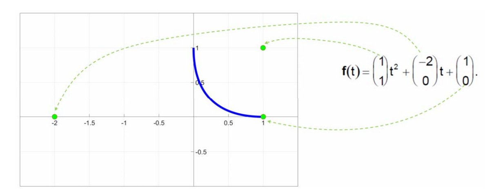
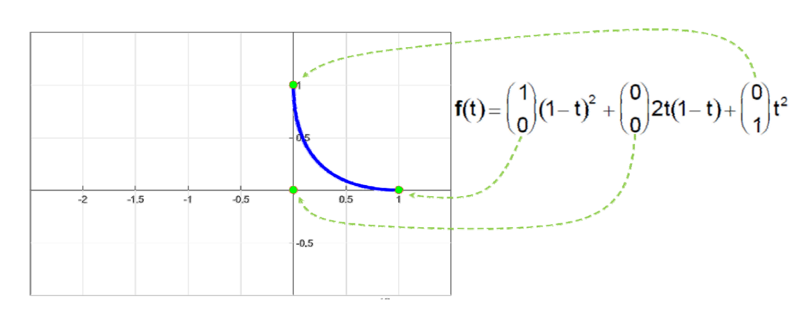
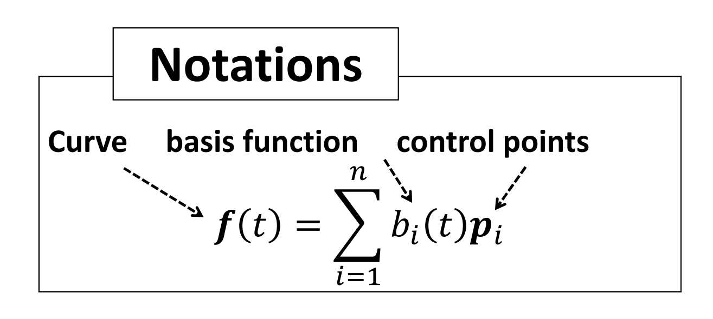
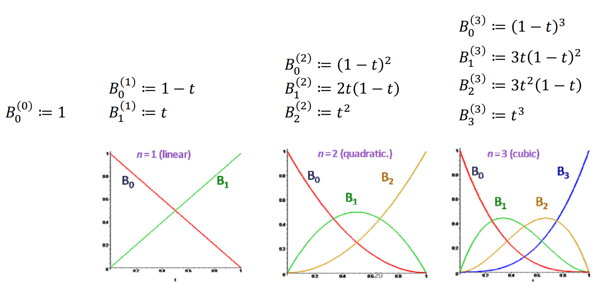

# 两种观点，两种表达方式

## 使用幂基来表达曲线   

• 二次多项式曲线（抛物线）:  

$$
𝑓(t)=at^2+bt+c
$$

   

几何观点：基函数为这些顶点的组合权系数。  

> 系数顶点与曲线本身无直观的联系：无几何意义！ 
> 不利于用户来交互修改曲线：适用于重建，但不适用于设计    

## 使用Bernstein基函数表达   

使用Bernstein基函数来改写    

$$
f(t)=\binom{1}{1} t^2+\binom{-2}{0} t+\binom{1}{0} 
$$

$$
\downarrow 
$$

$$
f(t)=\binom{1}{0} (1-t)^2+\binom{0}{0} 2t(1-t)+\binom{0}{1} t^2
$$

• 系数顶点与曲线关联性强，具有很好的几何意义     

• 对于交互式曲线设计更观     

  

**用Bernstein基函数所表达的曲线具有非常好的几何意义！** 

 

# Bernstein基函数   

• \\(n\\)次Bernstein基函数:\\(B=\\){\\(B_0^{(n)},B_1^{(n)},\cdots ,B_n^{(n)}\\)}   

$$
B_i^{(n)}(t)=\binom{n}{t}t^i(1-t)^{n-i}=B_{i-th basis function}^{(degree)} 
$$

where the binomial coefficients are given by:
$$
\binom{n}{t}=
\begin{cases}
 \frac{n!}{(n-i)!i!} && for \quad 0\le i\le n \\\\
0  &&        otherwise
\end{cases}
$$

  

