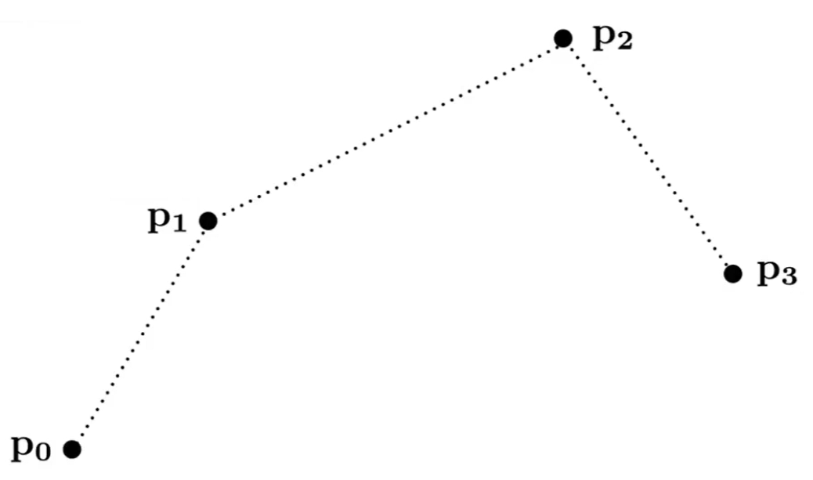

# Bezier曲线   

## 定义

\\(n\\)次Bezier曲线有\\(n+1\\)个控制顶点    

$$
x(t)=\sum_{i=0}^{n} B^n_i(t)\cdot b_i
$$

\\(b_i\\)称为控制顶点，所有\\(b_i\\)按顺序连起来得到的多边形为   
控制多边形

    

Bezier曲线的性质来源于Bernstein**基函数**的性质
（**曲线是控制顶点的线性组合构成的，基函数提供了组合系数**）

## 属性

  
 
- 起始点同p0位置
- 起点处的切线方向同\\(\vec{p_0p_1}\\)
- 终点同为p3位置
- 终点处的切线方向同\\(\vec{p_2p_3}\\)

## 例子

### 3次Bezier曲线    

$$
f(t)=\sum_{i=1}^{3} B^3_ip_i, \quad t\in [0,1]
$$

 

### 更复杂的Bezier曲线    

 

### 3D空间的Bezier曲线（单参数）   

$$
f(t)=\sum_{i=1}^{n} B^n_ip_i,t\in [0,1]
$$

 

## Piece-wise Bezier曲线

  

[38:23] 当控制点比较多时，Bezier曲线不利于控制

- How

把多个点分段，每4个点画一条曲线，例如photoshop中的钢笔功能。  

- What

  

## 光滑的Piece-wise Bezier曲线

C0连续：数值上连续

C1连续：切线连续（**方向和大小都要一致**），即光滑

C2连续：曲率连续

要使分段的Bezier曲线光滑（C1连续），需要让上一段的终点和下一段的起点切线一致。这可以通过控制点的位置来实现。   

  

---  

> 本文出自CaterpillarStudyGroup，转载请注明出处。
https://caterpillarstudygroup.github.io/GAMES102_mdbook/

