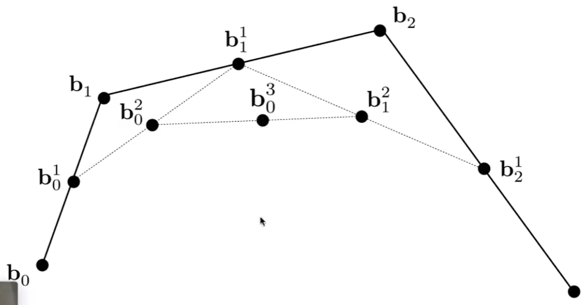

# 算法描述   
    
Input: points  \\(𝒃_0,𝒃_1,\dots 𝒃_n∈ \mathbb{R} ^3\\)       
Output: curve \\(x(t),t∈ [0,1]\\)    

# 过程示例    

Repeated convex combination of control points   

$$
b_i^{(r)}=(1-t)b_i^{(r-1)}+tb_{i+1}^{(r-1)}
$$

 

> 点 \\(b_0^{(0)},b_0^{(1)},b_0^{(2)},b_0^{(3)}是曲线 b_0^{(0)},b_0^{(3)}\\)的控制点。    

   

# 例子

## 给定3个点，画Bezier曲线

把起点看作是t=0时刻，终点看作是t=1时刻，画Bezier曲线，相当于求t=[0,1]区间时pt所在的位置。把范围所有时刻的pt连起来就是Bezier曲线。

1. 算出b0b1中的t位置的点为\\(b^1_0\\)  
2. 算出b1b2中的t位置的点为\\(b^1_1\\)  
3. ab连成一条线，算是ab中的t位置的点为\\(b^2_0\\)  
4. \\(b^2_0\\)是 Pt 的位置，

## 给定4个点，画Bezier曲线

[23:24]

# 总结   

   

* 给定\\(t\\)，计算Bezier曲线\\(x(t)\\)上参数为\\(t\\)的点    

> [30:18]局限性：一次只能针对一个\\(t\\)值计算。    

* 良好的几何意义：该点将曲线一分两条子Bezier 曲线，其控制顶点是中间生成的点    
* 可用于Bezier曲线的离散及求根等许多应用    

---  

> 本文出自CaterpillarStudyGroup，转载请注明出处。
https://caterpillarstudygroup.github.io/GAMES102_mdbook/

