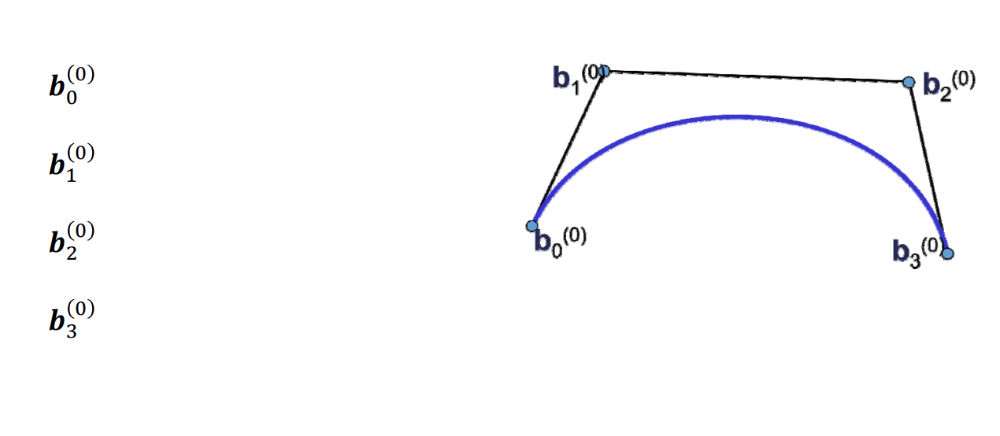
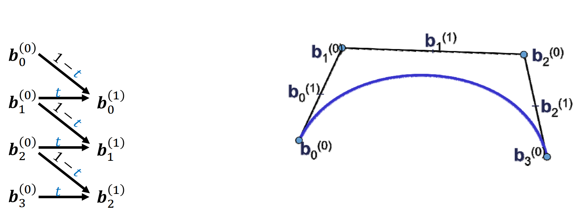
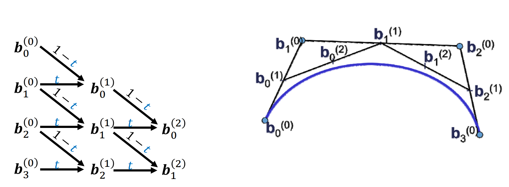
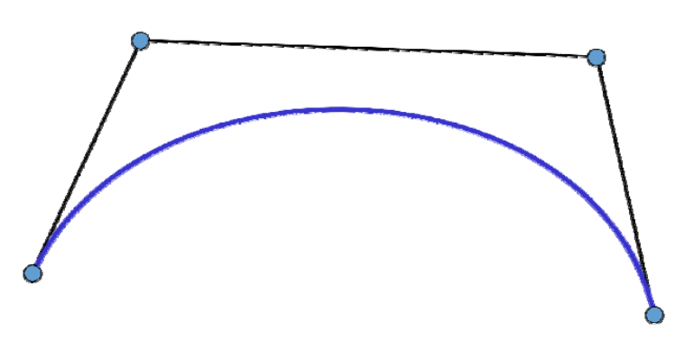
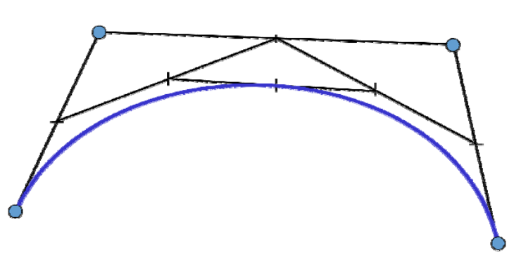
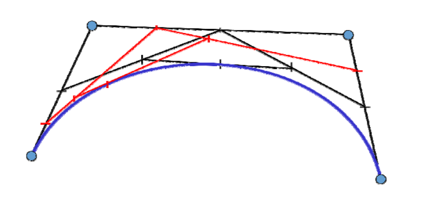

# Bezier曲线的 de Casteljau算法    
**（Bezier曲线的作图算法与细分）**   

# De Casteljau algorithm   

 - Algorithm description    
    - Input: points  \\(𝒃_0,𝒃_1,\dots 𝒃_n∈ \mathbb{R} ^3\\)       
    - Output: curve \\(x(t),t∈ [0,1]\\)    
    - Geometric construction of the points\\( 𝒙(𝑡)\\) for given \\(𝑡\\):    

    $$
    b_i^0(t)=b_i, 
    $$

    $$
    i=0,\cdots ,n
    $$

    $$
    b_i^r(t)=(1-t)b_i^{r-1}(t)+tb_{i+1}^{r-1} (t)
    $$

    $$
    r=1,\cdots ,n
    $$

    $$
    i=0,\cdots ,n-r
    $$

    - Then \\(b_i^r(t)\\) is the searched curve point 
    \\(𝒙(𝑡)\\) at the parameter value 𝑡    

> 点 \\(b_0^{(0)},b_0^{(1)},b_0^{(2)},b_0^{(3)}是曲线 b_0^{(0)},b_0^{(3)}\\)的控制点。    

[30:18]局限性：一次只能针对一个\\(t\\)值计算。    

# De Casteljau algorithm    

• Repeated convex combination of control points   

$$
b_i^{(r)}=(1-t)b_i^{(r-1)}+tb_{i+1}^{(r-1)}
$$

 

# De Casteljau algorithm   

• Repeated convex combination of control points   

$$
b_i^{(r)}=(1-t)b_i^{(r-1)}+tb_{i+1}^{(r-1)}
$$

 

# De Casteljau algorithm    

• Repeated convex combination of control points

$$
b_i^{(r)}=(1-t)b_i^{(r-1)}+tb_{i+1}^{(r-1)}
$$

 

# De Casteljau algorithm
• Repeated convex combination of control points

$$
b_i^{(r)}=(1-t)b_i^{(r-1)}+tb_{i+1}^{(r-1)}
$$

 

De Casteljau scheme

# De Casteljau algorithm

   

# De Casteljau algorithm    

 

* 计算Bezier曲线\\(x(t)\\)上参数为\\(t\\)的点   
• Bisect control polygon in ratio \\(t:(1-t)\\)        
* 良好的几何意义：该点将曲线一分两条子Bezier 曲线，其控制顶点是中间生成的点    
* 可用于Bezier曲线的离散及求根等许多应用    

# De Casteljau algorithm    

 

* 计算Bezier曲线\\(x(t)\\)上参数为\\(t\\) 的点    
• Bisect control polygon in ratio \\(t:(1-t)\\)    

* 良好的几何意义：该点将曲线一分两条子Bezier 曲线，其控制顶点是中间生成的点    
* 可用于Bezier曲线的离散及求根等许多应用    

# De Casteljau algorithm   

 
 
* 计算Bezier曲线\\(x(t)\\)上参数为\\(t\\)的点    
• Bisect control polygon in ratio \\(t:(1-t)\\)    
* 良好的几何意义：该点将曲线一分两条子Bezier 曲线，其控制顶点是中间生成的点    
* 可用于Bezier曲线的离散及求根等许多应用     

# De Casteljau algorithm   

   

* 计算Bezier曲线\\(x(t)\\)上参数为\\(t\\)的点    
• Bisect control polygon in ratio  \\(t:(1-t)\\)   
* 良好的几何意义：该点将曲线一分两条子Bezier 曲线，其控制顶点是中间生成的点    
* 可用于Bezier曲线的离散及求根等许多应用    