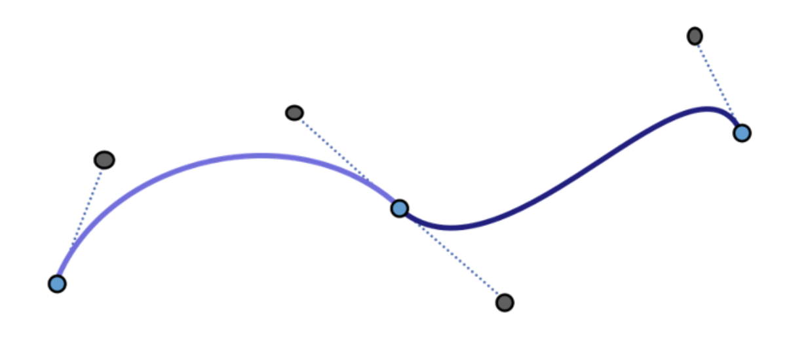
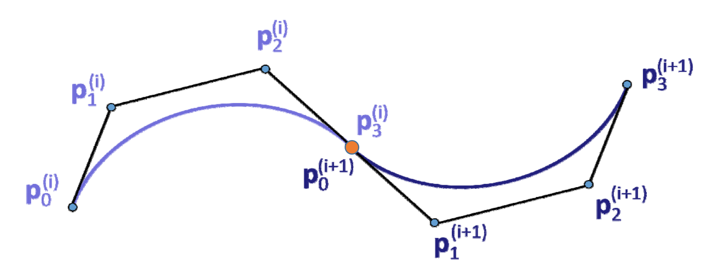
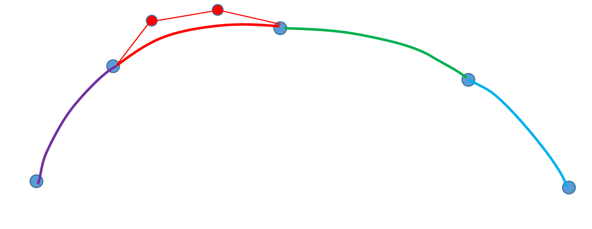

# 几何样条曲线   

> 样条就是分段曲线的意思。  

## 用分段Bezier曲线来插值型值点   

给定型值点:  
$$
k_0, \dots ,k_n\in \mathbb{R} ^3
$$

每两点间生成一段Bezier曲线，使得整体曲线满足一定的连续性\\((𝐶^0,C^1,C^2)\\)    

   

> 蓝点是型值点。黑色是为了控制生成的曲线额外添加的点。  

## 两Bezier曲线的拼接条件    

   

回顾：Bezier曲线的端点性质[link](Property.md)    

- C0连续与G0连续的条件：默认满足  

- \\(G^1\\)连续：三点共线   

- \\(C^1\\)连续：三点共线且等长     

   

- \\(C^2\\)连续：\\(𝑑^2⁄dt^2 \\)为 \\((p_2-2p_1+p_0),(p_n-2p_{n-1}+p_{n-2})\\)，即阴影三角形相似        
   

- \\(G^2\\)连续：？   

# 构造3次插值Bezier曲线的几何方法    

   

## 用矩阵计算的方法    

根据基构造矩阵，计算系数。    
局限性，任意控制点的改变就要重新构造矩阵和计算     

## 工程中常用的几何方法

构造曲线的关键是算出辅助控制点的位置。    

> [38:48]    

    

(1) \\(P_o 与P_2\\)连线     
(2) 过\\(P_1点画与P_0P_2\\)平行的线段，线段以\\(P_1\\)为中点，长度为\\(P_0P_2的\frac{1}{6} \\).    
(3) 线段的端点是辅助控制点的位置。    

> 这种方法能满足C1，不能满足C2

# 广义样条曲线   

分段的多项式曲线（Bezier曲线）  
    

> 所有的分段连续曲线，曲线可以是直的，曲线之间也可以只有C1连续

本文出自CaterpillarStudyGroup，转载请注明出处。
https://caterpillarstudygroup.github.io/GAMES102_mdbook/

