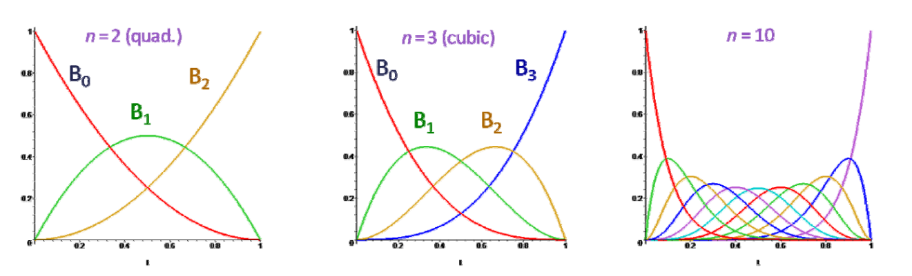
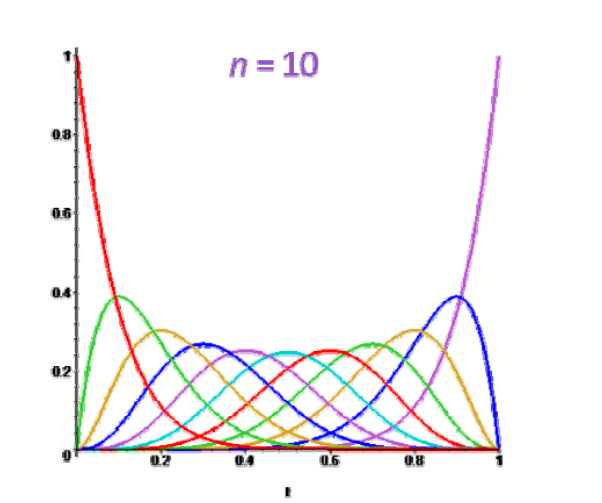
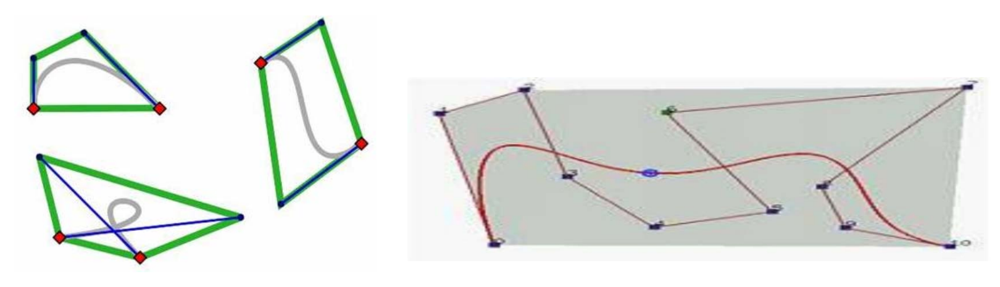
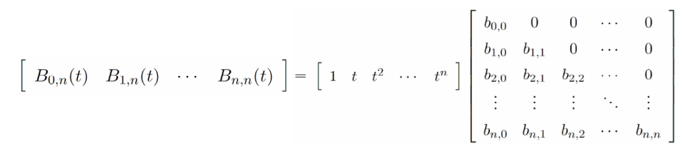
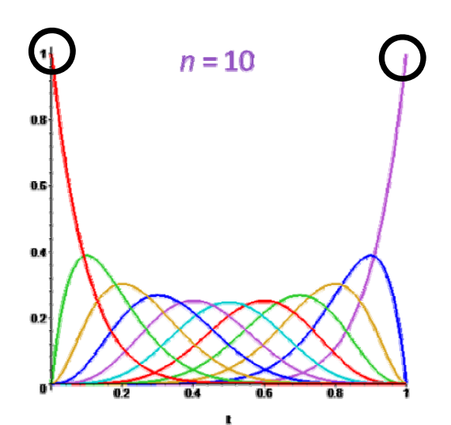
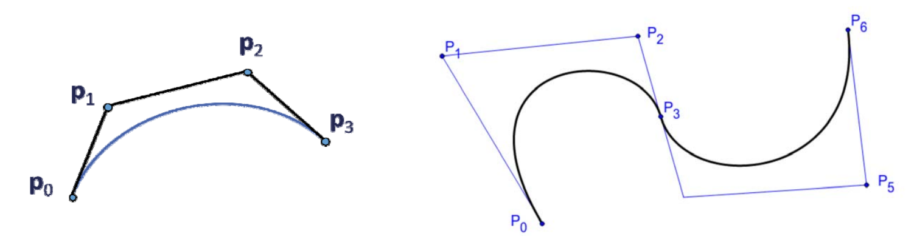
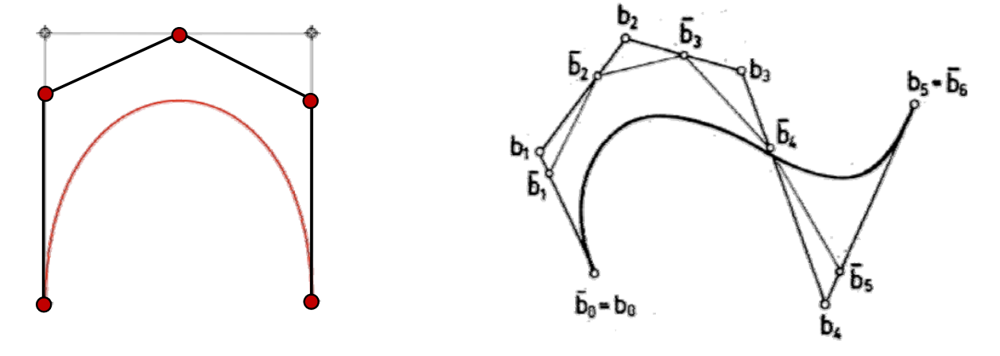

# Bernstein基函数及Bezier曲线的性质    

# Bernstein基函数    

  - Bernstein基函数:\\(B=\\){\\(B_0^{(n)},B_1^{(n)},...,B_N^{(n)}\\)}    
    - \\(𝑛\\)次\\((n+1\\)阶)Bernstein基函数:
   $$
   B_i(t)^{(n)}=\binom{n}{i} t^i(1-t)^{n-i}=B_{i-th basis function}^{(degree)}
   $$
      - 对称性：\\(B_i(t)^{(n)}=B_{n-i}^{n}(1-t)\\)    
      - \\(B^{(n)}_i(t)\\)   在\\(t= \frac{i}{n} \\)达到最大值   

 

# 性质1. 正权性    

* 正性（非负性）+ 权性    

$$
B_i^{(n)}(t)\ge 0,\forall t\in [0,1]
$$

$$
\sum_{i=1}^{n}B_i^{(n)}(t)=1, \forall t\in [0,1]
$$

   

$$
\downarrow 
$$

• Bezier曲线的凸包性

   

# 性质2.  基性   

•\\(B=\\){\\(B_0^{(n)},B_1^{(n)},...,B_N^{(n)}\\)}是次数不高于 的多项式集合（空间）的一组基

• 与幂基可以相互线性表达：

 

# 性质3. 递推公式    

 - 基函数的递推公式   
   \\( B_i^{(n)}(t)=（1-t）B_i^{(n-1)}(t)+tB_{i-1}^{(n-1)}(1-t)\\)     
   with \\(B_0^{(0)}(t)=1，B_i^n(t)=0\\) for \\(i\notin \\){\\(0\cdots n\\)}    
   - 由 \\(\binom{n-1}{i} +\binom{n-1}{i-1}=\binom{n}{i}  \\)可推导得到     
  - 高阶的基函数由2个低阶的基函数“升阶”得到      
    - 利于保持一些良好的性质    

# 性质4. 端点插值性    

 
    
$$
B_0^0(0)=1,B_1^n(0)= \dots B_n^n(0)=0
$$

$$
B_0^n(1)= \dots =B_{n-1}^n(1)=0,B_n^n(0)=1
$$

$$
\downarrow 
$$

• Bezier曲线经过首末两个控制顶点\\(p_0,P_n\\)    

 

# 性质5. 导数    

$$
\frac{d}{dt}B_i^{(n)}(t)=n[B_{i-1}^{(n-1)}(t)-B_i^{(n-1)}(t)] 
$$

$$
\frac{d^2}{dt^2}B_i^{(n)}(t)=n(n-1)[B_{i-2}^{(n-2)}(t)-2B_{i-1}^{(n-2)}(t)+B_i^{(n-2)}(t)] 
$$

 *  Bezier曲线的导数（切线）  
      • Given:\\(p_0,\dots ,p_n,f(t)=\sum_{i=0}^{n} B_i^n(t)p_i\\)  

      $$
        {f}' (t)=n\sum_{i=0}^{n-1} B_i^{n-1}(t)(p_{i+1}-p_i)
      $$

      $$
        f^{[r]} (t)=\frac{n!}{(n-r)!} \cdot  \sum_{i=0}^{n-r}B_i^{n-r}(t)\cdot \Delta ^r p_i
      $$

# Bezier曲线的端点性质   

• 端点插值：   
$$
f(0)=p_0
$$

$$
f(1)=p_n
$$

• 端点的切线方向与边相同：   

$$
(f)'(0)=n[p_1-p_0]
$$

$$
(f)'(1)=n[p_{n-1}-p_n]
$$

• 端点的2阶(k)切线与3点(k+1)相关：   

$$
(f)''(0)=n(n-1)[p_2-2p_1+p_0]
$$

$$
(f)''(1)=n(n-1)[p_n-2p_{n-1}+p_{n-2}]
$$

> **结合几何意义来理解**    

# 性质6. 升阶   

$$
(1-t)B^n_i(t)=(1-\frac{i}{n+1})B^{(n+1)}_i (t)
$$

$$
tB^n_i(t)=\frac{i+1}{n+1}B^{n+1}_i (t)
$$

$$
\downarrow 
$$

• Bezier曲线的升阶 

$$
f(t)=\sum_{i=0}^{n+1} B_i^{n+1}(t)[\frac{n+1-i}{n+1} p_i+\frac{i}{n+1} p_{i-1}]
$$

 
