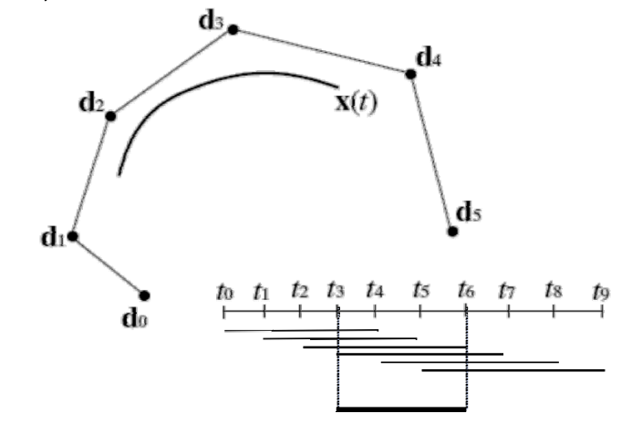
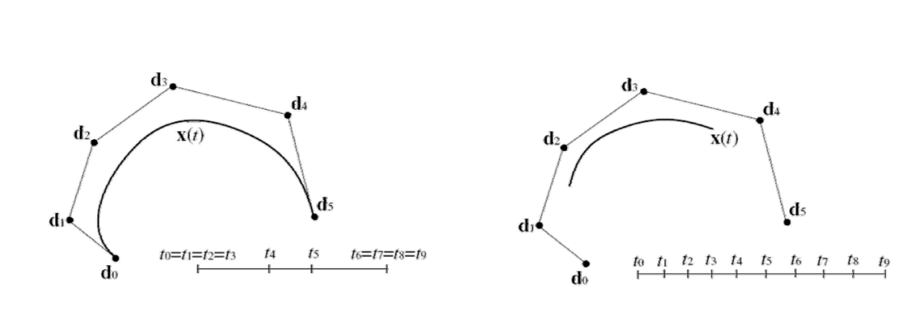
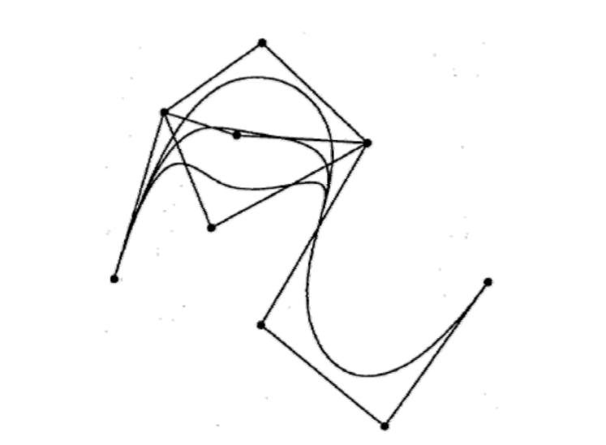
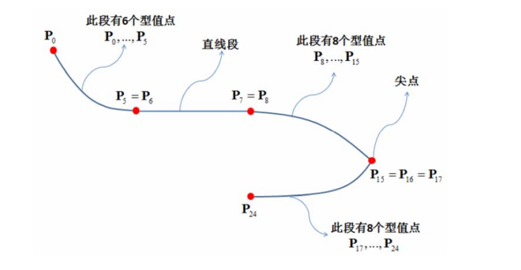

# B‐spline curves 的定义

Given:  
\\(𝑛+1\\) control points \\(𝒅_0,\dots,d_n∈\mathbb{R} ^3\\)     
参数化向量 \\(𝑇=(t_0,\dots,t_n,\dots,t_{n+k})\\)    

> \\(𝒅_i\\) 又称为 de Boor points    

Then：  
k阶 B‐spline curve 𝒙(𝑡) 定义为：

$$
x(t)=\sum_{i=0}^{n} N_{i,k}(t)\cdot d_i
$$

> B样条本质是分段曲线、但通过 local basis funchion 的方法，有一个公式统一了所有分段曲线。    

# B‐spline curves 的例子 

## \\(k=4,n=5\\)     

  


Support intervals of \\(𝑁_{i,k}\\)  

> 由于\\(n=5\\)，\\(d_0-d_5\\)定义第一条曲线，\\(d_1-d_6\\)定义第二条曲线。  
本质上是分段曲线，在连接点上C3连续。  

## Multiple weighted knot vectors  

例子中的\\(𝑇=(t_0,\dots,t_n,\dots,t_{n+k})\\) 满足 \\(t_0< t_1< \dots< t_{n+k}\\)     
但也可以定义为\\(t_0\le t_1\le \dots\le t_{n+k}\\)，即结点重合。  

> 结点重合会导致连续性下降，每增加一重、连续性减一。可以以此方法控制曲线的连续性。     
> 可以根据重合度控制结点的光滑性。  
• The recursive definition of the B spline function \\(𝑁_{i,k}(i=0,\dots,n) \\) works nonetheless as long as no more than 𝑘 knots coincide    

## 首未端点插值   

set: \\(t_0=t_1=\dots=t_{k-1}\\) and \\(t_{n+1}=t_{n+2}=\dots=t_{n+k}\\)   

\\(𝒅_0\\) and \\(𝒅_n\\) are interpolated      

  

> 要使首未端点被插值，需要把首未端点设置为\\(K\\)重。把B-spline curve 的两个端点都设成\\(n-1\\)重，就会退化为 Bezier curve.      

# B‐spline curves的性质    

## 性质1：退化

要使首未端点被插值，需要把首未端点设置为\\(K\\)重。把B-spline curve 的两个端点都设成\\(n-1\\)重，就会退化为 Bezier curve.      

## 性质2：连续性

结点重合会reduction of continuity of\\(𝑥(𝑡)\\)。𝑙重结点 \\((1\le 𝑙 < 𝑘)\\) means \\(𝐶^{k-𝑙-1}\\) continuity     

## 性质3：局部性

moving of \\(𝑑_i\\) only changes the curve in the region \\([𝑡_i,t_{i+k}]\\)    
The insertion of new de Boor points does not change the polynomial degree of the curve segments        

   

> [1:10:41] &#x1F4A1; 在神经网络中把 acfivation 改为 local basis funchion. 这样，只需更新 N N 的部分参数。   

# B样条的计算 The de Boor algorithm   

## 算法背景

**输入：**       
de Boor points：\\(𝒅_0,…,𝒅_n\\)      

Knot vector：  

$$
(t_0,\cdots ,t_{k-1}=t_0,t_k,t_{k+1},\dots ,t_n,t_{n+1},\dots ,t_{n+k}=t_{n+1})
$$

**输出：**     
Curve point \\(𝒙(𝑡)\\) of the k 阶B‐spline curve    

## 算法过程    

> 不断地插入结点就可以得到B样条曲线

1. Search index with \\(t_r\le  t\le t_{r+1}\\)   
2.
```
for i=r-k+1,... ,r
    d^0_i=d_i
for j=1, ... ,k-1   
    for i=r-k+1+j,\cdots ,r    
        a_i^j={t-t_i}/{t_{i+k-j}-t_i}
        d_i^j=(1-a^j_i) \cdot  d^{j-1}_{i-1}+a_j^i \cdot  d^{j-1}_i
d^{k-1}_r=x(t)    
```

# B样条的其他理论知识  

* B样条的许多性质   
• 局部凸包性、变差缩减性、包络性   
• B样条的导数、积分递推式、几何作图    
* 重节点的B样条基函数及B样条曲线   
* Bezier样条曲线转换为B样条曲线    
* **B样条插值方法**    
* …   

   

---  

> 本文出自CaterpillarStudyGroup，转载请注明出处。
https://caterpillarstudygroup.github.io/GAMES102_mdbook/


