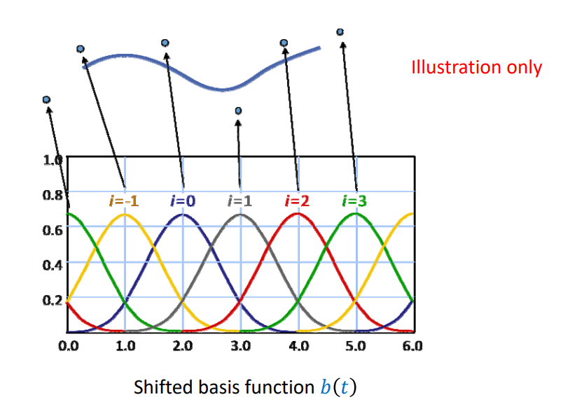
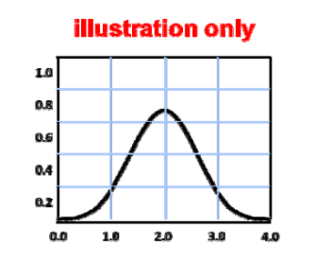
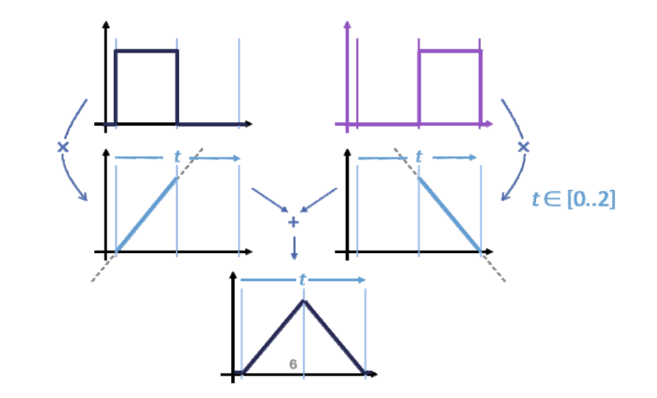
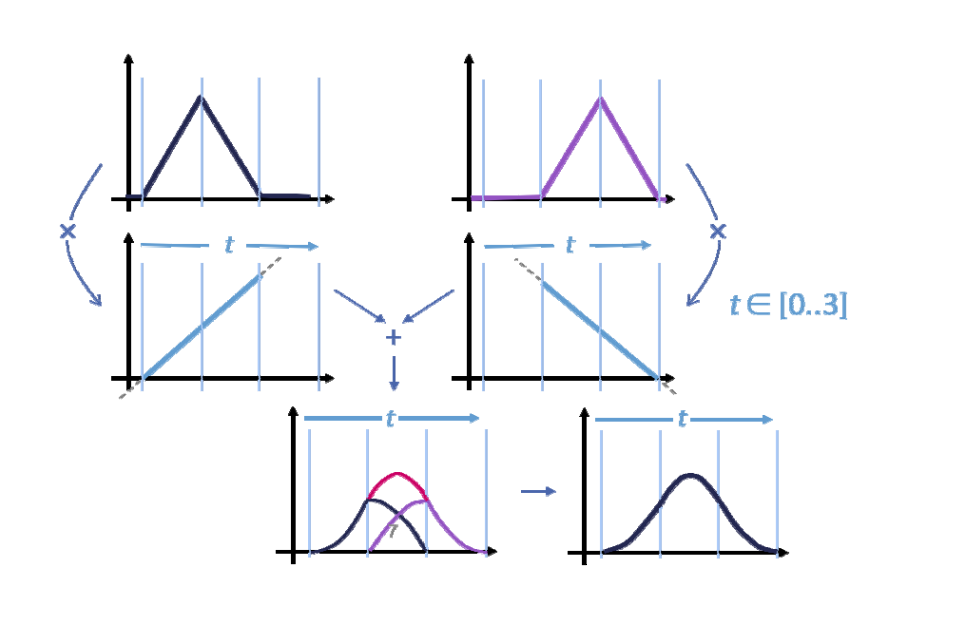
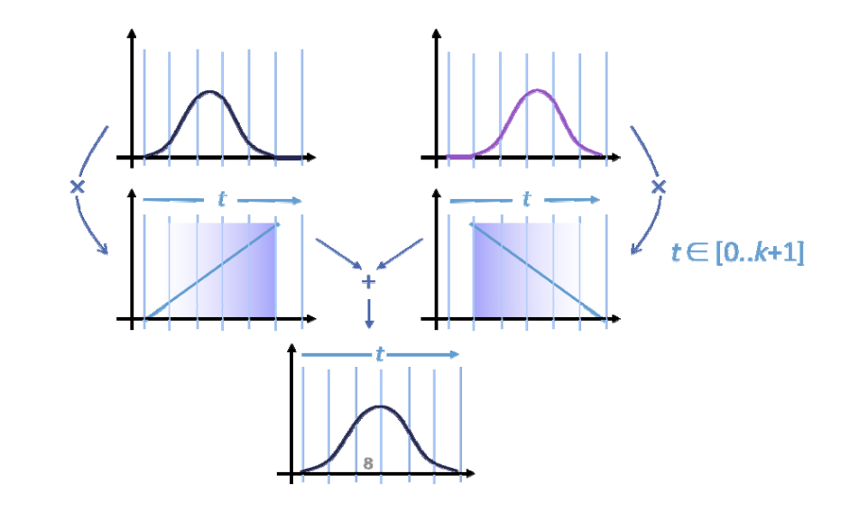
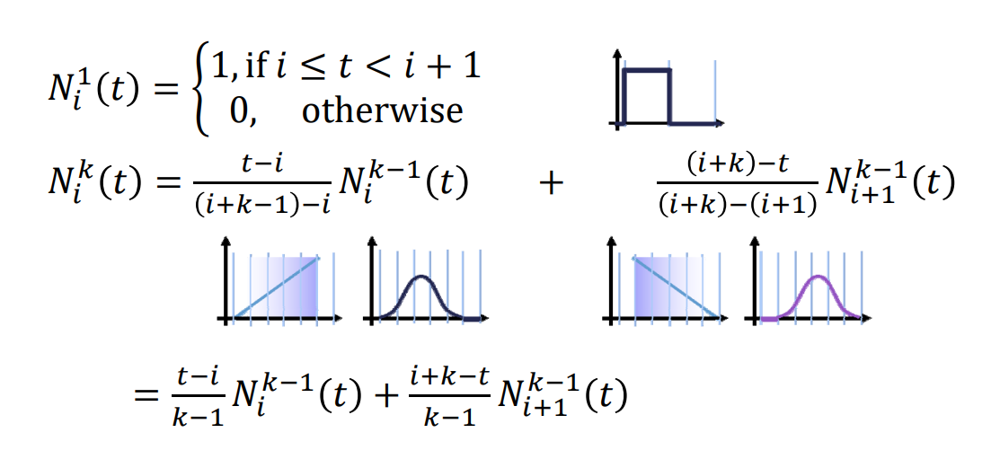
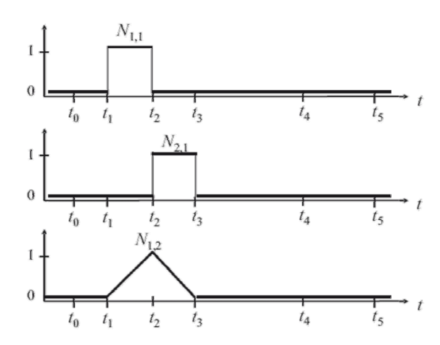
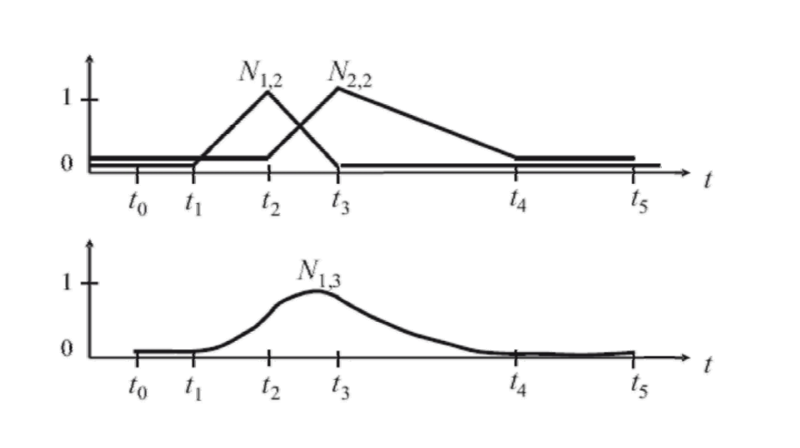
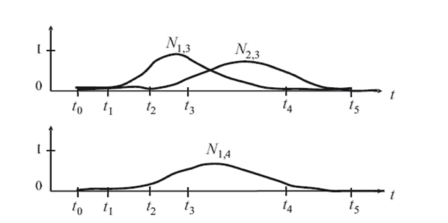

# 构造B样条基函数： 以三次为例      

## 1. 参数化

型值点参数，建立 \\(d_i 与t_i\\)之间的关系。    

> &#x1F446; 图中是均匀参数化的例子。 i 是参数， i 的取值构成节点向量基函数通过结点向量来定义，每个基函数定义在几个特定的节点上。    

## 2. 构造基函数𝑏(𝑡)

### 𝑏(𝑡)应满足以下性质

  
- 𝑏(𝑡) is \\(C^2\\) continuous    
- 𝑏(𝑡) is piecewise polynomial, degree 3 (cubic)   
- 𝑏(𝑡) is has local support   
- Overlaying shifted \\(𝑏 (𝑡+i)\\) forms a partition of unity   
- \\(𝑏(𝑡)\ge 0 \\) for all 𝑡      
In short:   
- All desirable properties build into the basis   
- Linear combinations will inherit these  

### 基函数的构造方法

Repeated linear interpolation：从0阶（水平直线）开始，使用t和(1-t)进行线性组合、即升阶每升一次阶，曲线会更光滑，跨度区间会多覆盖一个结点。    

  
  
  

### 基函数的定义

#### De Boor Recursion: uniform k阶 B样条基函数的定义

> Uniform:使用均匀参数化     

  

#### B‐spline curves: general case

> 此页公式定义在非均匀结点上。      

Given: knot sequence \\(t_0 < t_1 < \cdots < t_n < \cdots < t_{n+k}\\)
\\((t_0,t_i,\cdots,t_{n=k})\\) is called knot vector)      

Normalized B‐spline functions \\(N_{i,k}\\)of the order (degree \\(k-1\\)) are defined as:   

$$
N_{i,1}(t)=\begin{cases}
 1,t_i\le t<t_{i+1}\\\\
\\\\
0,otherwise
\end{cases}
$$

$$
N_{i,1}(t)=\frac{t-t_i}{t_{i+k-1}-t_i} N_{i,k-1}(t)+\frac{t_{i+k}-t}{t_{i+k}-t_{i+1}}N_{i+1,k-1}(t)
$$

for  \\(k>1\\), and \\(i=0,...,n\\)   

### 基函数的例子

#### Example 1

    

$$
N_{i,1}(t)=\begin{cases}
 1,t_i\le t<t_{i+1}\\\\
0,otherwise
\end{cases}
$$

$$
N_{i,1}(t)=\frac{t-t_i}{t_{i+k-1}-t_i} N_{i,k-1}(t)+\frac{t_{i+k}-t}{t_{i+k}-t_{i+1}}N_{i+1,k-1}(t)
$$

for\\( k>1,\\) and \\(i=0,...,n\\)

> \\(N_{i, k}:K 代表阶数，i代表第i\\)个基函数。    
\\(N_{1, 1}和 N_{2, 1}组合，得到 N_{1, 2}\\)    
\\(N_{1, 2}和 N_{2, 2}组合，得到 N_{1, 3}\\)     

#### Example  2

  

#### Example  3

  

## 3. 基函数的平移和伸缩

每个基函数是同一个基函数的平移或伸缩得到，其中第 i 个基函数是以\\(t_i\\)为中心的局部函数。    

  

# 基函数性质   

## 局部性

\\(𝑁_{i,k}(t)\\) > 0 for \\(𝑡_i < 𝑡 < t_{i+k}\\)    
\\(𝑁_{i,k}(t)\\) = 0 for \\(𝑡_0 < 𝑡 < t_i\\) or \\(t_{i+k} <t < t_{n+k}\\)    

The interval \\([t_i,t_{i+k}]\\), is called support of \\(N_{i,k}\\)      

## 权性 + 凸包性

\\(\sum_{i=0}^{n} N_{i,k}(t)=1 \\)for \\(t_{k-1}\le t\le t_{n+1} \\)     

## 光滑性

For \\(t_i\le t_j\le t_{i+k}\\), the basis functions  \\(N_{i,k}(t)\\) are \\(C^{k-2} \\) at the knots \\(t_j\\)      
