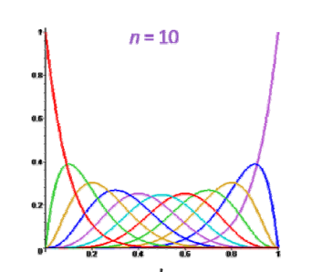

# 为什么引入B样条曲线

## Bezier曲线的不足   

   

$$
x(t)=\sum_{i=0}^{n} B_i^n(t)\cdot b_i
$$

> 每个基函数在整平[0，1]作用域上都有值，因此具有全局性。
任意一个点的移动都会影响整条曲线。    
> **全局性：牵一发而动全身，不利于设计**  

> &#x2753; 不是可以通过分段来解决吗？   
答：可以，但要分成多个函数来表达。B样条用统一的函数表达分段曲线。

## 样条曲线的不足  

分段的多项式曲线（Bezier曲线）  
优点：分段表达，具有局部性   
缺点：要分成多个函数来表达。

# 思考：以统一的方式表达分段函数  

## 基函数应满足的性质

形式类比：每个控制顶点用一个基函数进行组合   

$$
x(t)=\sum_{i=0}^{n} N_{i,k}(t)\cdot d_i
$$

其中di为控制顶点，N为基函数。  

基函数性质要求：  
• 基函数须局部性（局部支集）  
• 基函数要有正性+权性   

## 启发： 

【Bernstein基函数的递推公式】：[link](../BezierCurve/Property.md)  

思路：   
- 局部处处类似定义，由一个基函数平移得到    
- 高阶的基函数由2个低阶的基函数“升阶”得到，利于保持一些良好的性质，比如提高光滑性   

