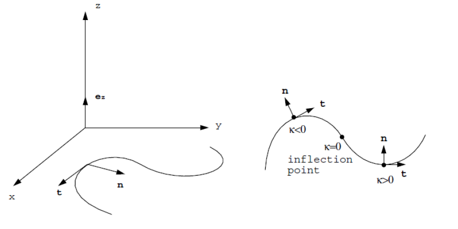
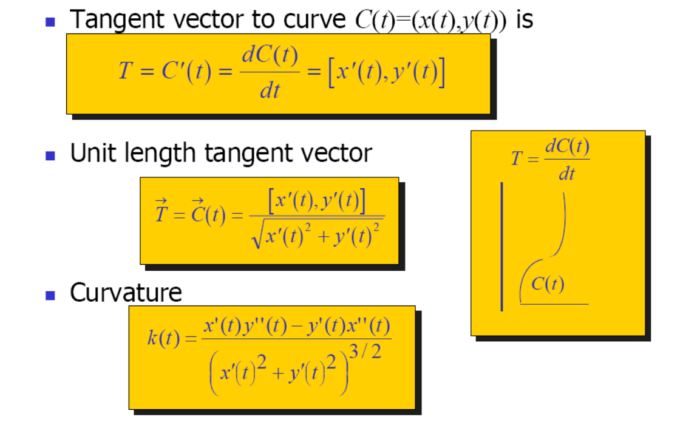
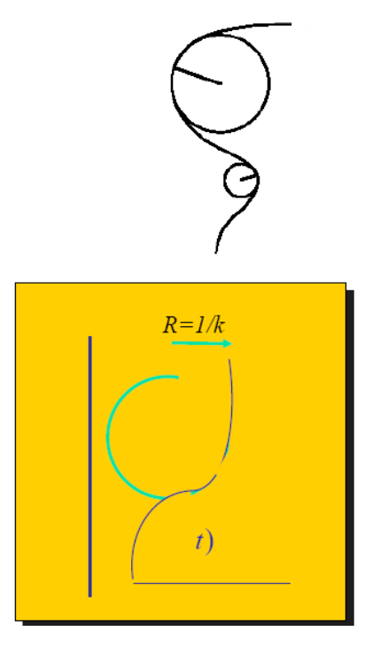
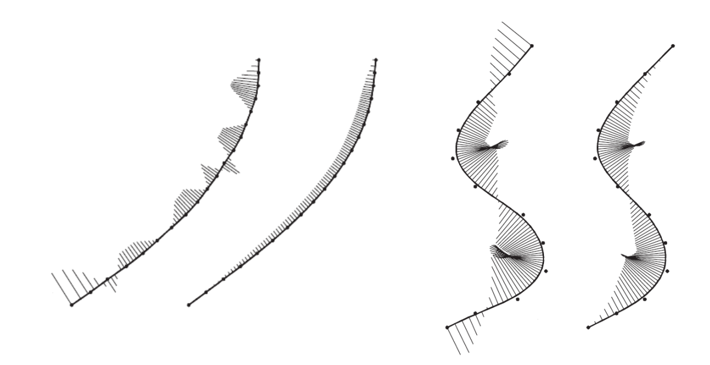
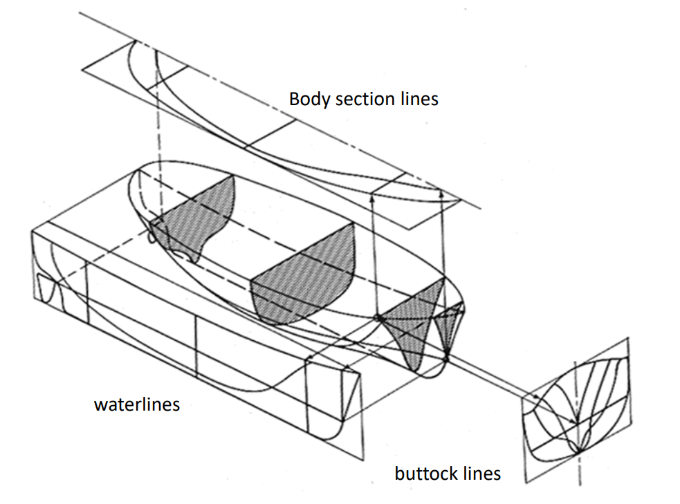
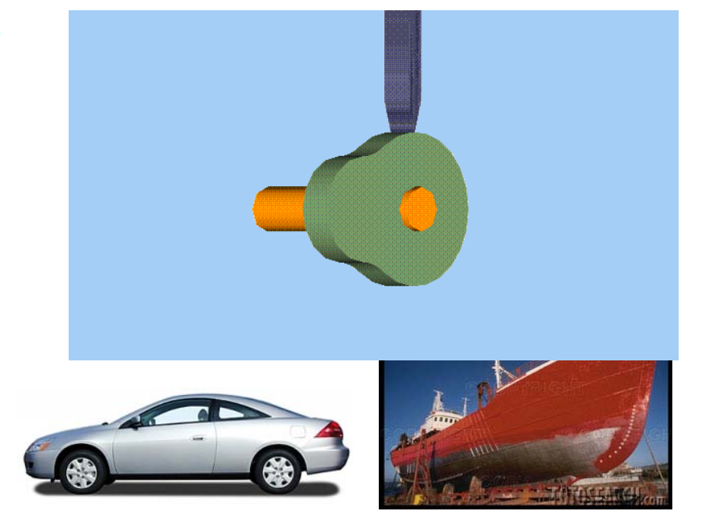
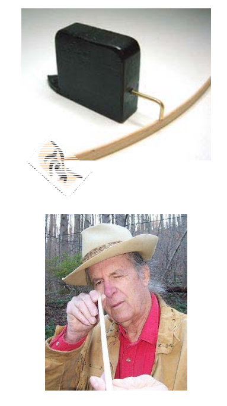

# 曲线光顺    

# 光滑(Smooth)曲线    

* 连续曲线(Continuous)：参数连续性    
• 给定 2 条曲线     
\\(𝒙_1(𝑡) 定义在[t_0,t_1]\\)     
\\(𝒙_2(𝑡) 定义在[t_1,t_2]\\)   
• 曲线\\(x_1\\)和\\(x_2\\)在\\(t_1\\)称为\\(C^r\\)**连续**的，如果它们的从\\(0^{th}\\) （0阶）至\\(r^{th}\\)（𝑟阶）的导数向量在\\(t_1\\)处完全相同     
• 光滑：高阶连续    
* **几何**连续：   
• 与参数化无关，更刻画了曲线形状的本征光滑性     
• 更适合交互式曲线设计     

# 什么是光顺曲线？    

• Curve fairing    

    

# 曲线的微分几何   

# 单参数曲线的切线和法向   

* 曲线：\\(r=r(t)=(x(t),y(t)),t\in [0,1]\\)    
* 切线：     
• \\(t=r′(t)=(𝑥′(t),𝑦′(t))\\)    

* 法线\\(n\\)     

  

# Curves    

  

# Curve Curvature     
 - Curvature is **independent** of parameterization    
     - \\(C(t),C(t+5),C(2t)\\)have same curvature (at corresponding locations)   
 - Corresponds to radius of osculating circle R=1/k      
 - Measure curve bending   

    

# 曲线的光顺定义    

# Geometric Design: Two Phases    

 - Shape design and modeling (Macro)     
 - Fairing design and modeling (Micro)     
    - A post‐processing after shape design     
    - Less well studied    
       - Difficult problem     
       - Lack of solid theories   
       - Far from solved      

# 曲线的曲率图    

    

# Why fairing curves?    

    

# Fairing Design is Important!     
• Shoe sole    
• Cam profile    
• Ship hull    
• Car profile    
• Plane profile    
• …     

    

# Why Difficult?     

* A subjective concept     
• The subtle bumps, wiggles, and inflection points of a curve      
• Related to human perception    
• Dependent on designer’s experience    
* A difficult task     
• Examining the curves by eye!    
• No objective measures    
• Cannot do it mathematically    

    

# Some ‘Definitions’ of Fairness     

* [Su and Liu 1978]       
• A curve is fair if it is \\(C^2\\) continuous and its curvature plot is free of any unnecessary variation, i.e., the distribution of curvature must be as uniform as possible.     
* [Farin and Sapidis, 1989]      
• A curve is fair if its curvature plot consists of relatively few 
monotone pieces.    
* [Farin 2002]     
• A curve is fair if its curvature plot is continuous and consists of only a few monotone pieces.     
* [Roulier and Rando, 1994]     
• A curve is fair if it is \\(C^2\\) continuous and minimizes the integral of the squared curvature with respect to arc length    

$$
\int _ck^2ds=MIN
$$

# Observations of Fairness     

* Neither a global problem nor a local problem, but a  large local problem      
• Not an energy minimization problem    
* Need not \\(C^2\\) continuous     
• Circular spline      
* Intimately related to uniform distribution of curvature     
• Curvature is a “magnifier” of the curve fairness      

# Example 1    

$$
y=sin x, x\in[0,6\pi]
$$

    

* The curve is \\(C^\infty \\)    
* The curve is not fair as the eye is very uncomfortable while 
viewing from point O       
* Reason     
• It has too many inflections (vibration numbers)    
(One vibration: from convex to concave or from concave to convex)     

# Example 2   

$$
y=\frac{1+\delta }{0} x^2+\sin x,x\in [0,6\pi ],\delta >0
$$

    

$$
{y}'' =1+\delta -\sin x > 0
$$

* The curve is \\(C^\infty \\) without any inflection point.    
* The curve is not fair as the eye is very uncomfortable while viewing from point O (it winds along the black parabola curve)     
* Reason     
• \\({y}''(x) \\) has too many vibration numbers       

# Example 3    

  

* The curvature function \\({y}''(x) \\) is discontinuous.    
* Vibration number of \\({y}''(x) \\) can be defined if it is a bounded function.         
\\({y}''(x) \\) is bounded \\(\Rightarrow {y}'(x)\\) has bounded variation \\(\Rightarrow y(x)\in C^{l+1}\\)    
* The curve is not fair if \\(k_1\\) and  \\(k_2\\) are much different.      
* Reason      
• \\({y}''(x) \\) has large amplitude at discontinuity point.

# 曲线的光顺的“新定义”     

• 一条曲线是光顺的，如果     
（1）它是\\(C^{l+1}  ( l > 0 )\\)连续的；    
（2）它的曲线本身拐点较少；     
（3）它的曲率图的拐点较少；    
（4）它的曲率图变化的振幅相对小。    

> 说明 1： 条件(1)中的 \\(C^{1+l}\\) 是要求曲线为 \\(C^{1}\\) 连续而不必\\(C^{2}\\),但\\(C^{1}\\)的导数满足有界变差。条件 (4) 则要求曲线在曲安非连续点处的跳跃要尺尽可能小。     
说明 2： 满足 (2)和(3)描述的曲线的它的曲率图含有的单调段都会相对少。这与前面所述的判 别准则 1-4 一致。

# Remarks   

* Vibration     
• Change from convex to concave or change from concave to convex     
* First vibration number \\(R\\)      
• Vibration number of \\(y(x)\\)     
* Second vibration number \\(S\\)    
• Vibration number of curvature function     

# 曲线的光顺方法    

# 函数型3次样条曲线   

* 小扰度假设     
• 转角不大于60°     
* \\({y}' (x)\ll 1 \\)       
* \\({y}'' (x)\approx k(x)\\)      

  

# 曲线的光顺方法    

• \\(C^1\\) continuous     
• Decrease jump amplitude of curvature      
• Decrease the first vibration number \\(R\\)     
• Decrease the second vibration number \\(S\\)     

# Steps    

• Coarse fairing     
• Basic fairing      
• Fine fairing      

# Step 1. 初光顺     
* 定界法    
• Adjust the positions of control points    
• Decrease the jump amplitude of curvature     
• Remove some unwanted inflections     
* Physical approach    

# Step 2. 基本光顺    

* 卡尺法     
• Adjust the positions of control points    
• Remove other redundant inflections    
• Decrease the first vibration number \\(R\\)      
* Geometric approach      

# Step 3. 精光顺    

* 回弹法     
• Check the signs of shear force at control points     
• Adjust the change numbers of shear force     
• Decrease the second vibration number \\(S\\)      
* Physical approach     

# Example 1    

   

# Example 2    

  

# Example 3    

  

# 光顺结果   

  

# 光顺结果    

  

# B样条曲线的光顺方法    

• 基于稀疏优化的光顺优化方法     

$$
\min_{\tilde{d} } ||e(\tilde{d} )||_1
$$

$$
s.t.||(\tilde{d} )-d||_\infty \le \varepsilon 
$$

曲率的二阶差分向量\\(e\\). 计算公式如下：

$$
e_i=\frac{C_{i+1}-C_i}{t_{i+1}-t_i} -\frac{C_{i}-C_{i-1}}{t_{i}-t_{i-1}},i=1,\cdots ,n-3 
$$

**王士玮等，基于稀疏模型的曲线光顺算法，计算机辅助设计与图形学学报，2016.**      

# 光顺结果及比较    

  

# 光顺结果及比较    

  

# 曲面的光顺   

* 无严格定义    
• 工业界：Class A曲面（Dassault CATIA ）  

  

  

• 方法1：三向曲线光顺     
• 方法2：能量法     

# 光顺曲面    

  
