# 离散微分几何    

# 回顾：三角网格曲面   

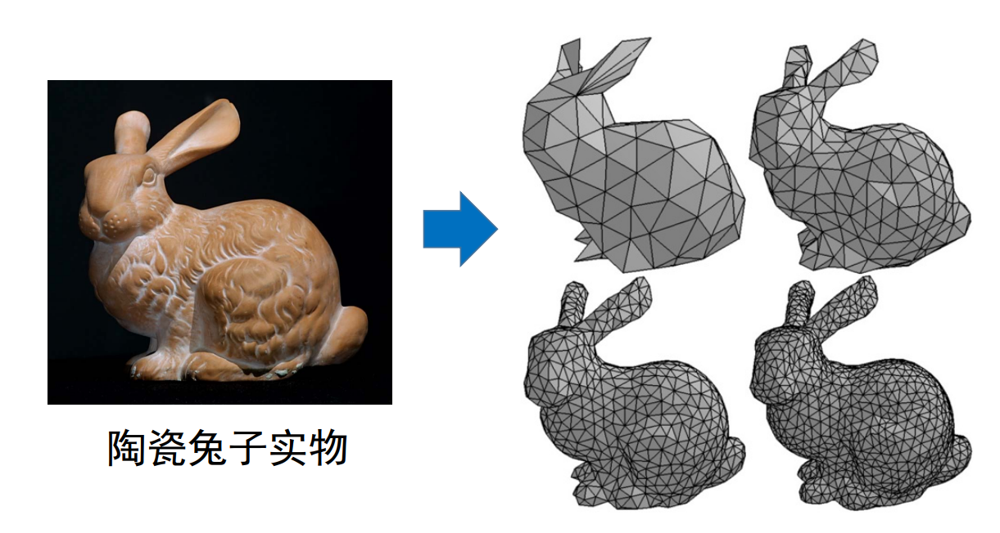   

# 回顾：三角网格曲面    

* 观点 1：曲面的离散逼近    
• 采样：顶点为从曲面上的采样点     
• 构网：每个三角面为线性平面     
• 本质：分片线性逼近    

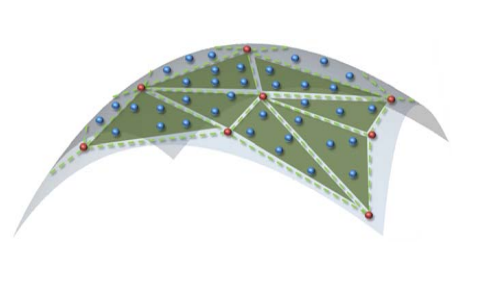   

* 观点 2：平面图的嵌入     
• 平面图    
• 图的顶点提升 (lifting) 至三维空间   
• 本质：二维流形    

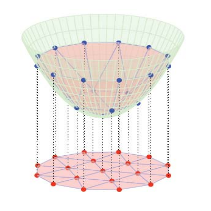   

# 回顾：数据结构—图 (graph)    

* G={V, E, F}      
• V: 顶点集合；E: 边集合；F: 三角形集合     
• 有其中两个集合可推出另一个集合     

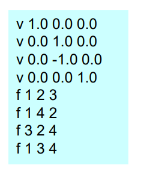   

* 多边形网格均可转化为三角网格       

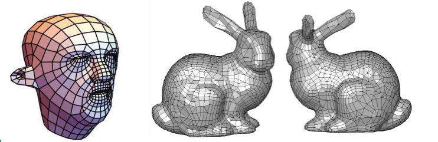   

* 不考虑非流形结构    

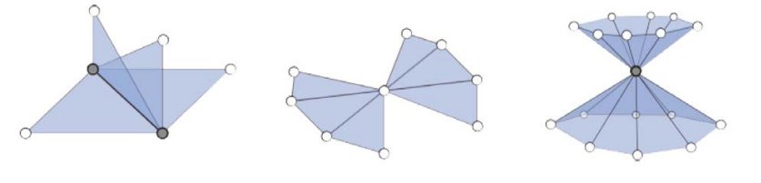   

# 三角网格编程初步    

# 半边 (half‐edge) 数据结构    

* 半边结构：以“边”为中心的数据结构    
• 网格连接关系存储在边上，每条边表达为两条“半边”    
• 目的：提高点线面的查询或增删改操作的效率    

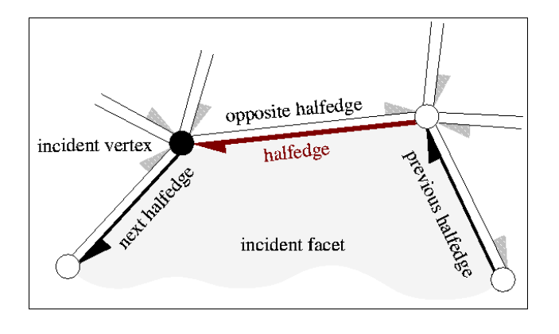    

<https://www.flipcode.com/archives/The_Half‐Edge_Data_Structure.shtml>    

# 半边 (half‐edge) 数据结构      

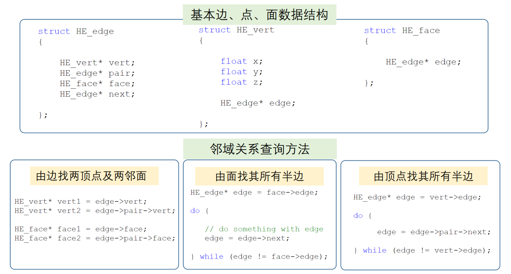   

<https://www.flipcode.com/archives/The_Half‐Edge_Data_Structure.shtml>   

# 几何（网格）处理库    

• CGAL: <http://www.cgal.org>    
• Libigl: <https://github.com/libigl/libigl>    
• MeshLab: <http://www.meshlab.net>    
• OpenMesh: <https://www.openmesh.org>    
• PCL (Point Cloud Library): <http://www.pointclouds.org>    
• TriMesh: <http://graphics.stanford.edu/software/trimesh>    
• DGtal: <https://dgtal.org>    

• 本课程作业框架：Utopia (USTC自研）   

<http://staff.ustc.edu.cn/~lgliu/Resources/CG/3D_modeling.htm>    

# 曲线曲面的微分几何    

# Curves    

# Differential Geometry of a Curve    

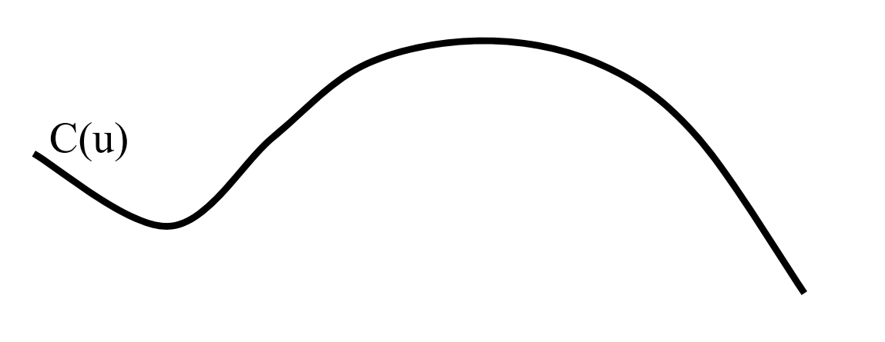   

# Differential Geometry of a Curve    

Point p on the curve at \\(u_0\\)   

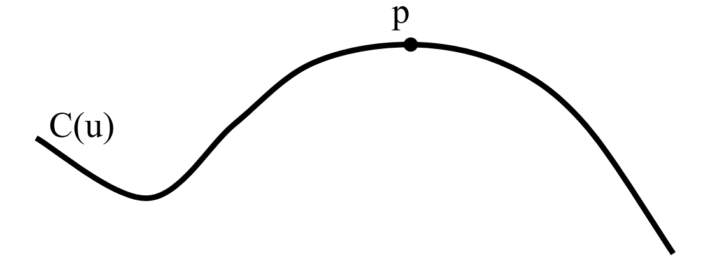   

p = C \\((u_0)\\)     

# Differential Geometry of a Curve    

Tangent T to the curve at \\(u_0\\)    

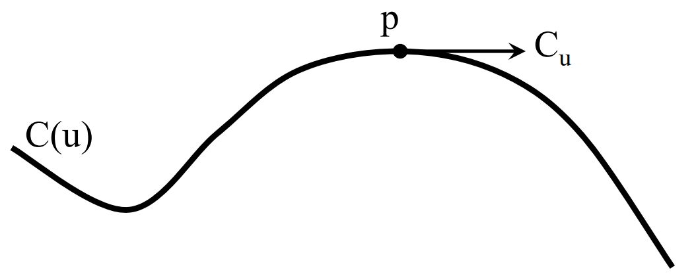   

\\(C_u=\frac{\partial C(u)}{\partial u} \\),\\(T=\frac{C_u}{||C_u||} \\)     

# Differential Geometry of a Curve     

Normal N and Binormal B to the curve at \\(u_0\\)    

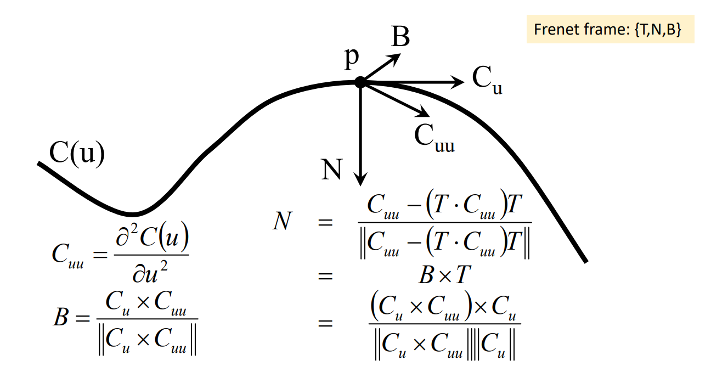   

# Differential Geometry of a Curve    

Curvature κ at \\(u_0\\) and the radius ρ osculating circle   

   

# Curves    

   

# Curve Curvature    

* Curvature is **independent** of parameterization     
• \\(C(t), C(t+5), C(2 t)\\) have same curvature (at corresponding locations)    

* Corresponds to radius of osculating circle \\(R=1/k\\)    

* Measure curve bending    

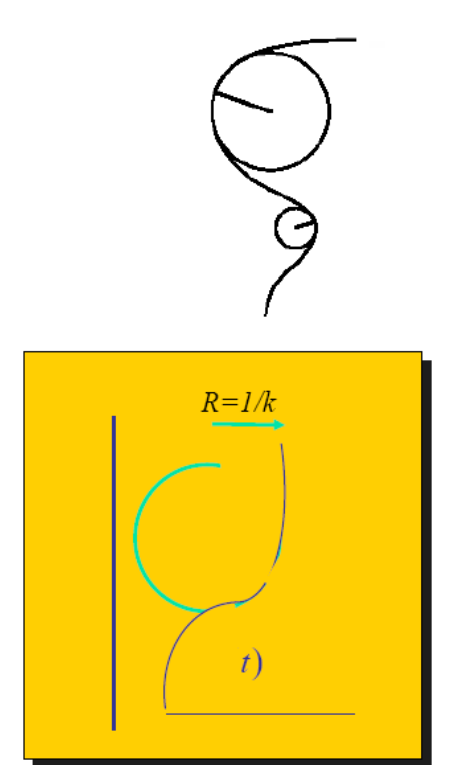   

# Surfaces   

# Differential Geometry of a Surface    

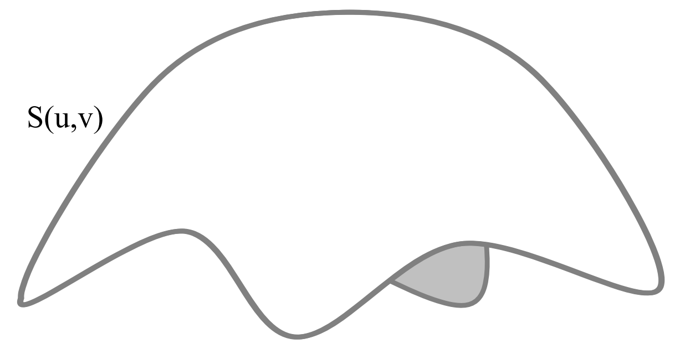   

# Differential Geometry of a Surface    

Point p on the surface at \\((u_0,v_0)\\)     

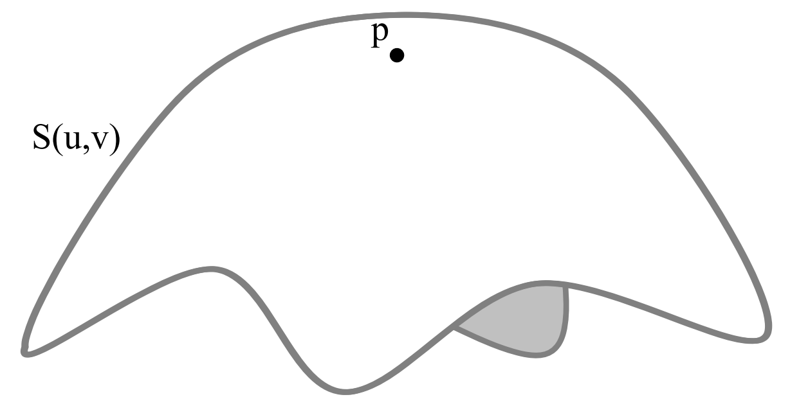   

# Differential Geometry of a Surface     

Tangent \\(S_u\\) in the u direction      

\\(S_u=\frac{\partial S(u,v)}{\partial u} \\)     

S(u,v)
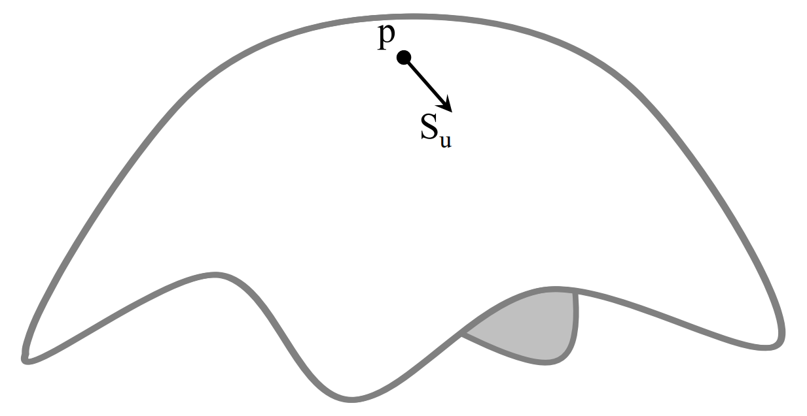   

# Differential Geometry of a Surface     

Tangent \\(S_v\\) in the v direction     

\\(S_v=\frac{\partial S(u,v)}{\partial v} \\)     

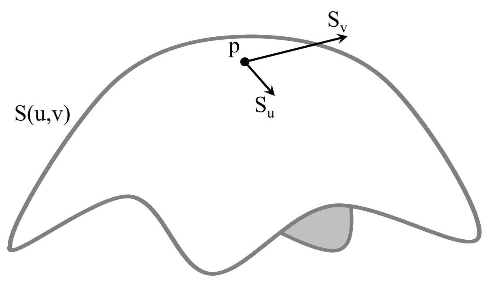  

# Differential Geometry of a Surface    

Plane of tangents T    

\\(T=uS_u+vS_v\\)     

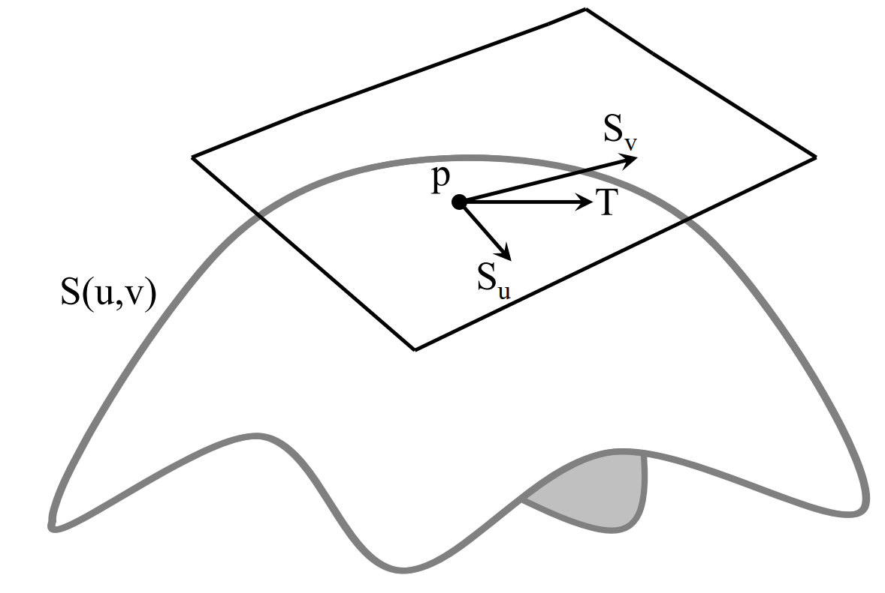  

# Differential Geometry of a Surface    

Normal N    
\\(N=\frac{S_u\times S_v}{||S_u\times S_v||} \\)    

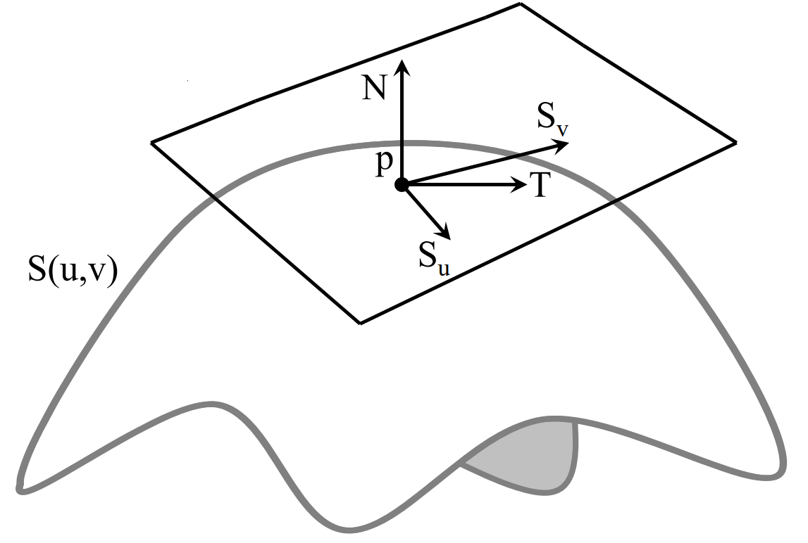  

# Differential Geometry of a Surface    

Normal section   

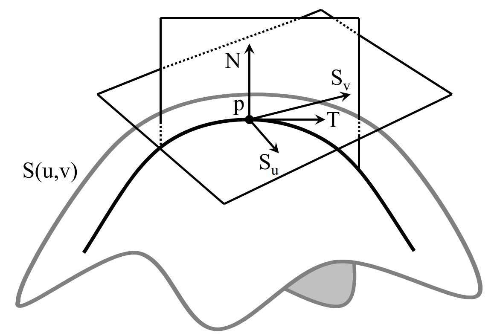  

# Differential Geometry of a Surface    

Curvature

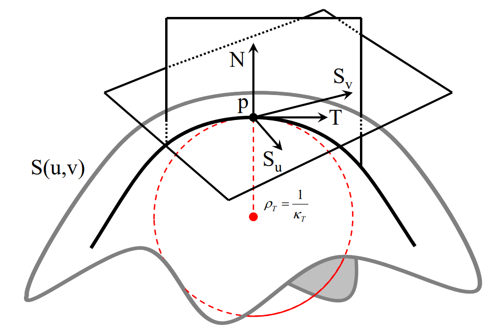  

# 方向曲率：曲率是随着方向变化的    

Curvature

  

# 曲面的曲率   

* 主曲率    
• 两个方向（正交）曲率：最大曲率\\(𝜅_1\\)和最小曲率\\(𝜅_2\\)     
* 欧拉公式     
• 其他方向曲率\\(k=k_1\cos ^2\theta +k_2\sin ^2\theta \\)     
* 高斯曲率     
• \\(k=k_1k_2\\)    
• 等距变换不变量     
• 处处高斯曲率为0的曲面：可展曲面     
• 三类：柱面、锥面、切线面      

  

* 平均曲率    
• \\(k=\frac{k_1+k_2}{2} \\)    
• 处处平均曲率为0的曲面：极小曲面      

  

# Principal Directions    

  

# Surface Curvature    

  

# 离散微分几何    

# 三角网格曲面的光滑性？   

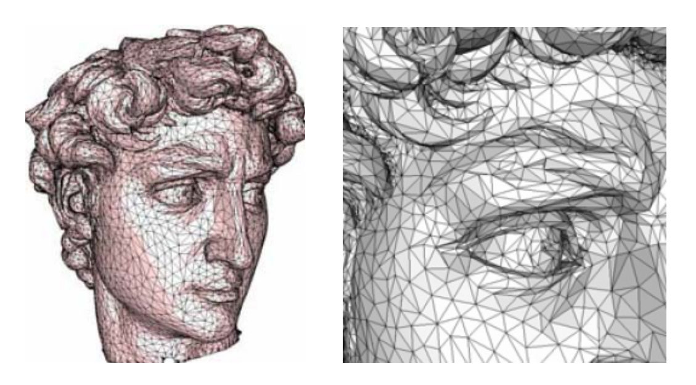   

# However, meshes are only \\(C^0\\)    

* Meshes are piecewise linear surfaces   
• Infinitely continuous on triangles   
• \\(C^0\\) at edges and vertices    

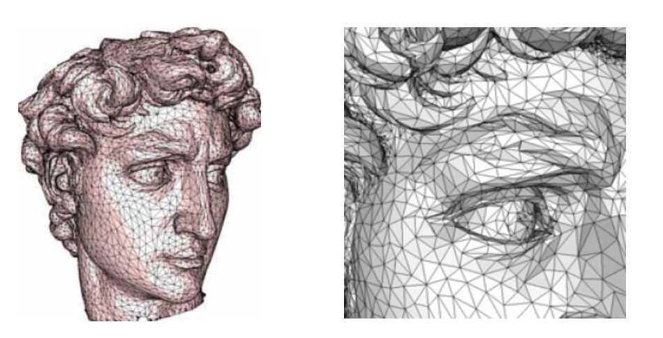    

# Discrete Differential Geometry    

* How to apply the traditional differential geometry on discrete mesh surfaces?     
• Normal estimation    
• Curvature estimation    
• Principal curvature directions   
• …   

# Estimation of Differential Measures    

 - Approximate the (unknown) underlying surface    
    - Continuous approximation    
      - Approximate the surface & compute continuous differential 
measures (normal, curvature)   
    - Discrete approximation   
      - Approximate differential measures for mesh    

# Continuous Approximation   

# Quadratic Approximation     

 - Approximate surface by quadric    
 - At each mesh vertex (use surrounding triangles)   
    - Compute normal at vertex    
      - Typically average face normals    
    - Compute tangent plane & local coordinate system    
      - (node = (0,0,0))    
    - For each neighbor vertex compute location in local system    
      - relative to node and tangent plane   

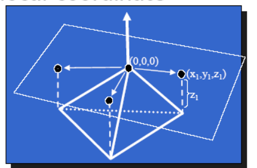    

# Quadratic Approximation (2)    

* Find quadric function approximating vertices    

$$
F(x, y, z)=ax^{2}+bxy+cy^{2}-z=0 
$$

* To find coefficients use least squares fit    

$$
\min \sum_{i}^{} (ax_i^2+bx_iy_i+cy_i^2-z_i) 
$$

 

# Quadratic Approximation (3)   

Finding the quadric function approximating points     

$$
F(x,y,z)=ax^2+bxy+cy^2-z=0
$$

To find coefficients use least square \\(\min \sum _i(ax_i^2+bx_iy_i+cy_i^2-z_i)\\) fit to find minimum:    

$$
\begin{pmatrix}x_1^2  & x_1y_1 &y_1^2
 \\\\ \cdots  &\cdots   &\cdots
  \\\\ x_n^2 &x_ny_n  &y_n^2
\end{pmatrix}\begin{pmatrix}a
 \\\\b
 \\\\c
\end{pmatrix}=\begin{pmatrix}z_1
 \\\\\cdots 
 \\\\z_n
\end{pmatrix}A=\begin{pmatrix}x_1^2  & x_1y_1 &y_1^2
 \\\\ \cdots  &\cdots   &\cdots
  \\\\ x_n^2 &x_ny_n  &y_n^2
\end{pmatrix},X=\begin{pmatrix}a
 \\\\b
 \\\\c
\end{pmatrix},b=\begin{pmatrix}z_1
 \\\\\cdots 
 \\\\z_n
\end{pmatrix}
$$

Approximation can be found by:\\(\tilde{X}=\left(A^{T} A\right)^{-1} A^{T} b\\)     

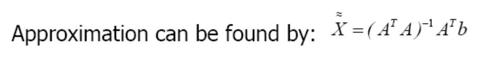    

# Quadratic Approximation (4)    

• Given surface \\(F\\) its principal curvatures \\(k_\min \\) and \\(k_\max\\) are real roots of:   

$$
k^{2}-(a+c)k + ac - b^{2} = 0
$$

• Mean curvature: \\(H = (k_\min + k_\max)/2\\)     
• Gaussian curvature:\\(K = k_\min  k_\max\\)    

# Other approximation     

* Cubic approximation     
• J. Goldfeather and V. Interrante. A novel cubic‐order algorithm for approximating principal direction vectors. ACM Transactions on Graphics 23, 1 (2004), 45–63.    
* Implicit surface approximation     
• Yutaka Ohtake et al. Multi‐level partition of unity implicits. Siggraph 2003.    
* Many others…      

# Discrete Approximation    

# Normal Estimation   

 - Normal estimation on vertices     
    - Defined for each face    
    - Average face normals    
      - Weighted:  face areas, angles at vertex      

 - What happen at edges/creases?     

# Mean Curvature     

• 由Laplace‐Beltrami定理：      

$$
K(x_i)=\frac{1}{2A_M} \sum_{j\in N_1(i)}^{} (\cot \alpha _{ij}+\cot \beta _{ij})(x_i-x_j)
$$

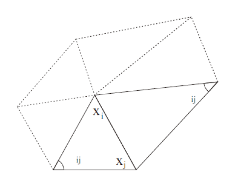    

# Gauss Curvature     

• 由Gauss‐Bonnet定理：   

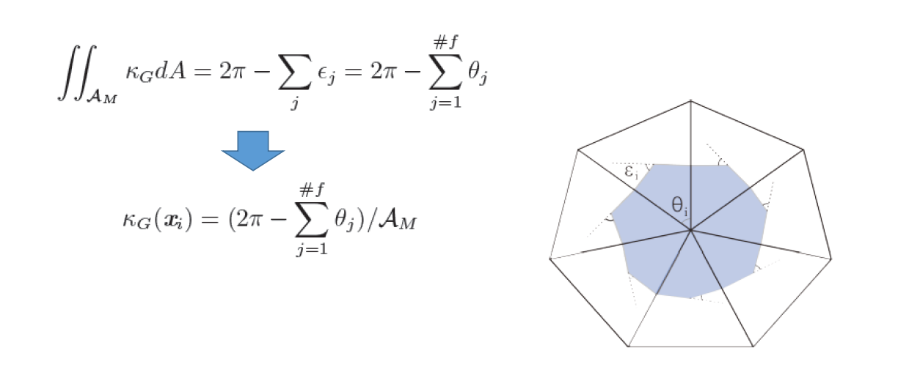    

# Gaussian Curvature Estimate – Example    

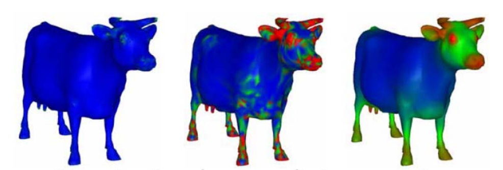    

 - Approximation always results in some noise    
 - Solution    
    - Truncate extreme values    
      - Can come for instance from division by very small area    
    - Smooth    
      - More later    

# Mean Curvature Estimate – Example    

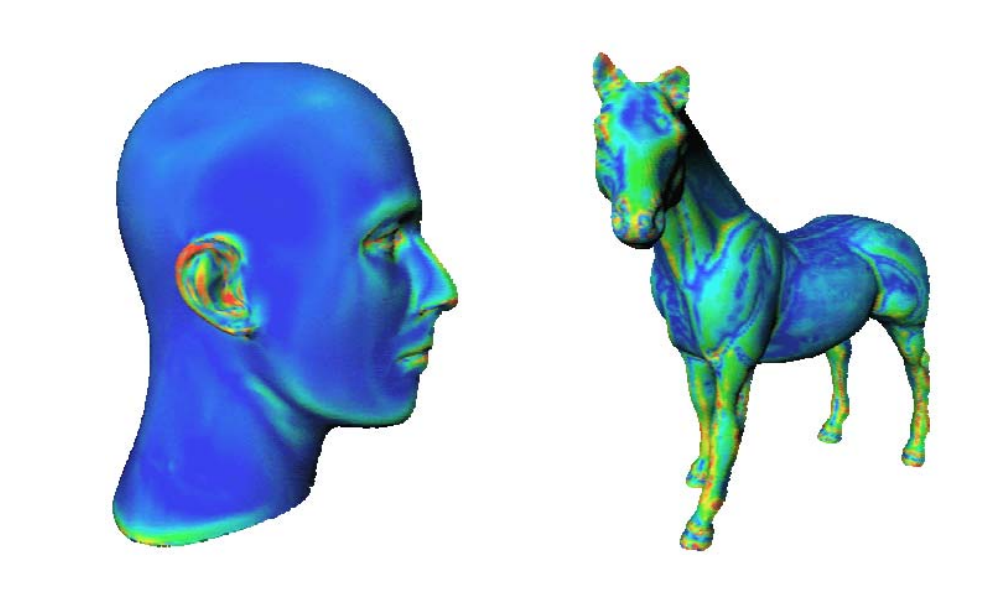    

# Mean Curvature    

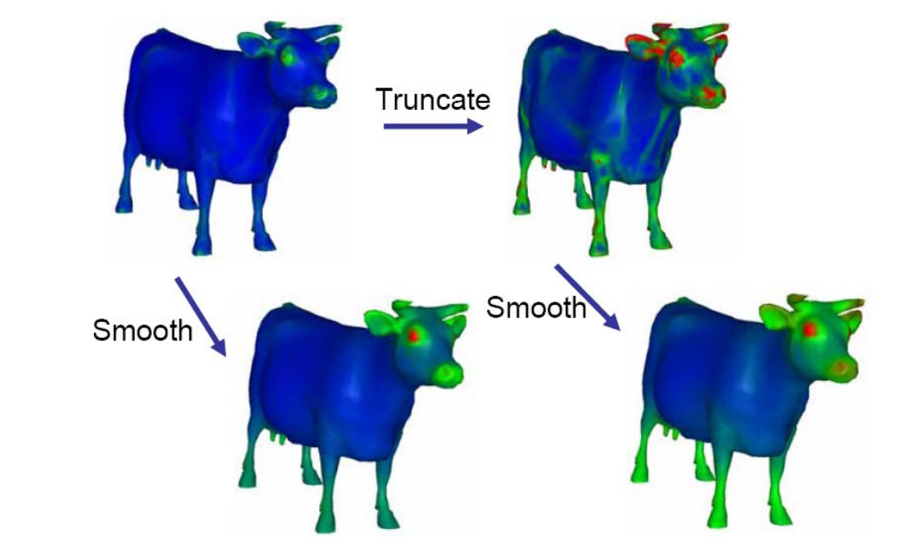    

# More…    

• MEYER M., DESBRUN M., SCHRÖDER P., BARR A.: Discrete differential‐geometry operators for triangulated 2‐manifolds. In Visualization and Mathematics III, Hege H.‐C., Polthier K., (Eds.). Springer, 2003, pp. 35–58. (<u>PDF</U>)    

# References    

• TAUBIN G.: Estimating the tensor of curvature of a surface from a polyhedral approximation. In Proc. International Conference on Computer Vision (1995), pp. 902–907.     
• MEYER M., DESBRUN M., SCHRÖDER P., BARR A.: Discrete differential‐geometry operators for triangulated 2‐ manifolds. In Visualization and Mathematics III, Hege H.‐C., Polthier K., (Eds.). Springer, 2003, pp. 35–58.      
• CAZALS F., POUGET M.: Estimating differential quantities using polynomial fitting of osculating jets. In Eurographics Symposium on Geometry Processing (2003), pp. 177–187.    
• COHEN‐STEINER D., MORVAN J.: Restricted delaunay triangulations and normal cycle. In Proc. ACM Symposium on Computational Geometry (2003), pp. 312–321.    
• GOLDFEATHER J., INTERRANTE V.: A novel cubic‐order algorithm for approximating principal direction vectors. ACM Transactions on Graphics 23, 1 (2004), 45–63.      
• MARTIN R. R.: Estimation of principal curvatures from range data. International Journal of Shape Modeling 4, 1 (1998), 99–109.     
• OHTAKE Y., BELYAEV A., SEIDEL H.‐P.: Ridge‐valley lines on meshes via implicit surface fitting. ACM 
Transactions on Graphics 23, 3 (2004), 609–612. (Proc. SIGGRAPH’2004).       
• PAGE D., SUN Y., KOSCHAN A., PAIK J., ABIDI M.: Normal vector voting: Crease detection and curvature 
extimation on large, noisy meshes. Graphical Models 64, 3‐4 (2002), 199–229.     

# 极小曲面    

# 极小曲面   

• 平均曲率处处为0的曲面   

    

# 极小曲面   

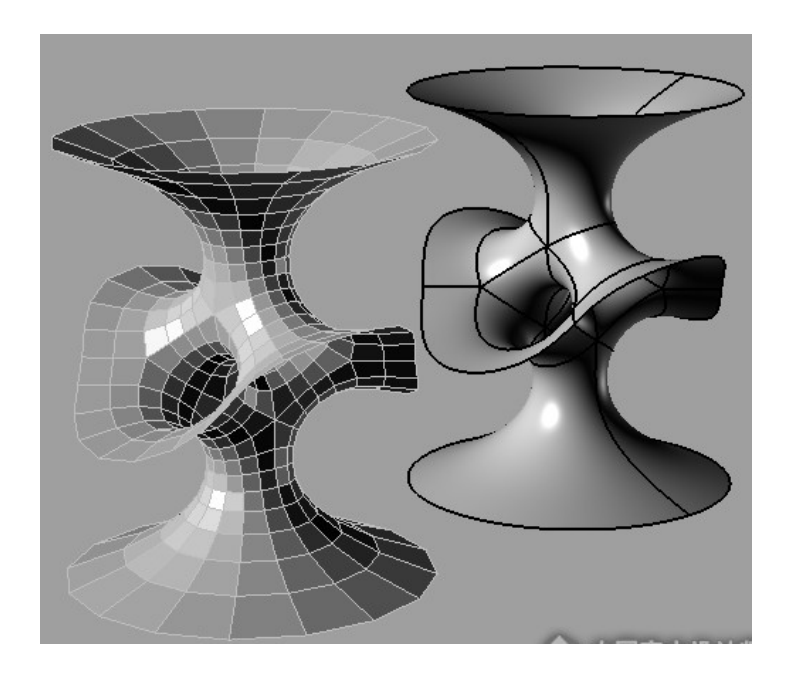    
    
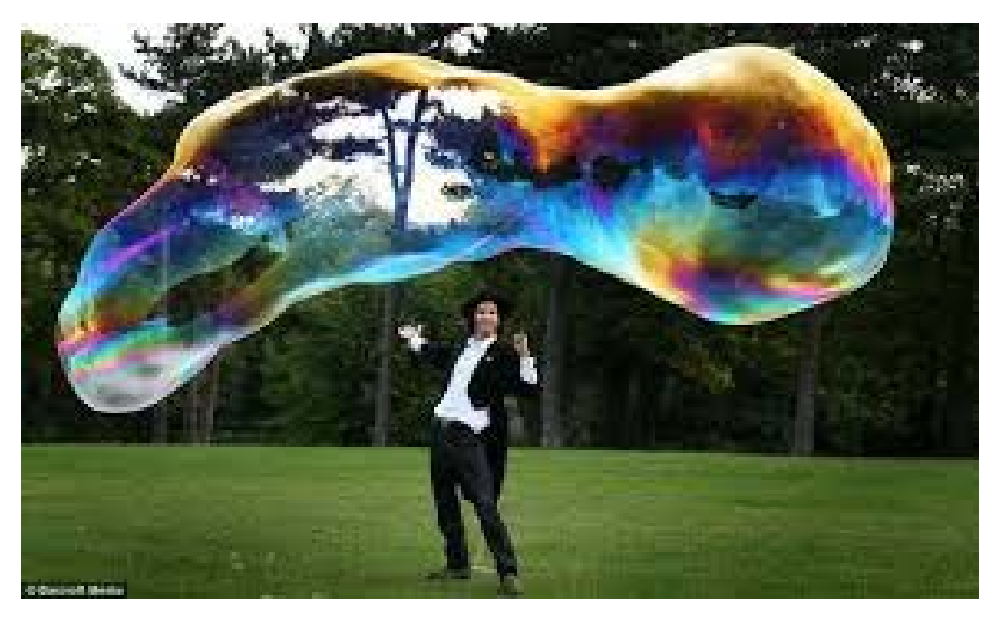    

# 极小曲面的例子    

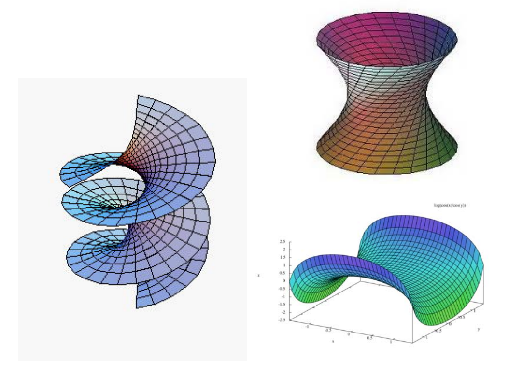    

# 建筑中的极小曲面：膜结构    

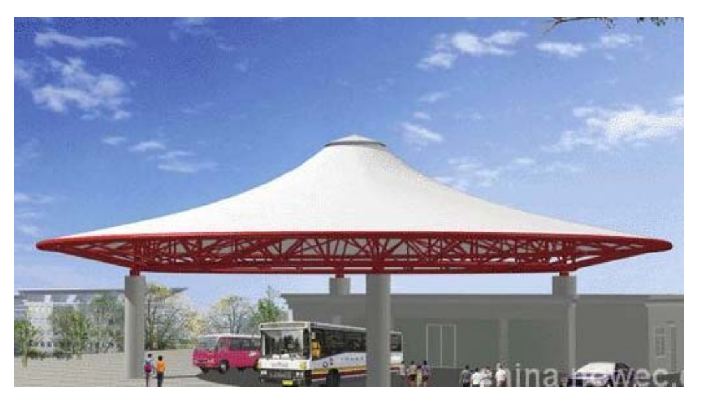    

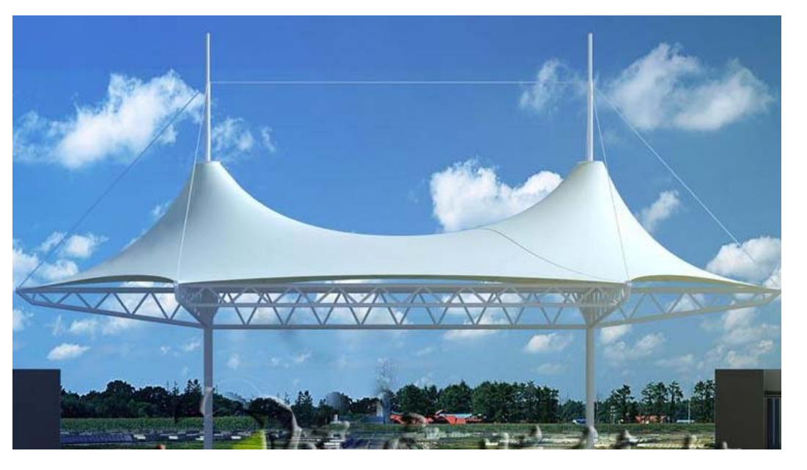    

    

    

    

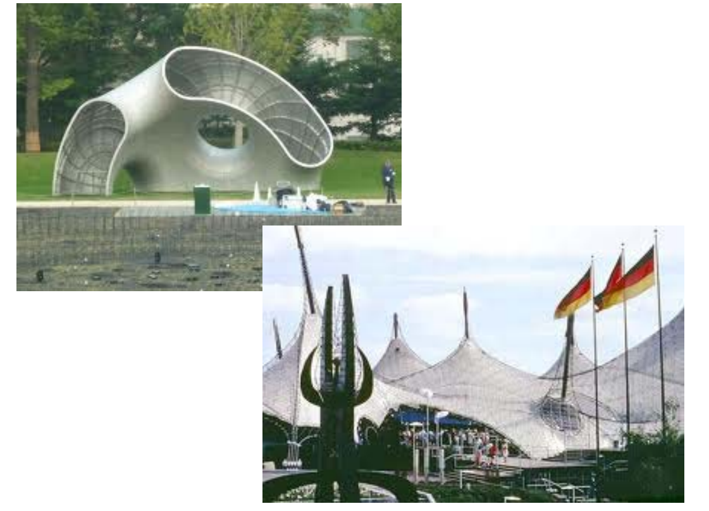    

# 极小曲面及平均曲率流    

• 平均曲率处处为0     

    

# Laplace Operator (Umbrella Operator)    

$$
L(P)=\frac{1}{n} \sum_{i=1}^{n} \overrightarrow{PQ_i} =\frac{1}{n} \sum_{i=1}^{n}Q_i-P
$$

    

# 离散平均曲率流   

  

# Discrete Mean Curvature     

$$
Hn=\frac{\nabla_PA}{2A} 
$$

$$
Hn=\frac{1}{4A} \sum_{j}^{} (\cot \alpha _j+\cot \beta _j)(P-Q_j)
$$

  

# 离散极小曲面的局部迭代法    

 - 找到边界    
 - 固定边界顶点    
 - 对每个内部顶点    
    - 找顶点1‐邻域    
    - 更新其坐标    
 - 迭代   
 - 更新所有顶点法向   

 - 【注】   
    - 只能对非封闭曲面（带一条边界）操作   
    - 更新坐标需要用老的顶点坐标   
    - 尝试试验不同的参数\\(𝜆(𝜆 = 0.1)\\)    

# 例子   

  

# 封闭曲面    

• 不固定任何顶点    
• 迭代结果如何？   

  

作业6    
* 任务：实现极小曲面的局部法    
• 寻找非封闭三角网格曲面的边界    
• 每个顶点更新坐标    
• 迭代给定次数 或 迭代至收敛    
* 目的   
• 学习三角网格的半边数据结构及操作   
* 框架：   
• Utopia （推荐）   
• 其他    
* 【可选】计算三角网格顶点的离散高斯曲率和平均曲率 并用颜色进行可视化    
* Deadline：2020 年12 月5日晚      

# 附加：如何构造曲面边界？   

 - 3D空间封闭曲线     
    - 已知的非封闭曲面   
    - 自己构造：平面曲线变形    

    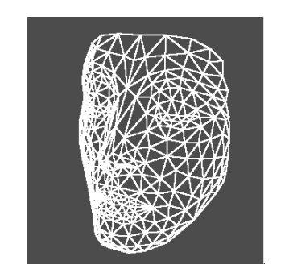  

 - 初始网格    
    - 自己构造    
      - 平面：Delaunay三角化（学习Triangle库）    
      - 空间变形: Warping     

      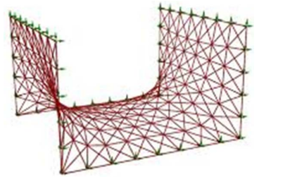  

# Triangle    

<http://www.cs.cmu.edu/~quake/triangle.html>   

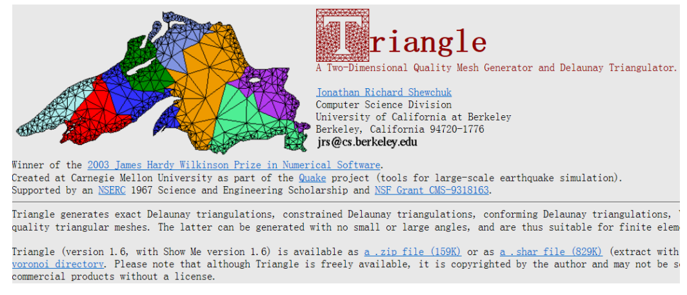  

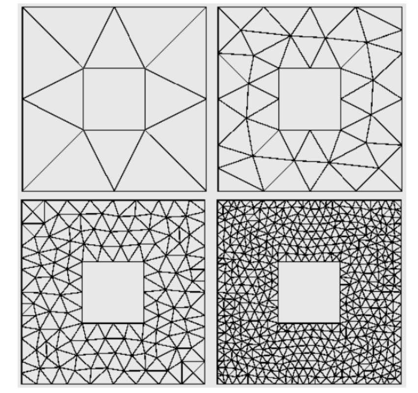  

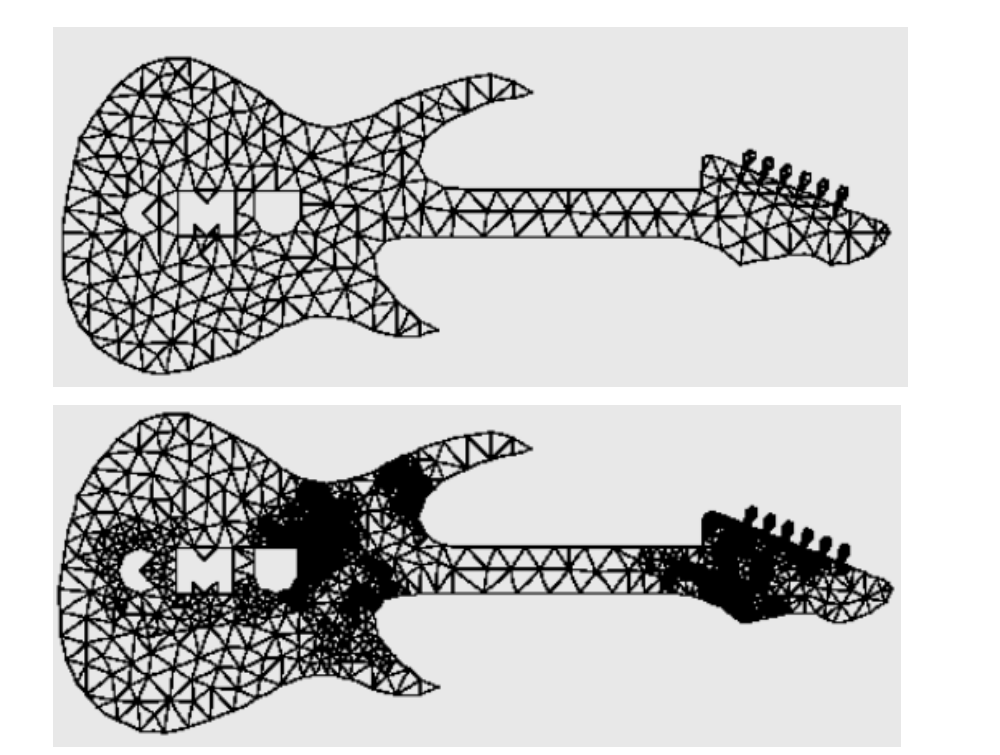  