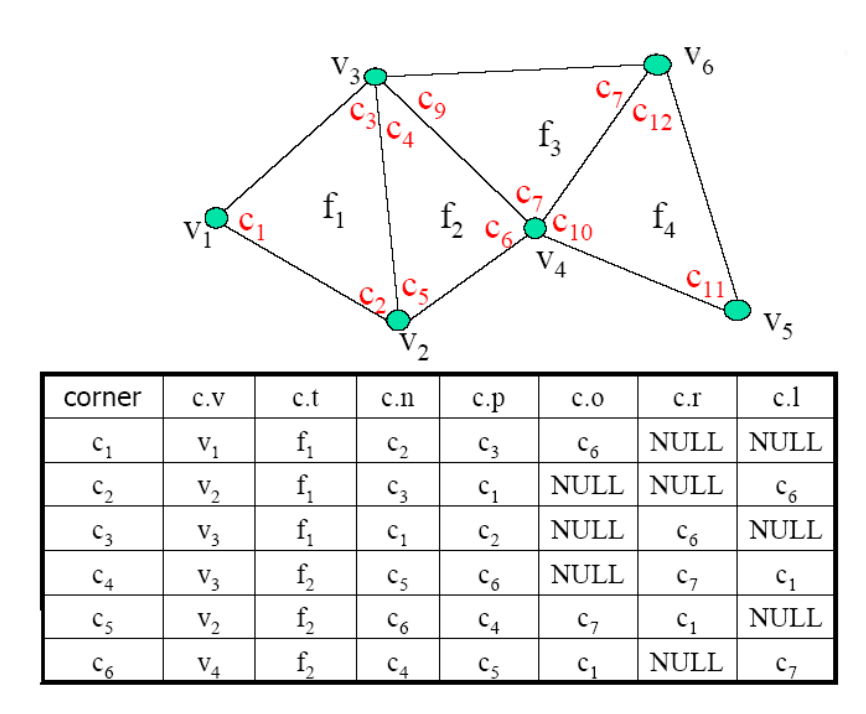

几何建模与处理基础
刘利刚
中国科学技术大学
GAMES 102在线课程
微分坐标
GAMES 102在线课程：几何建模与处理基础
(Laplace坐标
)
3D网格曲面：二维流形曲面的离散
• 平面图在3D空间中的嵌入 ଶ ଷ
Cardinal Coordinates
• (x,y,z) coordinates
v 1.5 -0.960751 -1.2232
v 0.81 -0.891238 -3.74258
v 0.16 -0.233535 -2.28405
v 1.49 -2.44325 -3.6962
v 1.59 -2.98815 -4.15761
v 1.66 -2.81016 -4.10777
v 1.41 -1.14861 -1.92823
v 1 -1.40023 -3.80159
v 0.88 -1.33122 -3.83517
…
f 1 2 3
f 2 4 5
…
图的连接关系：点、边、面
存储数据结构：半边结构
Local Structure
• Small‐sized Cells
• 1‐ring neighborhood 
（1‐邻域）
• 一般“流形”结构也是通过局部邻域来定义
局部特征度量：1‐邻域
• Detail = surface 
– smooth (surface)
• Smoothing = averaging
average of 1-ring neighbors
Laplace算子(operator)
• 维欧几里得空间的二阶微分算子（椭圆型算子）
• 梯度 的散度
ଶ
• 在笛卡尔坐标系中，为所有非混合二阶偏导数：
ଶ
௜
ଶ
௡
௜ୀଵ
• 特别地，对二元实函数 ：
ଶ
ଶ
ଶ
ଶ
Laplace‐Beltrami 算子
• 推广：定义在黎曼流形上的椭圆型算子
Differential Coordinates （微分坐标）
• 离散形式的 Laplacian 算子 (Umbrella Operator，
伞型算子):
( )
i i j j
j Ni
 v wv   

average of 1-ring neighbors
平均曲率流定理
 
( )
1
N i i d

i i 


v
δ vv
 
1
( )
ds
len




 i
v
v v
  () 0
1 lim ( ) ( ) len ds H
 len




 
 i ii
v
v v vn

离散形式：
Geometric Meaning
 
( )
1
N i i d

i i
  
v
δ vv  
1
( )
ds
len




 i
v
v v
  () 0
1 lim ( ) ( ) len ds H
 len




 
 i ii
v
v v vn

• DCs represent the local detail / local shape description
• The direction approximates the normal
• The size approximates the mean curvature
Weighting Schemes
(Barycentric coordinates)
• Uniform weight (geometry oblivious)
• Cotangent weight (geometry aware)
• Normalization
1
wj

(cot cot )
wj




j
j
j
j
w
w
w


Local Laplacian Smoothing
Differential Coordinates
(Laplace Coordinates)
• Represent local detail at each surface point
• better describe the shape
• Linear transition from global to differential
• Useful for operations on surfaces where surface 
details are important
Laplacian Smoothing Flow
Median direction
Pnew

Pold

L
(
Pold
)
Pold
L
L
Pnew
Pold
Move each vertex
Average of the vectors
to neighboring vertices
Qk
Qk
1
Qk
1
Laplacian Smoothing
• Equivalent to box filter in signal processing
• Apply to all vertices on mesh
• Typically repeat several times
• Can describe as energy minimization
• Energy = sum of squared edge lengths in mesh
• Parameter            controls convergence "speed"

 new old old
P

P

 L
P


0
Laplacian Smoothing 
– Example 
Problem of Over‐smoothing
Iterations 
Noisy Best Over-smoothing
How to find appropriate 
 and number of iterations?
Mean Curvature Flow
 
( )
1
N i i d

i i
  
v
δ vv  
1
( )
ds
len




 i
v
v v
  () 0
1 lim ( ) ( ) len ds H
 len




 
 i ii
v
v v vn

Discrete Mean Curvature Flow
Pnew

Pold

 H
(
Pold
)
n
(
Pold
)
Pold
Hn
Pold
Move 
each vertex
Hn
Pnew
Direction = normal 
Speed = discrete mean curvature 
Discrete Mean Curvature




2
P
Hn





j
H
j
j
j (cot cot )(
)
4
1
n


P
Q
P
Q
j
j
j
Properties of Mean Curvature Flow
 Increases mesh irregularity.
 Doesn’t develop unnatural deformations
High
density
sampling
Low
density
sampling
Global Laplacian Smoothing
极小曲面(minimal surface)
• 平均曲率处处为0
 
( )
1
N i i d  i i   v δ vv   1( ) ds len      i v v v
  () 0 1 lim ( ) ( ) len ds H  len        i ii v v v vn

H( ) 0,  i i v 微分坐标=0
局部迭代光顺方法的问题？
• 注：通过作业
6中已发现
Pnew

Pold

 H
(
Pold
)
n
(
Pold
)
Pold
Hn
Pnew
微分坐标一致为
0
• 所有顶点的方程联立，得到网格曲面的整体
Laplacian方程：
( )
() 0 i i ij j
j Ni
Lv v v 

   
i v
i v
cotangent : 
ij = cot 
ij + cot 
ij
Laplacian Matrix
• The transition between the 
 and xyz is linear:
               
L
1
2
n
x
x
x
               


( )
1
( )
2
( )
x
x
x
n



     
          


0
i
ij
d ij
D
otherwise










otherwise
i
N
j
Aij
0
1
(
)
1 L IDA  
Laplacian matrix
• The transition between the 
 and xyz is linear:
L
v
x
=

x
L
=
L
=


( )
i ij i j
j Ni
w

δ vv   
v
y
v
z

y

z
Reconstruction
• From relative coordinates to absolute coordinates.
• Solving a sparse linear system
Lv


Basic properties
• Rank(L) = n‐c   (n‐1 for connected meshes)
• We can reconstruct the xyz geometry from delta up 
to translation
Lx δ 
极小曲面生成的全局方法
• 检测边界，固定边界
• 构建稀疏方程组
(
)
• 求解稀疏方程组
• 【注：有高效的求解方法，且有成熟的数学库可使用】
• 更新内部顶点坐标
Mesh Parameterization
(Mesh Flattening)
曲面参数化
Parameter domain Embedded (ambient) space
Parametric Surfaces
曲面展开（参数化）
参数化：将曲面展开成平面
• 每个3D顶点(x,y,z)对应一个2D
点(u,v)
• (u,v) 称为 (x,y,z) 的参数（2D流形曲面的本征维数）
History
地图：将地球“展平”成平面
• 3D地球表面和2D地图的点有一一对应
但，球面是不可展的，必有形变
思考：
1.地图上的两点之间的距离是真实距离吗？哪些地方的距离可信度更高？
2.地图上看，哪些区域的面积被放大了？
思考：北京和纽约的最短路径是什么？
将球面割开展平的不同方式
沿经线切 沿北纬15度的纬线切
传统横板地图
沿经线切开
新型竖板地图
沿北纬15度的纬线切开
北京‐纽约的最短路径
纽 北 约 京 1.9万 公里
1.1万
公里
参数化是几何处理中的基本问题
• 提供了三维曲面每个点的一个二维参数
• 本征维数参数
• 在低维来处理高维问题，减少复杂度
• 降维
• 三维曲面之间的相关问题可通过参数化空间来处理
给定边界的极小曲面
• 如果边界刚好在一个平面上（共面）？
将边界映射到平面的
凸多边形上
• Fixing the boundary of the mesh onto
an unit circle                        an unit square
[Floater 97’]
M. Floater. Parametrization and smooth approximation of surface triangulations. CAGD, 1997.
http://www.cs.jhu.edu/~misha/Fall09/Floater97.pdf
方法：求解稀疏方程组
Tutte’s Method: Why it Works
• Theorem [Tutte,63], [Maxwel,1864] : 
• If G=<V,E> is a 3‐connected planar graph (triangular 
mesh) then any barycentric embedding provides a valid
parameterization
如果边界位于凸多边形上，则三角形一定不会发生翻转！
参数化：操作步骤
• 检测边界
• 将边界映射到正方形边界或圆边界（凸边界）
• 构建稀疏方程组
• 求解稀疏方程组
• 更新顶点坐标
• 连接纹理图像，更新显示
Floater参数化方法
• Uniform parametrization
• Weighted least squares parametrization
• Shape‐preserving parametrization 
• 如何判断哪个参数化方法更好？
[Floater 97’]
M. Floater. Parametrization and smooth approximation of surface triangulations. CAGD, 1997.
http://www.cs.jhu.edu/~misha/Fall09/Floater97.pdf
曲面展开（参数化）
纹理映射

例子
例子
例子
Parameterization
Parameterization
曲面纹理的保存：2D图像
参数化应用：纹理映射
Constrained (Feature‐Preserving)
Global Laplacian Smoothing
Shrinkage
• Global Laplacian smoothing results in shrinkages
Ideas: add constraints
• 如何处理各种约束条件？
• 顶点约束、面约束
…
 Interpolation (hard constraints) 
Approximation (soft constraints)
Soft Lapacian Smoothness
( )
() 0 i i ij j
j Ni
Lv v v 

   
i v
i v

Laplacian of Mesh
• Discrete Laplacians
( )
() 0 i i ij j
j Ni
Lv v v 

  
L
x
=

 Laplacian of the mesh
1, ,
, (, ) ,
0,
ij ij
i j
L

i
j
E

  
 

 other.
Laplacian of Mesh
• Surface reconstruction
L
x
=

L
L
y
z
x



( )
() 0 i i ij j
j Ni
Lv v v 

   
Properties of Laplacian
           
1
2
3
v
v
v
           

0
0
0
   
        

L
Rank(
L) = nk

k is the number of connected 
components of the mesh
 Need to add some constraints 
Vertex Constraints
• Add position constraint for one vertex
y
z
x
=
c1



fix
L
L
L
0
c1
Vertex Constraints
• Add position constraints for more vertices
y
z
x
=



fix
c
2



L
L
L
0
fix
Adding Vertex Constraints
2
2
2 min{ } i i
X i C
LX v v   
    
L
Face Constraints
10 0
01 0
11 1 0
01 1 1
                         


1
2
n
x
x
x
           
 1
2
1
2
0
0
0
c
c
t
t
           
              

barycenter
1( )
3 center i j k v vvv  
A x b 
Adding Face Constraints
2
2
2
, ,
min{ ( ) ( ) } i j k i jk
X i jk T
LX v v v v v v  
 
       
  0.5 0.3 
Other Constraints
• Edge constraints
• 1‐ring barycenter constraints
• Other linear constraints
Minimizing Energy
2 2
2 2 2
, ,
min{ ( ) ( ) } i i i j k ijk
X i C ijk T
LX v v v v v v v v   
  
           
Ax b 
Least Square Solution
• An over‐determined system:
• Normal equation:
ATA
x
=
AT
b
(ATA)-1
x
=
AT
b
A
x
=
b
One Channel Solution
• Very efficient solution by Cholesky factorization of 
A
T
A:
R is upper‐triangular and sparse
Once R is computed, solving for 
x, 
y, 
z by back‐
substitution:
T
T
A
A

R
R
b
ξ
ξ
x
T
T
R
A
R


Results
‘8’-like mesh model
3070 vertices, 6144 triangles
Results
Venus head model 
134359 vertices, 268714 triangles
LoD Smoothing
Applying our algorithm to the bunny model with different parameters.
Laplacian Editing
[Sorkine et al. SGP 2004]
Cardinal Coordinates
• (x,y,z) coordinates
v 1.5 -0.960751 -1.2232
v 0.81 -0.891238 -3.74258
v 0.16 -0.233535 -2.28405
v 1.49 -2.44325 -3.6962
v 1.59 -2.98815 -4.15761
v 1.66 -2.81016 -4.10777
v 1.41 -1.14861 -1.92823
v 1 -1.40023 -3.80159
v 0.88 -1.33122 -3.83517
v 1.69 -2.60816 -4.12133
v 1.68 -2.36516 -4.13078
…
Pros and Cons?
What’s are Details?
• Detail = surface – smooth (surface)
• Smoothing = averaging
average of 1-ring neighbors
What’s the Difference?
• Absolute Coordinate
• Relative Coordinate
( )
i j j i
j Ni
v wv 

  
(, ,) i i ii v x  y z
?
Laplacian Editing
• Local detail representation 
– enables detail 
preservation through various modeling tasks
• Representation with sparse matrices
• Efficient linear surface reconstruction
Editing framework
• The spatial constraints will serve as modeling 
constraints
• Reconstruct the surface every time the modeling 
constraints are changed
1 2 , {, , }
j j k
L
x c j jj j

 
x δ
Modeling constraints:

Detail constraints:
Direct Detail Preserving
A
B
Shape-preserving
transformation
Rotation Transformation ai bi
a
j
b
j
1 a
1 b
a
N
b
N
1 1 bb aa
bb aa
i i
i
Ni Ni
                     
R
Reconstruction
• Soft constraints T T
L Lv L 

Variational Viewpoint
• Laplacian Approximation
• Gradient Approximation
User Interfaces
• ROI is bounded by a belt (static anchors)
• Manipulation through handle(s)
Results
Results
Detail transfer and mixing
• “Peel
“ the coating of one surface and transfer to 
another
Detail transfer and mixing
• Correspondence:
• Parameterization onto a common domain and elastic 
warp to align the features, if needed
Detail transfer and mixing
• Detail peeling:
i ii 
   

i  i 

Smoothing by
[Desbrun et al.99]
Detail transfer and mixing
• Changing local frames:
i 
i 
Detail transfer and mixing
• Reconstruction of target surface from:
target i i

     
target 
Examples
Examples
Mixing Laplacians
• Taking weighted average of 
i and 
‘
i
Mesh transplanting
• The user defines
• Part to transplant
• Where to transplant
• Spatial orientation and scale
• Topological stitching
• Geometrical stitching via Laplacian mixing
Mesh transplanting
• Details gradually change in the transition area
Mesh transplanting
• Details gradually 
change in the 
transition area
作业7
• 任务：
• 实现极小曲面的全局方法：边界固定，求解方程组
• 实现曲面参数化：边界映射到平面，求解方程组
• 只要实现Floater1997论文中的一种方法（cot权）即可，其他的可选
• 目的
• 学习使用数学库（推荐Eigen库）求解稀疏线性方程组
• 数据
• 带一条边界的网格曲面（暂不处理复杂曲面）
• Deadline：2020 年12 月12日晚
谢 谢！
   
