 

# 采样 (Sampling)   

# 从连续到离散    

* 对象的表达    
• 在数学上，连续表达与计算    
• 在计算机中，离散表达与计算    
* 数值方法：数值微分、数值积分、数值优化    
• 数值分析：离散计算对精确计算的近似程度    
• Fourier分析/变换：离散Fourier分析/变换    
• 卷积（滤波）    
* 在计算机科学（计算机图形学）中，采样无处不在     
• 计算机只能表达离散的数值    
• 例子：int型的数据（量化）    

# 曲线曲面的离散表达    

* 曲线的绘制：   
• GDI/OpenGL 绘制基本单元：点、线段    
• 曲线须离散成多边形    
* 曲面的绘制：  
• OpenGL 绘制基本单元：点、线、三角形   
• 曲面须离散成三角形网格   

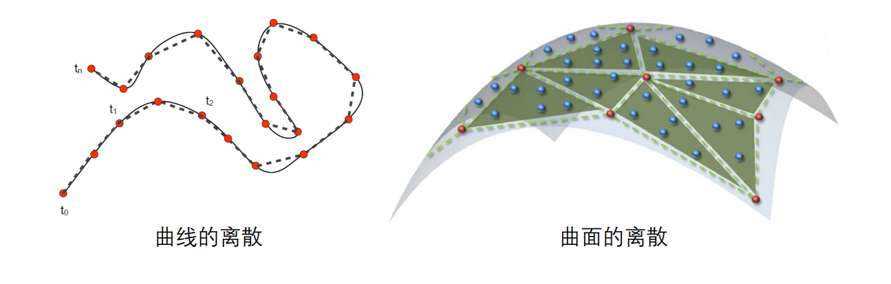    

# 离散的本质：采样 (Sampling)   

 - 曲线曲面的采样    
    - 在参数域上采样    
    - 直接在原始曲线曲面采样    
 - NURBS曲线曲面的采样误差估计    
    - 可进行理论上的误差分析    
 - 逆向工程：   
    - 采样点的获取    
      - 通过扫描硬件设备得到采样点     
      - 通过（多视点几何）重建算法计算得到采样点    
    - 重建问题：如何通过采样点重构原始曲线/曲面    
      - 连续重建：用连续函数来拟合表达    
      - **离散重建：直接得到离散基元表达**    

# 图像：区域的采样   

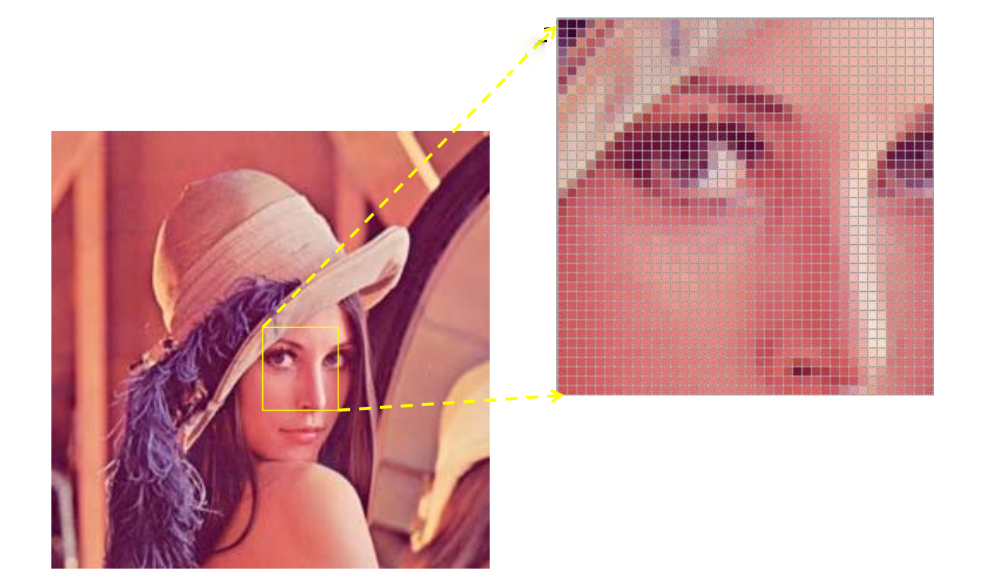    

# 视频：时间的采样    

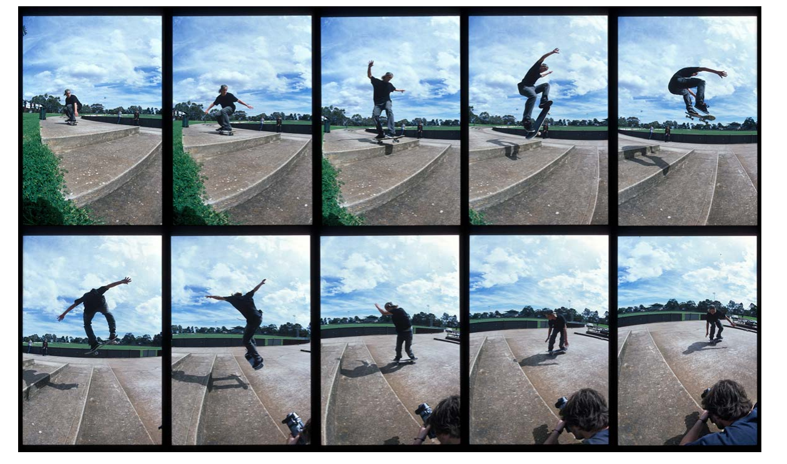    

# 曲线的采样   

    

# 曲面的采样    

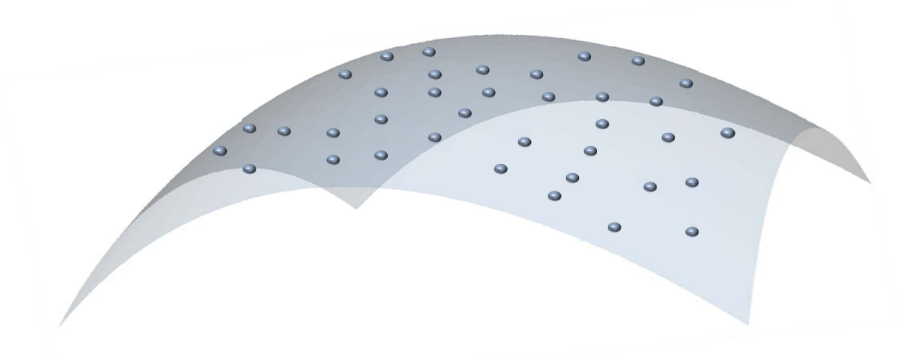    

# 采样与重建    

    

# Sampling Theorem    

• Nyquist–Shannon sampling theorem   

> If a function x(t) contains no frequencies higher than B hertz, it is completely determined by giving its ordinates at a series of points spaced 1/(2B) seconds apart.   

\\(\Rightarrow \\) Generally, **a amount of** samples are equired to **recover** complex signal    

# 采样与信号频率    

> Fourier Analysis   

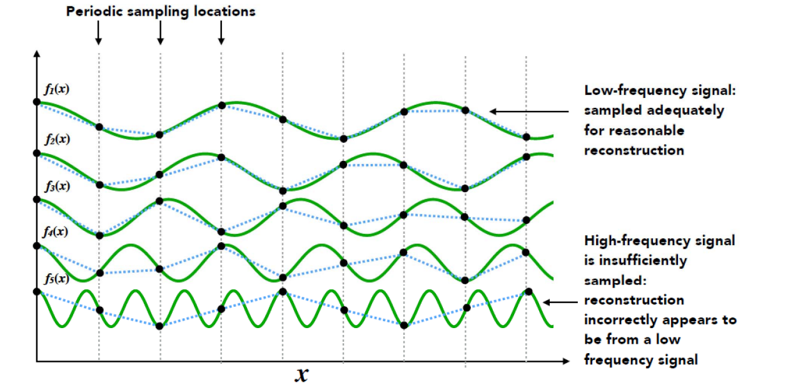    

Slide courtesy of Prof. Ren Ng, UC Berkeley   

# 欠采样产生频率的走样    

• 高频函数拟合低频信号：过拟合    
• 低频函数拟合高频信号：欠拟合    

    

# Stippling    

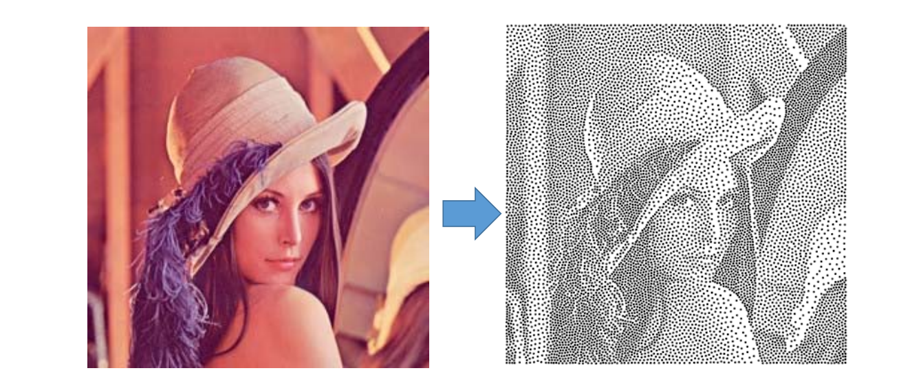    

# Half‐tone (dithering)    

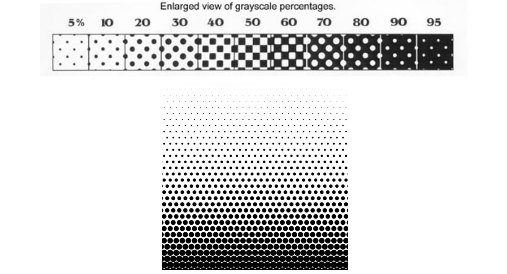    

# Halftoning Printing    

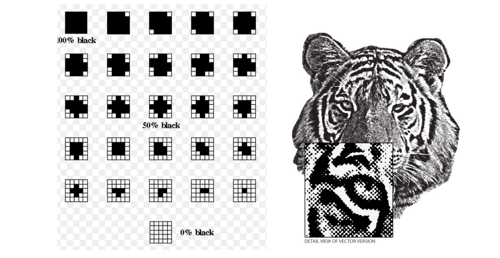    

# 1D曲线的采样：分段线性逼近表达    

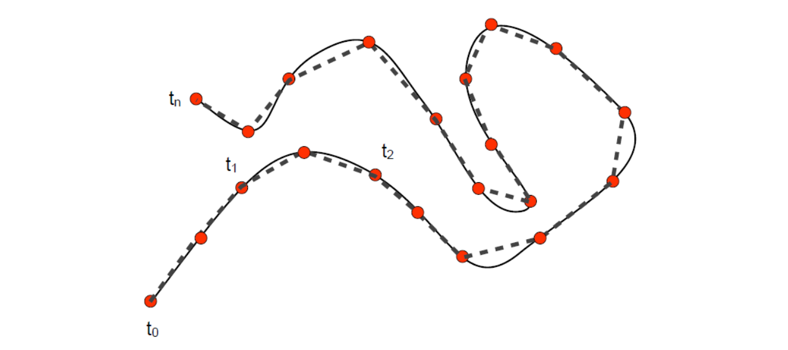    

# 2D曲面的采样：分片线性逼近表达     

    

# 平面规则区域的采样     

• 将一个区域分解为若干个小区域    

    

# 平面区域的不规则采样    

    

# 平面区域的不规则采样     

• 将一个区域分解为若干个小区域   

    

# Triangulation   

• 复杂函数的分片线性逼近 (piece‐wise linear approximation)   

    

# Blue Noise Sampling    

• (Left) A uniformly distributed yet randomly located point set    
• (Right) The typical power spectrum, radially averaged ower 
spectrum and anisotropy of blue noise distributions.    

    

# 平面三角网格

# 给定平面上一些点，如何生成**比较好**的三角剖分？   

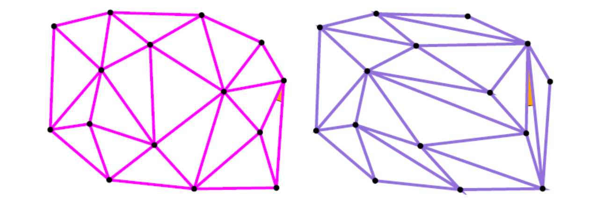    

**有无“最好”的三角剖分？**    

# Mesh Quality    

* What do we mean a “good” mesh/simplex (triangle)?    
• Minimal angle   
• Mean ratio   
• Aspect/radius ratio   
• **Singular values**    
• …   

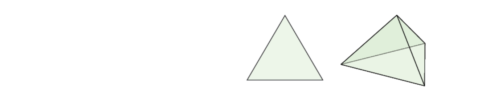    

* It is not easy to define a universal mesh quality cceptable by everyone. But everyone agrees on the "best" simplex: equilateral triangle and tetrahedra.      

# Delaunay三角化   

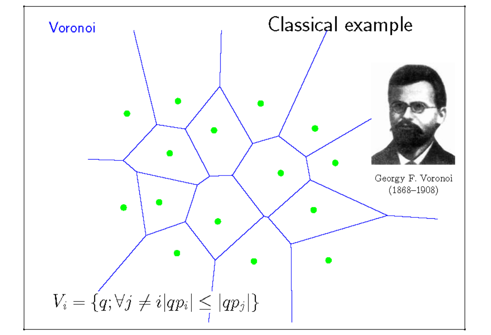    

    

    

    

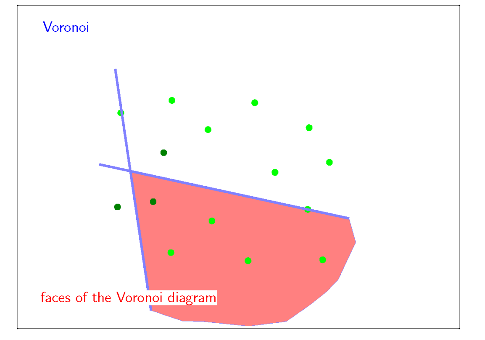    

    

# Properties of DT (1)   

* Empty sphere property: no points inside the circum‐sphere of any simplex     
• Delaunay edge    

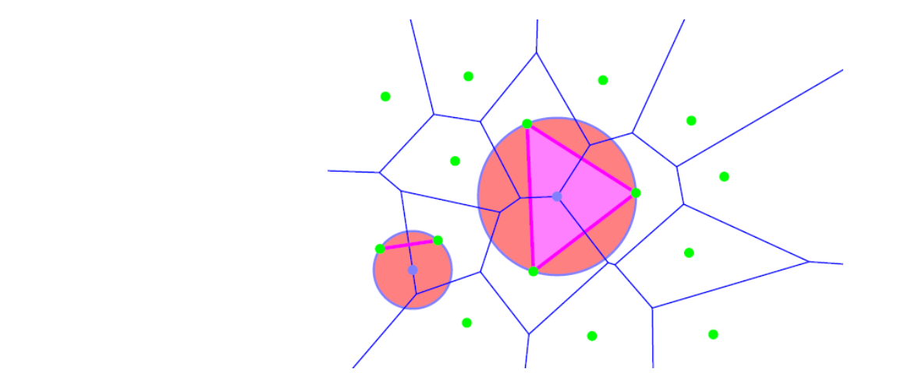    

# Properties of DT (2)    

* DT maximizes the smallest angle     
• [Lawson 1977] and [Sibson 1978]    

    

# Properties of DT (3)    

• Convex hull: union of all triangles    

    

# Properties of DT (4)    

 - DT maximizes the arithmetic mean of the radius of inscribed circles of the triangles.    
    - [Lambert 1994]   
 - DT minimizes roughness (the Dirichlet energy of any piecewise‐linear scalar function)   
    - [Rippa 1990]   
 - DT minimizes the maximum containing radius (the radius of the smallest sphere containing the simplex)    
    - [Azevedo and Simpson 1989], [Rajan 1991]   

# Properties of DT (5)     
 - The DT in d‐dimensional spaces is the projection of the oints of convex hull onto a (d+1)‐dimensional paraboloid.     
    - [Brown 1979]    

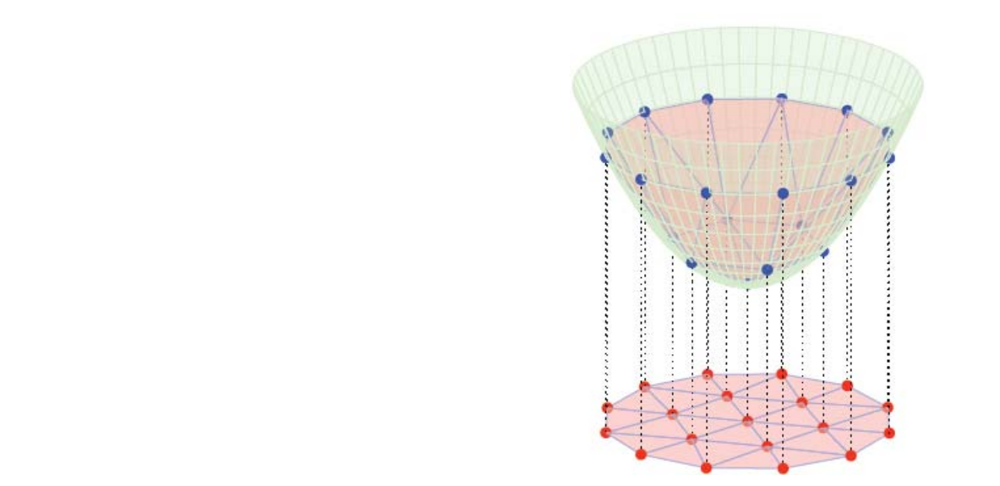    

# Properties of DT (5)    

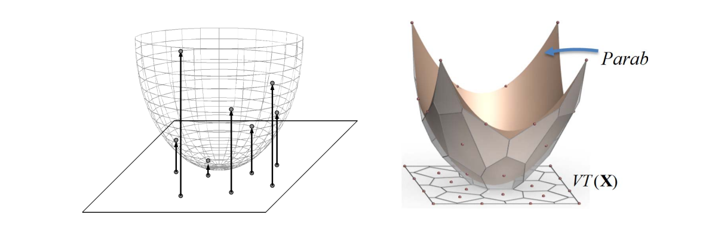    

Paraboloid:  \\(f(X)=||X||^2\\)    
Lifting Operator:   \\(X^*=(X.||X||^2)\\)    
Intersections of tangent planes     

# Simple Method: Edge Swapping/Flipping [Sibson 1978]    

 - Start with any triangulation     
    - 1. find any two adjacent triangles that form a onvex uadrilateral that does not satisfy empty sphere condition    
    - 2. swap the diagonal of the quadrilateral to be a Deluany triangulation of that four points    
    - 3. repeat step 1,2 until stuck.    

    

**Convergence**? Is it possible to end with an infinite loop?   

# Algorithms for Voronoi Diagrams    
 - Compute the intersection of n‐1 half‐planes for each site, and “merge” the cells into the diagram    
 - Divide‐and‐conquer (1975, Shamos & Hoey)    
 - Plane sweep (1987, Fortune)    
 - Randomized incremental construction (1992, Guibas, Knuth& Sharir)   
 
 
> Available in open source library CGAL: httt://www.cgal.org    

# Mesh Generation    

# Mesh Generation    

 - Given a fixed point set, Delaunay triangulation will try to make the triangulation more shape regular and thus is considered as a “good” nstructured mesh.    

    

# DT is not necessary a good mesh   

    

DT only optimize the **connectivity** when points are fixed. The **distribution of points** is more important for a good mesh.    

# Mesh Generation    

• How to sample points to generate high‐quality meshes?    

    

# Centroidal Voronoi Tessellation     

 - Definition: The VT is a centroidal Voronoi tessellation (CVT) , if each seed coincides with the **centroid** of its Voronoi cell     

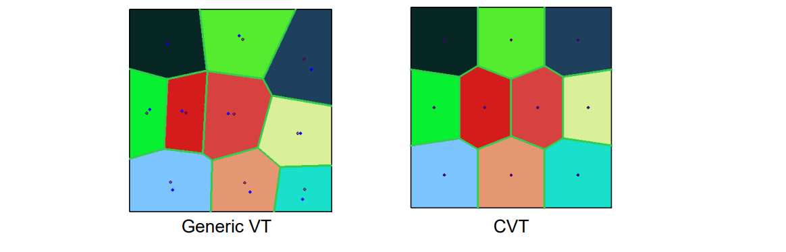    

# Centroidal Voronoi Tessellation    

    

# Lloyd Algorithm    

• Construct the  VT associated with the points    
• Compute the centroids of the Voronoi regions    
• Move the points to the centroids    
• Iterate until convergent    

    

# Centroidal Voronoi Tessellation    

* Definition (Variational point of view)    
• CVT energy function:    

$$
F(X)=\sum_{i=1}^{N} \int _{V_i}\rho (X)||X-X_i||^2dX
$$

• CVT is a critical point of \\(F(X)\\), an optimal CVT is a global minimizer of \\(F(X)\\)    

# CVT Energy Function    

 - Geometric interpretation     
    - The CVT energy with \\(\rho (X)\\) identical to 1, is the volume difference between the circumscribed polytope and the araboloid.    

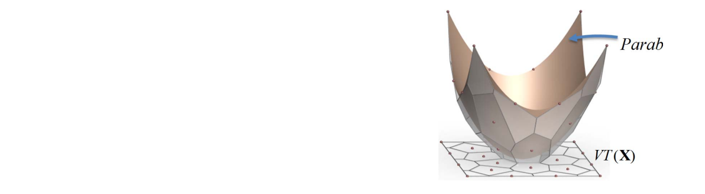    

# The Gradient of CVT Energy    

 - The gradient of \\(F(X)\\) is [Iri et al. 1984; Asami 1991; 
Du et al. 1999]:    

$$
\frac{\partial F}{\partial \chi _i} =2m_i(\chi _i-C_i),
$$
where 
$$
m_i=\int _{\chi\in \Omega _i }\rho (\chi )d\sigma
$$
 - Lloyd’s method is a gradient descent method, thus has linear convergence    
 
 
# Smoothness of F(X)    

 - Can BFGS method be applied to computing CVT? Or does CVT energy F(X) have required \\(C^2\\) smoothness?    
 - Results:   
    - It has been noted that F(X) is non‐smooth [Iri et al. 
1984], but without proof    
    - It has been proved that F(X) is \\(C^1\\) [Cortes et al. 2005]    
    - F(X) is \\(C^2\\) in a convex domain in 2D and 3D [Liu et al. 2009]     

# C2 Continuity of F(X) – Illustration    

    

**Figure**: Illustration of \\(C^2\\) smoothness of CVT energy in 2D     

# CVT on Surface    

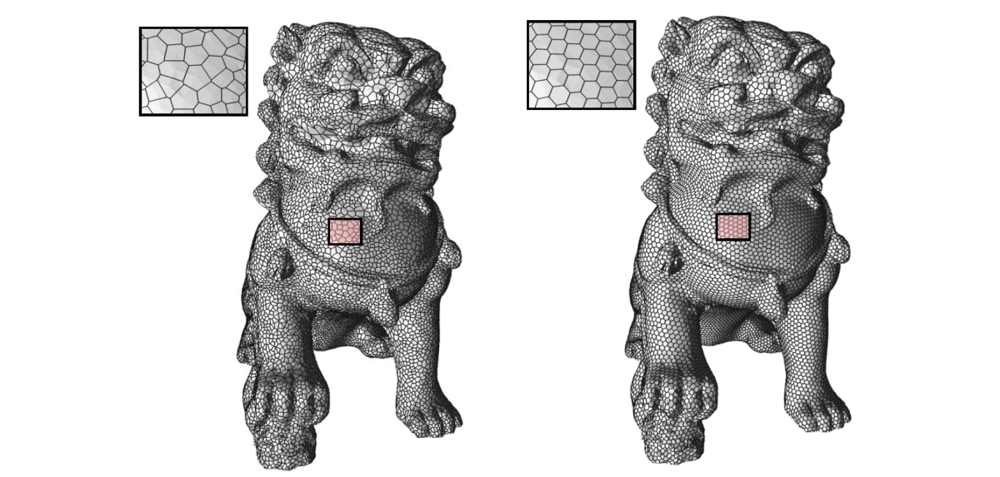    

Left: initial Voronoi; Right: CVT    

# CVT for Remeshing    

    

Left: initial mesh; Right: dual mesh of CVT    

# Optimal Delaunay Triangulation    

• ODT energy function:    

$$
E(X)=||f-f_{I,T }||L^1(\Omega)
$$

$$
=\sum _{\tau \in T}\int _\tau f_I(X)dX-\int _\Omega f(X)dX
$$

    

# CVT & ODT Energy    

• CVT energy    

$$
F(X)=\sum _{i=1}^N\int _{V_i}||X-X_i||^2dX
$$

• ODT energy    

$$
E(X)=\sum _{\tau \in T}\int _\tau f_I(X)dX-\int _\Omega f(X)dX
$$

    

# Compare ODT and CVT    

    

# 高维几何对象的采样与剖分    

    

# 二维流形曲面的采样与网格化   

    

# 二维流形曲面的四边形网格化   

    

# 空间体的采样与剖分    

* Interior of 3D shapes    
• FEM   
• Simulation    
• …    
* Two typical types   
• Tetrahedral meshes    
• Hexahedral meshes   

    

# 空间体的四面体网格    

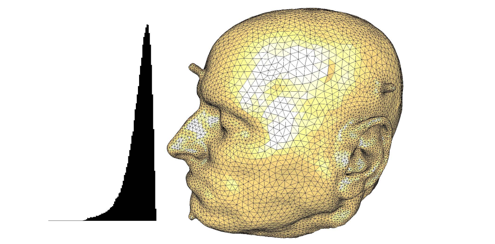    

# Meshing is still hard…   

# Solving PDE (FEM)
• Resolution, basis order, element quality…     

    

    

