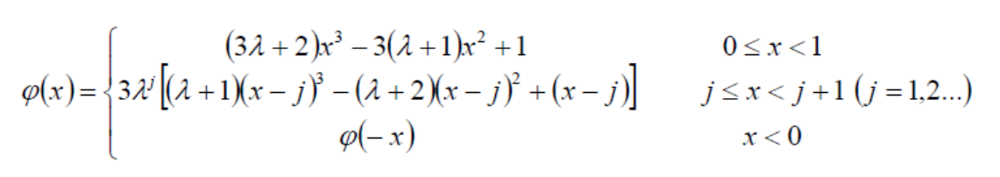
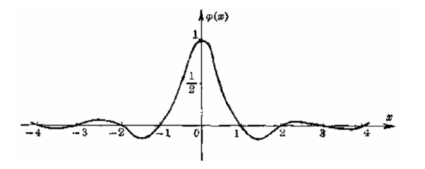
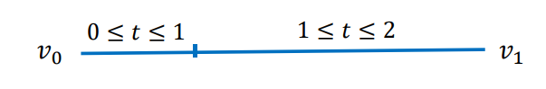
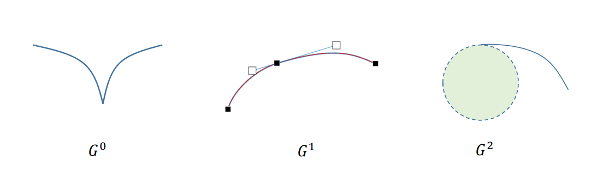

# 三次样条函数

## 作业3情况   
* 作业3情况   
• 演示优秀demo   
• 优秀代码和优秀报告  

* 其他学员可以继续完成提交   
• 可参照优秀作业尽快完成，赶上大部队 

# 几何设计  

## 工业产品的外形是如何设计的？  

  

## 几何设计

• 传统的概念更多指的是“外形设计”

 

概念设计

   

## 设计图纸

  

从设计到数学（几何）表达    

   

# 没有电脑之前，设计师是如何画图设计的？   
 

 

## 放样方法   
 

 

   

## 样条与压铁   
• 样条：具有一定弹性的软木条    
• 压铁：较重的铁块，用来固定样条所经过的点    

   

## 自由曲线
* 在产品初始设计阶段，描述其外形的曲线或曲面常常只有大致形状或只知道它通过一些空间点列（称为型值点），这类没有数学表达式的曲线或曲面称为自由曲线或自由曲面(Free form curve/surface)．   

* 造型方法   
• 拟合(fitting)   
• 插值(interpolation)   
• 逼近(approximation)   

 

## 样条所形成的曲线的数学表达？ 

 

# 三次样条函数

## 样条曲线的数学表达推导

• 压铁：型值点
• 木样条：插值型曲线  

 

## 力学解释

 

* 曲线：弹性梁，弹性模量为\\(E\\)   
• 压铁：载荷（力）   
• 由材料力学中的贝努利‐欧拉方程

$$
M(x)=EIK(x)=EI\frac{{y}'' (x)}{(1+({y}' (x))^2)^\frac{3}{2} } 
$$

其中
• 𝑀(𝑥)：曲线弯矩   
• 𝐸：木样条的弹性模量（杨氏模量）   
• 𝐼:几何惯性矩   
• 𝑘(𝑥)：曲线的曲率    

## 力学解释

 

• 曲线：软木弹性梁（弹性模量为 ）   
• 压铁：载荷（力）   
• 由材料力学中的贝努利‐欧拉方程  

$$
M(x)=EIK(x)=EI\frac{{y}'' (x)}{(1+({y}' (x))^2)^\frac{3}{2} } 
$$

• **小扰度假设**：\\({y}' (x)\ll 1\\)（弯角不大于45°）

$$
M(x)\approx EI{y}'' (x)
$$

• 因两压铁之间无外力，\\(M(x)\\)为一次式   

$$
M(x)=ax+b
$$

• 因此可得，两压铁间\\(y(x)\\)**为三次函数**，即样条曲线为分段三次函数。  

## 数学性质

 

* 分段3次多项式的好处  
• 2次多项式无法表达拐点，不够自由   
• 高次（4次及以上）多项式拐点多，次数若较高计算易出现较大误差    
* 思考：
• 每段多项式函数之间满足什么条件？   
• 如何求解？   

## 求解思路

 

• 每段为3次多项式，有4个变量（待定系数）  

$$
y_i(x)=a_i+b_ix+c_ix^2+d_ix^3
$$

• 假设有\\(n+1\\)个型值点（\\(n\\)段），则总共有个\\(4n\\)变量。
• 首先，曲线要插值型值点，有\\(n+1\\)个约束条件；
• 其次，假设曲线整体为\\(C^2\\)连续，则相邻两段在拼接点要满足3个条件（\\(C^0\\)连续、\\(C^1\\)连续、\\(C^2\\)连续）；则有\\(3n-3\\)个约束条件；
• 则共有\\(4n-2\\)个约束条件；  
• 因此，再加2个额外条件，即可唯一确定整条曲线。  

## 三次样条函数推导（方法1）

• 3次样条插值函数的定义   
• 引入中间变量：节点处的2阶导数值\\(M_i\\)（弯矩）  
• 每段\\({y}'' (x))\\表达为
\\(M_i\\)和\\(M_{i+1}\\)的线性插值   
• 则\\(y_i(x)\\)为包含待定值
\\(M_i\\)的3次多项式   
• 再根据拼接条件（\\(C^0\\)、\\(C^1\\)、\\(C^2\\)连续），列出等式  
• 最后加上2个边界条件，构成关于{\\(M_i=1,...,n-1)\\}的\\((n-1)\times (n-1)\\)阶的线性方程组    
• 方程组为对称的、三对角的、对角占优的，称为**三弯矩方程组**。方程组系数矩阵满秩，有唯一解。    
• 可用**追赶法**求解三弯矩方程组。  

## 边界条件

 

* I. 自由端：指定曲线在两个端点处的二阶导数值    
• 特别地，两个端点的二阶导数值指定为0时称为自然三次样条   

* II. 夹持端： 指定曲线在两个端点处的一阶导数值  

* 其他：  
• 抛物端：首末两段为抛物线   
• 周期端   
• 混合边界条件   

## 三次样条函数推导（方法2）

• 3次样条插值函数的定义   
• 引入中间变量：节点处的**1阶导数值**\\(m_I\\)（转角）  
• …（推导过程类似）   
• 最后加上2个边界条件，构成关于{\\(M_i,i=1,...,n-1\\)}
的\\((n-1)\times(n-1)\\)阶的线性方程组   
• 方程组为对称的、三对角的、对角占优的，称为**三转角方程组**。方程组系数矩阵满秩，有唯
一解。  
• 同样可用**追赶法**求解三转角方程组。  

## 三弯矩方程组/三转角方程组

• 三对角矩阵   
• 主对角占优    
• 有唯一解     
• 追赶法求解    

## 简化的计算技巧  

* Hermite型插值多项式
• 两点及其一阶导数（切线）  

* Lidstone型插值多项式   
• 两点及其二阶导数（曲率）   
* 好处：在给定两个端点及其导数情况下，可直接写出函数的表达形式    
• 这是数学上的一个通用技巧    

## Hermit型插值多项式   

假设
$$
\left\{\begin{array} { r l } 
{ S ( x _ { i - 1 } ) } & { = y _ { i - 1 } } \\
{ S ( x _ { i } ) } & { = y _ { i } }
\end{array} \quad \right.
$$

$$
\begin{cases}
{s}' (x_{i-1})=m_{i-1} \\
{s}' (x_i)=m_i
\end{cases}
$$

当\\(x=\in [x_{i-1},x_i]\\)时，有   
$$
S(x)=y_{i-1}h_0(x)+y_ih_1(x)+m_{i-1}H_0(x)+m_iH_1(x)
$$

# 三次基样条   

$$
S(x)=\sum_{i=0}^{n}y_i \varphi _i(x)+{y}'_0 \varphi _{n+1}(x)+{y}'_n \varphi _{n+2}(x)
$$

其中\\(\varphi _i(x)\\)均为三次样条函数，且满足  

任一\\(\varphi _i(x)\\)可由三次样条函数方法求得。  

## 基样条特征

• 考虑定义在所有整数节点上的基样条    
即满足\\\varphi (j)=\delta _{0j}\\),\\((j=0,\pm1,\pm2,...)\\)    

$$
\lambda =\sqrt{3} -2\approx - 0.268
$$

(a) 相邻两端异号；
(b) 每段有一个极值点，\\(j+1\\)段极值点是j段极值点的\\(\lambda\\)倍;   
(c) 节点处导数满足\\(m_{j+1}=\lambda m\\)

# 三次样条曲线  

## 样条函数的局限性  

• 须有小扰度假定   
• 不能处理多值问题   
• 不能很好表达空间曲线    
• 不具有坐标不变性（几何不变性）   

## 三次参数样条曲线   

• 3个坐标分量\\(x,y,z\\)分别是参数\\(t\\)的三次样条函数    
• 对型值点做参数化    
• 对3个坐标分量分别处理    
• （同课程3及作业3的处理） 

# 曲线的几何连续性   

## 参数连续性  

* 在数学分析/高等数学中，我们所说的“连续性”（光滑性）是指“参数连续性”：   
• 给定 2 条曲线
\\(x_1(t)\\)定义在\\([t_0,t_1]\\)     
\\(x_2(t)\\)定义在\\([t_1,t_2]\\)  

• 曲线\\(𝒙_1\\)和\\(𝒙_2\\)在\\(t_1\\)称为\\(C^r\\)**连续**的，如果它们的从\\(0^{th}\\)（\\(0\\)阶） 至\\(r^{th}\\)（\\(𝑟\\)阶）的导数向量在\\(𝑡_1\\)处完全相同。  

## 参数连续性  

*\\(C^0\\): position varies continuously    
*\\(C^1\\) : First derivative is continuous across junction   
• In other words: the velocity vector remains the same
*\\(C^2\\): Second derivative is continuous across junction
• The acceleration vector remains the same   

## 参数连续性

## 参数连续性的不足  
 
• 参数连续性过于严格，在几何设计中不太直观    
• 例子：一条直线   

$$
\varphi(t)=\left\{\begin{array}{c}
v_{0}+\frac{v_{1}-v_{0}}{3} t, 0 \leq t \leq 1 \\
v_{0}+\frac{v_{1}-v_{0}}{3}+\frac{2\left(v_{1}-v_{0}\right)}{3}(t-1), 1 \leq t \leq 2
\end{array}\right.
$$

• 但是，
$$
{\varphi }' t(1-)=\frac{v_{1}-v_{0}}{3},{\varphi }' (1+)=\frac{2(v_{1}-v_{0})}{3}
$$

• \\({\varphi }' t\\)在\\(t=1\\)的左右导数不相等，因此，\\({\varphi }' t\\)在\\([0,2]\\)中**不是**\\(C^1\\)的，与直线的连续性应是\\(C^\propto\\)的矛盾。   

> 原因：连续**性依赖于参数**的选择，同一条曲线，参数不同，连续阶也不同。 

## 参数连续性的不足

• 参数连续性过于严格，在几何设计中不太直观   
• 例子：一条直线   

$$
\varphi(t)=\left\{\begin{array}{c}
v_{0}+\frac{v_{1}-v_{0}}{3} t, 0 \leq t \leq 1 \\
v_{0}+\frac{v_{1}-v_{0}}{3}+\frac{2\left(v_{1}-v_{0}\right)}{3}(t-1), 1 \leq t \leq 2
\end{array}\right.
$$

• 则\\({\varphi }' (\frac{2}{3}- )={\varphi }' (\frac{2}{3}+ ),\varphi (t)\\)在\\([0,2]\\)就是\\(C^\infty \\)了。    

• 本质：是引入了**参数的一个变换**  

$$
t=\begin{cases}
 \frac{2}{3}s,0\le s\le \frac{2}{3}, \\
\frac{3}{4}(s-\frac{2}{3})+1,\frac{2}{3}\le s\le 2.
\end{cases}
$$

• 使得原来不是\\(C^1 \\)的曲线变为\\(C^1 \\)的了。

## 几何连续性  

【**定义**】设\\(\varphi (t)(a\le t\le b_1)\\)是给定的曲线。若存在一个参数变换\\( t=p(s)(a_1\le s\le b_1)\\),
使得\\(\varphi (p(s))\in C^n[a_1,b_1]\\),且\\(\frac{d\varphi (p(s))}{ds} \ne 0\\),
则称曲线\\(\varphi (t)(a\le t\le b_1)\\)是\\(n\\)阶几何连续的曲线，记为
$$
\varphi (t)\in GC^n[a,b]
$$

或

$$
\varphi (t)\in G^n[a,b]
$$

## 几何连续性：性质

【**定义**】设\\(\varphi (t)(a\le t\le b_1)\\)是给定的曲线。若存在一个参数变换\\( t=p(s)(a_1\le s\le b_1)\\)

使得\\(\varphi (p(s))\in C^n[a_1,b_1]\\),且\\(\frac{d\varphi (p(s))}{ds} \ne 0\\),   
则称曲线\\(\varphi (t)(a\le t\le b)\\)是𝑛阶几何连续的曲线，记为  

$$
\varphi (t)\in GC^n[a,b]
$$

或

$$
\varphi (t)\in G^n[a,b]
$$

【**性质**】
1. 条件 \\(\frac{d\varphi (p(s))}{ds} \ne 0\\)保证了曲线上无奇点；   
2. 几何连续性与参数选取无关，是曲线本身固有的几何性质； 
3. \\(𝐺^n\\) 的条件比\\(𝐺^n\\)的宽，曲线类型更多；

## 几何连续性的具体形式  

• \\(𝐺^0\\)：表示两曲线有公共的连接端点，\\(𝐺^0\\)与的条件一致   
• \\(𝐺^1\\)：两曲线在连接点处有公共的**切线**，即切线方向连续   
• \\(𝐺^2\\)：两曲线在连接点处有公共的**曲率圆**，即曲率连续     

## 曲线设计及编辑工具  

* 矢量曲线设计工具：PPT, Word, Adobe Illustrator,
Corel Draw, …    
• 使用：PowerPoint的曲线编辑工具   

## 两种连续性的比较   

