# Bezier曲线

# 回顾：函数/曲线拟合

• **逆向工程**中的建模问题：给定产品，用测量的方法得到产品外形上的一些采样点，然后通过拟合的方法得到产品外形的表达。   

  

# 回顾：函数/曲线拟合     

* 从**代数观点**来看：从一组基函数所张成的函数空间中，找一个“好”的函数来拟合给定的采样点。     
* 比如幂基{\\(1,x,x^2,\cdots ,x^n\\)}      
• \\((n=2) \\)二次多项式：\\(𝑓(t)=at^2+bt+c\\)    
• 参数曲线形式：\\(f(t)=\binom{x(t)}{y(t)} \\)    

# 使用幂基来表达曲线   

• 二次多项式曲线（抛物线）:  

$$
𝑓(t)=at^2+bt+c
$$

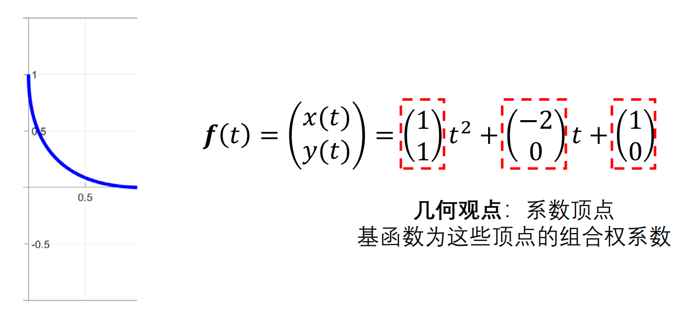  

Courtesy of Renjie Chen    

# 使用幂基来表达曲线   

• 二次多项式曲线（抛物线）:   
$$
𝑓(t)=at^2+bt+c
$$

   

> 系数顶点与曲线本身无直观的联系：无几何意义！ 

> 不利于用户来交互修改曲线：设计建模    

# 建模的两种形式   

$$
𝑓(t)=at^2+bt+c
$$

* 1.重建（Reconstruction）       
• 逆向工程：形状已有，要将其“猜”出来    
• 采样\\(\to \\)拟合：需要函数空间足够丰富（表达能力够）   
• 代数观点：{\\(a,b,c\\)}作为基函数的组合权系数     
* 2.设计（Design）    
• 自由设计：凭空产生，或从一个简单的形状编辑得到     
• 交互式编辑：几何直观性要好    
• **几何观点**：基函数{\\(t^2,t,1\\)}作为控制点的组合权系数   

# 使用Bernstein基函数表达   
• 使用Bernstein基函数来改写    

$$
f(t)=\binom{1}{1} t^2+\binom{-2}{0} t+\binom{1}{0} 
$$

$$
\downarrow 
$$

$$
f(t)=\binom{1}{0} (1-t)^2+\binom{0}{0} 2t(1-t)+\binom{0}{1} t^2
$$

# 使用Bernstein基函数表达   
• 系数顶点与曲线关联性强，具有很好的几何意义     

• 对于交互式曲线设计更观     

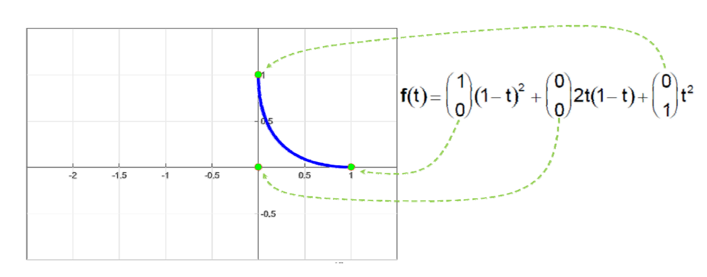  

# Bernstein基函数   
• \\(n\\)次Bernstein基函数:\\(B=\\){\\(B_0^{(n)},B_1^{(n)},\cdots ,B_n^{(n)}\\)}   

$$
B_i^{(n)}(t)=\binom{n}{t}t^i(1-t)^{n-i}=B_{i-th basis function}^{(degree)} 
$$

where the binomial coefficients are given by:
$$
\binom{n}{t}=
\begin{cases}
 \frac{n!}{(n-i)!i!} for 0\le i\le n \\\\
0          otherwise
\end{cases}
$$

# Examples: The first few   

$$
B^{(n)}_i(t)=\binom{n}{t}t^i(1-t)^{n-i}
$$

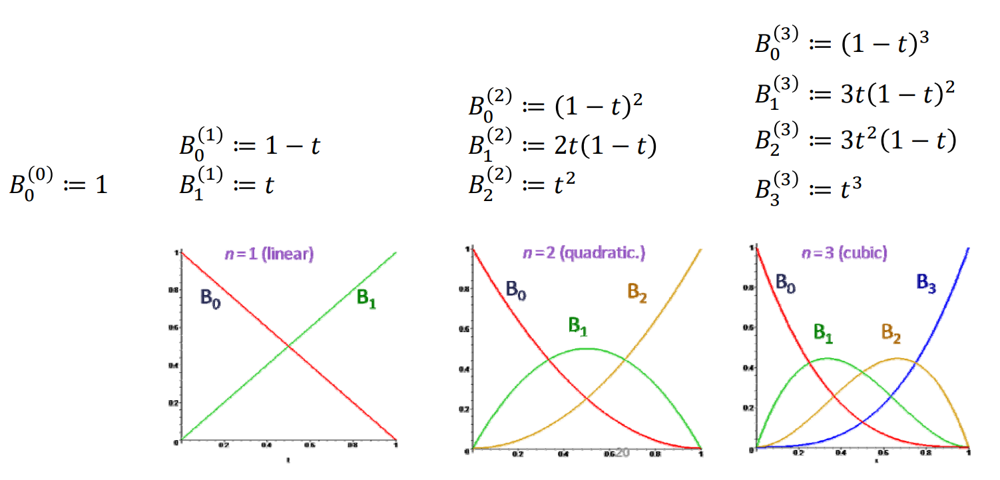  

# 另一个例子   

    
  
$$
b_0=\binom{0}{1},b_1=\binom{1}{1},b_2=\binom{0}{2}
$$

# 用Bernstein基函数所表达的  
曲线具有非常好的几何意义！     

 

# Bezier曲线   

• \\(n\\)次Bezier曲线:\\(n+1\\)个控制顶点    
$$
x(t)=\sum_{i=0}^{n} B^n_i(t)\cdot b_i
$$

**控制顶点     
控制多边形**

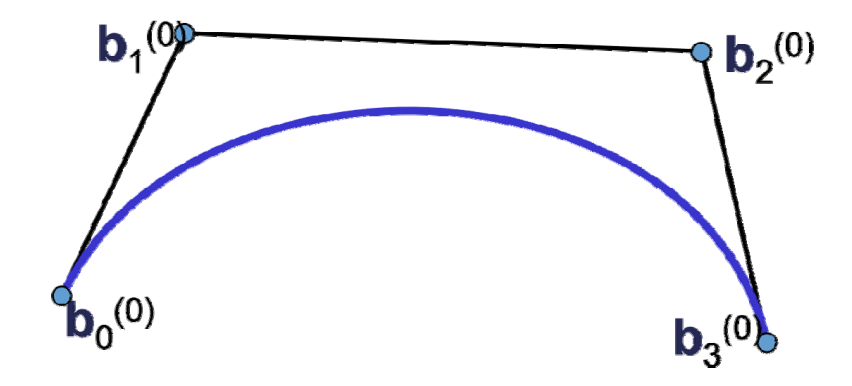    

> Bezier曲线的性质来源于Bernstein**基函数**的性质
（曲线是控制顶点的线性组合构成的，基函数提供了组合系数）

# 例子：3次Bezier曲线    

 

$$
• f(t)=\sum_{i=1}^{3} B^3_ip_i,t\in [0,1]
$$

 

# 例子：更复杂的Bezier曲线    

 

# 3D空间的Bezier曲线（单参数）   

$$
• f(t)=\sum_{i=1}^{n} B^n_ip_i,t\in [0,1]
$$

 

# Bernstein基函数及    
# Bezier曲线的性质    

# Bernstein基函数    

* Bernstein基函数:\\(B=\\){\\(B_0^{(n)},B_1^{(n)},...,B_N^{(n)},\\)}
•\\(𝑛\\)次\\((n+1\\)阶)Bernstein基函数:
    
$$
B^{(n)}_i(t)=\binom{n}{i} t^i(1-t)^{n-i}=B^{(degree)}_{i-th basis function}
$$
    
• 对称性：\\(B^{(n)}_i(t)=B^{n}_{n-i}(1-t)\\)    
•  \\(B^{(n)}_i(t)\\)   在\\(t= \frac{i}{n} \\)达到最大值   

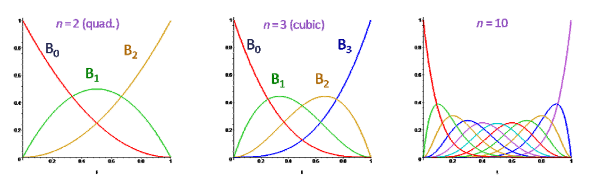 

# 性质1. 正权性    

* 正性（非负性）+ 权性    

$$
• B_i^{(n)}(t)\ge 0,\forall t\in [0,1]
$$

$$
• \sum_{i=1}^{n}B_i^{(n)}(t)=1, \forall t\in [0,1]
$$

   

$$
\downarrow 
$$

• Bezier曲线的凸包性

   

# 性质2.  基性   

•\\(B=\\){\\(B_0^{(n)},B_1^{(n)},\dcot,B_N^{(n)},\\)}是次数不高于 的多项式集合（空间）的一组基

• 与幂基可以相互线性表达：

 

# 性质3. 递推公式    

* 基函数的递推公式   

$$
B_i^{(n)}(t)=（1-t）B_i^{(n-1)}(t)+tB_{i-1}^{(n-1)}(1-t)
$$

with \\(B_0^{(0)}(t)=1，B_i^n(t)=0\\) for \\(i\notin \\){\\(0\cdots n\\)}    

• 由 \\(\binom{n-1}{i} +\binom{n-1}{i-1}=\binom{n}{i}  \\)可推导得到     
* 高阶的基函数由2个低阶的基函数“升阶”得到      
• 利于保持一些良好的性质    

# 性质4. 端点插值性    

 
    
$$
• B_0^0(0)=1,B_1^n(0)= ...B_n^n(0)=0
$$

$$
• B_0^n(1)=...=B_{n-1}^n(1)=0,B_n^n(0)=1
$$

$$
\downarrow 
$$

• Bezier曲线经过首末两个控制顶点\\(p_0,P_n\\)    

 

# 性质5. 导数    

$$
\frac{d}{dt}B^{(n)}_i(t)=n[B_{i-1}^{(n-1)}(t)-B_i^{(n-1)}(t)] 
$$

$$
\frac{d^2}{dt^2}B^{(n)}_i(t)=n(n-1)[B_{i-2}^{(n-2)}(t)-2B_{i-1}^{(n-2)}(t)+B_i^{(n-2)}(t)] 
$$

 *  Bezier曲线的导数（切线）  
      • Given:\\(p_0,\.cdots ,p_n,f(t)=\sum_{i=0}^{n} B_i^n(t)p_i\\)  

      $$
        • {f}' (t)=n\sum_{i=0}^{n-1} B_i^{n-1}(t)(p_{(i+1)}-p_i)
      $$

      $$
        • f^{[r]} (t)=\sum_{(n-r)!}^{n!}\cdot  \sum_{i=0}^{n-r}B_i^{n-r}(t)\cdot \bigtriangleup ^r p_i
      $$

# Bezier曲线的端点性质   

• 端点插值：   
$$
f(0)=p_0
$$

$$
f(1)=p_n
$$

• 端点的切线方向与边相同：   

$$
(f)'(0)=n[p_1-p_0]
$$

$$
(f)'(1)=n[p_{n-1}-p_n]
$$

• 端点的2阶(k)切线与3点(k+1)相关：   

$$
(f)''(0)=n(n-1)[p_2-2p_1+p_0]
$$

$$
(f)''(1)=n(n-1)[p_n-2p_{n-1}+p_{n-2}]
$$

> **结合几何意义来理解**    

# 性质6. 升阶   

$$
(1-t)B^n_i(t)=(1-\frac{i}{n+1})B^{(n+1)}_i 
$$

$$
tB^n_i(t)=\frac{i+1}{n+1}B^{n+1}_i (t)
$$

$$
\downarrow 
$$

Bezier曲线的升阶 

$$
f(t)=\sum_{i=0}^{n+1} B_i^{n+1}(t)[\frac{n+1-i}{n+1} p_i+\frac{i}{n+1} p_{i-1}]
$$

 

# Bezier曲线的 de Casteljau算法    
**（Bezier曲线的作图算法与细分）**   

# e Casteljau algorithm   

* Algorithm description
• Input: points    

$$
𝒃_0,𝒃_1,\dots 𝒃_n∈ \mathbb{R} ^3
$$

* Output: curve     

$$
x(t),t∈ [0,1]
$$

• Geometric construction of the points\\( 𝒙(𝑡)\\) for given \\(𝑡\\):    

$$
b_i^0(t)=b_i, 
$$

$$
i=0,\cdots ,n
$$

$$
b_i^r(t)=(1-t)b_i^{r-1}(t)+tb_{i+1}^{r-1} (t)
$$

$$
r=1,\cdots ,n
$$

$$
i=0,\cdots ,n-r
$$

• Then \\(b_i^r(t)\\) is the searched curve point 
\\(𝒙(𝑡)\\) at the parameter value 𝑡    

# De Casteljau algorithm    

• Repeated convex combination of control points   

$$
b_i^{(r)}=(1-t)b_i^{(r-1)}+tb_{i+1}^{(r-1)}
$$

 

# De Casteljau algorithm   

• Repeated convex combination of control points   

$$
b_i^{(r)}=(1-t)b_i^{(r-1)}+tb_{i+1}^{(r-1)}
$$

 

# De Casteljau algorithm    

• Repeated convex combination of control points

$$
b_i^{(r)}=(1-t)b_i^{(r-1)}+tb_{i+1}^{(r-1)}
$$

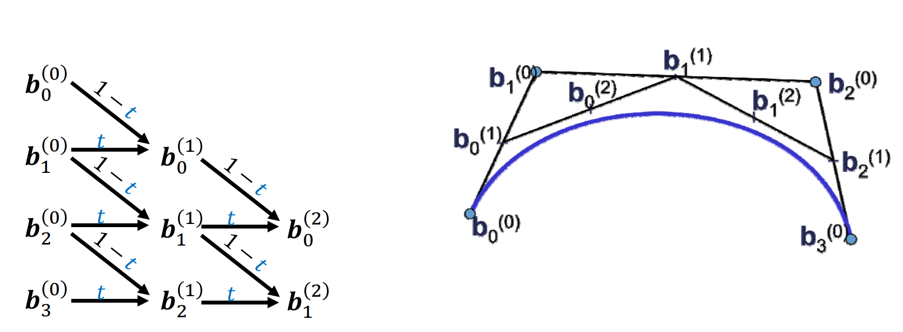 

# De Casteljau algorithm
• Repeated convex combination of control points

$$
b_i^{(r)}=(1-t)b_i^{(r-1)}+tb_{i+1}^{(r-1)}
$$

 

De Casteljau scheme

# De Casteljau algorithm

   

# De Casteljau algorithm    

 

* 计算Bezier曲线\\(x(t)\\)上参数为\\(t\\)的点   
• Bisect control polygon in ratio \\(t:(1-t)\\)        
* 良好的几何意义：该点将曲线一分两条子Bezier 曲线，其控制顶点是中间生成的点    
* 可用于Bezier曲线的离散及求根等许多应用    

# De Casteljau algorithm    

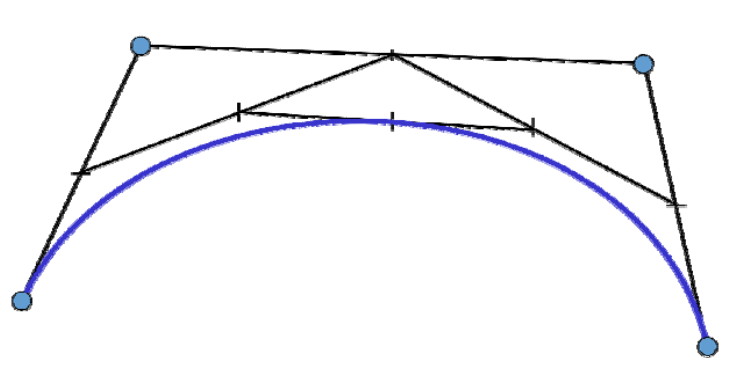 

* 计算Bezier曲线\\(x(t)\\)上参数为\\(t\\) 的点    
• Bisect control polygon in ratio \\(t:(1-t)\\)    

* 良好的几何意义：该点将曲线一分两条子Bezier 曲线，其控制顶点是中间生成的点    
* 可用于Bezier曲线的离散及求根等许多应用    

# De Casteljau algorithm   

 
 
* 计算Bezier曲线\\(x(t)\\)上参数为\\(t\\)的点    
• Bisect control polygon in ratio \\(t:(1-t)\\)    
• 良好的几何意义：该点将曲线一分两条子Bezier 曲线，其控制顶点是中间生成的点    
• 可用于Bezier曲线的离散及求根等许多应用     

# De Casteljau algorithm   

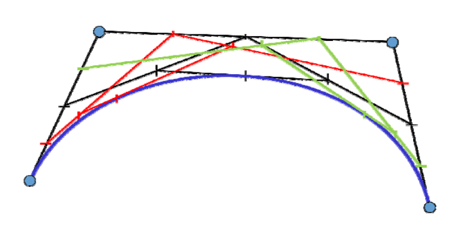   

* 计算Bezier曲线\\(x(t)\\)上参数为\\(t\\)的点    
• Bisect control polygon in ratio  \\(t:(1-t)\\)   
* 良好的几何意义：该点将曲线一分两条子Bezier 曲线，其控制顶点是中间生成的点    
* 可用于Bezier曲线的离散及求根等许多应用    

# 几何样条曲线   

# 用分段Bezier曲线来插值型值点   

• 给定型值点:  
$$
k_0,\cdots ,k_n\in \mathbb{R} ^3
$$

• 每两点间生成一段Bezier曲线，使得整体曲线满足一定的连续性\\((𝐶^0,C^1,C^2)\\)    

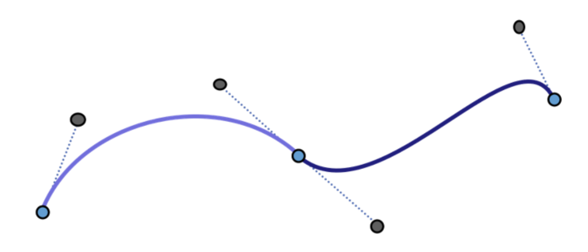   

# 问题：两Bezier曲线的拼接条件    

$$
• (𝐶^0,C^1,C^2)?
$$

   

# 回顾：Bezier曲线的端点性质    
• 端点插值： 

$$
f(0)=p_0
$$

$$
f(1)=p_n
$$

• 端点的切线方向与边相同：  

$$
(f)'(0)=n[p_1-p_0]
$$

$$
(f)'(1)=n[p_{n-1}-p_n]
$$

• 端点的2阶(k)切线与3点(k+1)相关：  

$$
(f)''(0)=n(n-1)[p_2-2p_1+p_0]
$$

$$
(f)''(1)=n(n-1)[p_n-2p_{n-1}+p_{n-2}]
$$

# 两Bezier曲线的拼接条件    

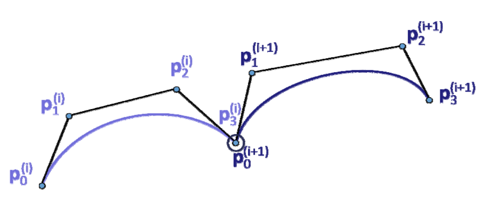  

$$
C^0连续
$$

   

\\(G^1\\)连续：三点共线   

\\（C^1\\)连续：三点共线     
且等长   

# 两Bezier曲线的拼接条件    

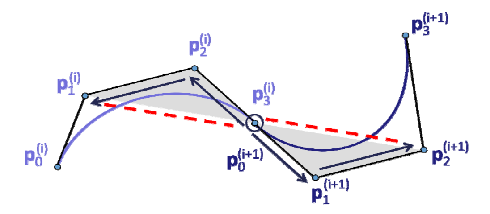   

* \\(C^2\\)连续   
• \\(𝑑^2⁄dt^2 \\)为 \\((𝒑_2,-2p_1+p_0),(p_n-2p_{n-1}+p_{n-2})\\)      
• 阴影三角形相似        
* \\(G^2\\)连续？   

# 构造3次插值Bezier曲线的几何方法    

   

> 在作业4中也实现下    

# 广义样条曲线   

• 分段的多项式曲线（Bezier曲线）  
    