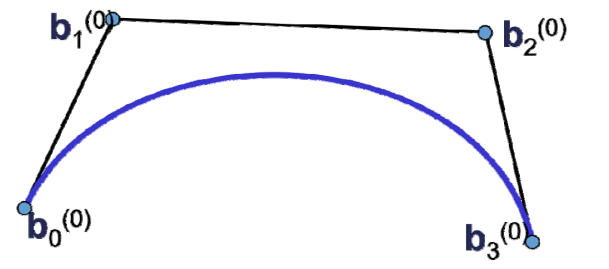
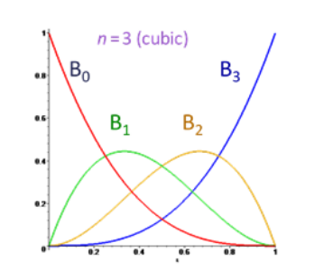
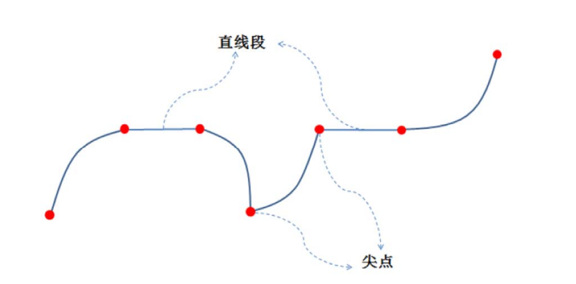
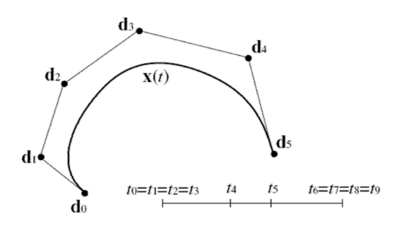
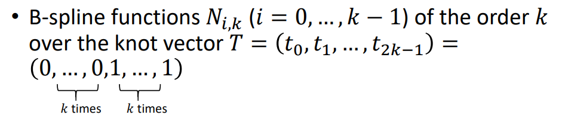
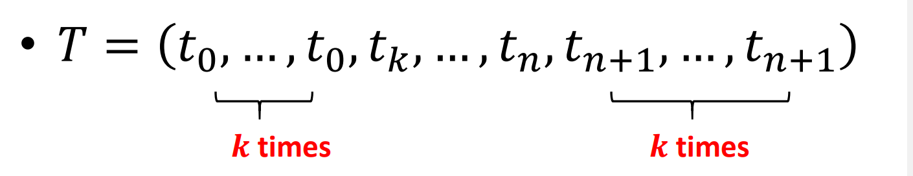

# B样条曲线  

# Bezier曲线的不足   
• \\(n\\)次Bezier曲线：\\(n+1\\)个控制顶点    

   

$$
x(t)=\sum_{i=0}^{n} B_i^n(t)\cdot b_i
$$

  

> **全局性：牵一发而动全身，不利于设计**  

**原因：基函数是全局的**  

# 样条曲线  

* 分段的多项式曲线（Bezier曲线）   
• 分段表达，具有局部性   

   

**有无统一的表达方式？**

# 思考：样条曲线的统一表达  

* 形式类比：每个控制顶点用一个基函数进行组合   

$$
x(t)=\sum_{i=0}^{n} N_{i,k}(t)\cdot b_i
$$

* 性质要求：  
• 基函数须局部性（局部支集）  
• 基函数要有正性+权性   
• …    

* 如何构造？   

# B样条的产生  

* Early use of splines on computers for data interpolation     
• Ferguson at Boeing, 1963    
• Gordon and de Boor at General Motors     
• B‐splines, de Boor 1972    

* Free form curve design    
• Gordon and Riesenfeld, 1974 → B‐splines as a generalization of Bezier curves   

启发：  
* Bernstein基函数的递推公式：  

$$
B_i^n(t)=(1-t)B_{i-1}^{(n-1)}(1-t)
$$

with \\(B_0^0(t)=1,B^n_i(t)=0\\) for \\(i \in \left \{  0...n\right \}\\) 

* 思路：   
• 局部处处类似定义，由一个基函数平移得到    
• 高阶的基函数由2个低阶的基函数“升阶”得到    
• 利于保持一些良好的性质，比如提高光滑性   

# Key Ideas   

  

* 以三次为例    
• We design one basis function 𝑏(𝑡)      
>* Properties:   
• 𝑏(𝑡) is \\(C^2\\) continuous    
• 𝑏(𝑡) is piecewise polynomial, degree 3 (cubic)   
• 𝑏(𝑡) is has local support   
• Overlaying shifted \\(𝑏 (𝑡+i)\\) forms a partition of unity   
• \\(𝑏(𝑡)\\)ge 0 or all 𝑡  

* In short:   
• All desirable properties build into the basis   
• Linear combinations will inherit these  

# Shifted Basis Functions   

• 型值点参数化：节点向量    

Courtesy of Renjie Chen   

# Repeated linear interpolation  

• Another way to increase smoothness:    

  

# Repeated linear interpolation   

• Another way to increase smoothness:  
  

# Repeated linear interpolation   

• Another way to increase smoothness    
  

# De Boor Recursion: uniform case       
• The **uniform** B‐spline basis of order 𝒌 (degree 𝒌 ? 𝟏) is given as     

  

# B‐spline curves: general case   

* Given: knot sequence t_o<t_1< ...< t_n< ...< t_{n+k} ((t_0,t_i,...,t_{n=k})is called knot vector)      

* Normalized B‐spline functions \\(N_{i,k}\\)of the order (degree \\(k-1\\)) are defined as:   

$$
N_{i,1}(t)=\begin{cases}
 1,t_i\le t\le t_{i+1}\\
0,otherwise
\end{cases}
$$

$$
N_{i,1}(t)=\frac{t-t_i}{t_{i+k-1}-t_i} N_{i,k-1}(t)+\frac{t_{i+k}-t}{t_{i+k}-t_{i+1}}N_{i+1,k-1}(t)
$$

$$
for k>1, and i=0,...,n
$$

# Example

    

$$
N_{i,1}(t)=\begin{cases}
 1,t_i\le t\le t_{i+1}\\
0,otherwise
\end{cases}
$$

$$
N_{i,1}(t)=\frac{t-t_i}{t_{i+k-1}-t_i} N_{i,k-1}(t)+\frac{t_{i+k}-t}{t_{i+k}-t_{i+1}}N_{i+1,k-1}(t)
$$

$$
for k>1, and i=0,...,n
$$

# Example  

  

# Example  

  

# Basis properties   

* For the so defined basis functions, the following properties can be shown:   

• \\(𝑁_{i,k}\\) > 0 for \\(𝑡_i\\) < 𝑡 < \\(t_{i+k}\\)   

•\\(𝑁_{i,k}\\) > 0 for \\(𝑡_0\\) < 𝑡 < \\(t_i\\) or \\(t_{i+k}\\) <t < \\(t_{n+k}\\)  

• \\(\sum_{i=0}^{n} N_{i,k}(t)=1 \\)for \\(t_{k-1}\le t\le t_{n+1} \\)   

• For \\(t_i\le t_j\le t_{i+k}\\), the basis functions \\(N_{i,k}(t)\\) are \\(C^{k-2} \\)at the knots \\(t_j\\)    

• The interval\\([t_i,t_{i+k}\\), is called support of\\(N_{i,k}\\)      

# B‐spline curves  

* B‐spline curves    
• Given:\\(𝑛+1\\) control points \\(𝒅_0,...,d_n∈R^3\\)     

knot vector \\(𝑇=(t_0,...,t_n,...,t_{n+k})\\)    

• Then, the B‐spline curve 𝒙(𝑡) of the order 𝑘 is defined as    

$$
x(t)=\sum_{i=0}^{n} N_{i,k}(t)\cdot d_i
$$

• The points 𝒅_i are called de Boor points    

**Carl R. de Boor**     
German‐American mathematician University of Wisconsin‐Madison   

# Example    

• \\(k=4,n=5\\)     

  

Support intervals of \\(𝑁_{i,k}\\)  

Curve defined in interval\\(t_3\le t\le t_6\\)  

# B‐spline curves

* Multiple weighted knot vectors  
• So far: \\(𝑇=(t_0,...,t_n,...,t_{n+k})\\)with\\(t_0\le t_1\le ...\le t_{n+k}\\)     
• Now: also multiple knots allowed, i.e. with \\(t_0\le t_1\le ...\le t_{n+k}\\)   
• The recursive definition of the B spline function \\(𝑁_{i,k}(i=0,...,n) \\) works nonetheless as long as no more than 𝑘 knots coincide    

# B‐spline curves

* Effect of multiple knots:   
set: \\(t_0=t_1=...=t_{n+k}\\)    
• and \\(t_{n+1}=t_{n+2}=...=t_{n+k}\\)   

\\(𝒅_0\\) and \\(𝒅_n\\) are interpolated      

# B‐spline curves

• Example:\\(k=4,n=5\\)

  

# B‐spline curves   

• Example:\\(k=4,n=5\\)

  

# B‐spline curves  

• Further example   

  

# B‐spline curves    

* Interesting property:    
• B‐spline functions \\(𝑁_{i,k}(𝑖=0,…,𝑘-1)\\) of the order 𝑘 over the knot vector \\(𝑇=(t_0,t_1,...,t_{2k-1})=(0,...,0,1,...,1)\\)   
𝑘 times    𝑘 times

are Bernstein polynomials\\(𝐵_i^{k-1} of degree \\(𝑘-1\\)    

# B‐spline curves properties    

* Given:   

    
• de Boor polygon \\(𝒅_0,…,𝒅_n\\)    
• Then, the following applies for the related B‐spline curve\\(x(t)\\):   

# B‐spline curves properties    

•\\(x(t_0)=d_0,(t_{n+1})=d_n\\) (end point interpolation)    
•\\(\dot{x} (t_0)=\frac{k-1}{t_k-t_0} (d_1-d_0)\\) (tangent direction at \\(d_0,\\) similar in \\(d_n\\)    

• \\(x(t)\\) consists of \\(n-k+2\\) polynomial curve segments of degree \\(k-1\\) (assuming no multiple inner knots)    

# B‐spline curves properties   

• Multiple inner knots ⇒ reduction of continuity of\\(𝑥(𝑡)\\). 𝑙‐times inner knot \\((1/le 𝑙/le 𝑘)\\) means \\(𝐶^{k-𝑙-1}\\) ‐continuity     
• Local impact of the de Boor points: moving of \\(𝑑_i\\) only changes the curve in the region \\([𝑡_i,t_{i+k}]\\)    
• The insertion of new de Boor points does not change the polynomial degree of the curve segments        

# B‐spline curves properties 

• Locality of B‐spline curves     
   

# B‐spline curves   

* Evaluation of B‐spline curves   
• Using B‐spline functions   
• Using the de Boor algorithm
Similar algorithm to the de Casteljau algorithm for Bezier curves; consists of a number of linear interpolations on the de Boor polygon     

# The de Boor algorithm   

• Given:
\\(𝒅_0,…,𝒅_n\\): de Boor points     

$$
(t_0,...,t_{k-1}=t_0,t_k,t_{k+1},...,t_n,t_{n+1},...,t_{n+k}=t_{n+1})
$$

Knot vector

• wanted:
Curve point \\(𝒙(𝑡)\\) of the B‐spline curve of the order 𝑘    

# The de Boor algorithm    

1. Search index with \\(t_r/le t/le t_{r+1}\\)   
2. for \\(i=r-k+1,...,r\\)
$$
d^0_i=d_i
$$

• for \\(j=1,...,k-1\\)   
for \\(i=r-k+1+j,...,r\\)    

$$
d_i^j=(1-a^j_i)\cdot d^{j-1}_{i-1}+a_j^i\cdot d^{j-1}_i
$$

with \\(a_i^j=\frac{t-t_i}{t_{i+k-j}-t_i} \\)

• Then: \\(d^{k-1}_r=x(t)\\)    

# B样条曲线：分段Bezier曲线    
• \\(n=3\\)    

   

> **B：Basic（亦称“基本样条”）**

# B样条的其他理论知识  

* B样条的许多性质   
• 局部凸包性、变差缩减性、包络性   
• B样条的导数、积分递推式、几何作图    
• 重节点的B样条基函数及B样条曲线   
• Bezier样条曲线转换为B样条曲线    
• **B样条插值方法**    
• …

   
