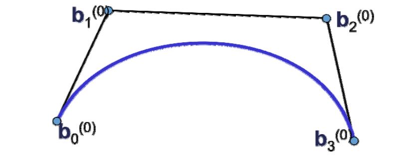
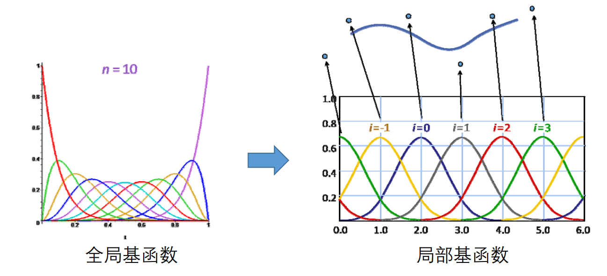
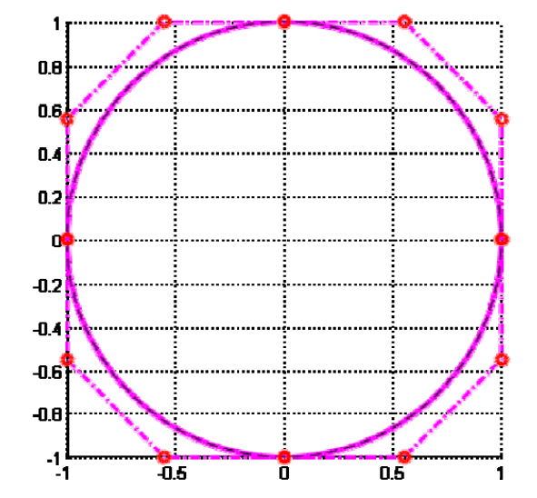
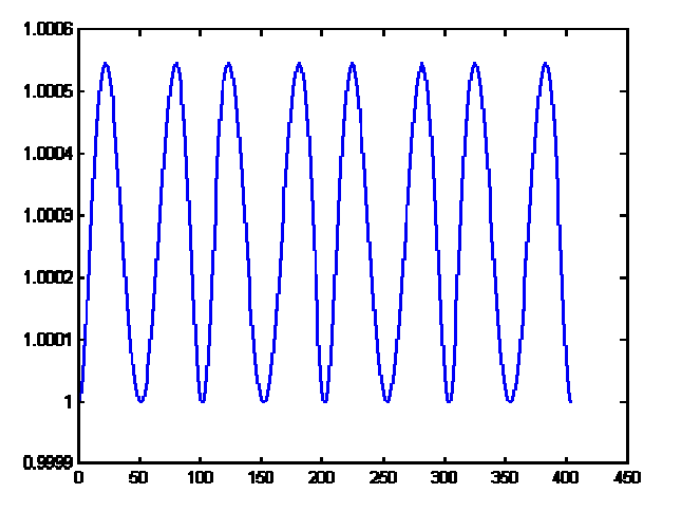
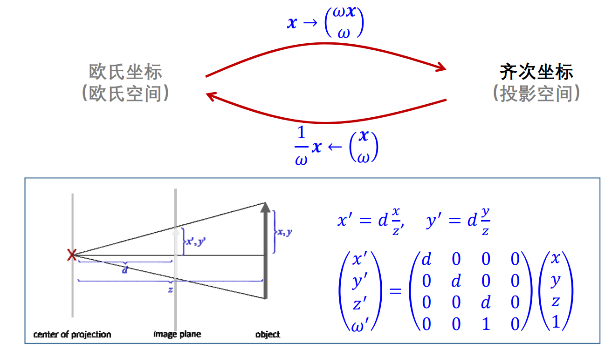

# 回顾：Bézier曲线    
• 类似RBF函数：对每个控制点叠加权函数    
• 几何设计观点：给定控制顶点{\\(b_i,i=0\sim n\\)}，使用一组（随\\(t\\)变化的）权系数函数{\\(B_i^n(t),i=0\sim n\\)} 对它们进行线性组合，得到的点的集合    

$$
x(t)=\sum_{i=0}^{n} B^n_i(t)\cdot b_t
$$

  

> Bezier曲线的性质来源于Bernstein**基函数**的性质   

# 回顾：B样条曲线   

• Bézier曲线、RBF函数：每个控制点上的权系数函数都是全局（定义在整个定义域）的   
• B样条曲线：每个控制点上的权系数函数是局部定义的（定义在其参数节点附近的支集）   

  

# 有理曲线

# 问题：Bézier曲线无法表示圆弧！  

思考：如何证明？   
Approximation of Circle using Cubic Bezier    

  

Evaluation of\\((𝒙^𝟐+𝒚^𝟐)\\) for points on the Bezier curve    

  

# 投影几何

 2D case:

$$
\binom{x}{y} \longrightarrow \begin{pmatrix}
 wx\\
 wy\\
w
\end{pmatrix}
$$

 3D case:
$$
 \begin{pmatrix}
 x\\
 y\\
z
\end{pmatrix}\longrightarrow \begin{pmatrix}
 wx\\
 wy\\
 wz\\
w
\end{pmatrix}
$$

• 齐次坐标：\\(x\longrightarrow \binom{wx}{w} \\)   

    

# 有理Bezier曲线

* Rational Bezier curves in \\(\mathbb{R} ^n\\) of degree\\(d\\):   
• Form a Bezier curve of degree 𝑑 in \\(𝑛+1\\) dimensional space    
• Interpret last coordinates as homogenous component    
• Euclidean coordinates are obtained by projection    

$$
𝒇^{(hom)}(t)=\sum_{i=0}^{n}B_i^{(d)}(t)P_i,P_i\in \mathbb{R} ^{n+1}
$$

$$
{f}^{(eucl)} (t)=\frac{\sum_{i=0}^{n}B_i^{(d)} (t)\begin{pmatrix}
 p_i^{(1)}\\
 \cdots \\
p_i^{(n)}
\end{pmatrix}}{\sum_{i=0}^{n}B_i^{(d)} (t)p_i^{(n+1)} } 
$$

# 有理Bezier曲线

• 每个控制顶点上设置一个权系数    

$$
{f}^{(eucl)} (t)=\frac{\sum_{i=0}^{n}B_i^{(d)} (t)w_ip_i}{\sum_{i=0}^{n}B_i^{(d)} (t)w_i } 
$$

$$
p_i=\begin{pmatrix}
p_i^{(1)} \\
\cdots  \\
p_i^{(n)}
\end{pmatrix}
$$

• 另一种形式    

$$
{f}^{(eucl)} (t)=\sum_{i=0}^{n}p_i =\frac{B_i^{(d)} (t)w_i}{\sum_{i=0}^{n}B_i^{(d)} (t)w_i } =\sum_{i=0}^{n}p_i(t)p_i 
$$

???
• 如权系数都相等，则退化为Bezier曲线
𝒑 ? =
𝑝 ?
?
…
𝑝 ?
?
with ∑ 𝑞 ? 𝑡
?
???
? 1
有理Bezier曲线的几何解释
• 高维的Bezier曲线的中心投影
权系数对曲线形状的影响
• 控制顶点的权系数越大，曲线就越靠近该点
移动控制顶点
增加权系数
1:1:1:1 10:1:1:10
1:10:1:10
1:10:10:1
有理Bezier曲线的性质
• 具有Bezier曲线的大部分性质（设
?
）:
• 端点插值
• 端点切线
• 凸包性
• 导数递推性
• de Casteljau作图算法
• …
2次有理Bezier曲线表示圆
NURBS曲线
NURBS: Non‐Uniform Rational B‐
Spline （非均匀有理B样条）
NURBS: Rational B‐Splines
• Formally:(𝑁 ?
?
:B‐spline basis function 𝑖 of degree d)
𝒇 𝑡 ?
∑ 𝑁
?
?
𝑡 𝜔 ? 𝒑 ?
?
???
∑ 𝑁
?
?
𝑡 𝜔 𝒊
?
???
• Knot sequences etc. all remain the same
• De Boor algorithm – similar to rational de Casteljau alg.
• option 1. – apply separately to numerator, denominator
• option 2. – normalize weights in each intermediate result
‐ the second option is numerically more stable
NURBS曲线
• 影响NURBS曲线建模的因素
• 控制顶点：用户交互的手段
• 节点向量：决定了B样条基函数
• 权系数：也影响曲线的形状，生成圆锥曲线等
• NURBS曲线的性质
• 大部分与Bezier/B样条曲线类同：具有良好的几何直观性
NURBS曲线的例子
NURBS曲线的例子
NURBS曲线
• NURBS曲线/曲面表达是当前的工业标准
• 工业CAD软件的基本表达形式
• 各种CAD系统的数据交换标准
• 3D建模软件：
• 工业设计：AutoCAD, CATIA, SolidWorks, Rhino, …
• 动画设计：3DS Max, Maya, SoftImage, Cinema 4D, …
产品设计的工业标准
谢 谢 ！
