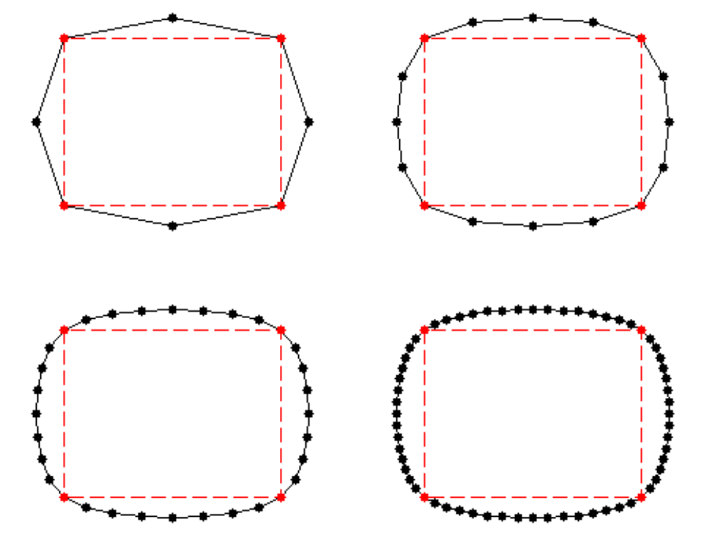
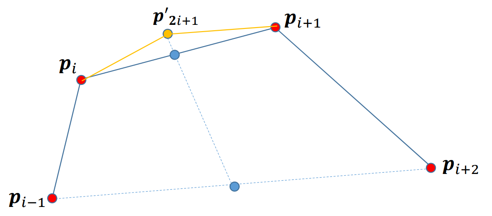
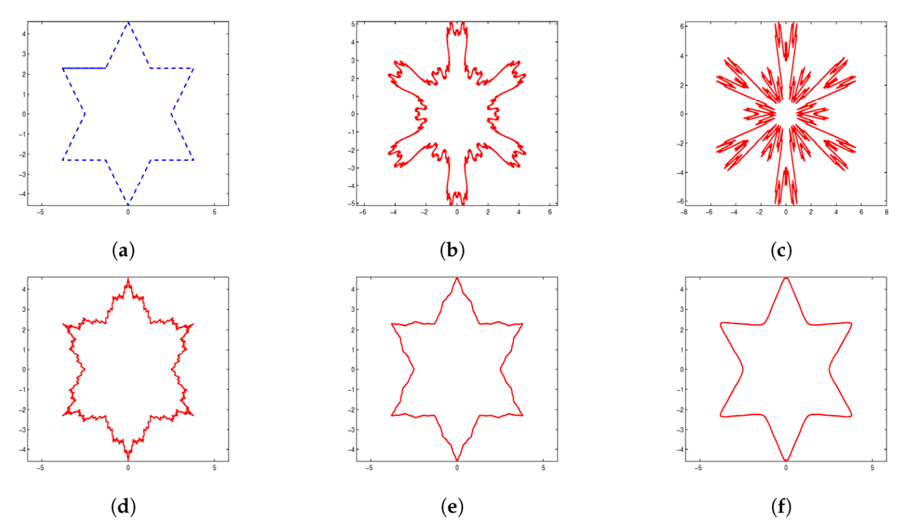
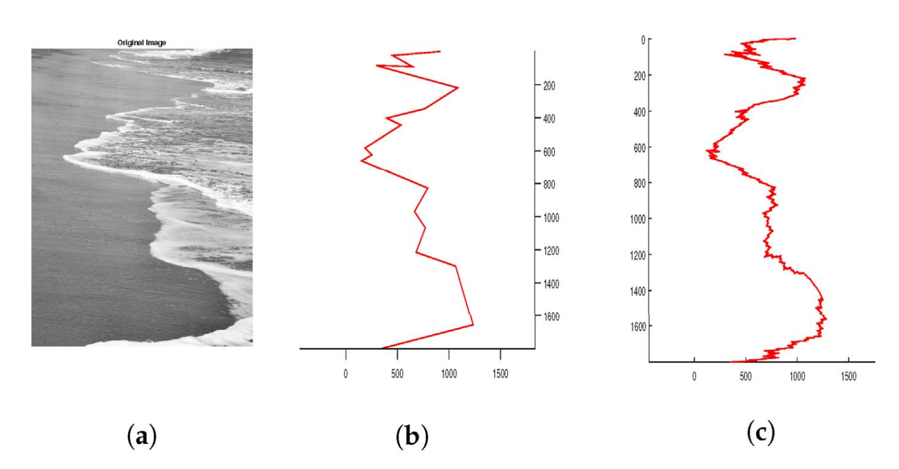

# 回顾：Bezier曲线的作图法    
* de Casteljau作图算法    

  

* 几何直观性：逐步割角、磨光    
• 类似于雕塑雕刻过程   

    

> “其实，这座雕塑本来就在那里，我只是将它多余的边边角角去掉而已。”    

# 问题   

• 输入：一个简单多边形（控制多边形）     

     

• 输出：一条与之关联的光滑曲线     

    

# 启发：通过不断“割角”构造曲线？   

• 给定一个简单多边形    
• 通过一定规则，割角磨光，产生更多边的多边形     
• 不断迭代操作割角磨光，产生（极限）光滑曲线     

    

# 细分方法的思想   

两个步骤：    
* 拓扑规则：加入新点，组成新多边形 (\\(splitting\\))    
* 几何规则：移动顶点，局部加权平均 (\\(averaging\\))    
• 对所有顶点都移动：逼近型    
• 只对新顶点移动：插值型        

    

# Chaikin细分方法   

# Chaikin割角法[1974]   

• 每条边取中点，生成新点       
• 每个点与其相邻点平均（顺时针）    
• 迭代生成曲线     

    

    

# Chaikin割角法[1974]   

* 拓扑规则：   
• 点分裂成边（割角），老点被抛弃（逼近型）    
• 新点老点重新编号   
* 几何规则：新顶点是老顶点的线性组合     

    

$$
{\nu }' _{2i}=\frac{1}{4} \nu _{i-1}+\frac{3}{4} \nu _i
$$

$$
{\nu }' _{2i+1}=\frac{3}{4} \nu _{i}+\frac{1}{4} \nu _{i+1}
$$

# Chaikin细分曲线     

    

* 可以证明：    
• 极限曲线为二次均匀B样条曲线     
• 节点处\\(𝐶^1\\)，其余点处\\(𝐶^\infty \\)          

# 均匀三次B样条曲线细分方法     

• 拓扑规则：边分裂成两条新边     
• 几何规则：     

    

$$
{\nu }' _{2i}=\frac{1}{8} \nu _{i-1}+\frac{3}{4} \nu _i+\frac{1}{8} \nu _{i+1}
$$

$$
{\nu }' _{2i+1}=\frac{1}{2} \nu _{i}+\frac{1}{2} \nu _{i+1}
$$

# 细分曲线的性质证明      

# 证明的思路    

* 将细分过程表达成矩阵形式        
• 新顶点是老顶点的线性组合    
* 讨论细分矩阵的谱性质（特征根）           

  

# 举例：Chaikin细分    

矩阵形式: 

•Control points at level   \\(𝑙: 𝒑^{(l)}_i\\)    

• “Splitted” points at level \\(𝑙+1: \tilde{p} ^{(l+1)}_i\\)      

• “Averaged” control points at level \\( 𝑙+1:𝒑^{(l+1)}_i\\)    

  

# Chaikin细分的矩阵形式      

  

# Chaikin细分的矩阵形式   

  

# 极限情况    

极限曲线上的点可由**细分矩阵**的幂次的极限求得:    

$$
\begin{pmatrix}x_-^{[\infty ]}
 \\\\x^{[\infty ]} 
 \\\\x_+^{[\infty ]}
\end{pmatrix}=\lim_{k \to \infty} M^k_{srbdiv}\begin{pmatrix}x_-^{[l]}
 \\\\x^{[l]} 
 \\\\x_+^{[l ]}
\end{pmatrix}
$$

# 极限情况    

 - 收敛的必要条件:
• 细分矩阵的最大特征根为1
• 否则会爆炸 (>1) 或收缩 (<1)

$$
\begin{Bmatrix}x_{-n}^{[l+k]} 
\\\\\vdots
  \\\\x_{0}^{[l+k]}
 \\\\\vdots
  \\\\x_{+n}^{[l+k]}
\end{Bmatrix}=M^k_{subdiv}\begin{Bmatrix}x_{-n}^{[l]}
 \\\\\vdots 
 \\\\x_{0}^{[l]}
 \\\\\vdots 
 \\\\x_{+n}^{[l]}
\end{Bmatrix}=UD^kU^{-1}\begin{Bmatrix}x_{-n}^{[l]}
 \\\\\vdots 
 \\\\x_{0}^{[l]}
 \\\\\vdots
  \\\\x_{+n}^{[l]}
\end{Bmatrix}
$$

# 插值型细分方法    

# 插值型细分方法     
 - 细分方法：   
• 保留原有顶点   
• 对每条边，增加一个新顶点     
• 不断迭代，生成一条曲线     

* 可以看成是“**补角法**”        

  

# 4点插值型细分规则     

     

Nira Dyn, David Levin, John A. Gregory A 4‐point interpolatory subdivision     
scheme for curve design. Computer Aided Geometric Design, 4(4): 257‐268, 1987.   

# 4点插值型细分曲线的例子    

     

# 4点插值型细分曲线的例子   

     

# 4点插值型细分规则    

     

> 可以证明：当\\(𝛼∈(0,\frac{1}{8})\\) 时，生成的细分曲线是光滑的；否则，细分曲线非光滑，生成了分形曲线。    

# 4点细分曲线的例子   

     

# 分形曲线（分数维）：分形几何     

     

# 一般：2n点插值细分方法    

• 连续阶随着\\(n\\)增大而增加     
2点插值细分方法    

$$
P_{2i+1}^{k+1}=\frac{1}{2} (P^k_i+P^k_{i+1})
$$

4点插值细分方法    

$$
P_{2i+1}^{k+1}=-\frac{1}{16} P^k_{i-1}+\frac{9}{16}P^k_{i}+\frac{9}{16}P^k_{i+1}-\frac{1}{16}P^k_{i+2}
$$

6点插值细分方法    

$$
P_{2i+1}^{k+1}=\frac{3}{256} P^k_{i-2}-\frac{25}{256}P^k_{i-1}+\frac{150}{256}P^k_{i}+\frac{150}{256}P^k_{i+1}-\frac{25}{256}P^k_{i+2}+\frac{3}{256}P^k_{i+3}
$$

# 非线性细分方法    

* 基于双圆弧插值的曲线细分方法     
• 给定一条边,新点为插值其两端点及两端切向的双圆弧的一个连接点,也是其两端点两端切向的所确定三角形的内心.     
• 每个细分步骤后调整切向.     

     

# 基于双圆弧插值的曲线细分方法    

* 性质（证明稍难）    
• 极限曲线\\(𝐺^2\\)，光顺，保形      

     

参考文献    
• Denis Zorin et al.Subdivision for Modeling and Animation. SIGGRAPH 2000 Course Notes    
• Warren and Weimer. Subdivision Methods for Geometric Design: A Constructive Approach. Morgan-Kaufmann Publishers, 2002     
• M.S. Sabin. Recent Progress in Subdivision: a Survey. Advances in Multiresolution for Geometric Modelling Mathematics and Visualization 2005, 203‐230      
• Cashman. Beyond Catmull–Clark? A survey of advances in subdivision surface methods. Compute Graphics Forum,  31(1), 2012, 42–61     
 

 