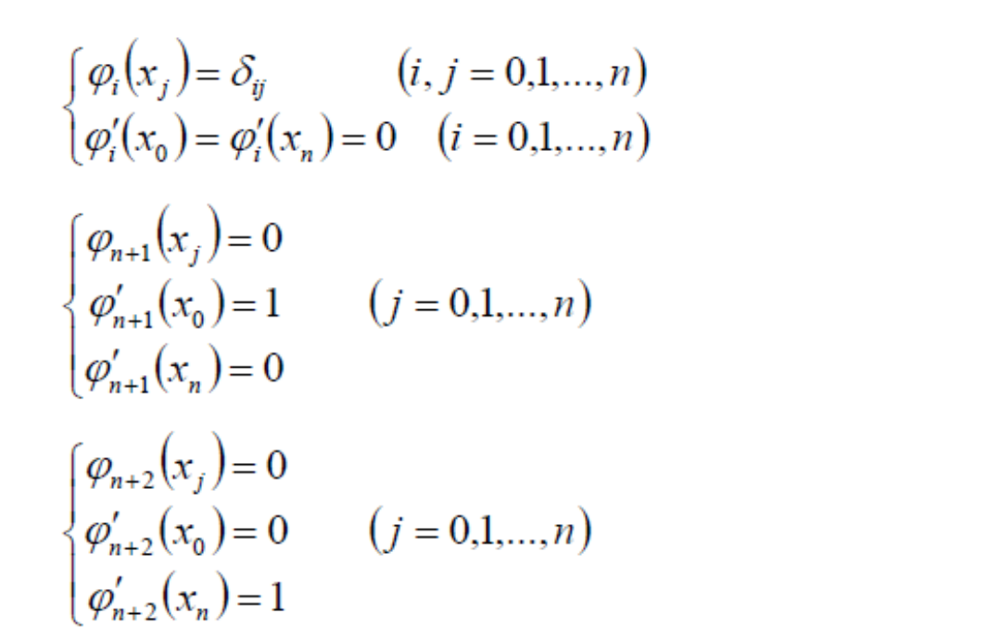
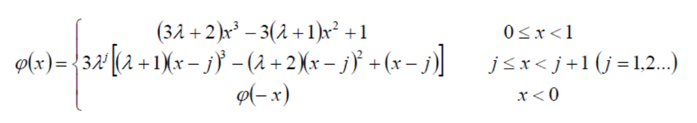
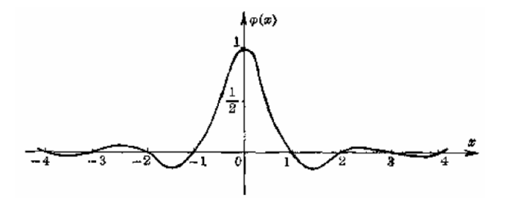
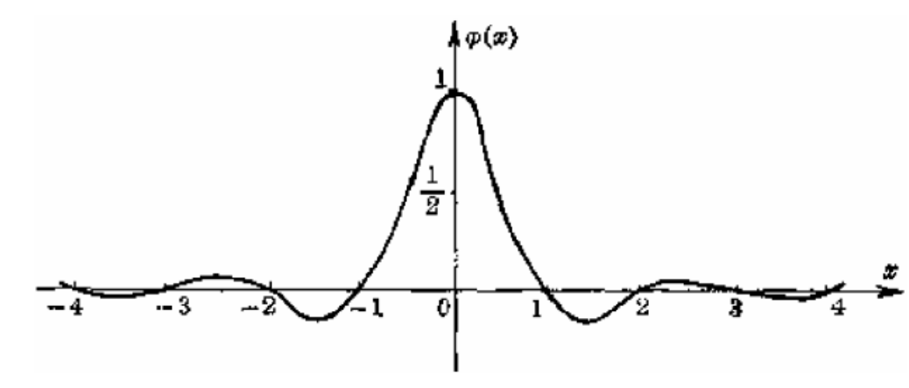

# 三次基样条   

> 这一节没讲，用Hermit基组成样条叫基样条。  

$$
S(x)=\sum_{i=0}^{n}y_i \varphi _i(x)+{y}'_0 \varphi _{n+1}(x)+{y}'_n \varphi _{n+2}(x)
$$

其中\\(\varphi _i(x)\\)均为三次样条函数，且满足  

任一\\(\varphi _i(x)\\)可由三次样条函数方法求得。  

> [29:35] # ？不知道在干什么.大概是用 Hermit 类似的方法简化求三次基样条的过程。     
> [>]这个简化方法有点像拉格朗日优化。    

## 基样条特征   

• 考虑定义在所有整数节点上的基样条    
即满足\\(\varphi (j)=\delta _{0j}\\),\\((j=0,\pm1,\pm2,...)\\)    

$$
\lambda =\sqrt{3} -2\approx - 0.268
$$

(a) 相邻两端异号；    
(b) 每段有一个极值点，\\(j+1\\)段极值点是j段极值点的\\(\lambda\\)倍;     
(c) 节点处导数满足\\(m_{j+1}=\lambda m_j\\)   

---  

> 本文出自CaterpillarStudyGroup，转载请注明出处。
https://caterpillarstudygroup.github.io/GAMES102_mdbook/

