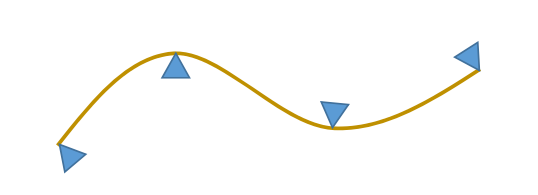
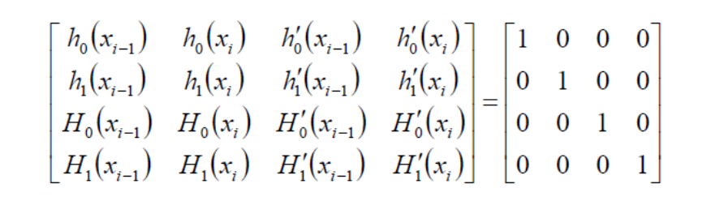

# 三次样条函数的来源   

  
物理推理过程省略，最后结论是两压铁间\\(y(x)\\)**为三次函数**，即样条曲线为分段三次函数。  

# 分段3次多项式的好处   

• 2次多项式无法表达拐点，不够自由   
• 高次（4次及以上）多项式拐点多，次数若较高计算易出现较大误差    

# 三次样条曲线的求解

思考：  
• 每段多项式函数之间满足什么条件？    
• 如何求解？   

## 求解思路  

• 每段为3次多项式，有4个变量（待定系数）  

$$
y_i(x)=a_i+b_ix+c_ix^2+d_ix^3
$$

• 假设有\\(n+1\\)个型值点（\\(n\\)段），则总共有个\\(4n\\)变量。   
• 首先，曲线要插值型值点，有\\(n+1\\)个约束条件；   
• 其次，假设曲线整体为\\(C^2\\)连续，则相邻两段在拼接点要满足3个条件（\\(C^0\\)连续、\\(C^1\\)连续、\\(C^2\\)连续）；则有\\(3n-3\\)个约束条件；   
• 则共有\\(4n-2\\)个约束条件；    
• 因此，再加2个额外条件，即可唯一确定整条曲线。   

### 边界条件  

在首尾的控制点上各增加一条约束，见[23:36]日的边界条件。  

* I. 自由端：指定曲线在两个端点处的二阶导数值    
• 特别地，两个端点的二阶导数值指定为0时称为自然三次样条   

* II. 夹持端： 指定曲线在两个端点处的一阶导数值  

* 其他：  
• 抛物端：首末两段为抛物线   
• 周期端   
• 混合边界条件   

## 方法1  

• 3次样条插值函数的定义   
• 引入中间变量：节点处的2阶导数值\\(M_i\\)（弯矩）  
• 每段\\({y}''(x)\\)表达为
\\(M_i\\)和\\(M_{i+1}\\)的线性插值      
• 则\\(y_i(x)\\)为包含待定值
\\(M_i\\)的3次多项式    
• 再根据拼接条件（\\(C^0\\)、\\(C^1\\)、\\(C^2\\)连续），列出等式  
• 最后加上2个边界条件，构成关于{\\((M_i,i=1,...,n-1)\\)}的\\((n-1)\times (n-1)\\)阶的线性方程组    
• 方程组为对称的、三对角的、对角占优的，称为**三弯矩方程组**。方程组系数矩阵满秩，有唯一解。    
• 可用**追赶法**求解三弯矩方程组。  

## 方法2   

• 3次样条插值函数的定义   
• 引入中间变量：节点处的**1阶导数值**\\(M_i\\)（转角）  
• …（推导过程类似）   
• 最后加上2个边界条件，构成关于{\\(M_i,i=1,...,n-1\\)}
的\\((n-1)\times(n-1)\\)阶的线性方程组   
• 方程组为**对称的**、**三对角的**、**对角占优**的，称为**三转角方程组**。方程组系数矩阵满秩，有**。  
• 同样可用**追赶法**求解三转角方程组。  

## 简化的计算技巧    

* Hermite型插值多项式：两点及其一阶导数（切线）     

> 如果已知两个压点的位置及一阶导，则可以快速求出三次曲线(Hermite)。     

* Lidstone型插值多项式：两点及其二阶导数（曲率）    

> 已知两个压点的位置和二阶导，也能快速求出曲线。（具体过程没讲）

好处：在给定两个端点及其导数情况下，可直接写出函数的表达形式，这是数学上的一个通用技巧

> [?] 没get到这个通用技巧的点

# Hermit型插值多项式     

> [?] 为什么突然提到Hermit?

假设

$$
\begin{cases}
 S(x_{i-1})=f_{i-1}\\\\
S(x_i)=y_i
\end{cases}
$$

$$
\begin{cases}
 {s}' (x_{i-1})=m_{i-1} \\\\
{s}' (x_i)=m_i
\end{cases}
$$

当\\(x=\in [x_{i-1},x_i]\\)时，有   
$$
S(x)=y_{i-1}h_0(x)+y_ih_1(x)+m_{i-1}H_0(x)+m_iH_1(x)
$$

> 对函数有4个约束：    
分别针对每个约束得到4个函数，即 \\(h_0,h_c,H_0,H_1\\)。    
\\(s(x)\\)为这4个函数的线性组合。    
[?] 怎么根据矩阵解出函数的？  