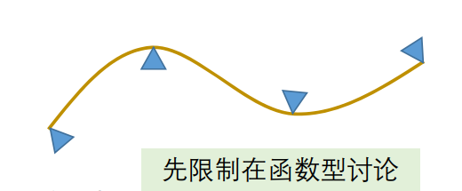
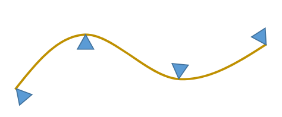

# 三次样条函数   

## 样条曲线的数学表达推导    

• 压铁：型值点   
• 木样条：插值型曲线   

 

## 力学解释   

  

* 曲线：弹性梁，弹性模量为\\(E\\)     
* 压铁：载荷（力）     
* 由材料力学中的贝努利‐欧拉方程

$$
M(x)=EIK(x)=EI\frac{{y}'' (x)}{(1+({y}' (x))^2)^\frac{3}{2} } 
$$

其中   
• 𝑀(𝑥)：曲线弯矩      
• 𝐸：木样条的弹性模量（杨氏模量）   
• 𝐼:几何惯性矩    
• 𝑘(𝑥)：曲线的曲率      

## 力学解释   

 

• 曲线：软木弹性梁（弹性模量为 ）   
• 压铁：载荷（力）   
• 由材料力学中的贝努利‐欧拉方程  

$$
M(x)=EIK(x)=EI\frac{{y}'' (x)}{(1+({y}' (x))^2)^\frac{3}{2} } 
$$

• **小扰度假设**：\\({y}' (x)\ll 1\\)（弯角不大于45°）

$$
M(x)\approx EI{y}'' (x)
$$

• 因两压铁之间无外力，\\(M(x)\\)为一次式     

$$
M(x)=ax+b
$$

• 因此可得，两压铁间\\(y(x)\\)**为三次函数**，即样条曲线为分段三次函数。  

## 数学性质  

 

* 分段3次多项式的好处   
• 2次多项式无法表达拐点，不够自由   
• 高次（4次及以上）多项式拐点多，次数若较高计算易出现较大误差    
* 思考：  
• 每段多项式函数之间满足什么条件？    
• 如何求解？   

## 求解思路  

 

• 每段为3次多项式，有4个变量（待定系数）  

$$
y_i(x)=a_i+b_ix+c_ix^2+d_ix^3
$$

• 假设有\\(n+1\\)个型值点（\\(n\\)段），则总共有个\\(4n\\)变量。   
• 首先，曲线要插值型值点，有\\(n+1\\)个约束条件；   
• 其次，假设曲线整体为\\(C^2\\)连续，则相邻两段在拼接点要满足3个条件（\\(C^0\\)连续、\\(C^1\\)连续、\\(C^2\\)连续）；则有\\(3n-3\\)个约束条件；   
• 则共有\\(4n-2\\)个约束条件；    
• 因此，再加2个额外条件，即可唯一确定整条曲线。   

## 三次样条函数推导（方法1）  

• 3次样条插值函数的定义   
• 引入中间变量：节点处的2阶导数值\\(M_i\\)（弯矩）  
• 每段\\({y}''(x)\\)表达为
\\(M_i\\)和\\(M_{i+1}\\)的线性插值      
• 则\\(y_i(x)\\)为包含待定值
\\(M_i\\)的3次多项式    
• 再根据拼接条件（\\(C^0\\)、\\(C^1\\)、\\(C^2\\)连续），列出等式  
• 最后加上2个边界条件，构成关于{\\((M_i,i=1,...,n-1)\\)}的\\((n-1)\times (n-1)\\)阶的线性方程组    
• 方程组为对称的、三对角的、对角占优的，称为**三弯矩方程组**。方程组系数矩阵满秩，有唯一解。    
• 可用**追赶法**求解三弯矩方程组。  

## 边界条件  

 

* I. 自由端：指定曲线在两个端点处的二阶导数值    
• 特别地，两个端点的二阶导数值指定为0时称为自然三次样条   

* II. 夹持端： 指定曲线在两个端点处的一阶导数值  

* 其他：  
• 抛物端：首末两段为抛物线   
• 周期端   
• 混合边界条件   

## 三次样条函数推导（方法2）   

• 3次样条插值函数的定义   
• 引入中间变量：节点处的**1阶导数值**\\(M_i\\)（转角）  
• …（推导过程类似）   
• 最后加上2个边界条件，构成关于{\\(M_i,i=1,...,n-1\\)}
的\\((n-1)\times(n-1)\\)阶的线性方程组   
• 方程组为对称的、三对角的、对角占优的，称为**三转角方程组**。方程组系数矩阵满秩，有唯
一解。  
• 同样可用**追赶法**求解三转角方程组。  

## 三弯矩方程组/三转角方程组   

• 三对角矩阵   
• 主对角占优    
• 有唯一解     
• 追赶法求解    

## 简化的计算技巧    

* Hermite型插值多项式     
• 两点及其一阶导数（切线）     

* Lidstone型插值多项式      
• 两点及其二阶导数（曲率）    
* 好处：在给定两个端点及其导数情况下，可直接写出函数的表达形式    
• 这是数学上的一个通用技巧       

## Hermit型插值多项式     

假设

$$
\begin{cases}
 S(x_{i-1})=f_{i-1}\\\\
S(x_i)=y_i
\end{cases}
$$

$$
\begin{cases}
 {s}' (x_{i-1})=m_{i-1} \\\\
{s}' (x_i)=m_i
\end{cases}
$$

当\\(x=\in [x_{i-1},x_i]\\)时，有   
$$
S(x)=y_{i-1}h_0(x)+y_ih_1(x)+m_{i-1}H_0(x)+m_iH_1(x)
$$

