# 离散曲线处理   

# 回顾：\\(R^2\\)和 \\(R^3\\)中的曲线/曲面   

  

# 映射的维数   

$$
f:X → Y
$$

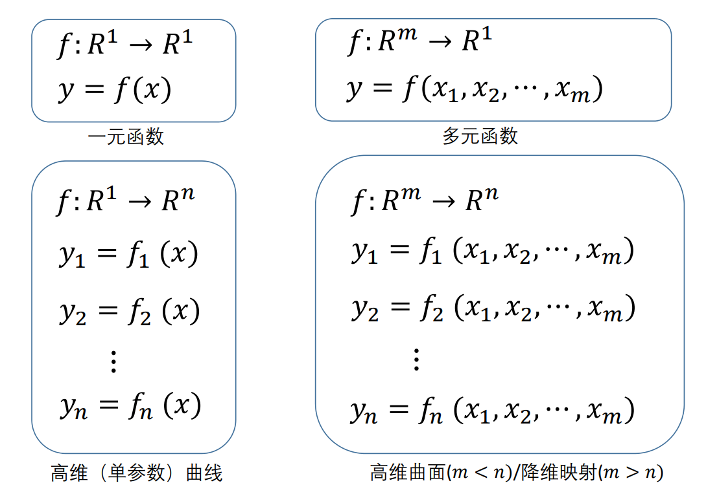  

# Curve Modeling in \\(R^2\\)（建模/造型）   

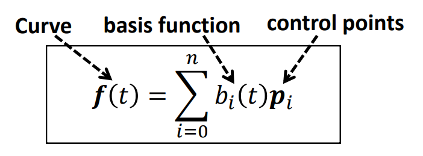    

* **Fitting** (Reconstruction) for reverse engineering (interpolation, approximation, aggression…)     
• 从代数观点：需要函数空间表达能力足够      
• 输入：采样点{\\(S_j,j=0\sim m\\)} 及基函数{\\(b_i(t),i=0\sim n\\)}     
• 输出：拟合函数的系数{\\(p_i,i=0\sim n\\)}       
* **Design** for interactive modeling      
• 从几何观点：具有好性质的基函数使得交互设计更直观     
• 输入：交互输入（或者反求）控制顶点{\\(p_i,i=0\sim n\\)}     
• 输出：曲线\\(f(t)\\)   

# 曲线（形状）的不同表达方法    

**优劣比较？**

* 显式函数曲线   

    

* 参数曲线    

    

* 隐式曲线    
• Level set (水平集)     

    

* 细分曲线      

    

# 几何迭代法（渐进迭代逼近）     
(progressive‐iterative approximation, PIA)     

    

齐东旭、de Boor、蔺宏伟    

# 曲线的离散   

# 从连续到离散   

* 对象的表达     
• 在数学上，连续表达与计算      
• 在计算机中，离散表达与计算     
* 数值方法：数值微分、数值积分、数值优化    
• 数值分析：离散计算对精确计算的近似程度     
• Fourier分析/变换：离散Fourier分析/变换    
• 卷积（滤波）    
* 在计算机科学（计算机图形学）中，采样无处不在    
• 计算机只能表达离散的数值    
• 例子：int型的数据（量化）    

# 曲线的离散化   

• 将连续性表达转化为**多边形**表达（分段线性）    

    

# 为何要离散化？   

* 渲染的必要性    
• 算法和硬件：线段/圆的光栅化     

    

* 计算的必要性     
• 直线求交、多项式求根    

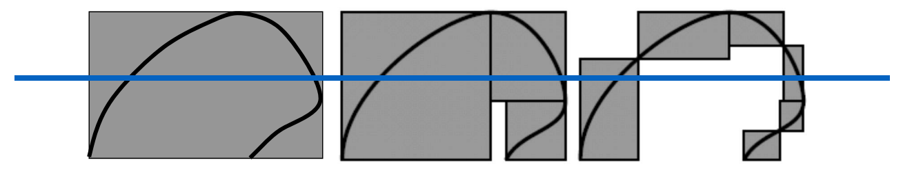    

* 制造的必要性      
• 刀具轨迹只能走直线段和圆弧     

# 曲线的离散：采样    

• Nyquist–Shannon采样定理      

> If a function \\(x(t)\\) contains no frequencies higher than B hertz, it is completely determined by giving its ordinates at a series of points spaced 1/(2B) seconds apart.      

    

# Bezier曲线的离散定理    

• 曲线到弦的最大距离<控制顶点到弦的最大距离     
• 给定误差，估计离散层级     

    

# 离散曲线的几何量的计算     

* 如果有连续表达，利用连续表达的曲线来计算    

* 如无连续表达     
• 差分法：利用差分形式来近似微分属性    
• 拟合法：利用光滑函数来拟合估计属性     

* Tylor展开及估计     

# 重心坐标     

# Free‐form Deformation (FFD)    
[Sederberg et al. 86]

* Embed the object into a domain that is more easily parametrized than the object.     
* Advantages:      
• You can deform arbitrary objects    
• Independent of object representation     

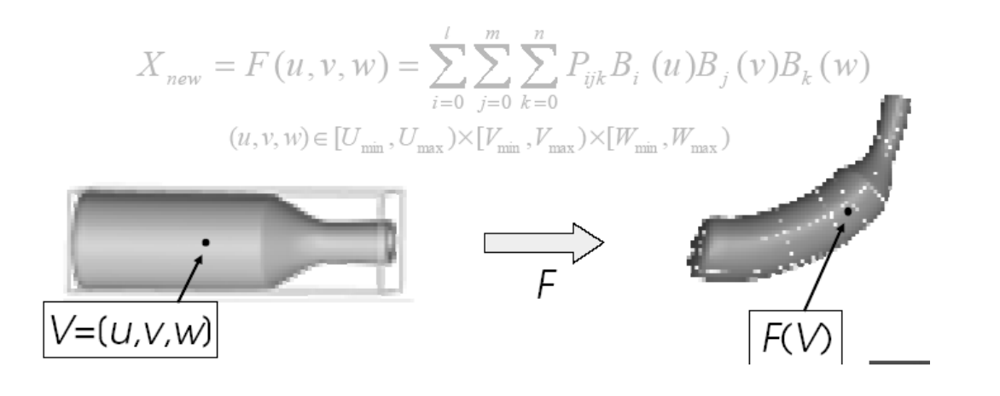    

# 图像变形    

• 交互：boundary editing    

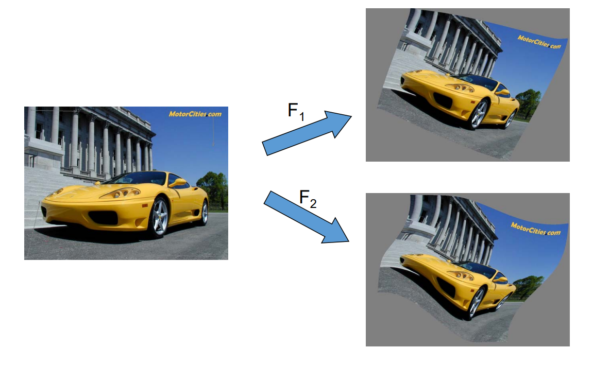    

# 图像变形     

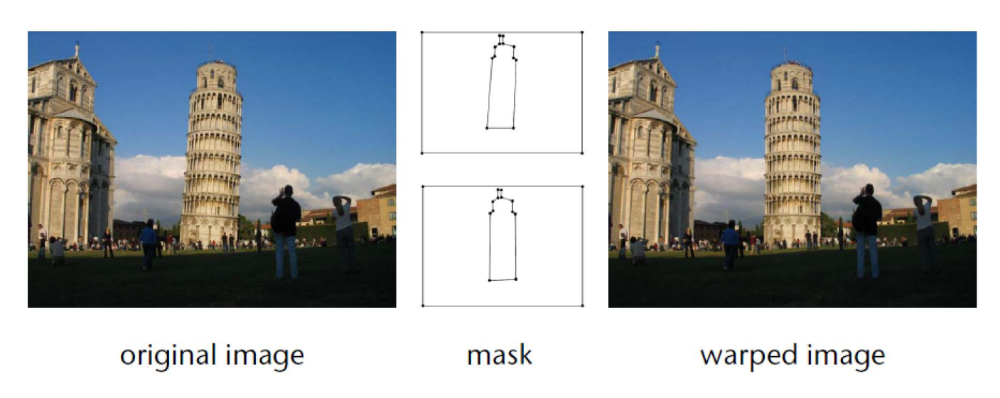    

**问题**：给定一个包含物体的边界多边形，改变边界时，如何计算物体的变形？      
即，内部点与边界点（**控制顶点**）之间的关联关系？     

    

# 三角形的重心坐标     

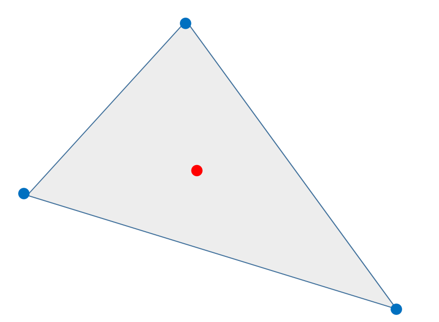    

# 四边形？   

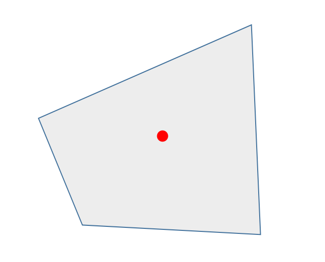    

# 多边形的重心坐标？   

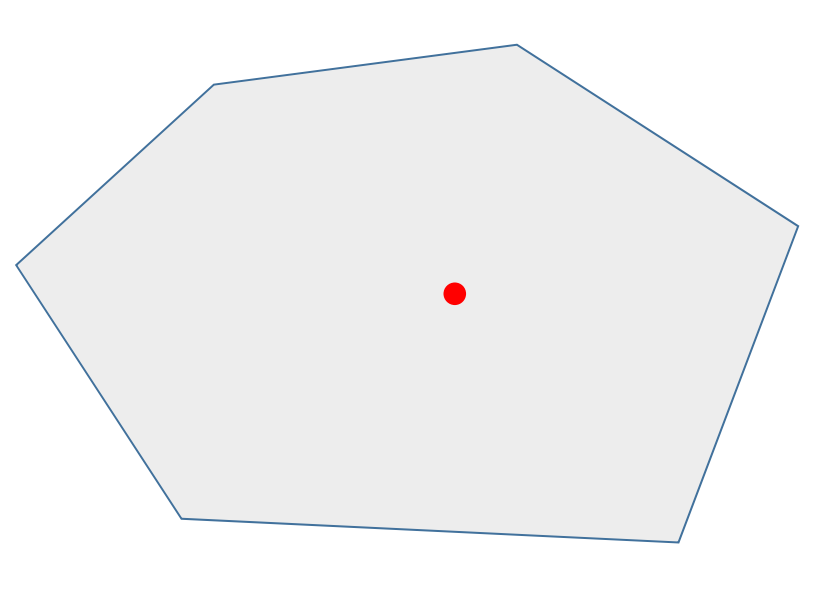    

# Warping with BC      

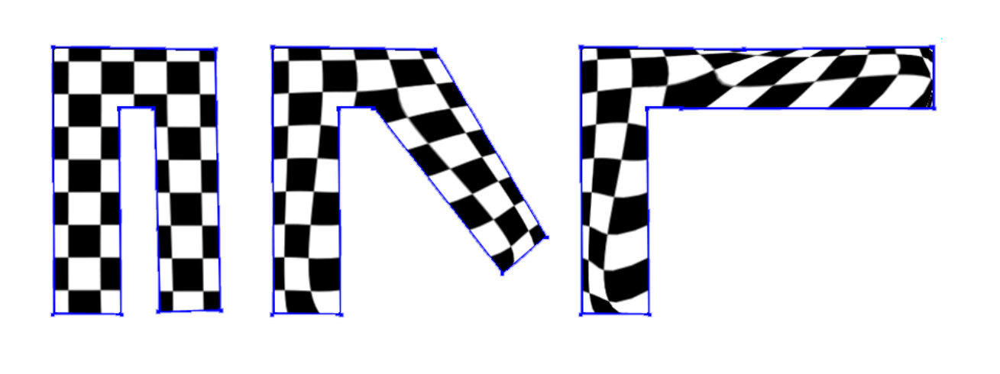    

# Coordinates    

 - Homogeneous coordinates
    - Given points \\(v_\Sigma \\) = {\\(v_1,\cdots ,v_i,\cdots \\)}    
    - Express a new point \\(x\\) as affine combination of \\(v_\Sigma \\)    

         \\(x=\Sigma b_i v_i,\\) where \\(\Sigma b_i = 1\\)    

    - \\(b_i\\) are called homogeneous coordinates      
    - Barycentric if all       

   $$
   b_i \ge 0
   $$

        

# Applications    

* Boundary interpolation    
\\(f(x)=\Sigma b_if_i\\)     
• Color/Texture interpolation      
* Mapping     
\\({x}' =\Sigma b_i{v}' _i\\)     
• Shell texture      
• Image/Shape deformation     

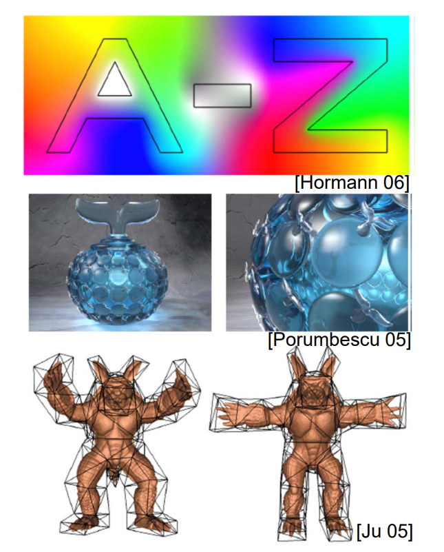    

# Coordinates In A Polytope     

* Points \\(v_\Sigma\\) form vertices of a closed polytope     
• \\(x\\) lies inside the polytope     

* Example: A 2D triangle     
• Unique (barycentric):     

  $$
  b_1=\frac{A_{xv_2v_3}}{A_{v_1v_2v_3}} 
  $$
• Can be extended to any N‐D simplex        
* A general polytope     
• Non‐unique      
• The triangle‐trick can not be applied.       

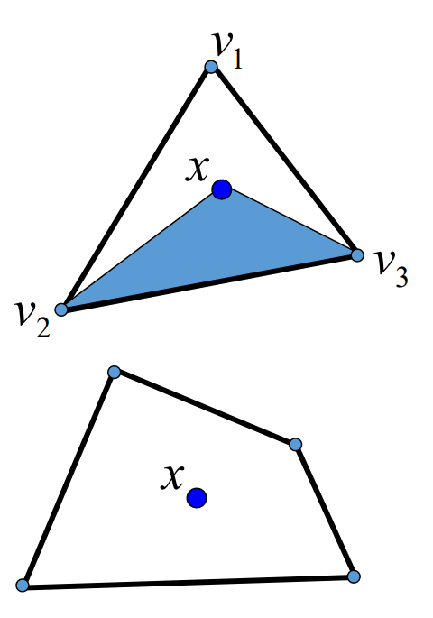    

# BC of 2D Polygons   

 -  2D Polygons     
    - Wachspress [Wachspress 75][Loop 89][Meyer 02][Malsch 04]    
      - Barycentric within convex shapes      
    - Mean value [Floater 03][Hormann 06]      
      - Homogeneous within any closed shape, barycentric within convex shapes and kernels of star‐shapes      
    - Discrete harmonic [Desbrun 02][Floater 06]     
      - Homogeneous within convex shapes     
 - A general construction in 2D [Floater 06]      
    - <u>Complete</u>: a single scheme that can construct all possible homogeneous coordinates in a convex polygon      
    - Reveals a simple connection between known coordinates via a parameter        
      - Wachspress      
      - Mean value       
      - Discrete harmonic     

# 各种重心坐标的计算方法     

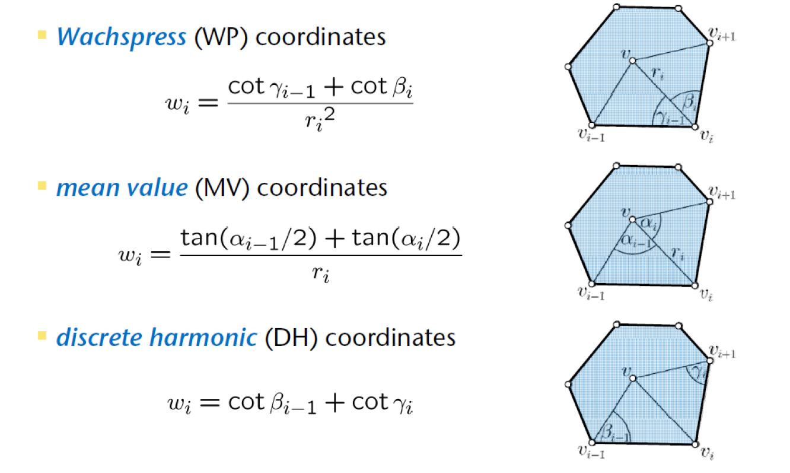    

# • 1.imge warping     

    

# • 2. shading     

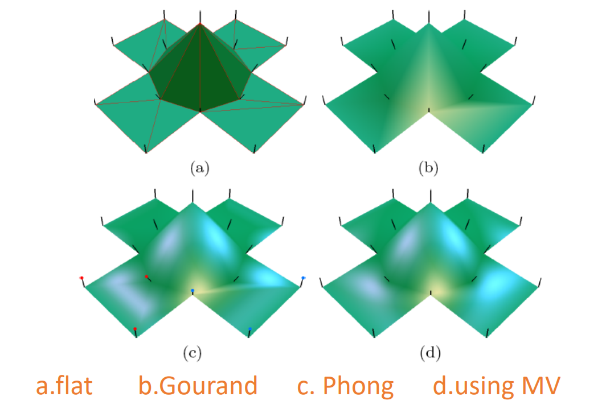    

# 3. Transfinite Interpolation: Interpolating height function to model a surface    

    

# • allow directly updating on interpolation when resampled.     

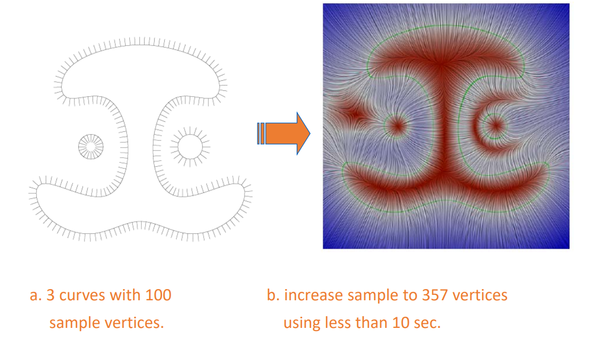     

# Transfinite Interpolation    
 
• 问题：给定4条边界曲线，构造插值这4条曲线的一张曲面     
• Coons surfaces      

     

# 广义重心坐标的学习资料   

• <http://www.inf.usi.ch/faculty/hormann/barycentric>     

# 2D形状（离散曲线）处理    
 

# 离散曲线的去噪/滤波    

• Denoising, smoothing, fairing     

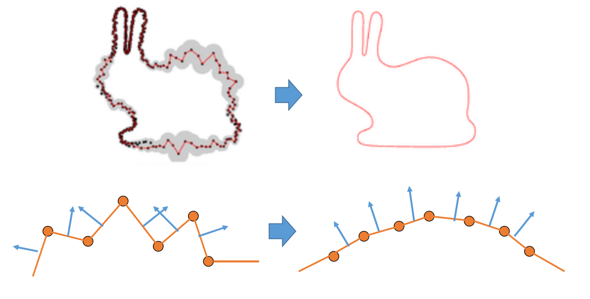     

# 曲线简化(Simplification)    

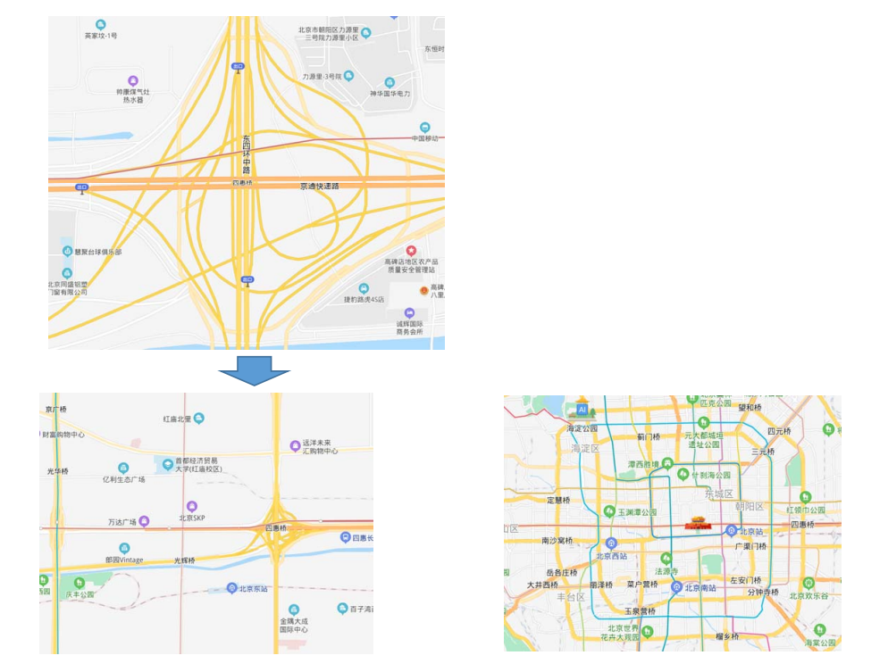     

# 曲线编辑/变形(Editing/Deformation)     

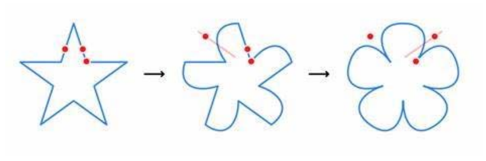     

# 形状插值(Morphing)     

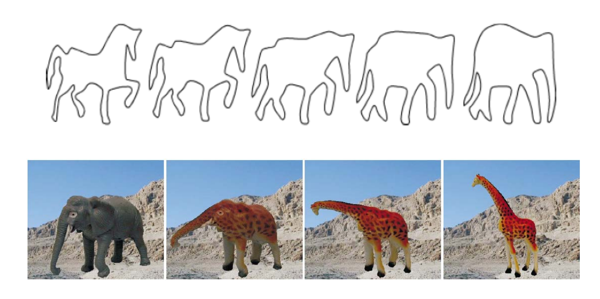     

# 形状的对称性检测(Symmetry)      

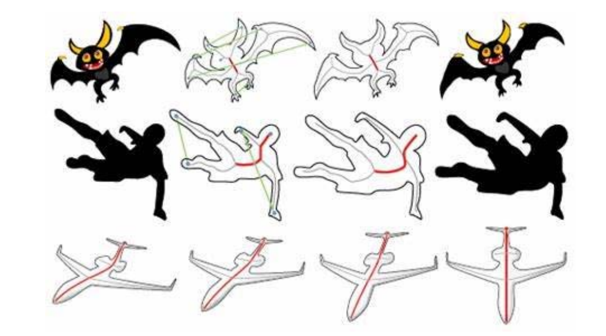     

# 形状分割(Segmentation)      

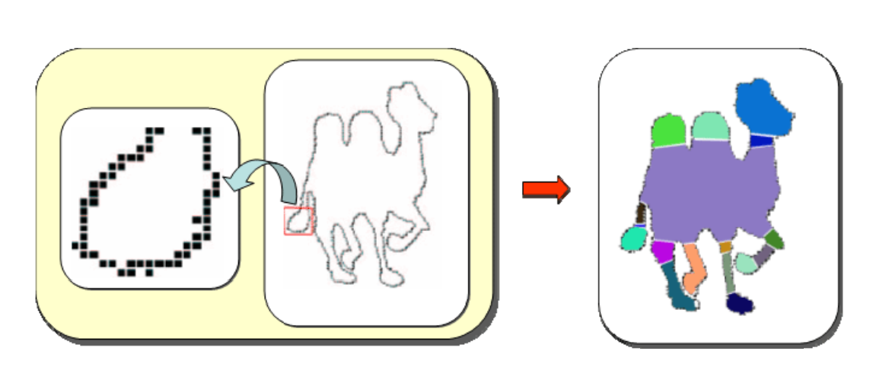     

# 形状匹配(Matching/Correspondences)        

     

# 形状检索(Retrieval)       

     

# 形状描述子(Descriptors)      

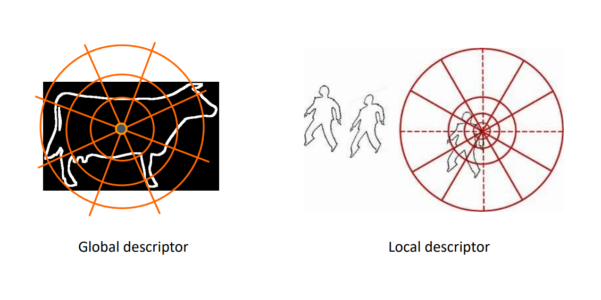     

