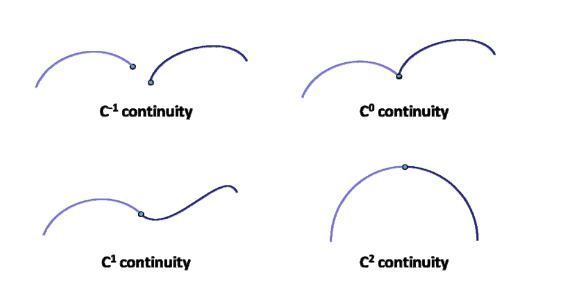
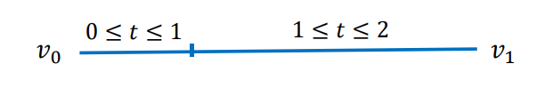
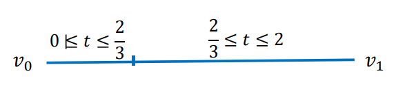
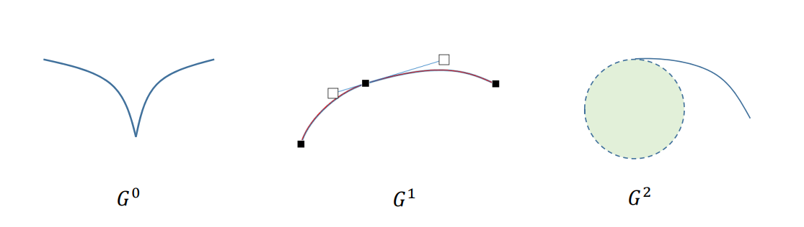

# 曲线的几何连续性   

## 参数连续性  

### 定义

在数学分析/高等数学中，我们所说的“连续性”（光滑性）是指“参数连续性”：   

给定两条曲线\\(x_1(t)\\)和\\(x_2(t)\\)，其中\\(x_1(t)\\)定义在\\([t_0,t_1]\\)，\\(x_2(t)\\)定义在\\([t_1,t_2]\\)  

曲线\\(𝒙_1\\)和\\(𝒙_2\\)在\\(t_1\\)称为\\(C^r\\)**连续**的，如果它们的从\\(0^{th}\\)（\\(0\\)阶） 至\\(r^{th}\\)（\\(𝑟\\)阶）的导数向量在\\(𝑡_1\\)处完全相同。  

* \\(C^{-1}\\)：表示不连续  
* \\(C^0\\): position varies continuously    
* \\(C^1\\): First derivative is continuous across junction。即 the velocity vector remains the same   
* \\(C^2\\): Second derivative is continuous across junction 即 The acceleration vector remains the same   

### 参数连续性的不足   
 
参数连续性过于严格，在几何设计中不太直观    

• 例子1：一条线段v0v1   

表示为分段函数：  

$$
\varphi(t)=\begin{cases}
 v_{0}+\frac{v_{1}-v_{0}}{3} t, 0 \leq t \leq 1\\\\
v_{0}+\frac{v_{1}-v_{0}}{3}+\frac{2\left(v_{1}-v_{0}\right)}{3}(t-1), 1 \leq t \leq 2
\end{cases}
$$

线段上的任意点应该是处处连续的。但是，
$$
{\varphi }'(1-)=\frac{v_{1}-v_{0}}{3},{\varphi }' (1+)=\frac{2(v_{1}-v_{0})}{3}
$$

\\(\varphi (t)\\)在\\(t=1\\)的左右导数不相等，因此，\\(\varphi(t)\\)在\\([0,2]\\)中**不是**\\(C^1\\)的，与直线的连续性应是\\(C^\propto\\)的矛盾。   

> &#x2753; 问：为什么此时在\\(t=1处 C^{1}\\)不连续      
答：导数反应的是对变量的变化率，而图中两段的\\(t\\)是不同的变量。   
> 因此，参数连续性**依赖于参数**的选择，同一条曲线，参数不同，连续阶也不同。 

• 例子2：同一条线段，但对参数化方法做一些改造：   

表示为分段函数：  

$$
\varphi(t)=\begin{cases}
 v_{0}+\frac{v_{1}-v_{0}}{3} t, 0 \leq t \leq \frac{2}{3}\\\\
v_{0}+\frac{v_{1}-v_{0}}{3}+\frac{\left(v_{1}-v_{0}\right)}{3}(t-\frac{2}{3}), \frac{2}{3} \leq t \leq 2
\end{cases}
$$

则\\({\varphi }' (\frac{2}{3}- )={\varphi }' (\frac{2}{3}+ ),\varphi (t)\\)在\\([0,2]\\)就是\\(C^\infty \\)了。    

这个参数化方法的改造，本质是引入了**参数的一个变换**  

$$
t=\begin{cases}
 \frac{2}{3}s,0\le s\le \frac{2}{3},\\\\
\frac{3}{4}(s-\frac{2}{3})+1,\frac{2}{3}\le s\le 2.
\end{cases}
$$

使得原来不是\\(C^1 \\)的曲线变为\\(C^1 \\)的了。

**参数连续性依赖于参数定义，无法刻画曲线本征的特性。**因此引入几何连续性。  

## 几何连续性   

### 定义

设\\(\varphi (t)(a\le t\le b)\\)是给定的曲线。若存在一个参数变换\\( t=p(s)(a_1\le s\le b_1)\\),
使得\\(\varphi (p(s))\in C^n[a_1,b_1]\\),且\\(\frac{d\varphi (p(s))}{ds} \ne 0\\),
则称曲线\\(\varphi (t)(a\le t\le b)\\)是\\(n\\)阶几何连续的曲线，记为
$$
\varphi (t)\in GC^n[a,b]
$$

或

$$
\varphi (t)\in G^n[a,b]
$$

> 把线段\\(C^1\\)不连续变成\\(C^\infty \\)连续的过程就是参数变换的例子。这里只是给出定义，不提供参数变换的方法。  

### 性质

1. 条件 \\(\frac{d\varphi (p(s))}{ds} \ne 0\\)保证了曲线上无奇点；  

> 一般不考虑有奇点的情况  
 
2. 几何连续性与参数选取无关，是曲线本身固有的几何性质； 

> 本征特征：**不会由于曲的旋转、平移而改变的特征**，例如曲率。   

3. \\(𝐺^n\\) 的条件比\\(𝐺^n\\)的宽，曲线类型更多；

### 具体形式   

• \\(𝐺^0\\)：表示两曲线有公共的连接端点，\\(C^0\\)与的条件一致   
• \\(𝐺^1\\)：两曲线在连接点处有公共的**切线方向**，即切线方向连续，切线长度可以不同。     
• \\(𝐺^2\\)：两曲线在连接点处有公共的**曲率圆**，即曲率连续     

> 曲线编辑工具。跳过   

## 两种连续性的比较   

C连续适合于动画。G连续适合于设计建模。

本文出自CaterpillarStudyGroup，转载请注明出处。
https://caterpillarstudygroup.github.io/GAMES102_mdbook/
