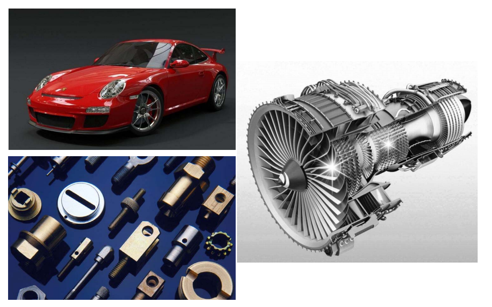
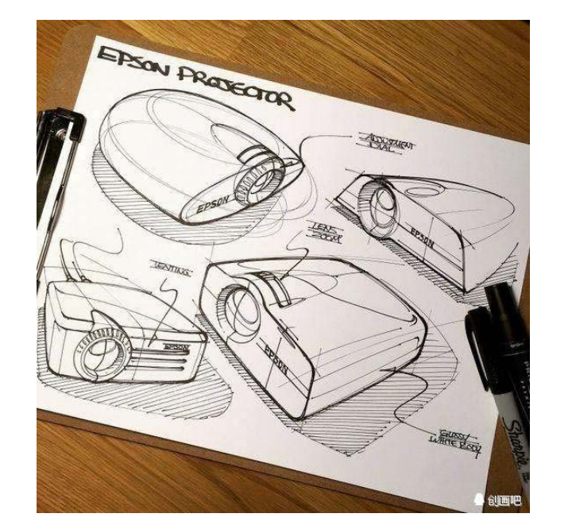
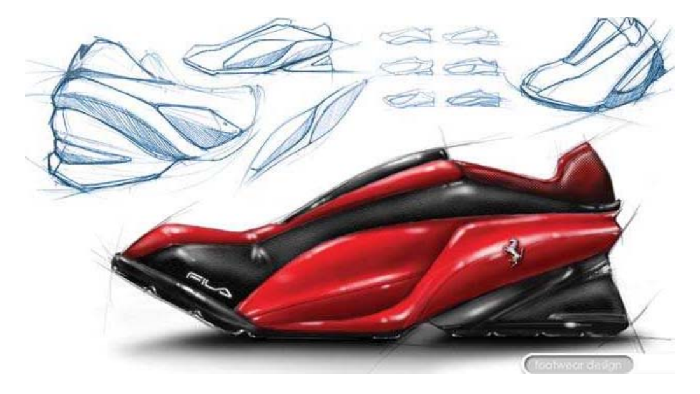
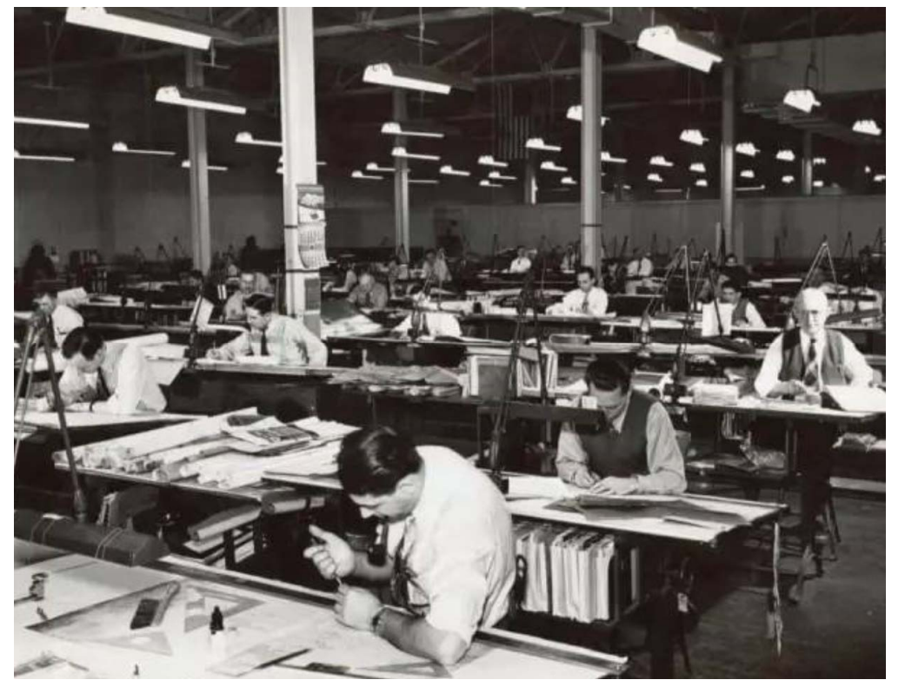
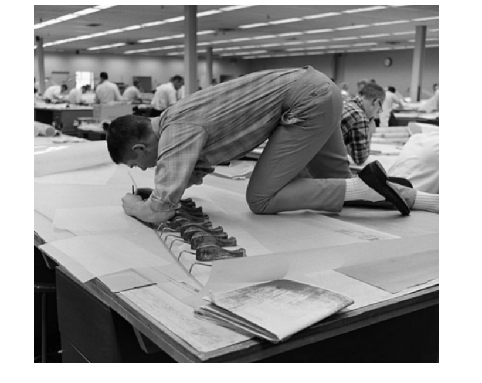
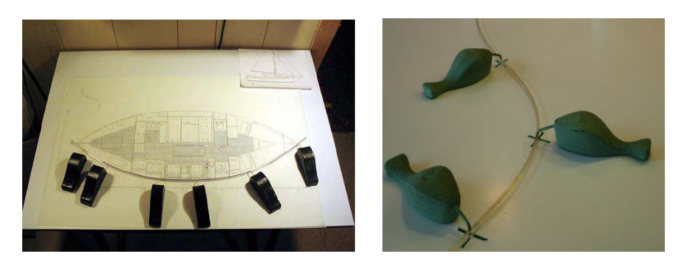
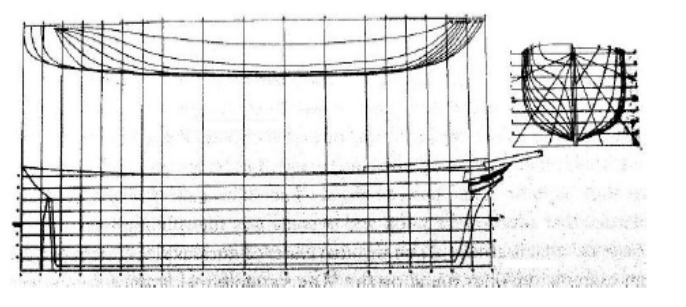

# 几何设计  

>几何设计、跳过  

## 工业产品的外形是如何设计的？  

  

## 几何设计  

• 传统的概念更多指的是“外形设计”

 

## 概念设计  

   

## 设计图纸   

  

## 从设计到数学（几何）表达    

   

# 没有电脑之前，设计师是如何画图设计的？   
 

 

## 放样方法   
 

 

   

## 样条与压铁   
• 样条：具有一定弹性的软木条    
• 压铁：较重的铁块，用来固定样条所经过的点    

   

## 自由曲线  
* 在产品初始设计阶段，描述其外形的曲线或曲面常常只有大致形状或只知道它通过一些空间点列（称为**型值点**），这类没有数学表达式的曲线或曲面称为自由曲线或自由曲面(Free form curve/surface)．   

* 造型方法   
• 拟合(fitting)   
• 插值(interpolation)   
• 逼近(approximation)   

 

## 样条所形成的曲线的数学表达？  

 

本文出自CaterpillarStudyGroup，转载请注明出处。
https://caterpillarstudygroup.github.io/GAMES102_mdbook/
