# 3D网格曲面：二维流形曲面的离散    

• 平面图在3D空间中的嵌入 \\(f:R^2\to R^3\\)    

   

# Cardinal Coordinates   

 - (x,y,z) coordinates    
> v 1.5 -0.960751 -1.2232    
  v 0.81 -0.891238 -3.74258   
  v 0.16 -0.233535 -2.28405   
  v 1.49 -2.44325 -3.6962   
  v 1.59 -2.98815 -4.15761   
  v 1.66 -2.81016 -4.10777   
  v 1.41 -1.14861 -1.92823   
  v 1 -1.40023 -3.80159   
  v 0.88 -1.33122 -3.83517   
  …   
  f 1 2 3   
  f 2 4 5   
  …   

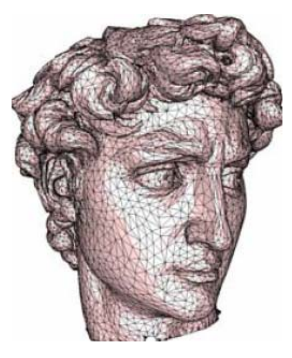   

# 图的连接关系：点、边、面    

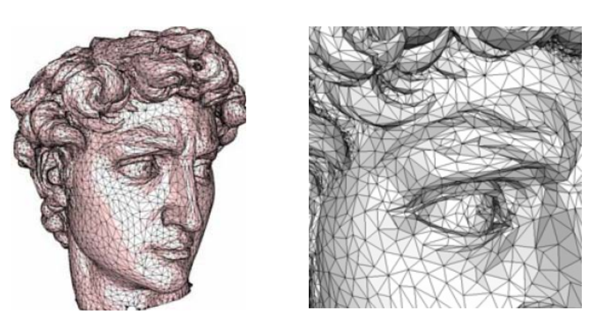   

# 存储数据结构：半边结构    

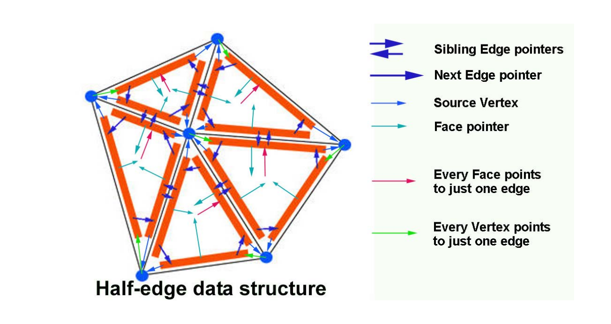   

# Local Structure   

 - Small‐sized Cells    
    - 1‐ring neighborhood （1‐邻域）    
    - 一般“流形”结构也是通过局部邻域来定义   

       

# 局部特征度量：1‐邻域   

 - Detail = surface – smooth (surface)     
 - Smoothing = averaging    
   

# Laplace算子(operator)    

• \\(n\\)维欧几里得空间的二阶微分算子（椭圆型算子）   
• 梯度 \\(\nabla f\\) 的散度 \\(\nabla \cdot f\\)   

$$
\Delta f=\nabla \cdot \nabla f=\nabla^{2} f
$$

• 在笛卡尔坐标系中，为所有非混合二阶偏导数：

$$
\Delta f=\sum_{i=1}^{n} \frac{\partial^{2} f}{\partial x_{i}^{2}}
$$

• 特别地，对二元实函数\\(f(x,y)\\)：    

$$
\Delta f=\frac{\partial^{2} f}{\partial x^{2}}+\frac{\partial^{2} f}{\partial y^{2}}
$$

# Laplace‐Beltrami 算子    

• 推广：定义在黎曼流形上的椭圆型算子    

$$
\nabla ^2f=\nabla \cdot \nabla f
$$

$$
\Downarrow 
$$

$$
\nabla ^2f=\frac{1}{\sqrt{|g|} } \partial _i(\surd |g|g^{ij}\partial _jf).
$$

# Differential Coordinates （微分坐标）    

• 离散形式的 Laplacian 算子 (Umbrella Operator，
伞型算子):   

$$
\delta _i=\nu _i-\sum _{j\in N(i)}w_j\nu _j
$$

    

# 平均曲率流定理   

    

# Geometric Meaning   

 - DCs represent the **local** detail / local shape description   
    - The direction approximates the normal    
    - The size approximates the mean curvature    

    

# Weighting Schemes     
(Barycentric coordinates)    

• Uniform weight (geometry oblivious)     

$$
w_i=1
$$

• Cotangent weight (geometry aware)     

$$
w_j=(\cot \alpha +\cot \beta )
$$

• Normalization    

$$
w_j=\frac{w_j}{\sum _jw_j} 
$$

    

$$
\delta _i=\frac{1}{d_i} \sum _{j\in N(i)}(\nu_i-\nu_j)
$$

# Local Laplacian Smoothing    

# Differential Coordinates (Laplace Coordinates)    

 - Represent local detail at each surface point    
    - better describe the shape    
 - Linear transition from global to differential   
 - Useful for operations on surfaces where **surface details** are important   

    
$$
\delta _i=\frac{1}{d_i} \sum _{j\in N(i)}(\nu_i-\nu_j)
$$    

# Laplacian Smoothing Flow   

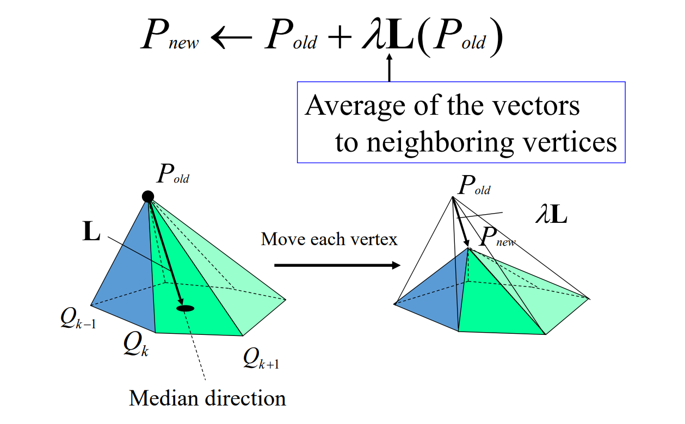    

# Laplacian Smoothing    

$$
P^{new}=P^{old}+\lambda L(P^{old})
$$

 - Equivalent to box filter in signal processing    
 - Apply to all vertices on mesh    
 - Typically repeat several times    
 - Can describe as energy minimization    
    - Energy = sum of squared edge lengths in mesh
    - Parameter \\(\lambda >0\\) controls convergence "speed"    

# Laplacian Smoothing – Example 

    

# Problem of Over‐smoothing   

How to find appropriate \\(\lambda\\) and number of iterations?   

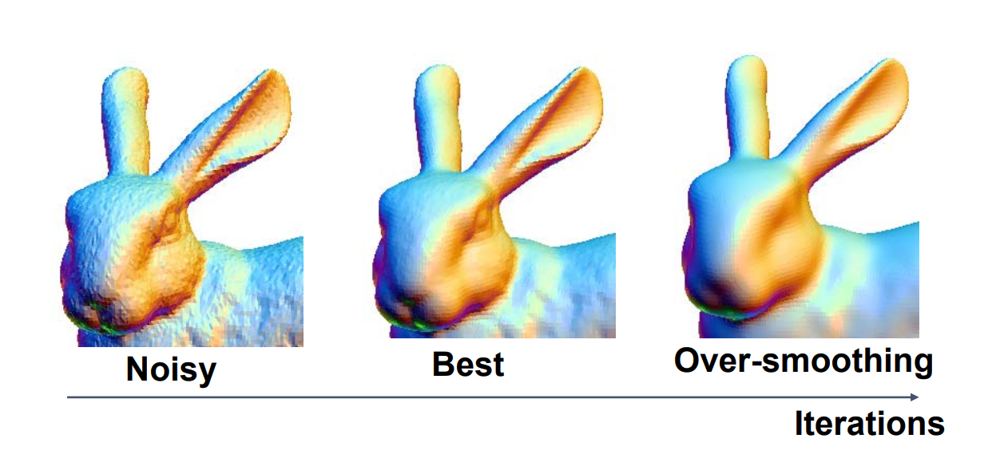    

# Mean Curvature Flow   

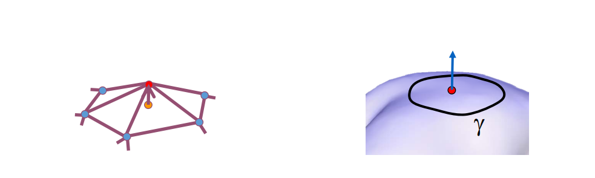    

$$
\delta _i=\frac{1}{d_i} \sum _{\nu\in N(i)}(\nu_i-\nu)
$$

$$
\frac{1}{len(\gamma )} \int _{\nu\in \gamma }(\nu_i-\nu)ds
$$

$$
\lim_{len(\gamma ) \to 0} \frac{1}{len(\gamma )} \int _{\nu\in \gamma }(\nu_i-\nu)ds=H(\nu_i)n_i
$$

# Discrete Mean Curvature Flow   

    

 
# Discrete Mean Curvature   

$$
Hn=\frac{\nabla _PA}{2A} 
$$

$$
Hn=\frac{1}{4A} \sum _j(\cot \alpha _j+\cot \beta _j)(P-Q_j)
$$

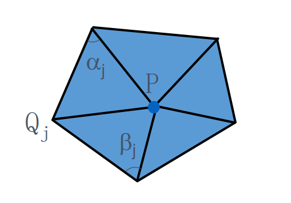    

# Properties of Mean Curvature Flow   

    

# Global Laplacian Smoothing    

# 极小曲面(minimal surface)    

• 平均曲率处处为0   

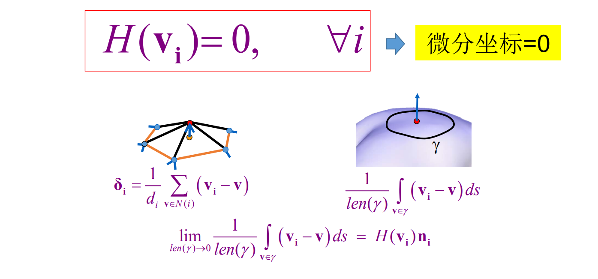    

# 局部迭代光顺方法的问题？   

• 注：通过作业6中已发现    

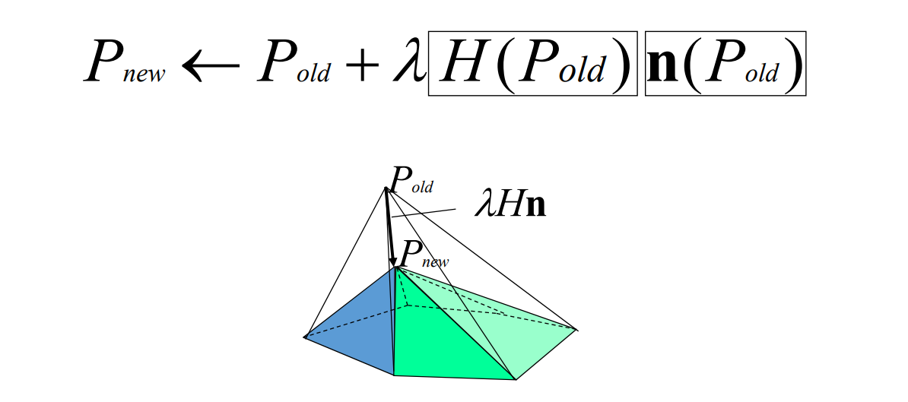    

# 微分坐标一致为0    

    

 - 所有顶点的方程联立，得到网格曲面的整体
Laplacian方程：
$$
Ax = 0
$$

# Laplacian Matrix   

• The transition between the \\(\delta and xyz\\)  is linear:     

    

$$
A_{ij}=\begin{cases}
 1 ,     i\in N(j)\\\\
  \\\\
0, otherwise
\end{cases}
$$

$$
D_{ij}=\begin{cases}
 d_i,     i=j\\\\
  \\\\
0, otherwise
\end{cases}
$$

$$
L=I-D^{-1}A
$$

# Laplacian matrix    
• The transition between the \\(\delta \\) and \\(xyz\\) is linear:    

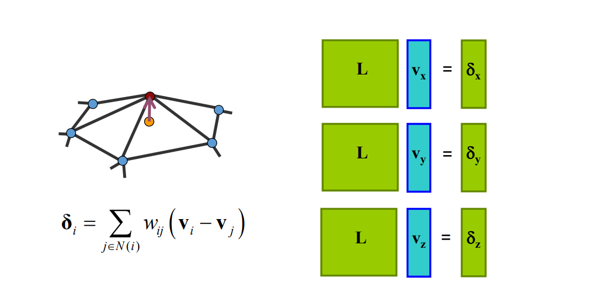    

# Reconstruction    

• From relative coordinates to absolute coordinates.    
• Solving a sparse linear system     

$$
Lv=\delta
$$

    

# Basic properties    

• Rank(L) = n‐c (n‐1 for connected meshes)    
• We can reconstruct the \\(xyz\\) geometry from delta up 
to translation   
$$
LX=\delta
$$

# 极小曲面生成的全局方法    

* 检测边界，固定边界    
* 构建稀疏方程组\\((\delta=0)\\)     
* 求解稀疏方程组     
• 【注：有高效的求解方法，且有成熟的数学库可使用】    
* 更新内部顶点坐标    

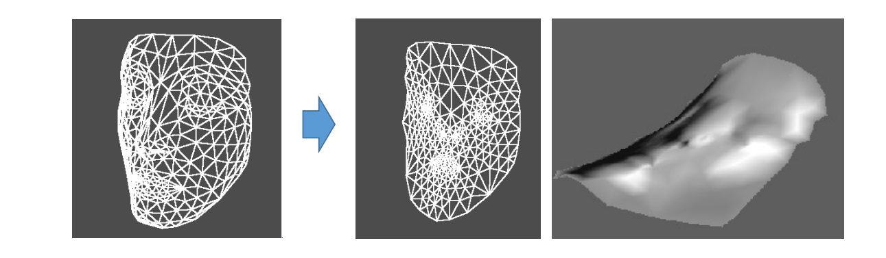    

# Mesh Parameterization (Mesh Flattening)     
曲面参数化   

# 2D Manifold Surfaces in \\(R^3\\)   

* A surface \\(S\\) in \\(R^3\\) has an **intrinsic dimension** of 2D   
•a patch \\(\Omega\\) in \\(R^2\\) is embedded into \\(R^3\\) (each point in \\(\Omega\\) is assigned a position in \\(R^3\\))    

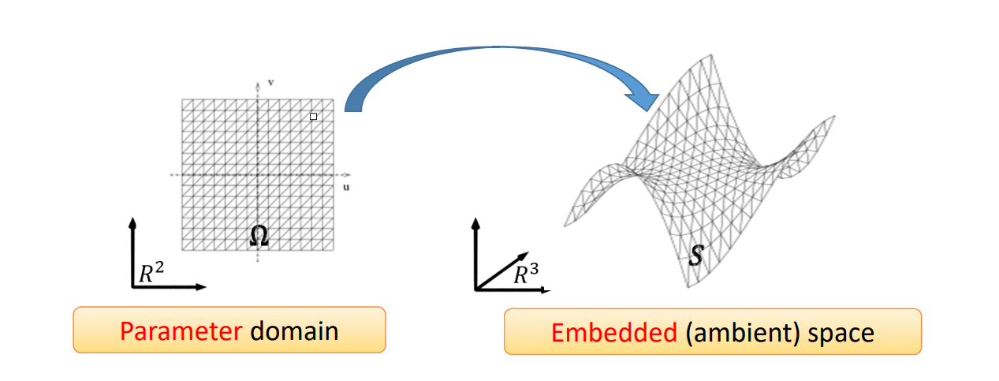    

# Parametric Surfaces    

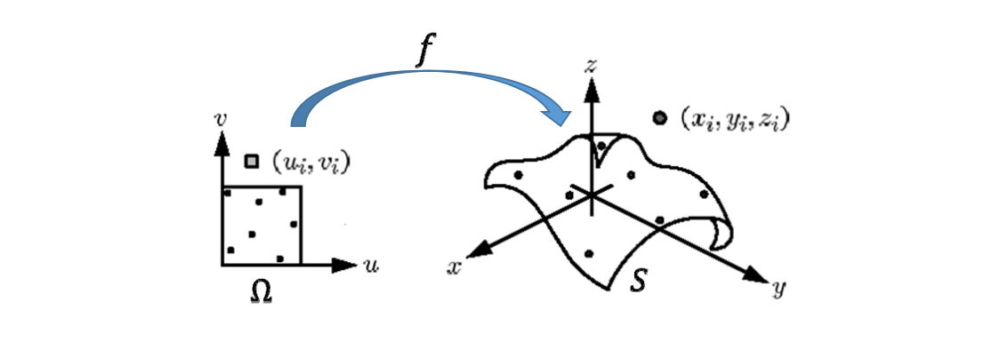    

$$
f:\Omega \to S
$$

$$
(u,v)\to \begin{cases}
 x= x(u,v),\\\\
 y= y(u,v),  \\\\
 z= z(u,v),
\end{cases}
$$

# 曲面展开（参数化）   

    

# 参数化：将曲面展开成平面    

* 每个3D顶点(\\(x,y,z\\))对应一个2D点(\\(u,v\\))    
• (\\(u,v\\)) 称为 (\\(x,y,z\\)) 的参数（2D流形曲面的本征维数）    

    

    
# 但，球面是不可展的，必有形变    

    

> 思考：   
1.地图上的两点之间的距离是真实距离吗？哪些地方的距离可信度更高？    
2.地图上看，哪些区域的面积被放大了？    

# 传统横板地图    

    

沿经线切开    

# 新型竖板地图    

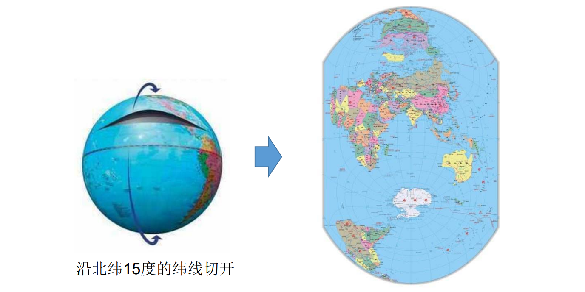    
   

# 北京‐纽约的最短路径   

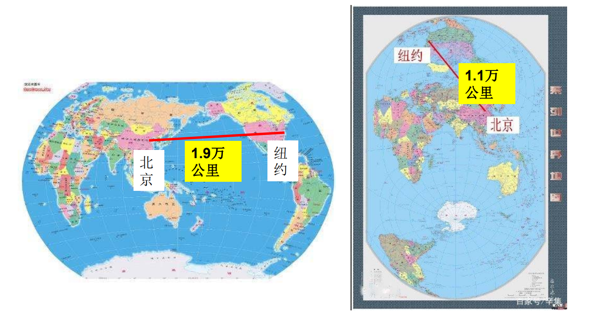    

# 参数化是几何处理中的基本问题    

* 提供了三维曲面每个点的一个二维参数     
• 本征维数参数      

* 在低维来处理高维问题，减少复杂度    
• 降维    

* 三维曲面之间的相关问题可通过参数化空间来处理      

# 给定边界的极小曲面    

• 如果边界刚好在一个平面上（共面）？    

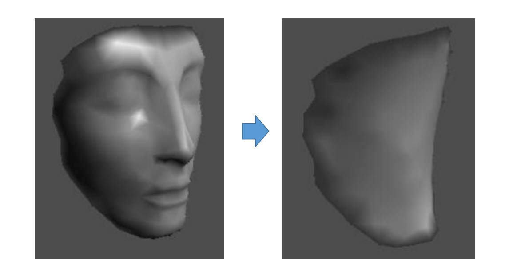    

# 将边界映射到平面的凸多边形上    [Floater 97’]

• Fixing the boundary of the mesh onto   

    

M. Floater. Parametrization and smooth approximation of surface triangulations. CAGD, 1997.    
<http://www.cs.jhu.edu/~misha/Fall09/Floater97.pdf>    

# 方法：求解稀疏方程组   

    

\\(\Rightarrow\\) Forming a sparse linear system    

# Tutte’s Method: Why it Works   

 - Theorem [**Tutte**,63], [Maxwel,1864] :     
    - If G=<V,E> is a 3‐connected planar graph (triangular mesh) then any barycentric embedding provides a **valid** parameterization    

    

> 如果边界位于凸多边形上，则三角形一定不会发生翻转！   
 

# 参数化：操作步骤    

• 检测边界    
• **将边界映射到正方形边界或圆边界（凸边界）**   
• 构建稀疏方程组    
• 求解稀疏方程组    
• 更新顶点坐标    
• **连接纹理图像，更新显示**    

# Floater参数化方法   [Floater 97’]

• Uniform parametrization    
• Weighted least squares parametrization    
• Shape‐preserving parametrization    

• 如何判断哪个参数化方法更好？    

M. Floater. Parametrization and smooth approximation of surface triangulations. CAGD, 1997.      
<http://www.cs.jhu.edu/~misha/Fall09/Floater97.pdf>   

# 曲面展开（参数化）   

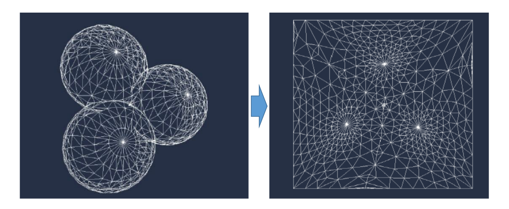    

# 纹理映射   

    

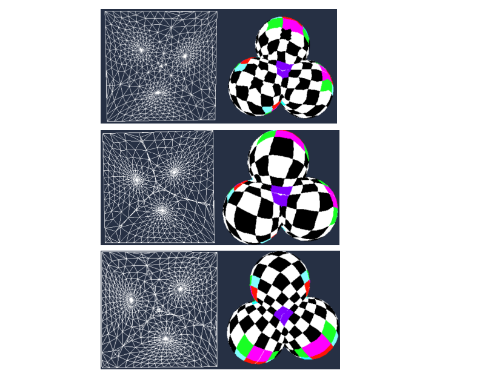    

# 例子   

    

# Parameterization    

    

# 曲面纹理的保存：2D图像   

    

# 参数化应用：纹理映射    

    

# Constrained (Feature‐Preserving)
# Global Laplacian Smoothing

# Shrinkage    

• Global Laplacian smoothing results in shrinkages    

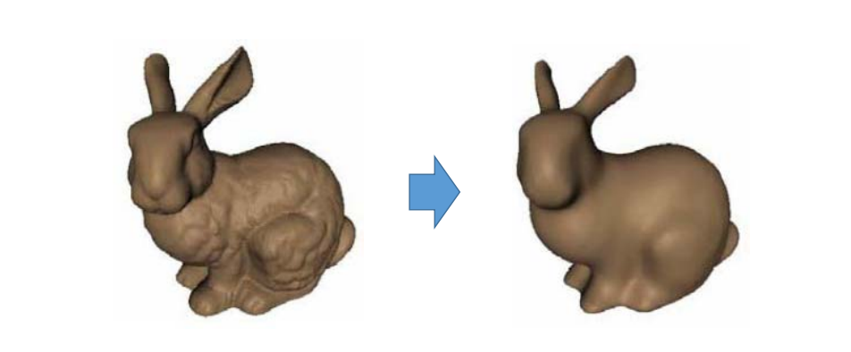    

# Ideas: add constraints    

* 如何处理各种约束条件？    
• 顶点约束、面约束…    

    

# Soft Lapacian Smoothness    

 - Interpolation (hard constraints) \\(\to\\) Approximation (soft constraints)    

    

$$
L(\nu_i)=\nu_i-\sum _ {j\in N(i)}w_{ij}\nu_j = 0
$$

# Laplacian of Mesh   

• Discrete Laplacians

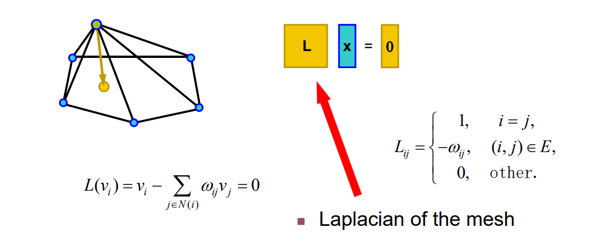    

# Laplacian of Mesh   

• Surface reconstruction    

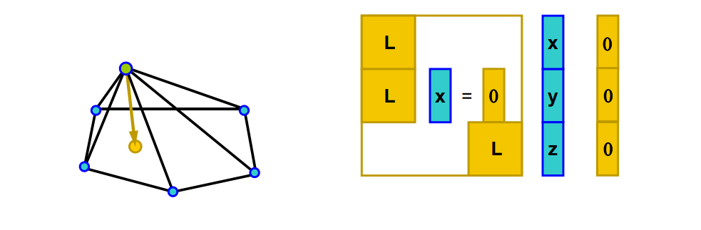    

$$
L(\nu_i)=\nu_i-\sum _ {j\in N(i)}w_{ij}\nu_j = 0
$$

# Properties of Laplacian    

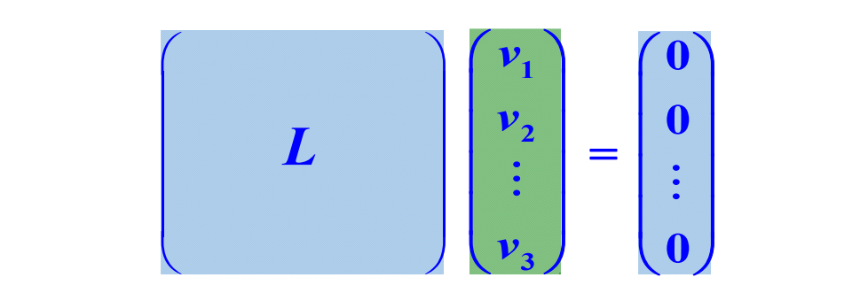    

$$
Rank(L) = n-k
$$

&#x2705; k is the number of connected components of the mesh    
&#x2705; Need to add some constraints     

# Vertex Constraints     

• Add position constraint for one vertex     

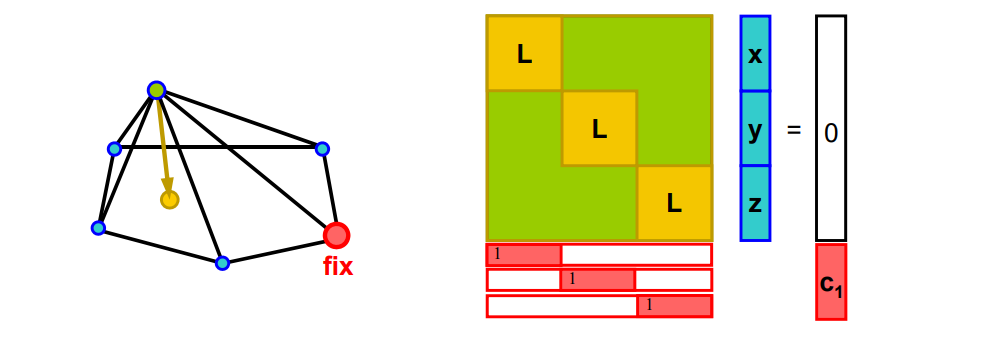    

# Vertex Constraints    

• Add position constraints for more vertices    

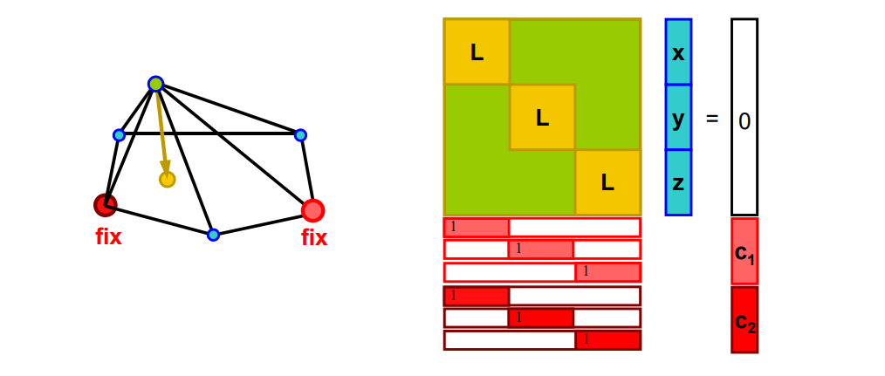    

# Adding Vertex Constraints    

\\(\min _{{X}'} \\){\\( ||L{X}' ||^2+\mu ^2\sum _{i\in C}|{\nu }'_i -\nu_i|^2\\)}

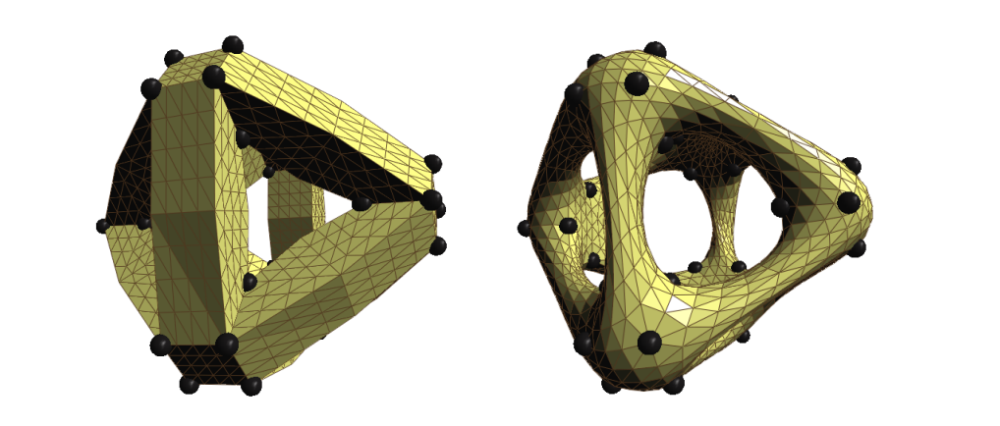    

# Face Constraints    

    

# Adding Face Constraints    

    

# Other Constraints    

• Edge constraints   

    

• 1‐ring barycenter constraints    

    

• Other linear constraints    

# Minimizing Energy    

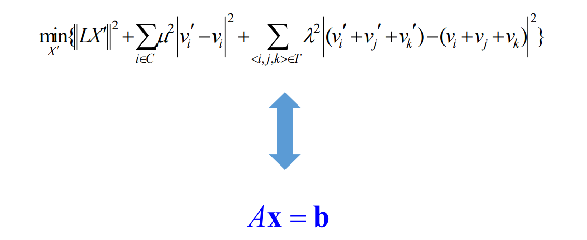    

# Least Square Solution    

• An over‐determined system:   

$$
AX = b
$$

• Normal equation:   

$$
A^TAX = A^Tb
$$

$$
X = (A^TA)^{-1}A^Tb
$$

# One Channel Solution    

• Very efficient solution by Cholesky factorization of \\(A^TA\\):

$$
A^TA = R^TR
$$
R is upper‐triangular and sparse     
Once R is computed, solving for x, y, z by back‐
substitution:    

$$
R^Tξ = A^Tb
$$

$$
RX = ξ
$$

# Results   

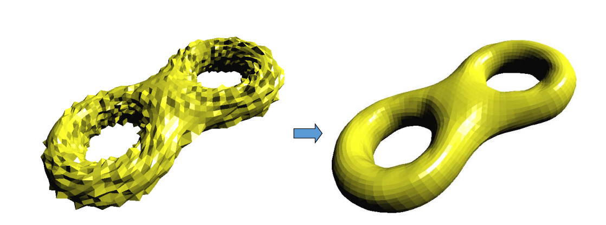    

**‘8’-like mesh model    
3070 vertices, 6144 triangles**

# Results   

    

# LoD Smoothing    

    

Applying our algorithm to the bunny model with different parameters.    

# Laplacian Editing     
[Sorkine et al. SGP 2004]

# Cardinal Coordinates    

• (x,y,z) coordinates    

> v 1.5 -0.960751 -1.2232    
  v 0.81 -0.891238 -3.74258   
  v 0.16 -0.233535 -2.28405    
  v 1.49 -2.44325 -3.6962   
  v 1.59 -2.98815 -4.15761   
  v 1.66 -2.81016 -4.10777    
  v 1.41 -1.14861 -1.92823   
  v 1 -1.40023 -3.80159   
  v 0.88 -1.33122 -3.83517  
  v 1.69 -2.60816 -4.12133   
  v 1.68 -2.36516 -4.13078   
  …    

    

**Pros and Cons?**

# What’s are Details?    

• Detail = surface – smooth (surface)    
• Smoothing = averaging    

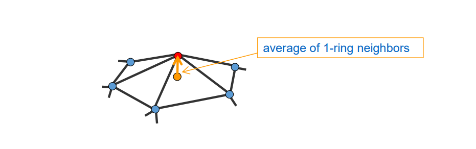    

# What’s the Difference?    

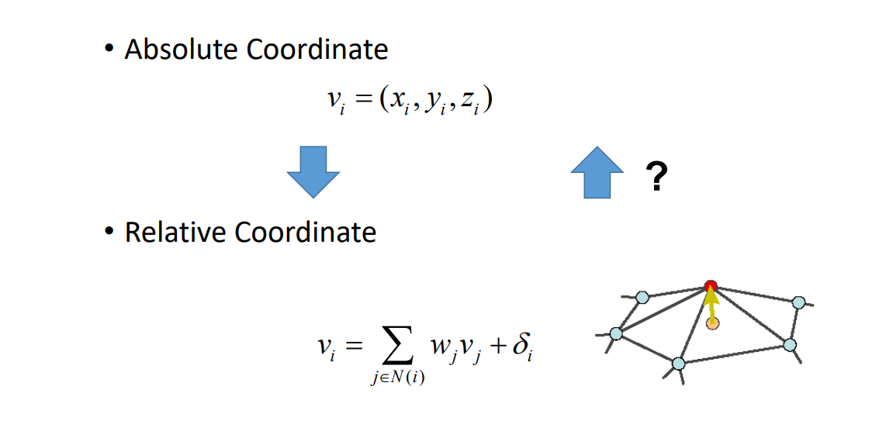    

# Laplacian Editing   

 - Local detail representation – enables **detail preservation** through various modeling tasks    
 - Representation with **sparse** matrices    
 - Efficient **linear** surface reconstruction    

    

# Editing framework     

 - The spatial constraints will serve as modeling constraints    
 - Reconstruct the surface every time the modeling constraints are changed   

Detail constraints: \\(LX=\delta \\)    
Modeling constraints: \\(x_j=c_j,j\in\\) {\\(j_1,j_2,\dots j_k\\)}    

# Direct Detail Preserving     

    

# Rotation Transformation   

    

$$
\begin{pmatrix}b_1-b_i
 \\\\\vdots 
 \\\\b_N-b_i
\end{pmatrix}=\begin{pmatrix}a_1-a_i
 \\\\\vdots 
 \\\\a_N-a_i
\end{pmatrix}R_i
$$

# Reconstruction    

• Soft constraints     

$$
L^TLv=L^T\delta 
$$

    

# Variational Viewpoint    

• Laplacian Approximation    

$$
\tilde{X} =\underset{X}{argmin} (||LX-\delta ^{(x)}||^2+\sum _{j\in C}w^2||x_j-c_j||^2).
$$

• Gradient Approximation    

$$
\underset{\phi }{min} \iint _\Omega ||\nabla \phi -w||^2dA,
$$

# User Interfaces    

• ROI is bounded by a belt (static anchors)    
• Manipulation through handle(s)    

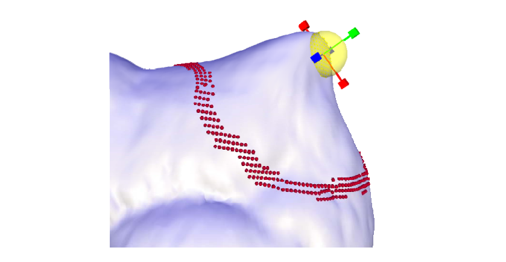    

# Results    

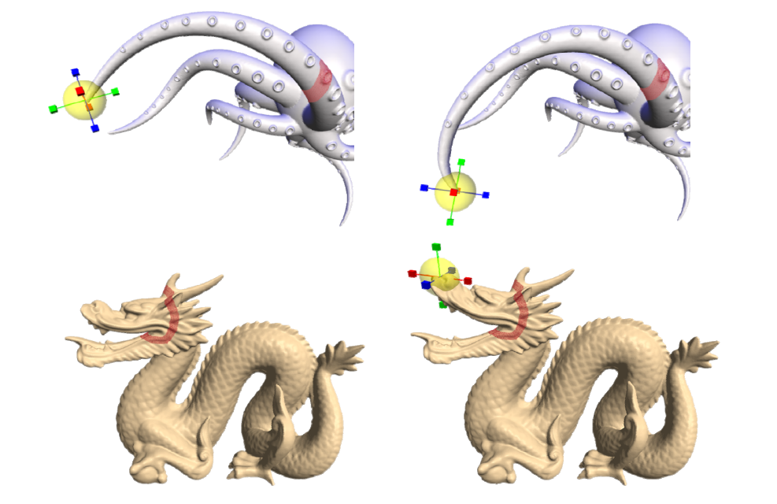    

# Detail transfer and mixing    
• “Peel“ the coating of one surface and transfer to 
another    

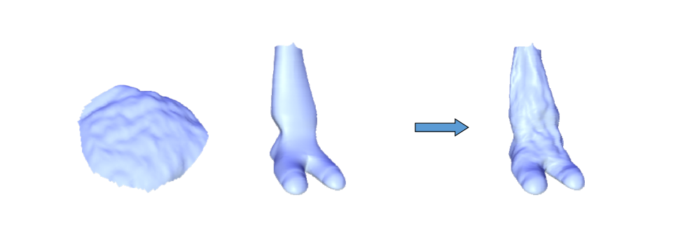    

# Detail transfer and mixing    

 - Correspondence:    

    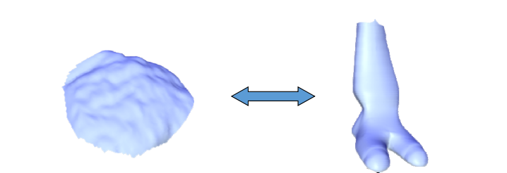    

    - Parameterization onto a common domain and elastic warp to align the features, if needed     

# Detail transfer and mixing    

• Detail peeling:    

    

$$
\xi _i=\delta _i-\tilde{\delta } _i
$$

# Detail transfer and mixing   

• Changing local frames:    

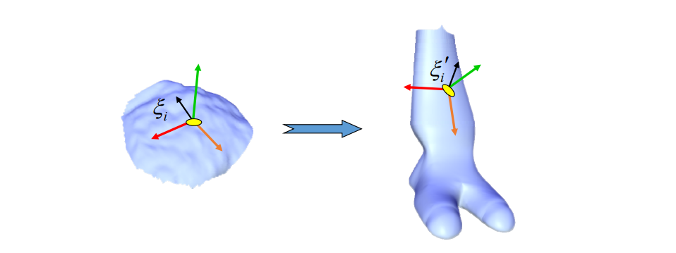    

# Detail transfer and mixing    

• Reconstruction of target surface from: \\(\delta _{target}\\)    

$$
\delta _{target} ={\delta}' _i+{\xi}' _i
$$

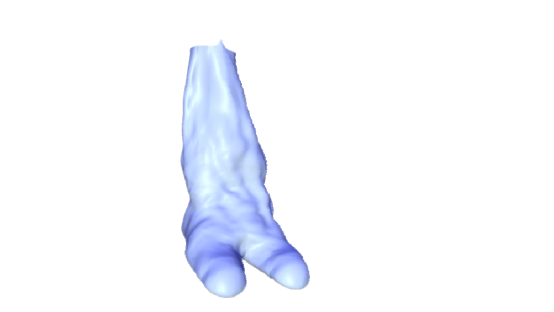    

# Examples    

    

# Examples    

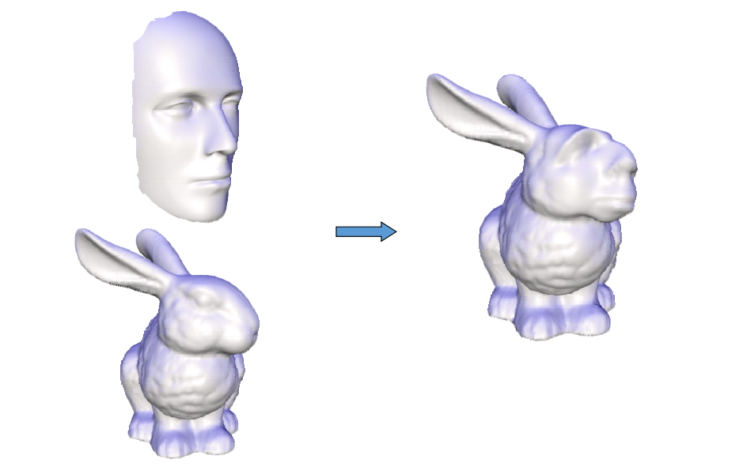    

# Mixing Laplacians    

• Taking weighted average of \\(\delta _i\\) and  \\(\delta ^‘_i\\)    

    

# Mesh transplanting   

* The user defines    
• Part to transplant   
• Where to transplant   
• Spatial orientation and scale    
* Topological stitching    
* Geometrical stitching via Laplacian mixing    

    

# Mesh transplanting    

• Details gradually change in the transition area    

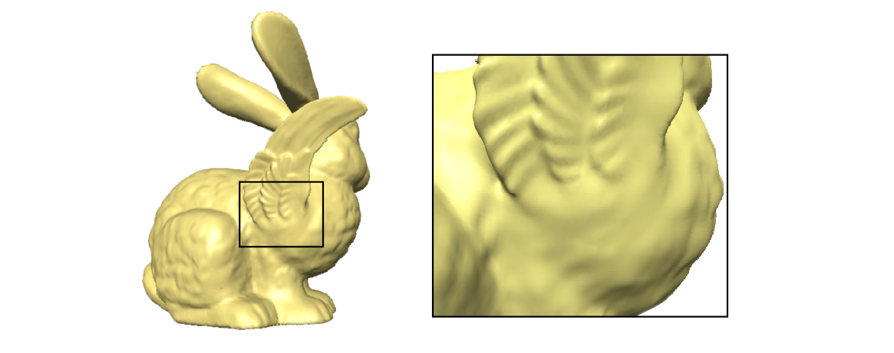    

