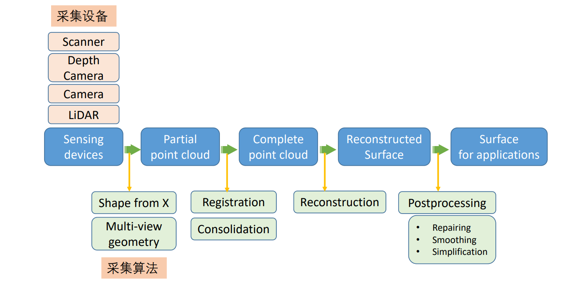
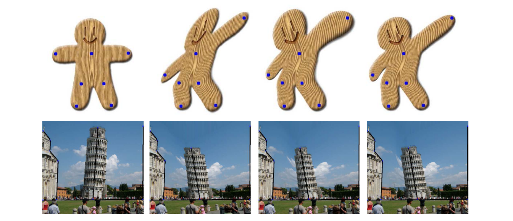
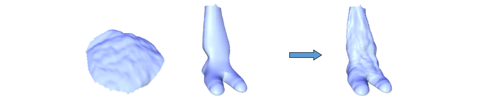
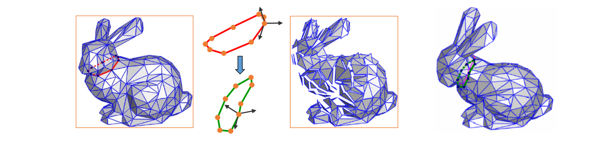

# 回顾：曲面重建   

     

# 建模(modeling)：设计与重建    

 - 曲面设计(Design)    
    - 不存在的物体：通过人工交互凭空设计出新的物体    
      - CAGD (NURBS)、mesh modeling    
     - 存在的物体：通过人工交互编辑修改构建出新的物体    
      - Editing, deformation    
 - 曲面重建(Reconstruction)    
    - 存在的物体：对其采集并进行数字化构建    
    - 也称为：逆向工程、扫描重建    
      - Reverse engineering, scanning    

# Design Modeling    

* Design from zero    
• Create a shape by a set of 3D design operators such as extrusion or revolution etc.    
* **Design from a given shape** (**Mesh editing**)    
• Select a base shape    
• Select editing elements and editing operators     
• Deform the shape to obtain a new shape    

# Mesh Surface Editing    

     

# Interactive shape modeling    

* Modeling is an interactive, iterative process    
• Tools need to be intuitive (interface and outcome)    
• Allow quick experimentation     
• Preserve shape properties     

     

# User Interaction (UI)    

* User specifications: Intuitive, easy‐to‐use    
• Dragging handles ‐‐ vertices, features, ROI, …    
* Deformed shape: adapt to user intents    

**Challenges**:
• Operations    
• Preservation of properties    
• Semantics    

     

# Methodology   

 - Set a proxy P for the input shape S    
    - P is simpler/easier/more semantic than S     
    - Find a map between P and S: S=g(P)    
      - g is also called an **embedded space**    
 - User interacts and deforms the proxy P to P’    
    - Find a deformation map: P’=h(P)    
 - Compute a new shape S’ from P’: S’=g(P’)    

> Key Problem:    
• find a good map *g*   

# Proxy Shapes (handles)    

* Points    
• Points, vertices, …    
* Lines/Curves    
• Sketches, skeletons, silhouettes, wires, …    
* Meshes    
• Bezier nets, lattices, cages, …    
* Other shapes    
• Deformation transfer: learning deformation from other shapes    

# 1. Point Proxy    

# Point based editing    

• Fix some vertices    
• Drag one or more vertices    

     

# User Interfaces    

• ROI is bounded by a belt (static anchors)    
• Manipulation through handle(s)    

     

> 本质数学问题：数据插值问题    

# Interpolation Problem    

$$
\begin{array}{l} 
 \min E (f) \\\\ 
  s.t. &f(x_i)=y_i,i=1,2,\dots , n \\\\ 
\end{array} 
$$

  

# 1.1 RBF‐based Editing       

  

# 1.2 Moving Least Squares Method    
[Siggraph 2006]   

  

# 1.3 Vector Field Based Deformations    
[Siggraph 2006]    

• Basic model: Moving vertex along the deformation orbit – defined by the path lines of a vector field v.    

  

• Given a time‐dependent vector field V(X,t), a *Path Line* X(t) in space is an integral.    

  

# Vector Field Selection    

* Deformation Request:    
• No self‐intersection    
• Volume‐preserving    
• Details‐preserving    
• Smoothness of shape in deformation    
* Divergence‐free Vector Field: \\(V=(V_1, V_2, V_3)\\)    

$$
div V=\frac{\partial V_1}{\partial x} +\frac{\partial V_2}{\partial y}+\frac{\partial V_3}{\partial z}=0
$$

# Piecewise Field for Deformation    

  

# Examples    

  

# 1.4 Laplacian Editing    
[Sorkine et al. SGP 2004]   

• Preserve local detail – Laplacian coordinates    
• Representation with sparse matrices    
• Efficient linear surface reconstruction       

  

$$
\nu _i=\sum _{j\in N(i)}w_j\nu _j+\delta _i
$$

# Variational Viewpoint    

• Laplacian Approximation    

$$
\tilde{X} =\underset{X}{argmin} \left ( ||LX-\delta ^{(x)}||^2+\sum _{j\in C}w^2||x_j-c_j||^2 \right ) 
$$

• Gradient Approximation    

$$
\min_\phi \iint _\Omega ||\nabla \phi -W||^2dA,
$$

  

# Editing framework    

• The spatial constraints will serve as modeling constraints    
• Reconstruct the surface every time the modeling constraints are changed    

Detail constraints:       \\( LX=\delta \\)     
Modeling constraints: \\(x_j=c_j,  j\in\\left \\{ j_1,j_2,\dots,j_k \right \\}\\)    

# Results     

  

# Detail transfer and mixing    

• “Peel” the coating of one surface and transfer to another   

    

# Mixing Laplacians     

• Taking weighted average of \\(\delta _i\\) and \\(\delta '_i\\)    

# Mesh transplanting    

* The user defines    
• Part to transplant    
• Where to transplant    
• Spatial orientation and scale    
* Topological stitching    
* Geometrical stitching via Laplacian mixing    

    

# Mesh transplanting   

• Details gradually change in the transition area    

# Mesh transplanting   

• Details gradually change in the transition area    

    

# Invariance – solutions   

 - Explicit transformation of the differential coordinates prior to surface reconstruction    
    - Lipman, Sorkine, Cohen‐Or, Levin, Rössl and Seidel [SMI 04], “Differential Coordinates for Interactive Mesh Editing”,    
      - Estimation of rotations from naive reconstruction    
 - Yu, Zhou, Xu, Shi, Bao, Guo and Shum [SIGGRAPH 04], “Mesh Editing With Poisson‐Based Gradient Field Manipulation”,     
    - Propagation of handle transformation to the rest of the ROI using geodesic distances    
 - Zayer, Rössl, Karni and Seidel [EG 05], “Harmonic Guidance for Surface Deformation”,     
    - Propagation of handle transformation to the rest of the ROI using harmonic functions     

# 1.5 Poisson Mesh Editing    
Yu et al. Mesh Editing With Poisson-Based Gradient Field Manipulation. Siggraph 2004.   

• **The representation**: the **gradients** of the functions **X, Y, Z** on each triangle of the mesh   
• **Deformation**: propagate the transformation of the handle onto the ROI using **geodesic distances**    

    

# Poisson editing – images   

• Inspiration: **Poisson Image Editing** [Pérez et al. 03]    

    

• Reconstruct a function from its gradients via the Poisson equation:     

$$
\underset{f}{\arg \min } \int_\Omega ||\nabla f-W||^2,s.t.f|_{\partial \Omega} =f^*|_{\partial \Omega}
$$

$$
\underset{f}{\arg \min } \int_{\Omega}\|\nabla f-\mathbf{w}\|^{2}, \quad
$$ 

s.t.   

$$
f|_{\partial \Omega}=f^{*}|_{\partial \Omega} 
$$

$$
\Downarrow 
$$

$$
 \Delta f=\operatorname{div} \mathbf{w} \quad  with  \left.\quad f\right|_{\partial \Omega}=\left.f^{*}\right|_{\partial \Omega} 
$$

Poisson images
2 * arg min , s.t. f
f f f 



 

w
* f ff div with 


  w
1.6 As‐rigid‐as‐possible Deformation
[Siggraph 2003]
1.7 ARAP Modeling
• Ask all star edges to transform rigidly by some 
rotation R, then the shape of the cell is preserved
[Sorkine and Alexa, As‐Rigid‐As‐Possible Surface Modeling. SGP 2007]
vi vj
1
vj
2
׳v
i v׳
j
1
׳v
j
2
Ri
2
1 ()
min ( ) ( )
n
i j ii j
i j Ni
R 
 
     
v
vv vv
.. , j j st j C v c  

ARAP Modeling
initial guess 1 iterations 4 iterations
• Keep a local frame at each vertex
• Prescribe changes to some selected frames
Local frame:
{ai, bi, ni}
1.8 Linear Rotation‐invariant Coordinates 
[Lipman et al. Siggraph 05]
Frame‐based deformations
• Encode the differences between adjacent frames
• Solve for the new frames in least‐squares sense
ai –
aj
=

1
ai +

2
bi + 

3
ni
bi –
bj
=

1
ai +

2
bi + 

3
ni
ni –
nj
=

1
ai +

2
bi +

3
ni
… … 
constraints
i
j
Frame‐based deformations
• Reconstruction:
• After having the frames, solve for positions
Frame‐based deformations
• Reconstruction:
• After having the frames, solve for positions
Results
2. Curve Proxy
User Specifications
• Line or curve features
2.1 Skeleton based
• Axial Deformation
Object Define an axis Deform axis Deformed object
[1994]
Axial Deformation
2.2 Sketching Deformations
[2005]
Sketching Deformation
Skeleton‐based Deformation
[2002]

2.3 Wires based
[Siggraph 1999]
• Silhouette sketching  Feature sketching Sketching a shape can be 
interpreted as inverse NonPhotorealistic Rendering 
 A sketch-based 
modeling interface 
which uses silhouettes 
and sketches as input, 
and produces contours, 
ridges and ravines
2.4 Silhouette sketching based
[Nealen et al. Siggraph 05]
Silhouette Sketching
• Approximate sketching
• Balance weighting between detail and positional constraints
Silhouette Sketching
• Approximate sketching
• Balance weighting between detail and positional constraints
2.5 Volumetric Graph Laplacian
[Zhou et al. Siggraph 2005]

Animation Modeling from 2D Cartoons
Short Summary: curve proxy
• Curve features
• Skeletons
• Silhouette
• Free‐form sketches
• Wires
• 2D image contours
•
…
3. Mesh Proxy
User Specifications
• Define a mesh proxy for the shape: generally a simpler, coarse 
mesh which encloses the shape
• The shape is embedded into the mesh proxy
• Deform the mesh proxy using point/line base methods
• Advantages: 
• You can deform arbitrary objects
• Independent of object representation
3.1 Free‐form Deformation (FFD)
• Proxy: a lattice mesh 
• more easily parametrized than the object
• Deformation defined by the tensor Bezier solid
[Sederberg et al. 86]
FFD Examples
3.2 Cage‐based deformation
• Proxy: cage
• Barycentric coordinates
• Many works…
[Ju et al. 2005]
3.3 Multiresolution Editing
• Proxy: simplified shape
• Pros
• Preserving details, scalable 
• Cons
• Instable reconstruction for 
large deformation
• Resampling problem 
• Invariant variables
• Detail information
[Kobbelt et al. 2003]
Decimation
Reconstruction
Editing
Short Summary: mesh proxy
• Lattice
• Cage
• Simplified shape
•
…
4. Deformation Transfer
Deformation Transfer
Siggraph 2004
Editing Arbitrary Deforming 
Surface Animations
Siggraph 2006
Deforming Surface
Editing Surface
5. Sketch‐based Modeling
（基于草图的建模）
An Example
B‐Mesh
[Ji et al. 2010]
B‐Mesh
[Ji et al. 2010]
Sketch‐based Modeling Systems
[Igarashi et al. 1999]
[Karpenko et al. 2006]
[Rivers et al. 2010]
More…
Sketch2Scene [Xu et al. 2013]
Sketch‐to‐Design [Xie et al. 2013]
6. Sculpturing Modeling
Highly Detailed Meshes
Motivation: Sculpturing
Sculpturing Modeling
• A series of sculpting/brush operators
Sculpting Modeling Tools
Mudbox
3D Coat
Zbrush
3D Brushes
Sculpting Modeling
Summary: Shape Editing
• Points
• Points, vertices, …
• Lines/Curves
• Sketches, skeletons, silhouettes, wires, … 
• Meshes
• Bezier nets, lattices, cages, …
• Other shapes
• Deformation transfer: learning deformation from other 
shapes
• Physically‐based shape deformation (*)
• Material‐based, FEM, simulation
Data‐Driven Modeling
三维几何模型数据库
1. Modeling by Examples
1. Segment into parts
2. Search 3D database for parts
3. Compose parts into a model
[Funkhouser et al. Siggraph 2004]
Modeling by Examples
1. Segment into parts
2. Search 3D database for parts
3. Compose parts into a model
[Funkhouser et al. Siggraph 2004]
2. Probabilistic Reasoning
• Design space 
[Chaudhuri et al. Siggraph 2011]
2. Probabilistic Reasoning
• Exploring the design space 
[Chaudhuri et al. Siggraph 2011]
3. ShapeSynth: 
Exploration as Design Tool
[Averkiou et al. Siggraph 2014]
4. Photo‐inspired Modeling
[Xu et al. Siggraph 2012]
Examples
5. Primitive‐based Modeling
Chen et al. 2013
6. Shadow Guidance Fan et al. 2013
ShadowDraw [Lee et al. 2011]
6. Shadow Guidance Fan et al. 2013
7. Learning Generative Models of 
3D Shapes (3D‐GAN)
• Emergence of various 3D‐GANs for shape generation
Chinagraph 2020 Key note talk by Hao Zhang:
https://www.bilibili.com/video/BV1Pa4y1x7au?p=3
Chaudhuri, et al. Learning Generative Models of 3D Structures. Computer Graphics Forum (Eurographics STAR), 2020.
Shape Morphing
Shape Morphing
• Given two objects produce sequence of 
intermediate objects that gradually evolve from 
one object to the other
• Interpolate object shapes
• Interpolate object attributes
• Color, texture, normal, etc.
Applications
Shape Transformations
• Warping: Unary Op
• Given Object A and F(t), find Object B
• Morphing: Binary Op
• Given Object A and Object B, find F(t)
A
? F(t)
A
?
B
Terminologies
• Morphing
• Metamorphosis
• Shape blending
• Shape averaging
• Shape interpolation
• Shape transition
Rules for Good Morphing
• Natural
• Keep as much as possible of the two shapes during the 
transformation
• Volume, curvature, area, etc...
• Subjective aesthetic criteria
• User control
• intuitive
• not too heavy
• can be adapted to user's knowledge
Morphing
• Input: two meshes source & target
• Frames at t0 and tn
• Output: sequence of intermediate meshes
• Frames t1 to tn‐1
• Intermediate mesh:
• For each point on source/target model specify location 
at time ti consistent with source & target
Morphing: Two Sub‐Problems
• Correspondence problem
• Compatible meshes
• For each point on source/target meshes 
find corresponding point on second mesh 
= Parameterization
• Path problem
• Inbetween shapes
• Specify trajectory in time for each point
• For mesh 
– specify vertex trajectory
vertex-to-vertex
triangle-to-triangle
1. Vertex Correspondence 
• Compatible meshes (consistent meshes, inter‐map)
• Each vertex on source mesh mapped to vertex on target (and vice
versa)
• Have common connectivity
Homogeneous models Heterogeneous models
Separate sampling Different geometries
Challenges
Correspondence: Parameterization
• To compute map between source mesh S and  target mesh T parameterize both on common  domain D:
• Common domain options
• 2D patch(es) 
– works for genus 0 + boundary
• Use convex boundary (why?)
• Sphere
• Base mesh
1.1 Parameterization: Planar domain
1.1 Parameterization: Planar domain
1.1 Parameterization: Planar domain
1.2 Parameterization: Sphere domain
1.3 Parameterization: Base mesh
• MAPS
Lee et al. 1999
1.3 Parameterization: Base mesh
1.3 Parameterization: Base mesh
1.4 Decomposition Based
[Shlafman et al. 2002]
1.5 Component Based
[Zhao et al. 2003]
Overlaying-based
[Schreiner et al. 2004]
Common domain-based
[Aigerman et al. 2014] [Aigerman et al. 2015] [Aigerman et al. 2016] [Mandad et al. 2016]
[Kraevoy et al. 2004]
Subdivision-based
[Kwok et al. 2012]
1.6 Many Recent Works
1.7 Error‐Bounded Compatible Remeshing
• Optimization based method
Yang et al.  Error‐Bounded Compatible Remeshing. Siggraph 2020.
Stage 2
Edge‐based
compatible
remeshing
Increase
target
edge length
Is angle
too small?
Stage 1
Cut
construction
Boundary‐
to‐interior
compatible
remeshing
Is
error‐bounded?
Adjust
target
edge length
N
o
Input
Intermediate
result Output
Relaxing complexity Reducing mesh complexity
1.7 Error‐Bounded Compatible Remeshing
Yang et al.  Error‐Bounded Compatible Remeshing. Siggraph 2020.
1.8 Different Topologies
[DeCarlo et al. 1996]
1.8 Different Topologies
[DeCarlo et al. 1996]
More: Correspondences between 
planar shapes – Matching 
• Physically Based Method  [Sederberg et al. 1992]
More: Correspondences between 
planar shapes – Matching 
• Curve Aligning [Sebastian et al. 2003]
More: Correspondences between 
planar shapes – Matching 
• Perceptually Based Method [Liu et al. 2004]
2. Vertex Path (Trajectory)
• Input:
• All vertices on source & target have 
one‐to‐one correspondence with 
each other
• Each vertex has two 3D coords vFc1
(source) and vFc2 (target)
• Output: generate the intermediate 
shapes from two shapes
Simplest Method: Linear Interpolation
• Linear interpolation between corresponding points
• Work well for many cases
• many drawbacks
Linear Interpolation
• Simple and easy
• Drawbacks
• Shrinkage
Unnatural Results in 
Linear Interpolation
Intrinsic Approach
• Intrinsic variables
• edge lengths 
• turning angles
Sederberg et al. 1993
Fourier Approach
Chen et al. 2001
Wavelet Approach
• Wavelet decomposition Zhang et al. 2000
Star Skeleton Representation
[Shapira et al. 1995]
Interior Based Approach
• Based on compatible triangulation
• [Gotsman and Surazhsky, 1999‐2001]
• As‐rigid‐as‐possible [Alexa et al. 2000]
Morphing between Different Topologies
Liu et al. 2005
Implicit Approaches
• Construct a 4D function which interpolates two shapes (with 
iso‐value 0 and 1 respectively)
Distance Field
• Distance field of a shape
[Cohen-Or et al. 1998]
Distance Field
Variational Implicit Function
[Turk et al. 1999]
Examples
Polymorph: 
Morphing between multiple shapes
Summary
3D content creation is still hard
• One of the most central and challenging problems in graphics
• (Comparing to simulation and rendering)
Challenges to Geometric Modeling
• Modeling porous structure
• Modeling non‐homogeneous materials
• varying density
• changing composition
• multiple phases (solid, liquid)
•
…
生物多孔组织 多孔泡沫 微胞腔结构
谢 谢！