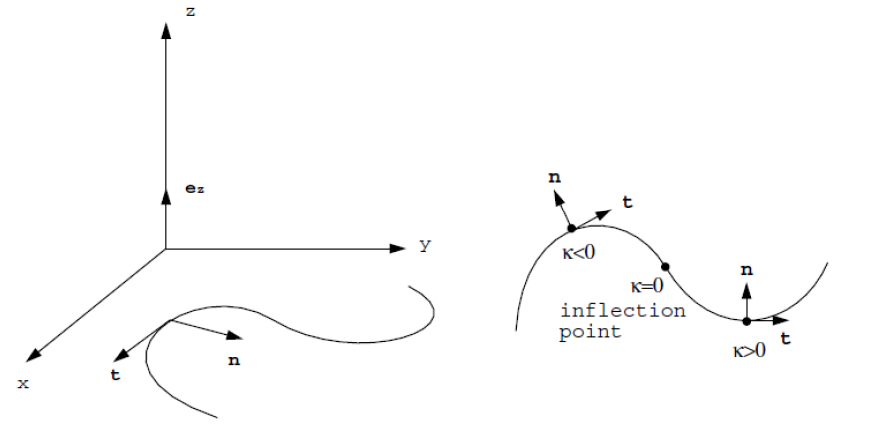
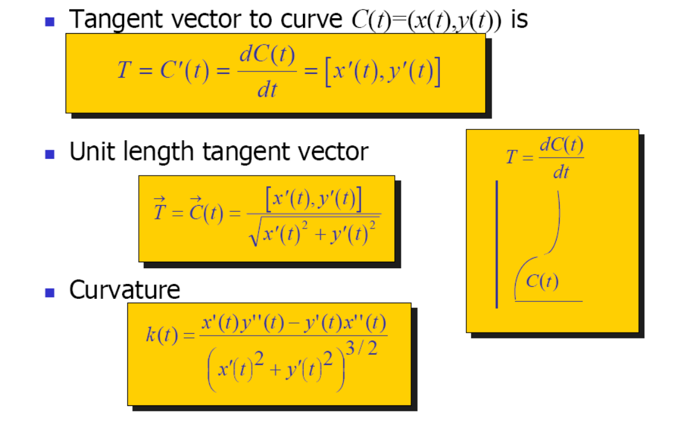
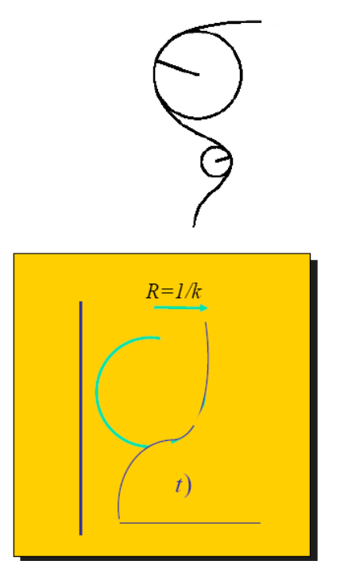

# 曲线的微分几何   

# 单参数曲线的切线和法向   

曲线：

$$
r=r(t)=(x(t),y(t)),t\in [0,1]
$$

切线：     

$$
t=r′(t)=(𝑥′(t),𝑦′(t))
$$   

* 法线\\(n\\)     

  

# Curves    

  

# Curve Curvature     
 - Curvature is **independent** of parameterization    
     - \\(C(t),C(t+5),C(2t)\\)have same curvature (at corresponding locations)   
 - Corresponds to radius of osculating circle R=1/k      
 - Measure curve bending   

    

> 曲率：由线上一点的二阶密切圆半径的倒数，即\\(k=\frac{1}{R} \\)    
曲率是与参数化无关的量     

本文出自CaterpillarStudyGroup，转载请注明出处。
<https://caterpillarstudygroup.github.io/GAMES102_mdbook/>