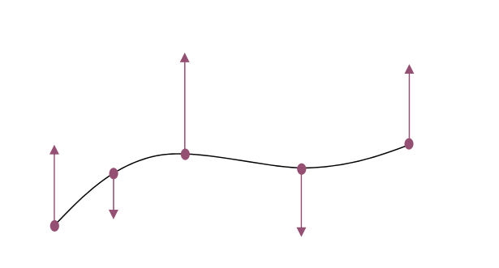
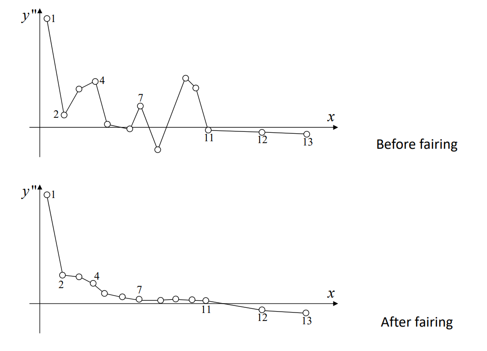
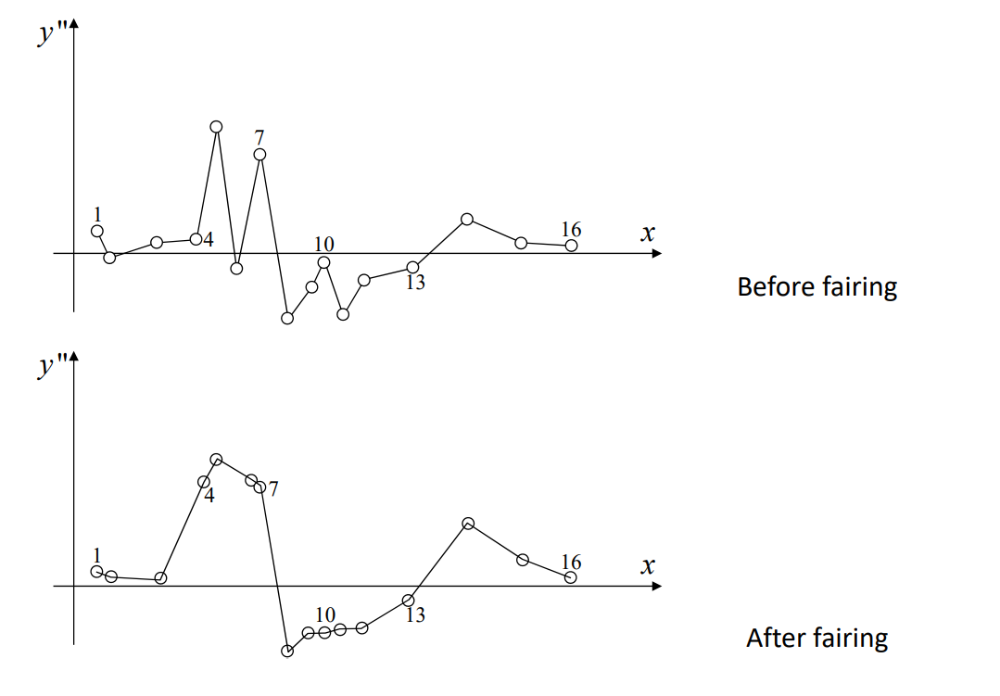
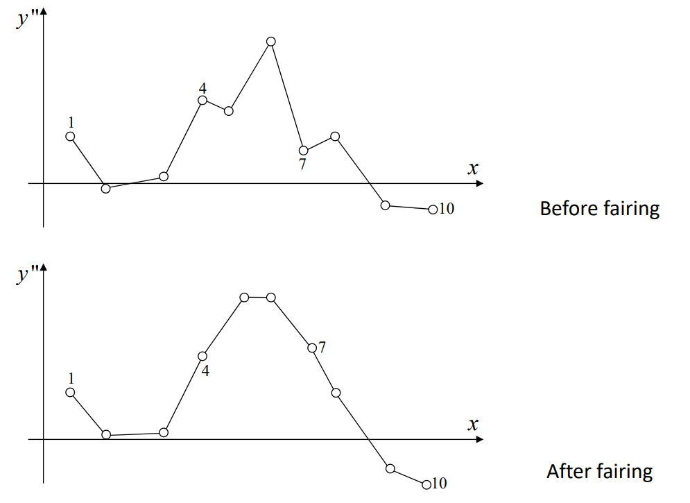
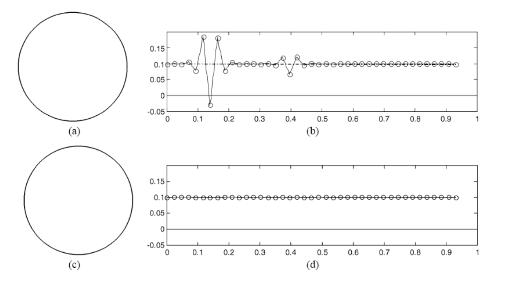
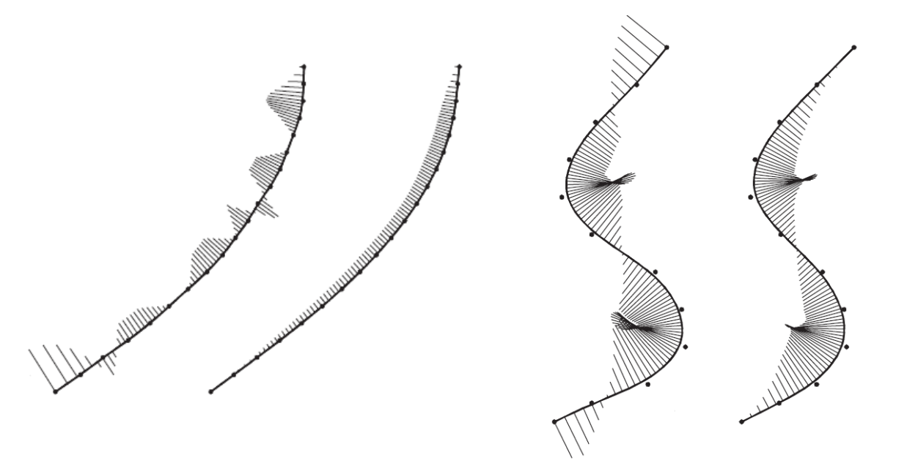
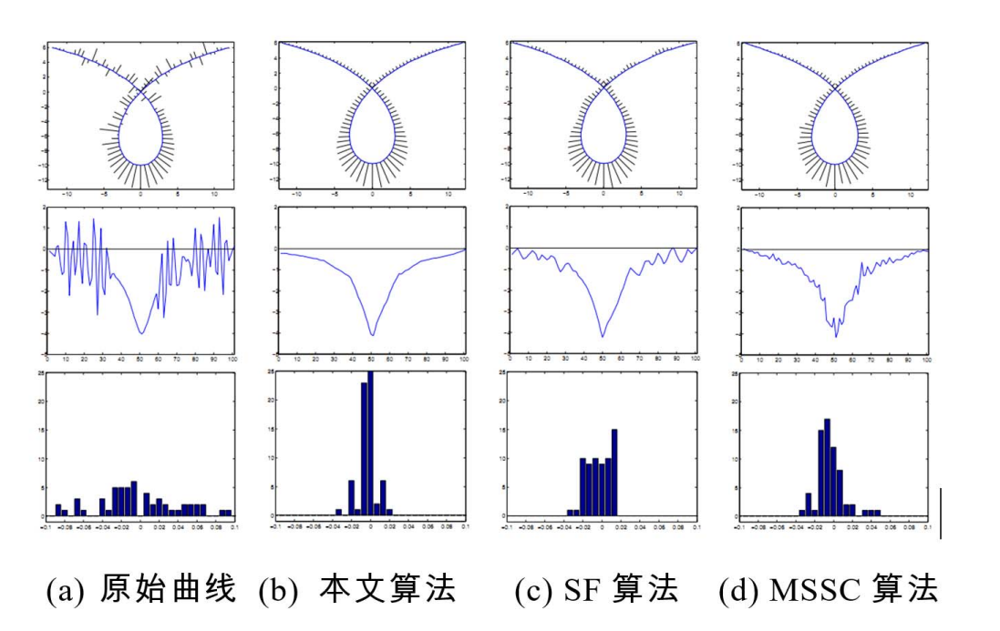
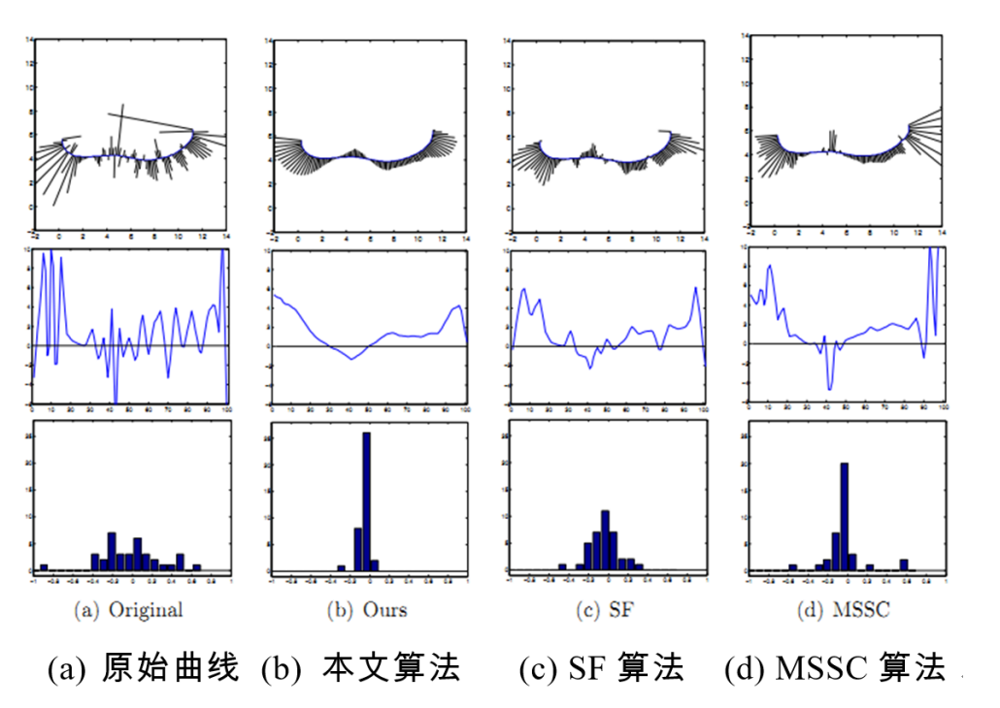
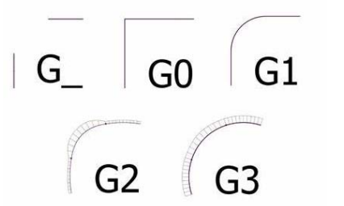
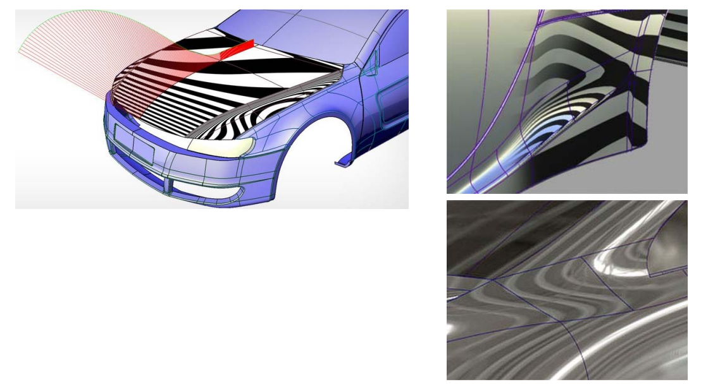

# 曲线的光顺方法    

# 函数型3次样条曲线   

* 小扰度假设     
• 转角不大于60°     
* \\({y}' (x)\ll 1 \\)       
* \\({y}'' (x)\approx k(x)\\)      

  

> \\({y}' \ll 1⇒  曲线的转角不会太大，此时 y"(x)=K(x)\\)    
[?]  \\(y"\\)不就是\\(K\\)吗？为什么需要这个前提条件？     
工业界做高精设备时才需要考虑光顺。   

# 曲线的光顺方法    

• \\(C^1\\) continuous     
• Decrease jump amplitude of curvature      
• Decrease the first vibration number \\(R\\)     
• Decrease the second vibration number \\(S\\)     

# Steps    

• Coarse fairing     
• Basic fairing      
• Fine fairing      

# Step 1. 初光顺     
* 定界法    
• Adjust the positions of control points    
• Decrease the jump amplitude of curvature     
• Remove some unwanted inflections     
* Physical approach    

# Step 2. 基本光顺    

* 卡尺法     
• Adjust the positions of control points    
• Remove other redundant inflections    
• Decrease the first vibration number \\(R\\)      
* Geometric approach      

# Step 3. 精光顺    

* 回弹法     
• Check the signs of shear force at control points     
• Adjust the change numbers of shear force     
• Decrease the second vibration number \\(S\\)      
* Physical approach     

# Example 1    

   

# Example 2    

  

# Example 3    

  

# 光顺结果   

  

# 光顺结果    

  

# B样条曲线的光顺方法    

• 基于稀疏优化的光顺优化方法     

$$
\min_{\tilde{d} } ||e(\tilde{d} )||_1
$$

$$
s.t.||(\tilde{d} )-d||_\infty \le \varepsilon 
$$

曲率的二阶差分向量\\(e\\). 计算公式如下：

$$
e_i=\frac{C_{i+1}-C_i}{t_{i+1}-t_i} -\frac{C_{i}-C_{i-1}}{t_{i}-t_{i-1}},i=1,\cdots ,n-3 
$$

**王士玮等，基于稀疏模型的曲线光顺算法，计算机辅助设计与图形学学报，2016.**      

# 光顺结果及比较    

  

# 光顺结果及比较    

  

# 曲面的光顺   

* 无严格定义    
• 工业界：Class A曲面（Dassault CATIA ）  

  

  

• 方法1：三向曲线光顺     
• 方法2：能量法     

# 光顺曲面    

  
