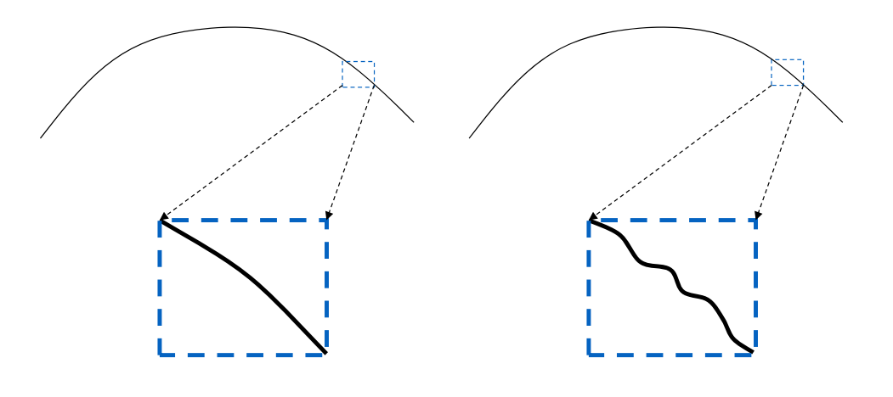
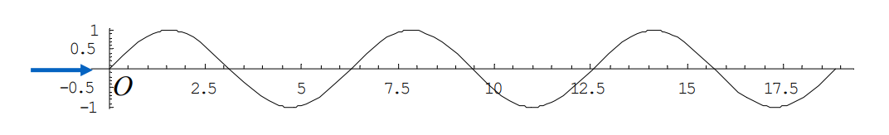
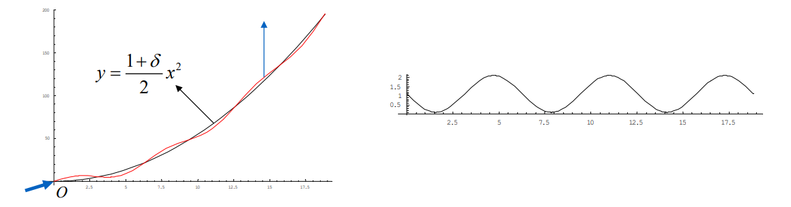
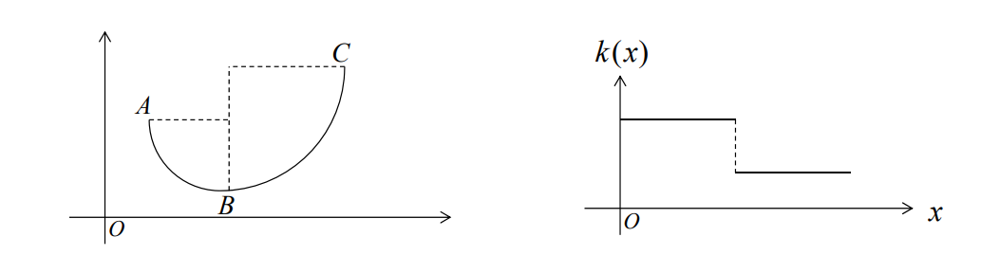

# 从曲线的曲率图的直观理解    

 

> 看上去光滑的曲线，放大后发现是凹凹凸凸的（右）

**Fairing Design is Important!**    

• Shoe sole    
• Cam profile    
• Ship hull：船的表面光顺可以减小水的阻力。    
• Car profile    
• Plane profile    
• …     

# 光顺的定义

## 为什么光顺难以定义    

光顺是一种微观的性质，很难描述  
是否光顺取决于人的主观和经验  
没有明确的数学定义  
没有客观的测量方法   

## 光顺的参考定义     

1. [Su and Liu 1978]       
- \\(C^2\\) continuous  
- curvature plot is free of any unnecessary variation  
  例如： the distribution of curvature must be as uniform as possible.     
2. [Farin and Sapidis, 1989]      
- curvature plot consists of relatively few 单调段（monotone pieces）    
3. [Farin 2002]     
- curvature plot is continuous
- curvature plot consists of only a few monotone pieces.     
4. [Roulier and Rando, 1994]     
- \\(C^2\\) continuous
-  minimizes the integral of the squared curvature with respect to arc length    

$$
\int _ck^2ds=MIN
$$

> 这是用整条曲线的能量来定义，是全局面定义法。    

## Observations of Fairness     

* Neither a global problem nor a local problem, but a  large local problem      
• Not an energy minimization problem    
* Need not \\(C^2\\) continuous     
• Circular spline      
* Intimately related to uniform distribution of curvature     
• Curvature is a “magnifier” of the curve fairness      

> 不能用\\(\int K^2=MIN\\) 来定义，有可能k不大，但频繁挠
动，仍不算光顺。   

### Example 1    

$$
y=\sin x, x\in[0,6\pi]
$$

    

The curve is \\(C^\infty \\)，但并不光顺  
原因：拐点（vibration）数太多    
拐点即 from convex to concave or from concave to convex     

### Example 2   

$$
y=\frac{1+\delta }{0} x^2+\sin x,x\in [0,6\pi ],\delta >0
$$

    

$$
{y}'' =1+\delta -\sin x > 0
$$

The curve is \\(C^\infty \\)且一直在递增无拐点，但仍不光顺  
原因：\\(y''\\)有太多振荡。    

### Example 3    

  

The curvature function \\({y}''(x) \\)不满足G2连续。  
\\(k_1\\)与\\(k_2\\)变化不大时光顺。  
原因：\\({y}''(x) \\) has large amplitude at discontinuity point.

> 不满足\\(C^2\\)连续，但光顺，因此\\(C^2\\)不是必须的。    

## 曲线的光顺的“新定义”     

一条曲线是光顺的，如果     
（1）它是\\(C^{l+1}  ( l > 0 )\\)连续的；    
（2）它的曲线本身拐点较少；     
（3）它的曲率图的拐点较少；    
（4）它的曲率图变化的振幅相对小。    

> 说明 1： 条件(1)中的 \\(C^{1+l}\\) 是要求曲线为 \\(C^{1}\\) 连续而不必\\(C^{2}\\),但\\(C^{1}\\)的导数满足有界变差。条件 (4) 则要求曲线在曲安非连续点处的跳跃要尺尽可能小。     
说明 2： 满足 (2)和(3)描述的曲线的它的曲率图含有的单调段都会相对少。这与前面所述的判 别准则 1-4 一致。
> &#x1F4A1; 光顺很难定义，为什么一定要给它一个定义？因为定义代表了一个明确的标准，在同一个标准下讨论问题才有意义。

# Remarks   

震荡数 Vibration：Change from convex to concave or change from concave to convex     
一阶震荡数 First vibration number \\(R\\)：Vibration number of \\(y(x)\\)     
二阶震荡数 Second vibration number \\(S\\)：Vibration number of curvature function     

本文出自CaterpillarStudyGroup，转载请注明出处。
<https://caterpillarstudygroup.github.io/GAMES102_mdbook/>

