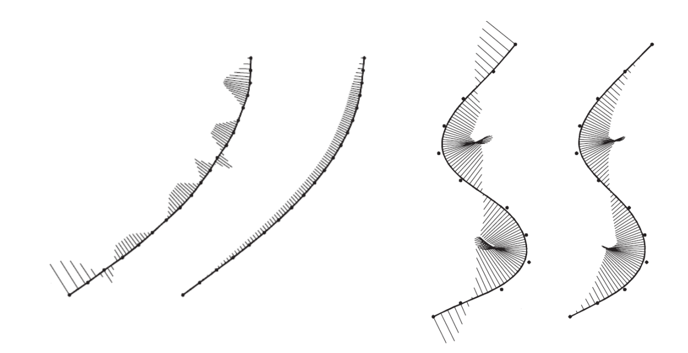
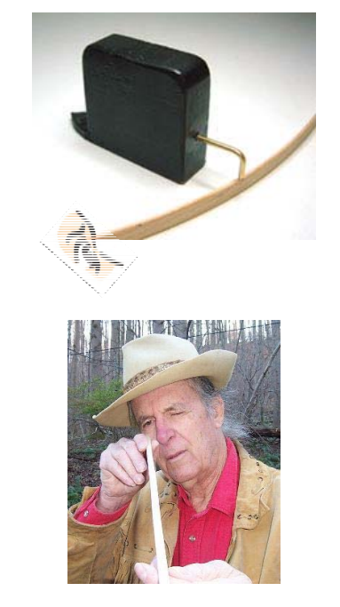

# 曲线的光顺定义    

# Geometric Design: Two Phases    

 - Shape design and modeling (Macro)     
 - Fairing design and modeling (Micro)     
    - A post‐processing after shape design     
    - Less well studied    
       - Difficult problem     
       - Lack of solid theories   
       - Far from solved      

# 曲线的曲率图    

    

# Why fairing curves?    

    

# Fairing Design is Important!     
• Shoe sole    
• Cam profile    
• Ship hull    
• Car profile    
• Plane profile    
• …     

    

# Why Difficult?     

* A subjective concept     
• The subtle bumps, wiggles, and inflection points of a curve      
• Related to human perception    
• Dependent on designer’s experience    
* A difficult task     
• Examining the curves by eye!    
• No objective measures    
• Cannot do it mathematically    

    

# Some ‘Definitions’ of Fairness     

* [Su and Liu 1978]       
• A curve is fair if it is \\(C^2\\) continuous and its curvature plot is free of any unnecessary variation, i.e., the distribution of curvature must be as uniform as possible.     
* [Farin and Sapidis, 1989]      
• A curve is fair if its curvature plot consists of relatively few 
monotone pieces.    
* [Farin 2002]     
• A curve is fair if its curvature plot is continuous and consists of only a few monotone pieces.     
* [Roulier and Rando, 1994]     
• A curve is fair if it is \\(C^2\\) continuous and minimizes the integral of the squared curvature with respect to arc length    

$$
\int _ck^2ds=MIN
$$

# Observations of Fairness     

* Neither a global problem nor a local problem, but a  large local problem      
• Not an energy minimization problem    
* Need not \\(C^2\\) continuous     
• Circular spline      
* Intimately related to uniform distribution of curvature     
• Curvature is a “magnifier” of the curve fairness      

# Example 1    

$$
y=sin x, x\in[0,6\pi]
$$

    

* The curve is \\(C^\infty \\)    
* The curve is not fair as the eye is very uncomfortable while 
viewing from point O       
* Reason     
• It has too many inflections (vibration numbers)    
(One vibration: from convex to concave or from concave to convex)     

# Example 2   

$$
y=\frac{1+\delta }{0} x^2+\sin x,x\in [0,6\pi ],\delta >0
$$

    

$$
{y}'' =1+\delta -\sin x > 0
$$

* The curve is \\(C^\infty \\) without any inflection point.    
* The curve is not fair as the eye is very uncomfortable while viewing from point O (it winds along the black parabola curve)     
* Reason     
• \\({y}''(x) \\) has too many vibration numbers       

# Example 3    

  

* The curvature function \\({y}''(x) \\) is discontinuous.    
* Vibration number of \\({y}''(x) \\) can be defined if it is a bounded function.         
\\({y}''(x) \\) is bounded \\(\Rightarrow {y}'(x)\\) has bounded variation \\(\Rightarrow y(x)\in C^{l+1}\\)    
* The curve is not fair if \\(k_1\\) and  \\(k_2\\) are much different.      
* Reason      
• \\({y}''(x) \\) has large amplitude at discontinuity point.

# 曲线的光顺的“新定义”     

• 一条曲线是光顺的，如果     
（1）它是\\(C^{l+1}  ( l > 0 )\\)连续的；    
（2）它的曲线本身拐点较少；     
（3）它的曲率图的拐点较少；    
（4）它的曲率图变化的振幅相对小。    

> 说明 1： 条件(1)中的 \\(C^{1+l}\\) 是要求曲线为 \\(C^{1}\\) 连续而不必\\(C^{2}\\),但\\(C^{1}\\)的导数满足有界变差。条件 (4) 则要求曲线在曲安非连续点处的跳跃要尺尽可能小。     
说明 2： 满足 (2)和(3)描述的曲线的它的曲率图含有的单调段都会相对少。这与前面所述的判 别准则 1-4 一致。

# Remarks   

* Vibration     
• Change from convex to concave or change from concave to convex     
* First vibration number \\(R\\)      
• Vibration number of \\(y(x)\\)     
* Second vibration number \\(S\\)    
• Vibration number of curvature function     

