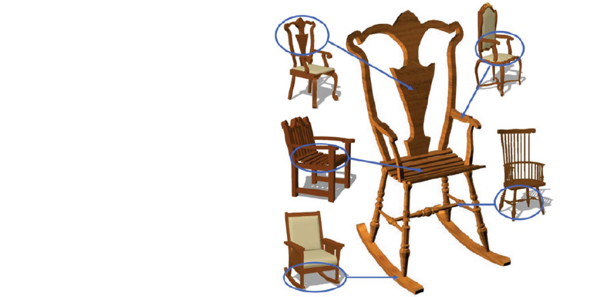
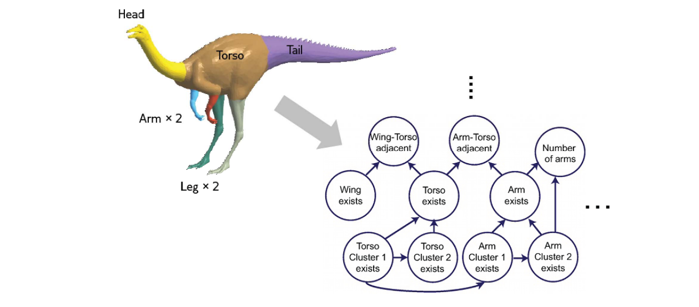
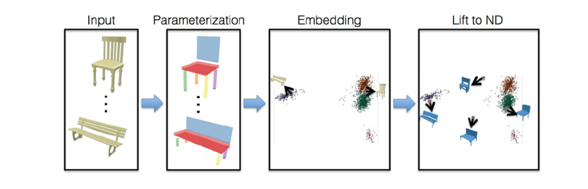
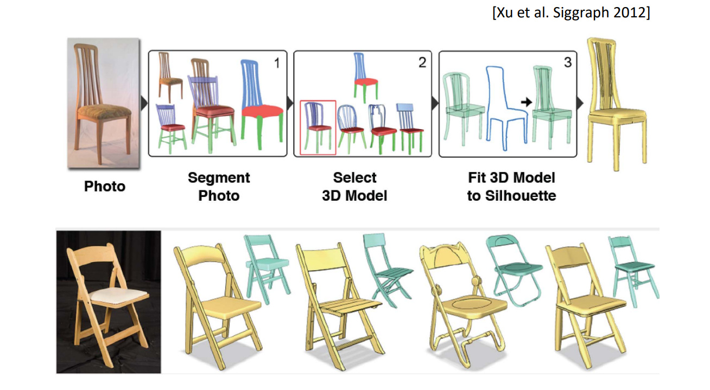
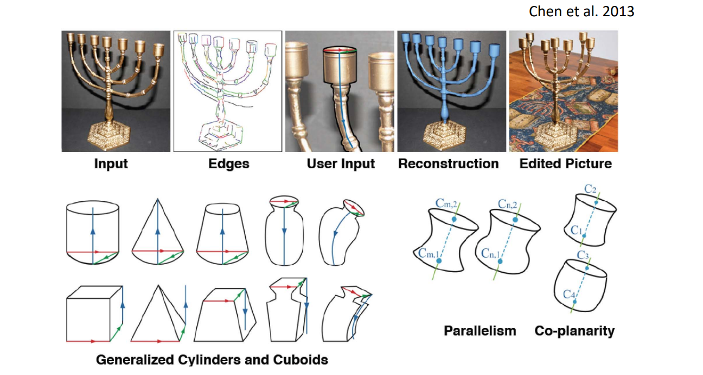
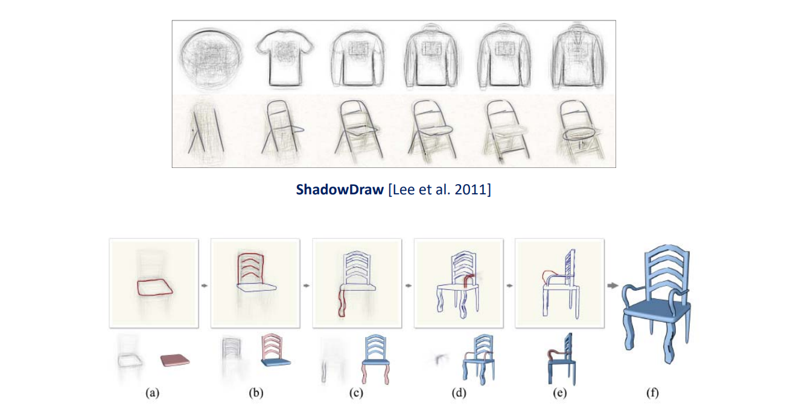
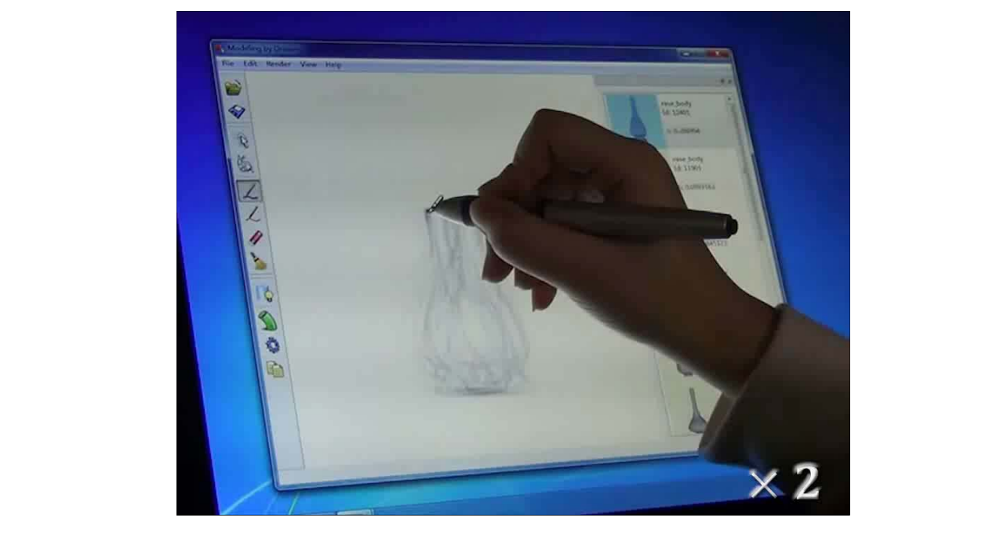
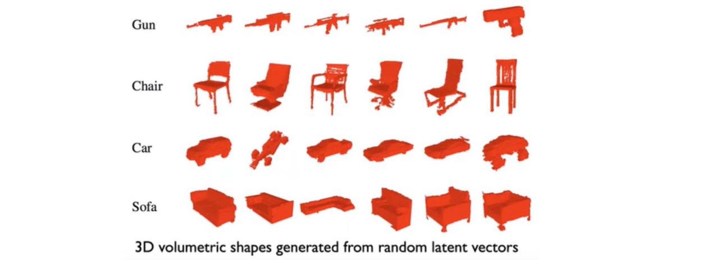

# 1. Modeling by Examples    
[Funkhouser et al. Siggraph 2004]   
 
1. Segment into parts    
2. Search 3D database for parts    
3. Compose parts into a model    

    

# 2. Probabilistic Reasoning    
[Chaudhuri et al. Siggraph 2011]    

基于贝叶斯网络    

    

$$
\mathbf{P(X)} =\prod_i\mathbf{P}\left ( x_i|\pi (x_i) \right )
$$

# 3. ShapeSynth: Exploration as Design Tool      
[Averkiou et al. Siggraph 2014]    

 

> 把形状映射到高维空间

# 4. Photo‐inspired Modeling     
    

    

> 找轮廓线最相似，然后再做变形，同时结构保持椅子的语义结构

# 5. Primitive‐based Modeling    
     

    

> 分析primitive并fit

# 6. Shadow Guidance    
Fan et al. 2013    

    

> 根据阴影概率

# 6. Shadow Guidance    
Fan et al. 2013     

    

# 7. Learning Generative Models of 3D Shapes (3D‐GAN)    

• Emergence of various 3D‐GANs for shape generation    

    

Chinagraph 2020 Key note talk by Hao Zhang:    
<https://www.bilibili.com/video/BV1Pa4y1x7au?p=3>    
Chaudhuri, et al. Learning Generative Models of 3D Structures. Computer Graphics Forum (Eurographics STAR), 2020.     
  
---  

> 本文出自CaterpillarStudyGroup，转载请注明出处。
https://caterpillarstudygroup.github.io/GAMES102_mdbook/
  
