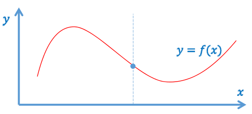
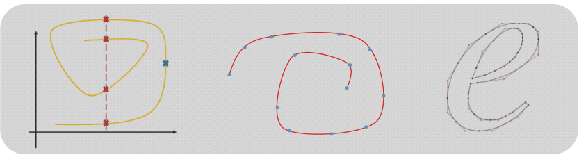
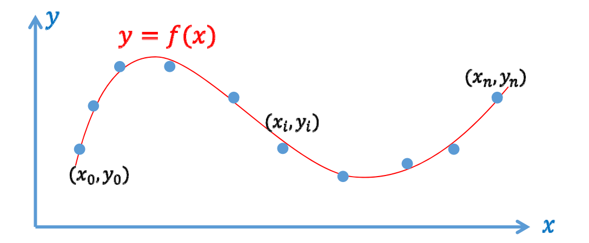
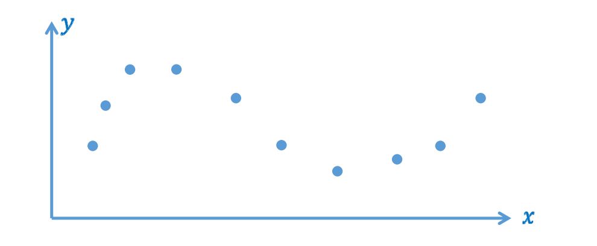
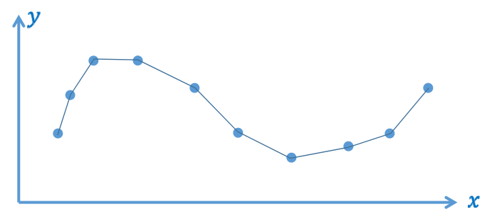
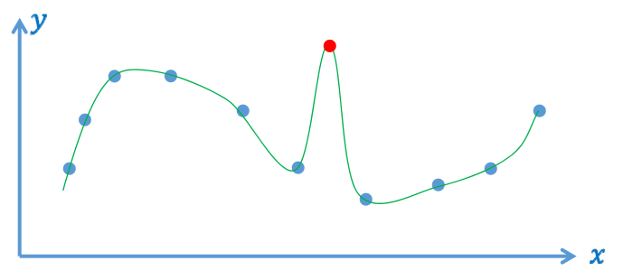
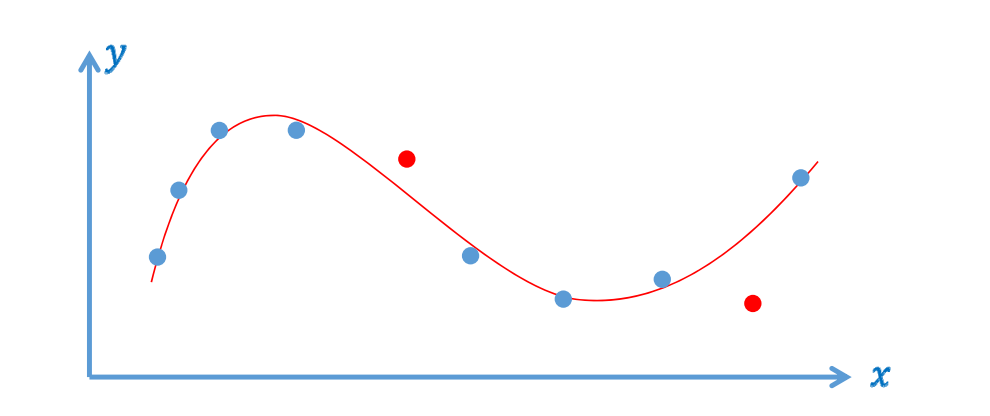

# 假定：函数形式 

• 假定：仅函数形式，一般曲线（非函数形式）后面再学习

  

$$
f:R^1 \rightarrow R^1
$$

或

$$
y=f(x)
$$

> &#x1F50E; [03：55]  
> &#x2705; 上图中的曲线中每个x都对应一个\\(y\\)值，是函数函数形式的曲线。上面的公式是函数形式曲线的两种表达方式。  

  

> &#x2705; 这三个曲线是一般曲线  

# 函数拟合问题
- 输入: 一些观察 (采样) 的数据点
$$
(x_i,y_i)^n_i=0
$$
 
- 输出: 拟合数据点的函数\\(y=f(x)\\), 并用于**预测**  

**这种拟合函数有多少个？**
> 函数拟合的目的：  
> 1. 压缩：把大量采样点压缩成函数
> 2. 预测：预测未采样的点  

# 拟合函数的“好坏”  
  

> &#x1F50E; [06：01]  
 
# 拟合函数的“好坏”   
- 分段线性插值函数\\(y=f_1(x)\\)   
— 数据误差为\\(0\\)。  
— 函数性质不够好：只有\\(C^{\circ} \\)连续，不光滑（数值计算）  

  

> &#x1F50E; [06：12]  
> &#x2705; 误差为0，但函数性质不好，不光滑

# 拟合函数的“好坏”  
- 光滑插值函数\\(y=f_2(x)\\)   
— 数据误差为\\(0\\)  
— 可能被 “差数据” (噪声、**outliers**) 带歪, 导致函数性质不好、预测不可靠
    

> &#x1F50E; [08：06]  
> &#x2705; 误差为0，但可能被“差”的数据影响  

# 拟合函数的“好坏”  
- 逼近拟合函数\\(y=f_3(x)\\)   
— 数据误差不为\\(0\\),但足够小  
  

> &#x1F50E; [09：48]  
> &#x2705; 误差不为\\(0\\)，但足够小，能抵抗噪声  

# 拟合函数的“好坏”

• 分段线性函数?    
• 光滑插值函数?    
• 逼近拟合函数?  

# 求拟合函数：应用驱动
 
> • 大部分的实际应用问题 

• 可建模为：找一个映射/变换/函数     
• 输入不一样、变量不一样、维数不一样   

> • 三步曲方法论：  

**• 到哪找？**  
• 确定某个函数集合/空间  

**• 找哪个？**  
• 度量哪个函数是好的/“最好”的 

**• 怎么找？**  
• 求解或优化：不同的优化方法与技巧，既要快、又要好…   

# 数据拟合的方法论   

> &#x1F50E; [12：50]  

- **到哪找?**
— 确定函数的表达形式 (函数集、空间) \\(
L=span(b_0(x),\dots b_n(x)) \\)

— 待定基函数的组合系数 (求解变量) 
$$
f_\lambda (x)=\sum_{k=0}^{n} \lambda_ib_i(x)
$$  

— **找哪个**?    
— 优化模型 (最小化问题)   
- 能量项 = 误差项 - 正则项  
— 统计模型、规划模型...  
\\(f\\)由等待系数\\(\lambda=\left(\begin{array}{c}
\lambda_{1} \\
\ldots \\
\lambda_{n}
\end{array}\right) \\)确定   

— **怎么找**?   
— 求解误差函数的驻点 (导数为 \\(0 \\)之处)
— 转化为系数的方程组
- 如果是欠定的 (有无穷多解)，则修正模型   

  - 改进/增加各种正则项:Lasso、岭回归、稀疏正则项…
  - 返修改模型

