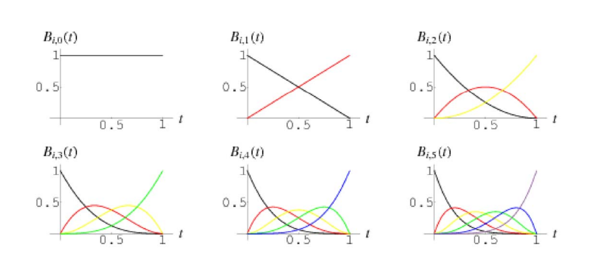
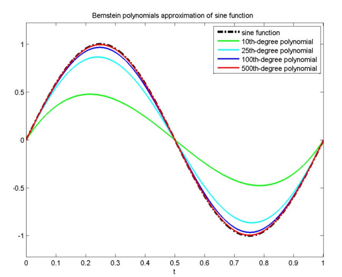
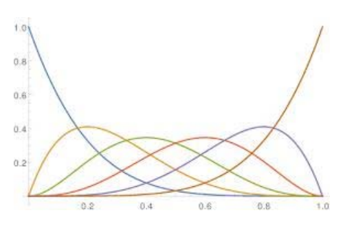
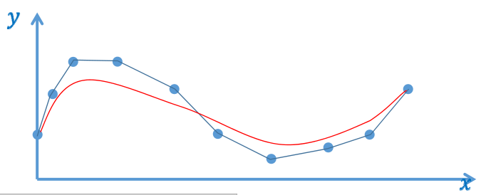

# 多项式的优点

- 易于计算, 表现良好, 光滑, ...    
- 稠密性与完备性：**表达能力足够!**   
  - 魏尔斯特拉斯Weierstrass定理:令\\(f\\)为闭区间\\([a, b]\\)上任意连续函数, 则对任意给\\(\varepsilon\\), 存在\\(n\\)和**多项式**\\(P_n\\)使得    

$$
\left|f(x)-P_{n}(x)\right|<\varepsilon, \forall x \in[a, b]
$$

-  - Weierstrass只证明了存在性,未给出多项式
   
> 多项式逼近的优点
> 1. 易于计算。 先滑
> 2. 表达能力足够。\\(Pn(x)\\)可以在一定误差内拟合任意\\(f(x)\\)

> 这里\\(x的范围区间是[a,b]，通常考虑[0,1]\\)

# Bernstein多项式的优点

## 完备性

- 伯恩斯坦Bernstein给出了构造性证明（强大!)   
－ 对\\([0,1]\\)区间上任意连续函数\\(f(x)\\)和任意正整数\\(n\\), 以下不等式对所有\\(x\in[0,1]\\)成立   

$$
|f(x)-B_n(f,x)|<\frac{9}{4} m_{f,n}
$$

-\\(m_f,n\\)=lower upper bound |\\(f(y_1)-f(y_2)\\)|

\\(y_1, y_2\in[0,1] \\)  且|\\(y_1-y_2\\)|<\\(\frac{1}{\sqrt{n}} \\)

-\\(B_n(f, x)=\sum_{j=0}^{n} f(x_j) b_n, j(x), \\) 其中\\((x_j)\\) 为[\\(0,1\\)]上等距采样点    
-\\(b_{n,j} = \binom{n}{j} x^j (1-x)^{n-j}\\)为Bernstein多项式  

> \\(\binom{n}{j}相当于{\textstyle C_{n}^{j}} \\),排列组合的意思。 

## Bernstein多项式

-  \\(b_{0,0}(x)=1\\)     
-  \\(b_{0,1}(x)=1-x, b_{1,1}=x\\)     
-  \\(b_{0,2}(x)=(1-x)^2, b_{1,2}=2x(1-x),b_{2,2}=x^2\\)     
-  \\(b_{0,3}(x)=(1-x)^3,b_{1,3}=3x(1-x)^2, b_{2,3}=3x^2(1-x),b_{3,3}=x^3\\)     
-  \\(b_{0,4}(x)=(1-x)^4,b_{1,4}=4x(1-x)^3,b_{2,4}=6x^2(1-x)^2, b_{3,4}=4x^3(1-x),b_{4,4}=x^4\\)   

> &#x1F50E; [36：40]   
> &#x2705; 矩阵的本质：在不同的基函数空间做变换  
> 6张图分别是0.-5次的 Bernstein 基。

## Bernstein多项式的优点  

* Bernstein基函数的良好性质：非常好的几何意义！   
• 正性、权性（和为1）\\(\Rightarrow \\)凸包性   
• 变差缩减性     
• 递归线性求解方法       
• 细分性     
• …    

> 权性。上面图中，任意画一条竖线，线上点的\\(y\\)值和为1    
[?] 什么是凸包性？为什么有权性就有凸包性？    
为什么凸包性就计算稳定？ 

* Bernstein多项式逼近示例   
• 逼近结果优秀   
• 需要高阶   

**丰富的理论：CAGD 课程**

# 关于Bernstein函数…

> &#x1F50E; [46：17]   

* \\(B_{n}(f, x)=\sum_{j=0}^{n} f\left(\frac{i}{n}\right) b_{n, j}(x)\\) 

  

* 两种观点：    
－ 几何观点、代数观点    

> &#x2705; \\(f\\)是采样点，\\(b\\)可以看作是f的组合系数

> &#x2705; 蓝色为采样点， 红色为拟合曲线。红色实际上是基于蓝点画的 Bezier 曲线。当采样点足够多时。红线逼近蓝点。
> \\(f(x)\\)是一个离散函数， \\(f(\frac{i }{n} )\\)为\\(x\\)为第i个采样点时\\(f(x)\\)的值，因此 \\(f(\frac{i}{n} )\\)代表能有采样点。    
代数观点：\\(f(\frac{i}{n} )是采样点， bnj(x) \\)是系数，
用系组来组合采样点。当\\(n\to \infty\\). 即采样足够密。得到\\(f(x)逼近 B_n (f,x)\\)      
几何观点， \\(f(\frac{i}{n})\\)是系数，\\(bn_1,j(x)\\)是基函数，用系数来组合基函数，得到新的函数。

**丰富的理论：CAGD 课程**
