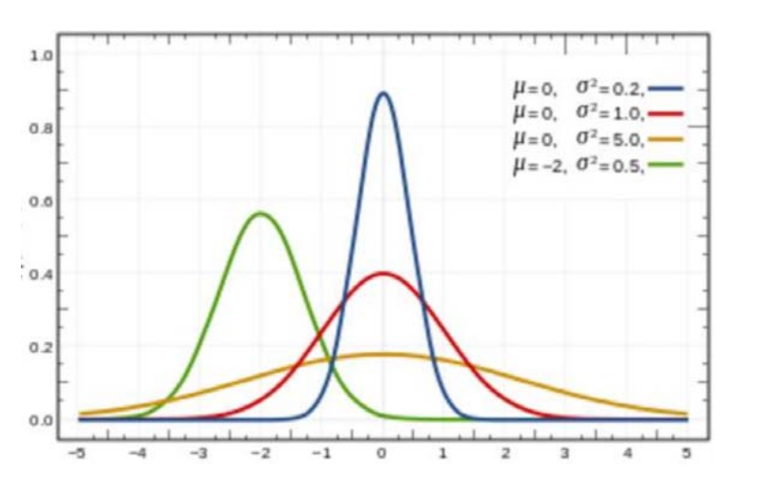
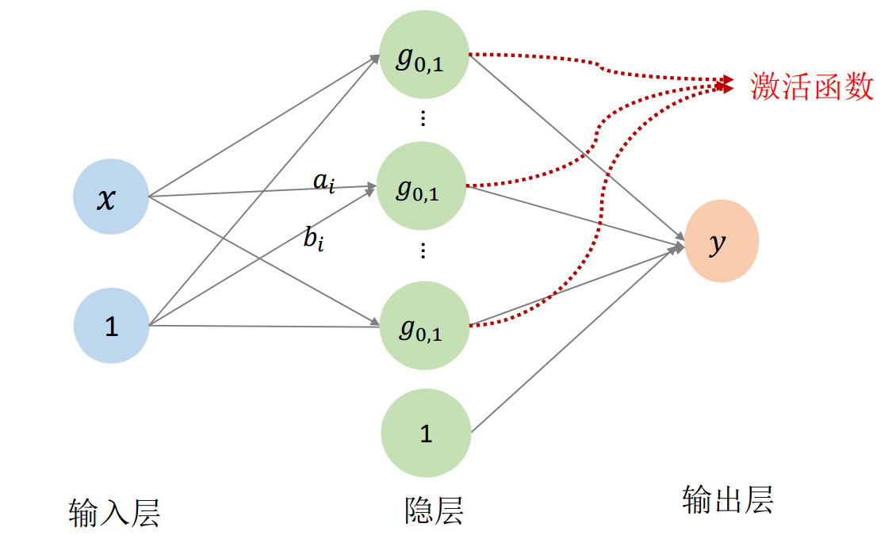
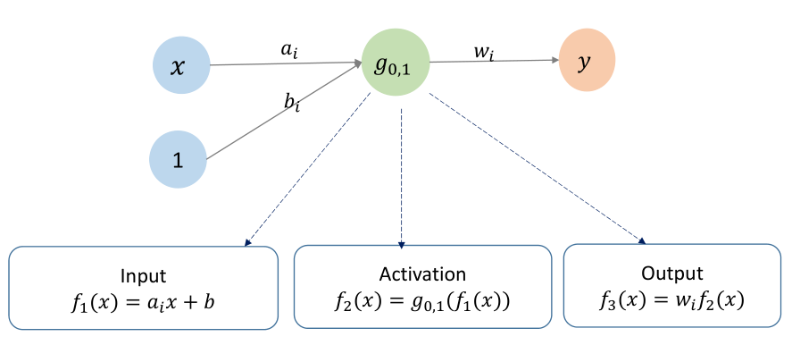
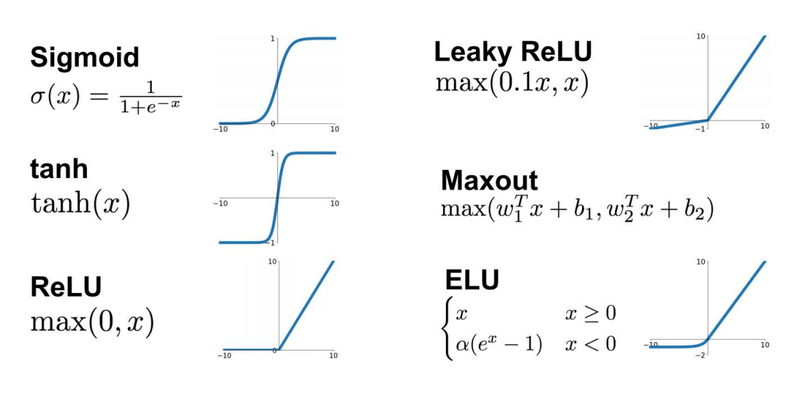
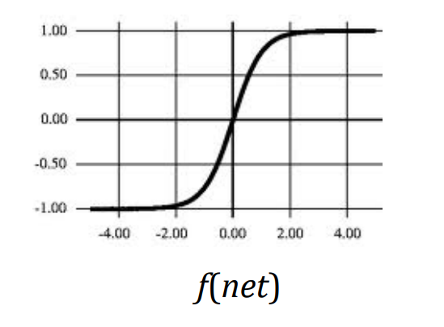
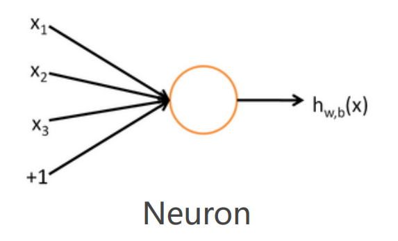
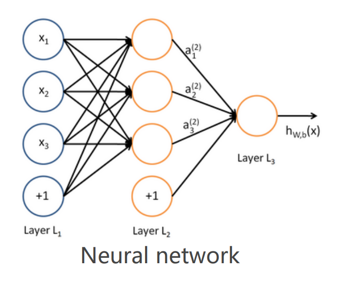
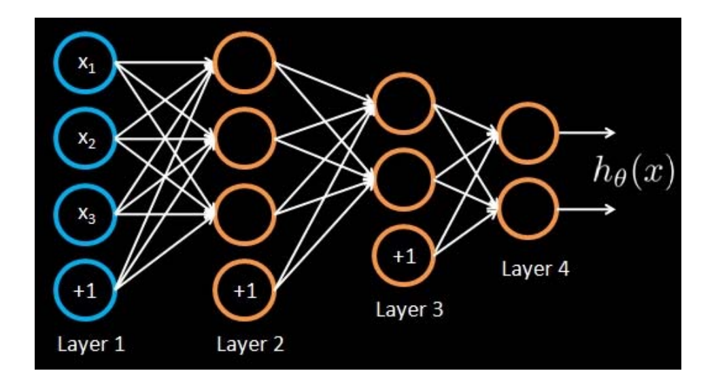
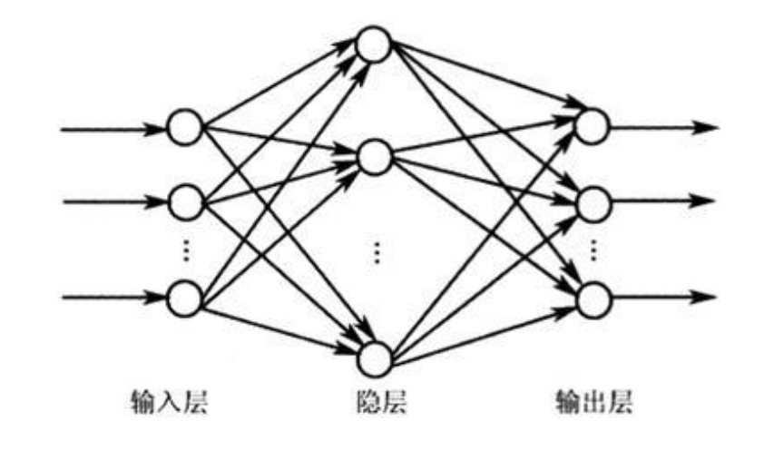
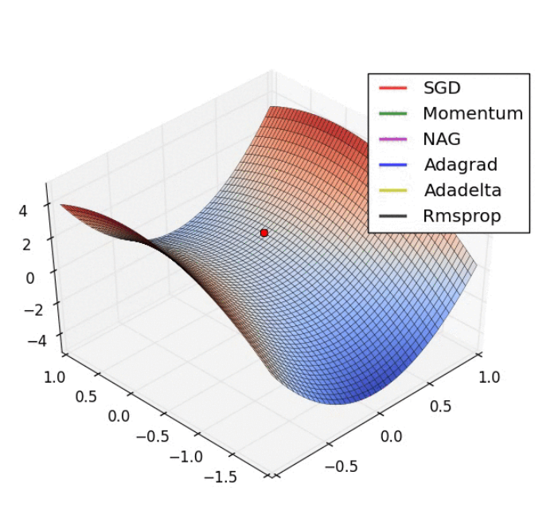

# Gauss拟合函数

• 一般Gauss函数表达为标准Gauss函数的形式  

$$
g_{\mu ,\sigma } (x)= \frac{1}{\sqrt{2\pi } } e^{-\frac{(x-\mu )^{2} }{2\sigma ^{2} } } =\frac{1}{\sqrt{2\pi } } e^{-\frac{1}{2}(\frac{x}{\sigma } -\frac{\mu }{\sigma } )^2} =g_{0,1 } (ax+b)
$$

$$
a=\frac{1}{\sigma },b=\frac{\mu }{\sigma }   
$$

> &#x2705; 把任意 Gauss 函数 \\(g_{\mu,\sigma}(x)\\)9 mom 中的x做平移与缩放，使之成为 std Gauss 函数，即：
$$
g_{\mu,\sigma}(x) \Rightarrow g_{0,1}(x') 
$$
> 通过推导得：  
$$
x'=ax+b
$$
> 其中：
$$
a=\frac{1}{\sigma}, b=-\frac{\mu}{\sigma}
$$

$$
f(x)=b_{0}+\sum_{i=1}^{n} b_{i} g_{i}(x)
$$

$$
\Downarrow 
$$

$$
f(x)=\omega_{0}+\sum_{i=1}^{n} \omega_{i} g_{0,1}\left(a_{i} x+b_{i}\right)
$$

$$
\Downarrow 
$$

**基函数是由一个基本函数通过平移和伸缩变换而来的**

  

> \\(a_i,b_i\\)及组合系数都成为函数变量、都可以通过优化得­到最优值。
> [55:00] 高维拟合函数也满足比限逼近定理    

# 换个方式看函数：神经网络
• 将Gauss函数看成网络

> &#x2705; RBF函数由此演变为：  

$$
f(x)=\omega_{0}+\sum_{i=1}^{n} \omega_{i} g_{0,1}\left(a_{i} x+b_{i}\right)
$$

> &#x2705; 其中\\(\omega_0, \omega_i, a_i, b_i\\)都是待优化的函数。 
> 当n足够多时，f(x)可以逼近任何函数。  
> \\(x\\) 本身一维，考虑到平移，再升一维。　　

隐层的\\(l\\)是指基函数线性组合后整体增加一个平移。   
在这里， std gauss 相当于激活函数。    
连接线上的数值 \\((a_i,b_i,\omega _i)\\)是网络参数。   
\\(n\\)对应网络隐层的结点个数，需要手调。  

# 抽象：神经元

> &#x1F446; [58:00] 用神经网络来描述RBF公式

**一个神经网络就是一个函数**

> &#x1F4A1; 从传统机器学习到神经网络，这是我见过的最好的解释。
> &#x2705; 参数的初值很重要，最好能根据物理意义找到初值。  

# RBF 神经网络

* 高维情形：RBF (Radial Basis Function)，径向基函数   
* 一种特殊的BP网络  
• 优化：BP算法  
* 核函数思想  
* Gauss函数的特性：拟局部性  

> RBF 神经网络的问题是，关于 \\(a,b\\) 的导数难求，高阶且非凸，
难以优化。只能找局部最小，因此初值很重要。  

# 思考：激活函数的选择？

• 启发：**由一个简单的函数通过（仿射）变换构造出一组基函数，张成一个函数空间**  
• 表达能力是否足够强：是否完备/稠密的？   
  

> 机器学习的本质是在做拟合。  

# 高维情形：多元函数  
**（后面的课程再展开解释）**

  
• 变量的多个分量的线性组合  

$$
(x_1,x_2,...,x_n)\longrightarrow g_{0,1}(a^i_1x_1+a^i_2x_2+...+a^i_nx_n+b_i)
$$

• 单隐层神经网络函数： 

$$
f(x_1,x_2,...,x_n) = \omega_{0}+\sum_{i=1}^{n} \omega_{i} g_{0,1}(a^i_1x_1+a^i_2x_2+...+a^i_nx_n+b_i)
$$

> 高维只是在输入层，输出层纵向多加几个圈     
共享基函数，使用不同的系数      

# 多层神经网络：多重复合的函数  

• 线性函数和非线性函数的多重复合    
   

   

$$
h_{W,b}(x)=f(W^Tx)=f(\sum_{i=1}^{3} W_ix_i+b)
$$

  

$$
a_1^{(2)}=f(W_{11}^{(1)} x_1+W_{12}^{(1)}x_2+W_{13}^{(1)} x_3+b_1^{(1)})
$$

$$
a_2^{(2)}=f(W_{21}^{(1)} x_1+W_{22}^{(1)} x_2+W_{23}^{(1)} x_{3}+b_{2}^{(1)})
$$

$$
a_{3}^{(2)}=f(W_{31}^{(1)} x_{1}+W_{32}^{(1)} x_{2}+W_{33}^{(1)} x_{3}+b_{3}^{(1)}) 
$$

$$
h_{W, b}(x) =a_{1}^{(3)}=f(W_{11}^{(2)} a_{1}^{(2)}+W_{12}^{(2)} a_{2}^{(2)}+W_{13}^{(2)} a_{3}^{(2)}+b_{1}^{(2)})
$$

> 通常每层使用相当的激活函数，方便优化    
增加网络的深度和宽度，都会极大膨胀参数个数    
同样参数量级下，通常深的比宽的好，因为深的自由度更高   

# 用神经网络函数来拟合数据

   

Regression problem:  
Input: Given training set \\((x_1,y_1), (x_2,y_2),(x_3, y_3)\\),….   
Output: Adjust **parameters** \\(0\\)(for every node)to make:
$$
h(x_i)\approx y_i
$$

# Why it works?

• 万能逼近定理：自由度足够多！  
$$
F(X)=\sum_{i=1}^{N} v_i\varphi (W^T_iX+b_i)
$$

 

**与传统拟合一样存在同样的问题：**  
函数个数如何选？!   
调参！

# 使用深度学习的方法

* 问题建模    
• 理解问题、问题分解（多个映射级联）…   
* 找哪个？   
• 损失函数、各种Penalty、正则项…  
* 到哪找？  
• 神经网络函数、网络简化…  
* 怎么找？  
• 优化方法（BP方法）  
• 初始值、参数…  
 

**调参：有耐心、有直觉…**

