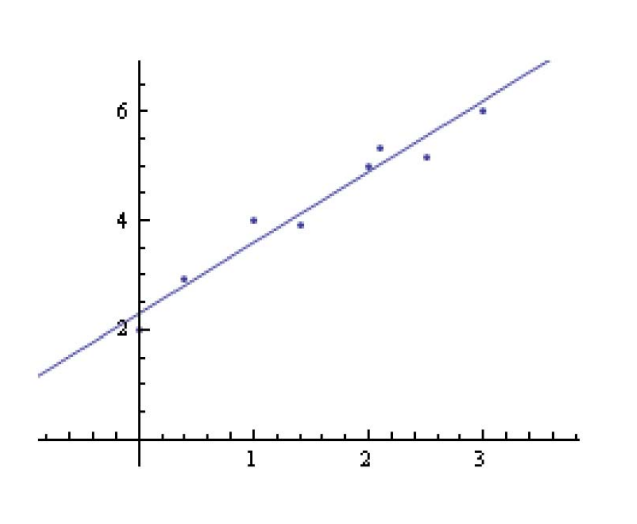

# 为什么逼近？

> &#x2705; 用逼近代替插值的优点

• 数据点含噪声、outliers等  
• 更紧凑的表达  
• 计算简单、更稳定  

  

# 逼近问题
   
－ 给定一组线性无关的连续函数集合\\(B\\)={\\(b_1, \ldots b_n\\)}和一组结点{\\((x_1, y_1)\\), ...,\\((x_m, y_m)\\)}, 其中\\(m>n\\)    
－ 在\\(B\\)张成空间中哪个函数\\(f\in\operatorname{span}(B)\\)对结点逼近最好?    
－ 示例: 给定一组点,找到最佳逼近的线性函数    
－ 怎么定义 “最佳逼近"?    

> &#x1F50E; [31：38]  

# 最佳逼近的定义

- 最小二乘逼近
$$
\underset{f \in \operatorname{span}(B)}{\operatorname{argmin}} \sum_{j=1}^{m}\left(f\left(x_{j}\right)-y_{j}\right)^{2}
$$

> 公试1是关于系数\\((\lambda _1,\lambda _2,\dots ,\lambda _n,)\\)的函数，直接求极小值的闭式解。    

$$
\sum_{j=1}^{m}\left(f\left(x_{j}\right)-y_{j}\right)^{2}=\sum_{j=1}^{m}\left(\sum_{i=1}^{n} \lambda_{i} b_{i}\left(x_{j}\right)-y_{j}\right)^{2}
$$

$$
=(M \lambda-y)^{T}(M \lambda-y)
$$

$$
=\lambda^{T} M^{T} M \lambda-y^{T} M \lambda-\lambda^{T} M^{T} y+y^{T} y
$$

$$
=\lambda^{T} M^{T} M \lambda-2y^{T} M\lambda +y^{T} y
$$

$$
M=\left(\begin{array}{ccc}
b_{1}\left(x_{1}\right) & \ldots & b_{n}\left(x_{1}\right) \\\\
\ldots & \ldots & \ldots \\\\
b_{1}\left(x_{m}\right) & \ldots & b_{n}\left(x_{m}\right)
\end{array}\right)
$$

> [?] 所以含义到底是啥？

# 求解

* 关于\\(\lambda\\)的二次多项式    
$$
\lambda^{T} M^{T} M \lambda-2 y^{T} M \lambda+y^{T} y 
$$

* 法方程   
－ 最小解满足   
$$
M^{T} M \lambda=M^{T} \mathrm{y}   
$$

* 提示   
－ 最小化二次目标函数\\(x^TAx+b^Tx+c \\)    
－ 充分必要条件:\\(2Ax=-b\\)  

