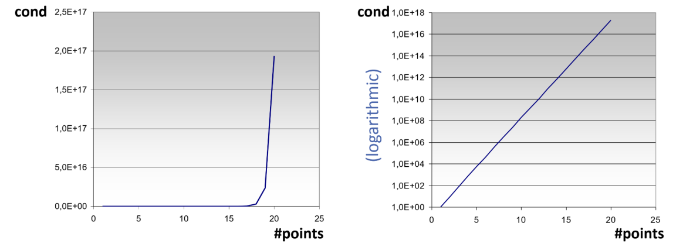
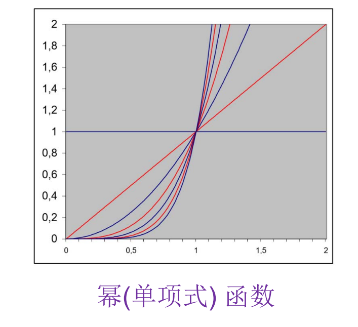
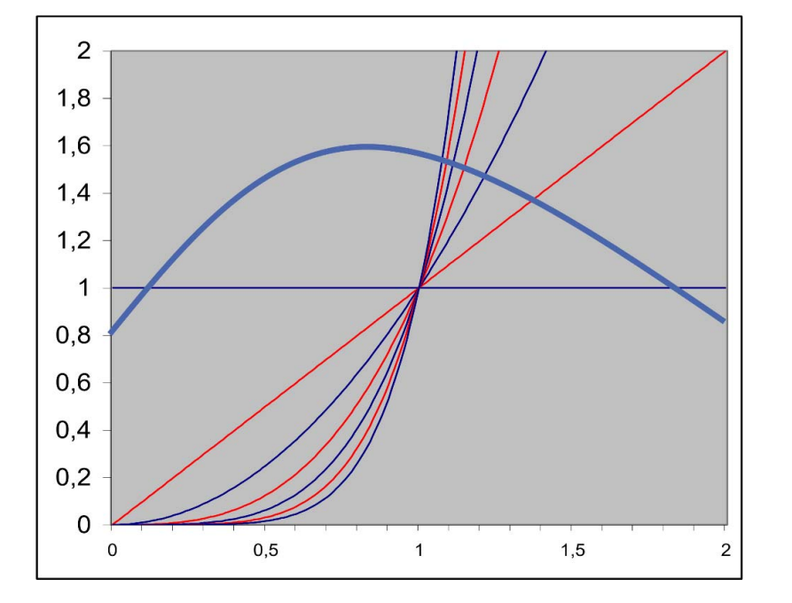
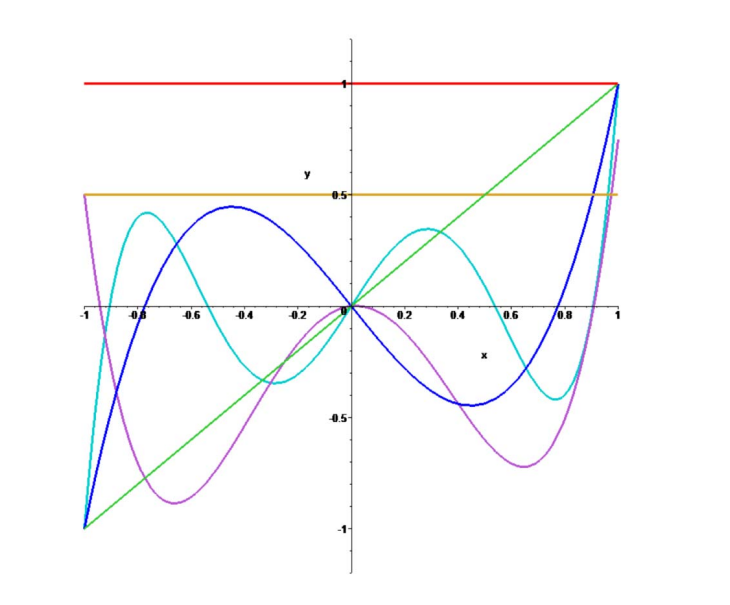
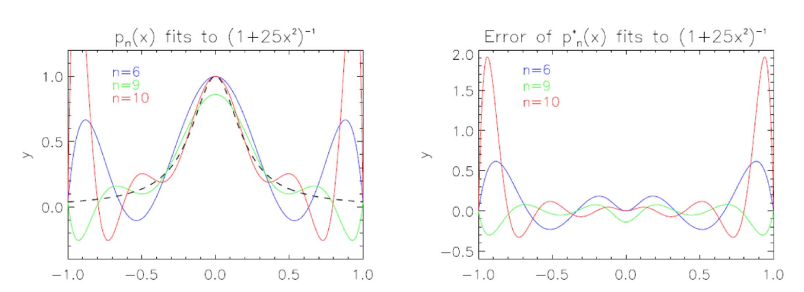

# 多项式插值定理

> &#x1F50E; [16：46]  

> &#x2705; 有\\(n\\)个不同的点\\(x_i\\)，存在唯一的多项式\\(p\\)  

$$
p(x) = a_0 + a_1x + a_2x^2 + \cdots + a_nx^n
$$

>  &#x2705; 使得
$$
p(x_i) = y_i
$$
且多项式的次数不超过n  
> 唯一的多项式p的意思是唯一的一组系数\\(a_0, \cdots, a_n)

> &#x2705; 以幂基\\({1, x, \cdots, x^n}\\)为例，解多项式系数的方程组：

如果基函数选取不一样，方程组的系数矩阵不同

系数矩阵为Vandermonde矩阵。  

> &#x2705; 如果不使用幂基而是别的基函数，也能得到上述方程组并解出唯一解，只是矩阵的内容不同。  

# 多项式插值定理  
定理：若\\(x_i\\)两两不同，慢对任意给定的\\(y_i\\)，存在唯一的次数至多是\\(n\\)次的多项式\\(p_n\\)，使得\\(p_n(x)=y_ii=0,\cdots,x^n\\)。   
证明：在幂基\\((1,x,\cdots,x^n)\\)下待定多项式\\(p\\)的形式为：  
$$
p(x)=a_0+a_1x+a_2x^2+\cdots+a_nx^n
$$  
由插值条件\\(p(x_i)=y_i,i=0,\cdots,n\\)得到如下方程组:

系数矩阵为Vandermonde矩阵，其行列式非零，因此方程组有唯一解。  

# 技巧1：构造插值问题的通用解  
- 构造插值问题的通用解   
－ 给定  \\(n+1\\)个点  {\\((x_0,y_0),\cdots,(x_n,y_n)\\)}, 寻找一组次数为\\(n\\)的多项式基函数\\(l_i\\)使得  
$$
l_{i}\left(x_{j}\right)=\left\{\begin{array}{l}
1, \text { 若 } i=j \\
0, \text { 若 } i \neq j
\end{array}\right.
$$

－ 插值问题的解为:   
$$
P(x)=y_{0} l_{0}(x)+y_{1} l_{1}(x)+\cdots+y_{n} l_{n}(x)=\sum_{i=0}^{n} y_{i} l_{i}(x)
$$

> &#x1F50E; [17：44] 
> &#x2705; 上一页方法中的问题：每次都要构造一个公式来解。  
> &#x2753; 这里没懂
> 构造基函数li使得：  

$$
l_i(x_j) = \begin{cases}
 1 & \text{ if } i=j \\
 0 & \text{ if } i\neq j
\end{cases}
$$

那么：  

$$
P(x) = \sum_{i=0}^{n}y_il_i(x)
$$

> &#x2705; 这样，即使y变化，也不用重新解方程组。而\\(l_i(x)\\)可以通过上述方程组提前解出来。  
> 多项式\\(l_i(x)\\)被称为拉格朗日多项式。  
> 该方法称为拉格朗日插值。

# 一般形式   
- 怎么计算多项式\\(l_i(x)\\)?  
 -\\(n\\)阶多项式,且有以下\\(n\\)个根 

 $$
 x_0,x_1,x_2,\cdots,x_{i-1} ,x_{i+1} ,\cdots,x_n
 $$

- 故可表示为    
\\(l_i(x)\\)  
\\( =C_{i}\left(x-x_{0}\right)\left(x-x_{1}\right) \ldots\left(x-x_{i-1}\right)\left(x-x_{i+1}\right) \ldots\left(x-x_{n}\right) \\)
 
 \\( =C_{i} \prod_{j \neq i}\left(x-x_{j}\right) \\)
 
- 由\\(l_i(x_i)=1\\)可得  
$$
 1=c_{i} \prod_{j \neq i}\left(x_{i}-x_{j}\right) \Rightarrow c_{i}=\frac{1}{\prod_{j \neq i}\left(x_{i}-x_{j}\right)} 
 $$

# 技巧1：构造插值问题的通用解
- 最终多项式基函数为  
$$
l_{i}(x)=\frac{\prod_{j \neq i}\left(x-x_{j}\right)}{\prod_{j \neq i}\left(x_{i}-x_{j}\right)}
$$

- 多项式\\(l_i(x)\\)被称为**拉格朗日多项式**  

# 技巧2：更方便的求解表达
• Newton插值：具有相同“导数”（差商）的多项式构造（\\(n\\)阶Taylor展开）  
定义：
一阶差商：

$$
f\left[x_{0}, x_{1}\right]=\frac{f\left(x_{1}\right)-f\left(x_{0}\right)}{x_{1}-x_{0}}  
$$

\\(k\\)阶差商:  

设{\\(x_0,x_1,\cdots,x_k\\)}互不相同,\\(f(x)\\)关于{\\(x_0,x_1,\cdots,x_k\\)}的\\(k\\)阶差商为:  

$$
f\left[x_{0}, x_{1}, \cdots, x_{k}\right]=\frac{f\left[x_{1}, \cdots, x_{k}\right]-f\left[x_{0}, x_{1}, \cdots, x_{k-1}\right]}{x_{k}-x_{0}}  
$$

所以Newton插值多项式表示为： 
$$
N_{n}(x)=f\left(x_{0}\right)+f\left[x_{0}, x_{1}\right]\left(x-x_{0}\right)+\cdots+f\left[x_{0}, x_{1}, \cdots, x_{n}\right]\left(x-x_{0}\right) \cdots\left(x-x_{n-1}\right)
$$  

> &#x1F50E; [19：23]  

• Newton插值：具有相同“导数”（差商）的多项式
构造（\\(n\\)阶Taylor展开）

> &#x2753; 这里也没听懂  
> 意思是预算出的有阶的差商  

# 多项式插值存在的问题

• 系统矩阵稠密

> &#x2705; 例如Vandermonde矩阵，处处非零元素
> 稀疏矩阵的优势：有好的迭代方法，计算很快.
> eigen库

• 依赖于基函数选取，矩阵可能病态，导致难于求解（求逆）  

# 病态矩阵示例

- 考虑二元方程组  
－ 解为\\((1,1)\\)   
$$  
 x_{1}+0.5 x_{2}=1.5 
 $$

 $$
  0.667 x_{1}+0.333 x_{2}=1 
  $$

- 对第二个方程右边项扰动0.001  
－ 解为  (0,3) 
$$  
 x_{1}+0.5 x_{2}=1.5 
 $$

 $$
0.667 x_{1}+0.333 x_{2}=0.999
$$

- 对矩阵系数进行扰动   
－ 解为(2,-1)   
$$
\begin{array}{c}
x_{1}+0.5 x_{2}=1.5 \\
0.667 x_{1}+0.334 x_{2}=1
\end{array}
$$

> &#x2705; 对系数矩阵或y向量做微小的扰动，其解的变化会非常大。

# 病态问题

• 输入数据的细微变化导致输出（解）的剧烈变化       

• 将线性方程看成直线（超平面）   
- 当系统病态时，直线变为近似平行   
- 求解（即直线求交）变得困难、不精确   

# 矩阵条件数

$$
\kappa_{2}(A)=\frac{\max _{x \neq 0} \frac{\|A x\|}{\|x\|}}{\min _{x \neq 0} \frac{\|A x\|}{\|x\|}}
$$

- 等于最大特征值和最小特征值之间比例   
- 条件数大意味着基元之间有太多相关性   

> &#x2705; 病态程度由条件数来衡量
> 条件数 = 最大特征值 / 最小特征值

条件数大意味着基元之间有太多相关性

# 矩阵条件数

- 多项式揷值问题是病态的   
- 对于等距分布的数据点\\(x_i\\),范德蒙矩阵的条件数随着数据点数\\(n\\)呈指数级增长（多项式的最高次数为\\(n-1\\)）

  

> &#x2705; 多项式插值如果使用了高阶的基函数，就容易出现病态问题

# 为什么？

- 幂（单项式）函数基   
- 幂函数之间差别随着次数增加而减小   
  

- 不同幂函数之间唯一差别为增长速度（\\(x^i\\)比 \\(x^{i-1}\\)增长快）   

> &#x1F50E; [26：31]  
> &#x2705; 例如幂函数基是这样的，高阶后函数变化非常快，取么结果就会被幂底严重挠动

# 函数互相抵消   

• 单项式:  
- 从左往右   
- 首先常函数1主宰   
- 接着\\(x\\)增长最快   
- 接着\\(x^2\\)增长最快   
- 接着\\(x^3\\)增长最快    
- \cdots

• 趋势   
- 好的基函数一般需要系数交替    
- 互相抵消问题    

  

# 解决方法

• 使用正交多项式基  
• 如何获得？  
• Gram‐Schmidt正交化  

  

# 多项式插值结果好吗？

  

振荡（龙格Runge）现象和对插值点数的高度敏感性观察\\(n\\)=9(10个数据点)和\\(n\\)=10（11个数）据点的差别   
# 结论

• 多项式插值不稳定  
• 控制点的微小变化可导致完全不同的结果  
• 振荡(Runge)现象  
• 多项式随着插值点数(可以是细微)增加而摆动  
• 需要更好的基函数来做插值  
• Bernstein基函数？  
• 分片多项式？  
