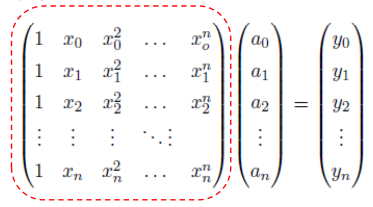

# 多项式插值定理

> &#x1F50E; [16：46]  

> &#x2705; 有n个不同的点xi，存在唯一的多项式 p

$$
p(x) = a_0 + a_1x + a_2x^2 + \cdots + a_nx^n
$$

>  &#x2705; 使得
$$
p(x_i) = y_i
$$
且多项式的次数不超过n  
> 唯一的多项式p的意思是唯一的一组系数\\(a_0, \cdots, a_n)

> &#x2705; 以幂基\\({1, x, \cdots, x^n}\\)为例，解多项式系数的方程组：

如果基函数选取不一样，方程组的系数矩阵不同

系数矩阵为Vandermonde矩阵。  

> &#x2705; 如果不使用幂基而是别的基函数，也能得到上述方程组并解出唯一解，只是矩阵的内容不同。  

# 技巧1：构造插值问题的通用解

> &#x1F50E; [17：44] 
> &#x2705; 上一页方法中的问题：每次都要构造一个公式来解。  
> &#x2753; 这里没懂
> 构造基函数li使得：  

$$
l_i(x_j) = \begin{cases}
 1 & \text{ if } i=j \\
 0 & \text{ if } i\neq j
\end{cases}
$$

那么：  

$$
P(x) = \sum_{i=0}^{n}y_il_i(x)
$$

> &#x2705; 这样，即使y变化，也不用重新解方程组。而\\(l_i(x)\\)可以通过上述方程组提前解出来。  
> 多项式\\(l_i(x)\\)被称为拉格朗日多项式。  
> 该方法称为拉格朗日插值。

# 一般形式

# 技巧1：构造插值问题的通用解

# 技巧2：更方便的求解表达

> &#x1F50E; [19：23]  

• Newton插值：具有相同“导数”（差商）的多项式
构造（n阶Taylor展开）

> &#x2753; 这里也没听懂  
> 意思是预算出的有阶的差商  

# 多项式插值存在的问题

• 系统矩阵稠密

> &#x2705; 例如Vandermonde矩阵，处处非零元素
> 稀疏矩阵的优势：有好的迭代方法，计算很快.
> eigen库

• 依赖于基函数选取，矩阵可能病态，导致难于求
解（求逆）

# 病态矩阵示例

> &#x2705; 对系数矩阵或y向量做微小的扰动，其解的变化会非常大。

# 病态问题

• 输入数据的细微变化导致输出(解)的剧烈变化
• 将线性方程看成直线（超平面）
• 当系统病态时，直线变为近似平行
• 求解（即直线求交）变得困难、不精确

# 矩阵条件数

> &#x2705; 病态程度由条件数来衡量
> 条件数 = 最大特征值 / 最小特征值

条件数大意味着基元之间有太多相关性

# 矩阵条件数

> &#x2705; 多项式插值如果使用了高阶的基函数，就容易出现病态问题

# 为什么？

幂(单项式) 函数

> &#x1F50E; [26：31]  
> &#x2705; 例如幂函数基是这样的，高阶后函数变化非常快，取么结果就会被幂底严重挠动

# 函数互相抵消

# 解决方法

• 使用正交多项式基
• 如何获得？
• Gram‐Schmidt正交化
# 多项式插值结果好吗？
# 结论
• 多项式插值不稳定
• 控制点的微小变化可导致完全不同的结果
• 振荡(Runge)现象
• 多项式随着插值点数(可以是细微)增加而摆动
• 需要更好的基函数来做插值
• Bernstein基函数？
• 分片多项式？
2. 多项式逼近
为什么逼近？
• 数据点含噪声、outliers等
• 更紧凑的表达
• 计算简单、更稳定
最小二乘逼近
最佳逼近的定义
求解
3. 函数空间及基函数
为什么用多项式？
用Bernstein多项式做逼近
Bernstein多项式
用Bernstein多项式做逼近
• Bernstein基函数的良好性质：非常好的几何意义！
• 正性、权性（和为1）凸包性
• 变差缩减性
• 递归线性求解方法
• 细分性
• …
• Bernstein多项式逼近示例
• 逼近结果优秀
• 需要高阶
丰富的理论：CAGD 课程
关于Bernstein函数…
丰富的理论：CAGD 课程
4. RBF函数插值/逼近
Gauss函数
RBF函数拟合
• RBF函数
• 方法
• 原因
讨论：现象
讨论：现象
思考：
5. 从另一个角度来看拟合函数
Gauss拟合函数
• 一般Gauss函数表达为标准Gauss函数的形式
基函数是由一个基本函数通
过平移和伸缩变换而来的
换个方式看函数：神经网络
• 将Gauss函数看成网络
𝑥
𝑔 ?,?
𝑦
1
𝑔 ?,?
𝑔 ?,?
1
输入层 隐层
输出层
激活函数
… …
𝑎 ?
𝑏 ?
抽象：神经元
𝑥
𝑔 ?,? 𝑦
1
𝑎 ?
𝑏 ?
Input
𝑓
? ?𝑥? ? 𝑎 ? 𝑥 ? 𝑏
Activation
𝑓 ? ?𝑥? ? 𝑔 ?,? ?𝑓
? ?𝑥??
Output
𝑓 ? ?𝑥? ? 𝑤 ? 𝑓 ? ?𝑥?
𝑤 ?
RBF 神经网络
• 高维情形：RBF (Radial Basis Function)，径向基函数
• 一种特殊的BP网络
• 优化：BP算法
• 核函数思想
• Gauss函数的特性：拟局部性
思考：激活函数的选择？
• 启发：由一个简单的函数通过（仿射）变换构造出一组
基函数，张成一个函数空间
• 表达能力是否足够强：是否完备/稠密的？
高维情形：多元函数
（后面的课程再展开解释）
• 变量的多个分量的线性组合
• 单隐层神经网络函数：
多层神经网络：多重复合的函数
• 线性函数和非线性函数的多重复合
56
Neuron
Neural network
f(net)
用神经网络函数来拟合数据
Regression problem:
Input: Given training set (x 1 , y 1 ), (x 2 , y 2 ), (x 3 , y 3  ), ….
Output: Adjust parameters  (for every node) to make:
Why it works?
• 万能逼近定理：自由度足够多！
与传统拟合一样存在
同样的问题：
函数个数如何选？!
与传统拟合一样存在
同样的问题：
函数个数如何选？!
调参！
Deep Learning Frameworks
使用深度学习的方法
• 问题建模
• 理解问题、问题分解（多个映射级联）…
• 找哪个？
• 损失函数、各种Penalty、正则项…
• 到哪找？
• 神经网络函数、网络简化…
• 怎么找？
• 优化方法（BP方法）
• 初始值、参数…
调参：有耐心、有直觉…
未来课程内容
• 全局函数局部函数
• 样条函数
• 多元函数一般曲线
• 参数曲线、参数域为本征维数
• 隐函数
• 曲线设计
• 计算机辅助几何设计
• 曲面设计
• 张量积的参数曲面

