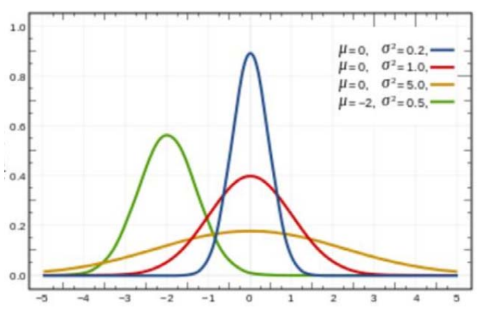
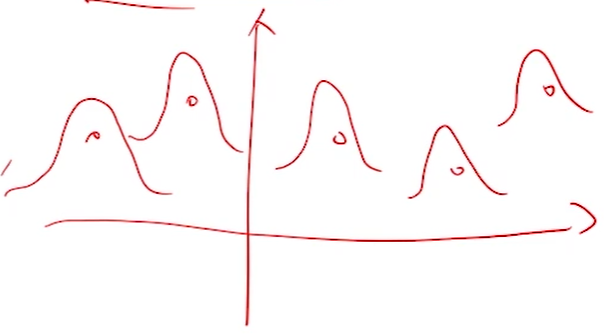

# Gauss函数

> &#x2705; 一维 RBF 称为 Gauss 函数

$$
g_{\mu ,\sigma } = \frac{1}{\sqrt{2\pi } } e^{-\frac{(x-\mu )^{2} }{2\sigma ^{2} } } 
$$

几何意义：   
• 均值\\(\mu\\):位置   
• 方差\\(\sigma\\)：宽度  

**不同µ和\\(\sigma\\)的 Gauss 函数都线性无关.** 有什么启发？

> 各个线性无关的 Gauss 函数，可以张成一个空间。用 Gauss 函数作为基函数  

# RBF函数拟合

$$
f(x) = b_0 + \sum b_ig_i(x)
$$

> &#x1F50E; [47：44]   
> 有\\(n\\)个采样点，分别以每个点的x值为µ.生成Gauss函数作为 RBF基。    
\\(b_0\\)为上下偏移，可以来自先验，也可以是某种约束。 

# 思考：

\\(\sigma \\) 取什么值能得到比较好的结果？   
均值\\(\mu\\)和方差\\(\sigma\\)是否可以一起来优化？   

本文出自CaterpillarStudyGroup，转载请注明出处。
<https://caterpillarstudygroup.github.io/GAMES102_mdbook/>
