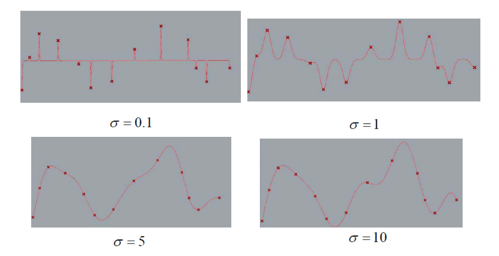
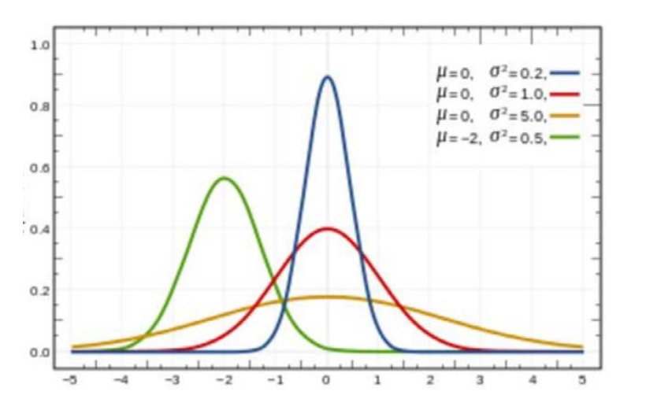

# Gauss函数
* 两个参数：均值\\(\mu\\)，方差\\(\sigma\\)  

$$
g_{\mu ,\sigma } = \frac{1}{\sqrt{2\pi } } e^{-\frac{(x-\mu )^{2} }{2\sigma ^{2} } } 
$$

* 几何意义：   
• 均值\\(\mu\\):位置   
• 方差\\(\sigma\\)：支集宽度  

* 不同均值和方差Gauss函数都线性无关系  
• 有什么启发？   

> &#x2705; 一维 RBF 称为 Gauss 函数

$$
g_{\mu ,\sigma } = \frac{1}{\sqrt{2\pi } } e^{-\frac{(x-\mu )^{2} }{2\sigma ^{2} } } 
$$

均值 \\(\mu\\) 方差\\(\sigma\\)  

**不同µ和0的 Gauss 函数都线性无关.**

# RBF函数拟合

• RBF函数

$$
f(x) = b_0 + \sum b_ig_i(x)
$$

• 方法
• 原因

> &#x1F50E; [47：44]  
> &#x2705; 改进：通过优化得到\\(\mu\\) 和\\(\sigma\\)

# 讨论：现象
  

# 思考：

* 均值\\(\mu\\)和方差\\(\sigma\\)是否可以一起来优化？   
$$
g_{\mu ,\sigma }(x) = \frac{1}{\sqrt{2\pi } } e^{-\frac{(x-\mu )^{2} }{2\sigma ^{2} } } 
$$

$$
f(x) = b_0 + \sum^n_{i=1} b_ig_i(x)
$$

* 问题？  
