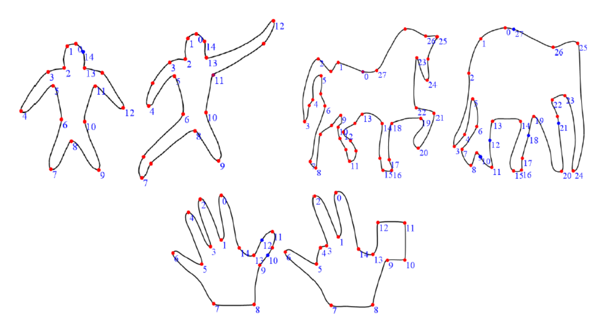
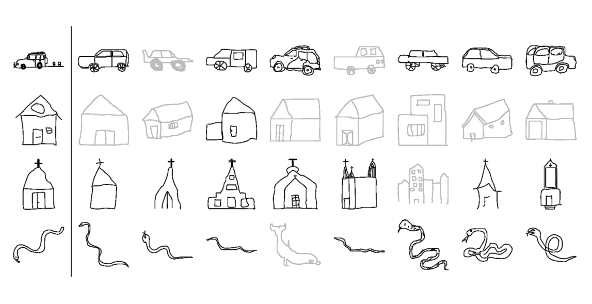

# 2D形状（离散曲线）处理    
 

# 离散曲线的去噪/滤波    

• Denoising, smoothing, fairing     

     

# 曲线简化(Simplification)    

     

# 曲线编辑/变形(Editing/Deformation)     

     

# 形状插值(Morphing)     

     

# 形状的对称性检测(Symmetry)      

     

# 形状分割(Segmentation)      

     

# 形状匹配(Matching/Correspondences)        

     

# 形状检索(Retrieval)       

     

# 形状描述子(Descriptors)      

     

