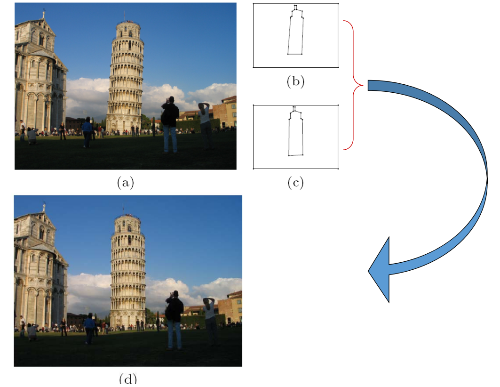
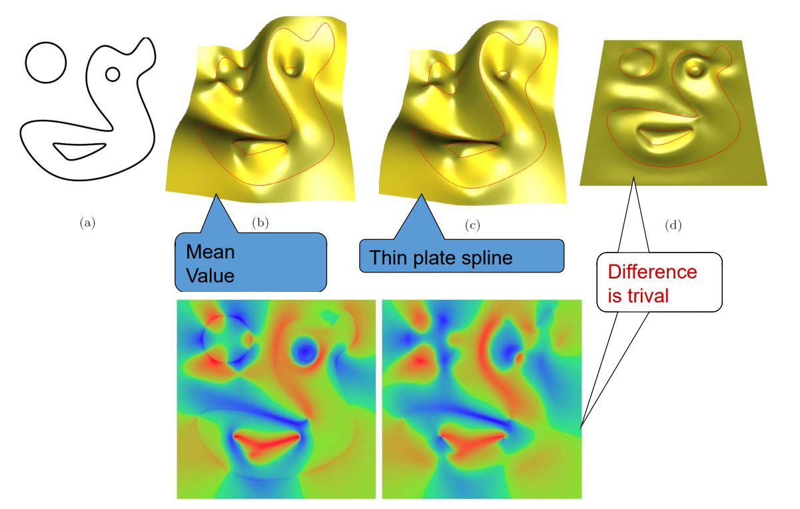

# 重心坐标要解决的问题 - FFD

FFD = Free‐form Deformation    

*[Sederberg et al. 86]*

**问题**：给定一个包含物体的边界多边形，改变边界时，如何计算物体的变形？      
**方法**：Embed the object into a domain that is more easily parametrized than the object.     

**优点**:      
• You can deform arbitrary objects    
• Independent of object representation     

    

> 本文是作用于3D物体的算法，以2D为例说明该算法：    
用 Bezier 面片包围目标面片。通过控制 Bazier 顶点来控制目标面片。    
> Bezier 顶点称为 proxy （**代理**） ，但Proxy 不一定是 Bezier 点，也可以是边界上的点，主要是找到目标上任意一个点与 Proxy 点之间的关系。    
因此问题简化为求**内部点与边界点（控制顶点）之间的关联关系**     
> 关联关系本质是重心坐标，即组合系数   
代理的优点是：简化问题，可以快速得到一个基本准确的结果。  
缺点是：1.有些无法简化的地方，就是artifact.  
2.如何得到准确的关联关系。   

# 几何图形的重心坐标

三角形的重心坐标：三角形的顶点是 Proxy 点. P是三角形内任意一点。用某种方法来描述P与 Proxy 点之间的关系。  
> 即把P描述为Proxy点的线性组合。线性组合的系数就是P的重新坐标值。      

四边及以上多边形不能用三角形的方法求重心坐标，因为系数解不唯一。     
因此需要一种对所有多边形适用的更统一的重心坐标定义方式。      

> Coordinates：这一页没讲  
> 重心坐标的应用：这一页没讲  
> Coordinates In A Polytope：这一页没讲       
> BC of 2D Polygons：这一页没讲     

# 各种重心坐标的计算方法     

- Wachspress (WP) coordinates    

$$
w_{i}=\frac{\cot \gamma_{i-1}+\cot \beta_{i}}{r_{i}^{2}}
$$

    

- mean value (MV) coordinates     

$$
w_{i}=\frac{\tan \left(\alpha_{i-1} / 2\right)+\tan \left(\alpha_{i} / 2\right)}{r_{i}}
$$

    

- discrete harmonic (DH) coordinates     

$$
w_{i}=\cot \beta_{i-1}+\cot \gamma_{i}
$$

    

> 不同的几何坐标都有相应的几何背景  

# 重心坐标的应用

## 1.imge warping     

    

## 2. shading     

    

> 通常只存储顶点上的shading value. 非顶点处的shade value 是通过顶点的shading value 插值得到。插值是基于重心坐标做的。  

## 3. Transfinite Interpolation

问题：给定4条边界曲线，构造插值这4条曲线的一张曲面   

Interpolating height function to model a surface    

    

## 4. allow directly updating on interpolation when resampled.     

     
> &#x2753; 这就是普通插值，跟重心坐标有什么关系？   
# 广义重心坐标的学习资料   

http://www.inf.usi.ch/faculty/hormann/barycentric

---  

> 本文出自CaterpillarStudyGroup，转载请注明出处。
https://caterpillarstudygroup.github.io/GAMES102_mdbook/

