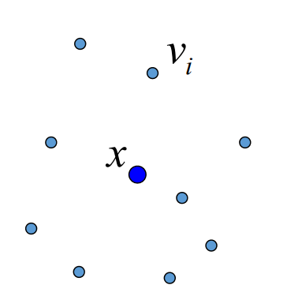
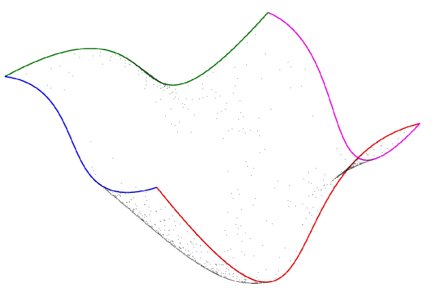

# 重心坐标     

# 需求
## Free‐form Deformation (FFD)    
[Sederberg et al. 86]

* Embed the object into a domain that is more easily parametrized than the object.     
* Advantages:      
• You can deform arbitrary objects    
• Independent of object representation     

    

> 本文是作用于3D物体的算法，以2D为例说明该算法：    
用 Bezier 面片包围目标面片。     
通过控制 Bazier 顶点来控制目标面片。    
Bezier 顶点称为 proxy （代理）  
> 使 Proxy 不一定是 Bezier 点，也可以是边界上的点，主要是找到目标上任意一个点与 Proxy 点之间的关系。    

**问题**：给定一个包含物体的边界多边形，改变边界时，如何计算物体的变形？      
即，内部点与边界点（**控制顶点**）之间的关联关系？     

# 几何图形的重心坐标

三角形的顶点是 Proxy 点. P是三角形内任意一点，用某种方法来描述P与 Proxy 点之间的关系。    

四边及以上多边形不能用三角形的方法求重心，坐标，因为系数解不唯一。     
因此需要一种对所有多边形适用的更统一的重心坐标定义方式。      

## Warping with BC      

    

# Coordinates    

Homogeneous coordinates
- Given points \\(v_\Sigma \\) = {\\(v_1,\cdots ,v_i,\cdots \\)}    
- Express a new point \\(x\\) as affine combination of \\(v_\Sigma \\)    

     \\(x=\Sigma b_i v_i,\\) where \\(\Sigma b_i = 1\\)    

- \\(b_i\\) are called homogeneous coordinates      
- Barycentric if all       

$$
b_i \ge 0
$$

    

# Applications    

* Boundary interpolation    
\\(f(x)=\Sigma b_if_i\\)     
• Color/Texture interpolation      
* Mapping     
\\({x}' =\Sigma b_i{v}' _i\\)     
• Shell texture      
• Image/Shape deformation     

# Coordinates In A Polytope     

* Points \\(v_\Sigma\\) form vertices of a closed polytope     
• \\(x\\) lies inside the polytope     

* Example: A 2D triangle     
• Unique (barycentric):     

$$
b_1=\frac{A_{xv_2v_3}}{A_{v_1v_2v_3}} 
$$

• Can be extended to any N‐D simplex        
* A general polytope     
• Non‐unique      
• The triangle‐trick can not be applied.       

    

# BC of 2D Polygons   

 -  2D Polygons     
    - Wachspress [Wachspress 75][Loop 89][Meyer 02][Malsch 04]    
      - Barycentric within convex shapes      
    - Mean value [Floater 03][Hormann 06]      
      - Homogeneous within any closed shape, barycentric within convex shapes and kernels of star‐shapes      
    - Discrete harmonic [Desbrun 02][Floater 06]     
      - Homogeneous within convex shapes     
 - A general construction in 2D [Floater 06]      
    - <u>Complete</u>: a single scheme that can construct all possible homogeneous coordinates in a convex polygon      
    - Reveals a simple connection between known coordinates via a parameter        
      - Wachspress      
      - Mean value       
      - Discrete harmonic     

# 各种重心坐标的计算方法     

\\(\star \\) Wachspress (WP) coordinates    

$$
w_{i}=\frac{\cot \gamma_{i-1}+\cot \beta_{i}}{r_{i}^{2}}
$$

    

\\(\star \\) mean value (MV) coordinates     

$$
w_{i}=\frac{\tan \left(\alpha_{i-1} / 2\right)+\tan \left(\alpha_{i} / 2\right)}{r_{i}}
$$

    

\\(\star \\) discrete harmonic (DH) coordinates     

$$
w_{i}=\cot \beta_{i-1}+\cot \gamma_{i}
$$

    

# 重心坐标的应用

## 1.imge warping     

    

## 2. shading     

    

## 3. Transfinite Interpolation

• 问题：给定4条边界曲线，构造插值这4条曲线的一张曲面     
• Coons surfaces      

     

Interpolating height function to model a surface    

    

## 4. allow directly updating on interpolation when resampled.     

     

# 广义重心坐标的学习资料   

http://www.inf.usi.ch/faculty/hormann/barycentric