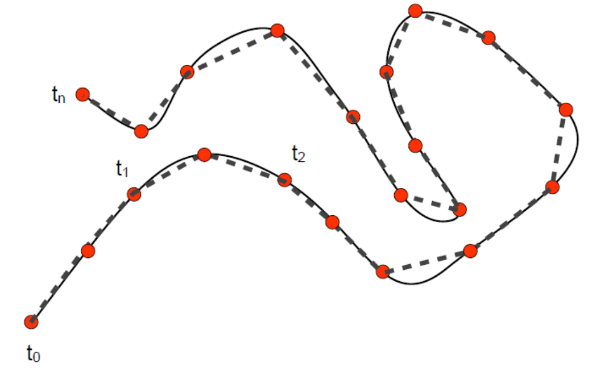
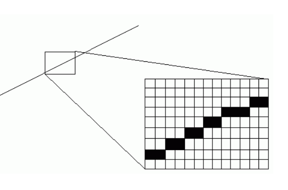

# 曲线的离散   

# 从连续到离散   

* 对象的表达     
• 在数学上，连续表达与计算      
• 在计算机中，离散表达与计算     
* 数值方法：数值微分、数值积分、数值优化    
• 数值分析：离散计算对精确计算的近似程度     
• Fourier分析/变换：离散Fourier分析/变换    
• 卷积（滤波）    
* 在计算机科学（计算机图形学）中，采样无处不在    
• 计算机只能表达离散的数值    
• 例子：int型的数据（量化）    

# 曲线的离散化   

• 将连续性表达转化为**多边形**表达（分段线性）    

    

# 为何要离散化？   

* 渲染的必要性    
• 算法和硬件：线段/圆的光栅化     

    

* 计算的必要性     
• 直线求交、多项式求根    

    

* 制造的必要性      
• 刀具轨迹只能走直线段和圆弧     

# 曲线的离散：采样    

• Nyquist–Shannon采样定理      

> If a function \\(x(t)\\) contains no frequencies higher than B hertz, it is completely determined by giving its ordinates at a series of points spaced 1/(2B) seconds apart.      

    

# Bezier曲线的离散定理    

• 曲线到弦的最大距离<控制顶点到弦的最大距离     
• 给定误差，估计离散层级     

    

# 离散曲线的几何量的计算     

* 如果有连续表达，利用连续表达的曲线来计算    

* 如无连续表达     
• 差分法：利用差分形式来近似微分属性    
• 拟合法：利用光滑函数来拟合估计属性     

* Tylor展开及估计 