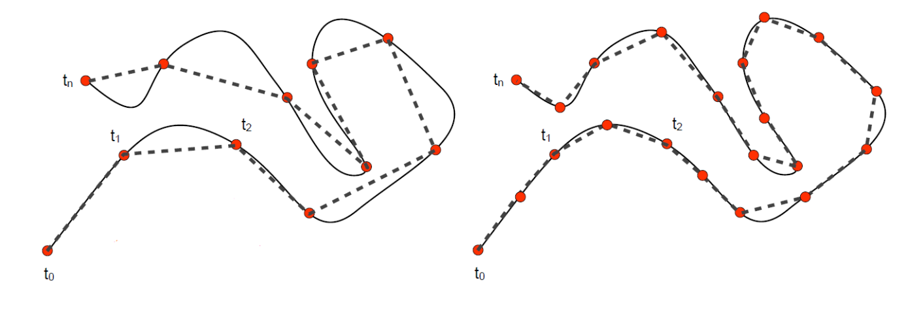
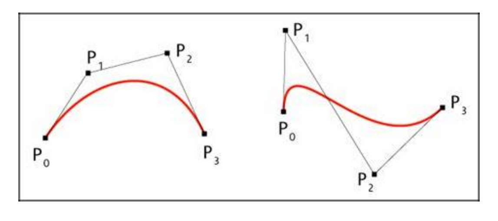
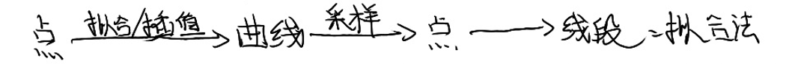

# 从连续到离散   

对象的表达     
• 在数学上，连续表达与计算      
• 在计算机中，离散表达与计算     
数值方法：数值微分、数值积分、数值优化    
• 数值分析：离散计算对精确计算的近似程度     
• Fourier分析/变换：离散Fourier分析/变换    
• 卷积（滤波）    
在计算机科学（计算机图形学）中，采样无处不在    
• 计算机只能表达离散的数值    
• 例子：int型的数据（量化）    

> &#x1F4A1; 人的感知精度高，宏观表现为连续，计算能力支持的精度低，宏观表现为离散，精度不匹配就会产生artifact.   
# 曲线的离散化   

## 要解决的问题

将连续性表达转化为**多边形**表达（分段线性）    

    

> 黑色是光滑曲线，但无法用于计算。因此用虚线近似替代曲­线进行计算。只要能控制直线与曲线的误差。     

## 为何要离散化？   

* 渲染的必要性：线段/圆的光栅化     

  - 曲线的绘制：曲线须离散成多边形      
  - 曲面的绘制：曲面须离散成**三角形网格**       
   

> 只有针对线段或特殊曲线（圆、椭圆）等的高效渲染算法。     
不会针对一般曲线专门设计，因此要把一般曲线离散成线段再渲染。     

    

* 计算的必要性：直线求交、多项式求根    

    

* 制造的必要性：刀具轨迹只能走直线段和圆弧     

# Nyquist–Shannon采样定理      

If a function \\(x(t)\\) contains no frequencies higher than B hertz, it is completely determined by giving its ordinates at a series of points spaced 1/(2B) seconds apart.      

    

# Bezier曲线的离散定理    

定理：曲线到弦的最大距离<控制顶点到弦的最大距离     
应用：给定误差，估计离散层级     

    

# 离散曲线的几何量的计算     

* 如果有连续表达，利用连续表达的曲线来计算    

* 如无连续表达     
• 差分法：利用差分形式来近似微分属性    
> 差分法：一个点的导数是相邻点的差分，用前一点和后一点的弦的斜率来代替当前点的切线。       

• 拟合法：利用光滑函数来拟合估计属性     
>    

* Tylor展开及估计 

本文出自CaterpillarStudyGroup，转载请注明出处。
https://caterpillarstudygroup.github.io/GAMES102_mdbook/

