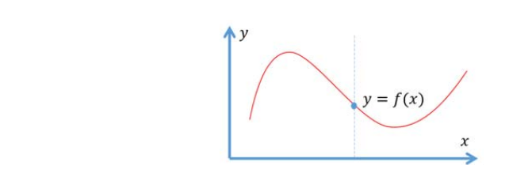
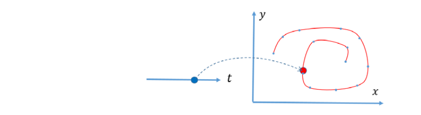

# 回顾：\\(R^2\\)和 \\(R^3\\)中的曲线/曲面   

  

# 映射的维数   

$$
f:X → Y
$$

- 一元函数

$$
\begin{array}{l} 
  f:R^1\to R^1    \\\\    
  y=f(x) \\\\ 
\end{array} 
$$

- 多元函数

$$
\begin{array}{l} 
  f: R^m \to R^1    \\\\    
  y=f (x_1, x_2, \cdots, x_m) \\\\ 
\end{array} 
$$

 

- 高维（单参数）曲线

$$
\begin{array}{l} 
  f: R^1 \to R^n \\\\
  y_1=f_1(x) \\\\
  y_2=f_2(x) \\\\ 
  \vdots \\\\
y_n=f_n(x) \\\\ 
\end{array} 
$$

-高维曲面(\\(𝑚 <𝑛\\))/降维映射(\\(m>n\\\))

$$
\begin{array}{l} 
  f: R^m \to R^n \\\\
  y_1=f_1(x_1,x_2,\cdots,x_m) \\\\
  y_2=f_2(x_1,x_2,\cdots,x_m) \\\\ 
  \vdots \\\\
y_n=f_n(x_1,x_2,\cdots,x_m) \\\\ 
\end{array} 
$$

> 降维映射，又称为参数化。   

# Curve Modeling in \\(R^2\\)（建模/造型）   

    

* **Fitting** (Reconstruction) for reverse engineering (interpolation, approximation, aggression…)     
• 从代数观点：需要函数空间表达能力足够      
• 输入：采样点{\\(S_j,j=0\sim m\\)} 及基函数{\\(b_i(t),i=0\sim n\\)}     
• 输出：拟合函数的系数{\\(p_i,i=0\sim n\\)}       
* **Design** for interactive modeling      
• 从几何观点：具有好性质的基函数使得交互设计更直观     
• 输入：交互输入（或者反求）控制顶点{\\(p_i,i=0\sim n\\)}     
• 输出：曲线\\(f(t)\\)   

# 曲线（形状）的不同表达方法    

**优劣比较？**

* 显式函数曲线   

$$
\begin{array}{l} 
  f:R^1\to R^1    \\\\    
  y=f(x) \\\\ 
\end{array} 
$$

    

* 参数曲线    

$$
\begin{array}{l} 
  p:R^1\to R^1    \\\\    
  x=x(t) \\\\ 
  y=y(t) \\\\ 
\end{array} 
$$

    

* 隐式曲线    
• Level set (水平集)    

$$
f(x,y)=0
$$

    

* 细分曲线      

    

> 前三种是连续表达，第四种是线段表达。    
连续表达在数学上容易表达。但在应用上有局限。   

# 几何迭代法（渐进迭代逼近）     
(progressive‐iterative approximation, PIA)     

    

> 要解决的问题：   
\\(Q_0\\) ~ \\(Q_4\\) 是用户给点，要求新的控制顶点P，使其生成
的曲线经过Q点。     
普通方法：构造方程反求控制顶点。    
本文方法：   
[>] 图(b)的P点标注得不对。     
用 Q 作为初始 P       
基于 P 画出曲线。    
计算曲线对应点与Q的距离，调整P的位置。    