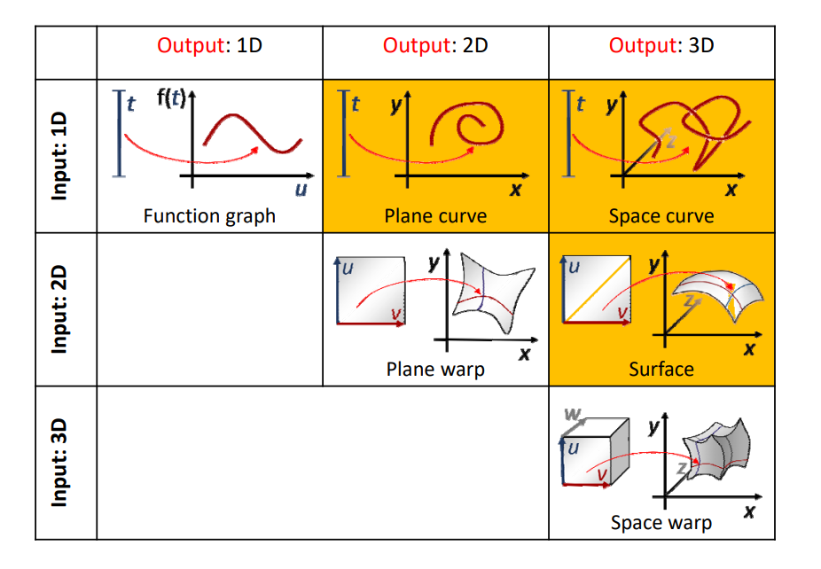
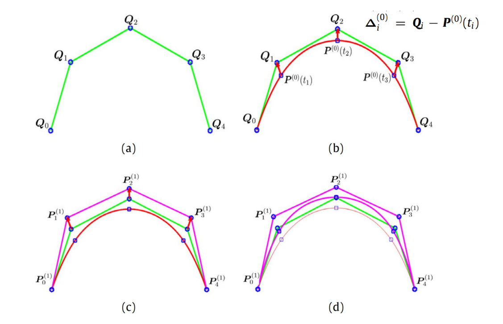

# 回顾：\\(R^2\\)和 \\(R^3\\)中的曲线/曲面   

  

映射的维数：[link](../ParametricFitting/VectorValue.md)   
重建与设计：[link](../BezierCurve/Review.md)
曲线（形状）的不同表达方法：[link](../ImplicitCurves/Review.md)    

# 几何迭代法（渐进迭代逼近）     

(progressive‐iterative approximation, PIA)     

    

## 要解决的问题：   

\\(Q_0\\) ~ \\(Q_4\\) 是用户给点，要求新的控制顶点P，使其生成
的曲线经过Q点。     

## 普通方法：

构造方程反求控制顶点。    

## 本文方法： 

> 图(b)的P点标注得不对。     

用 Q 作为初始 P       
基于 P 画出曲线。    
计算曲线对应点与Q的距离，调整P的位置。    
公式求解与迭代求解的区别   

本文出自CaterpillarStudyGroup，转载请注明出处。
https://caterpillarstudygroup.github.io/GAMES102_mdbook/
