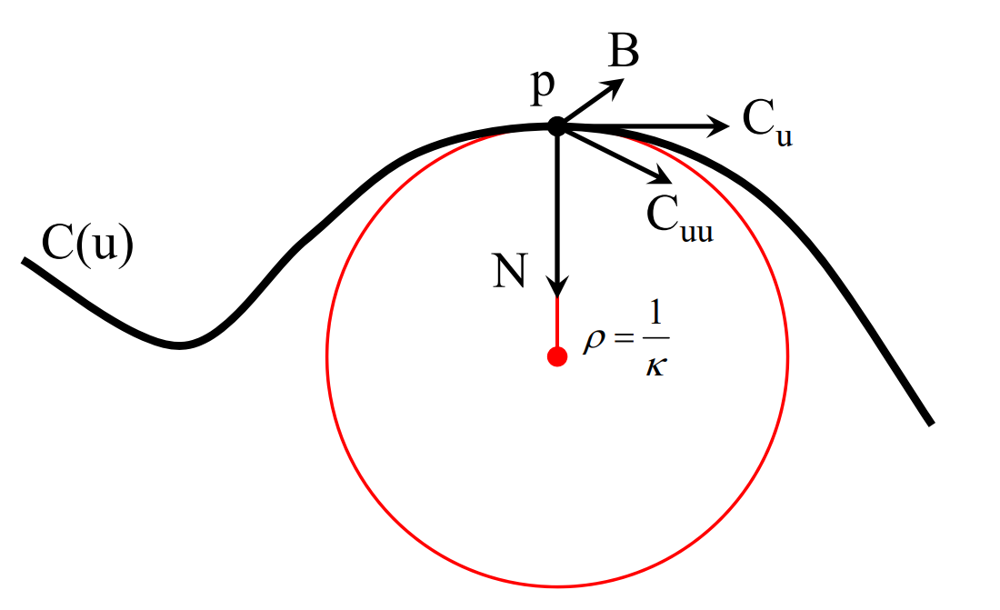
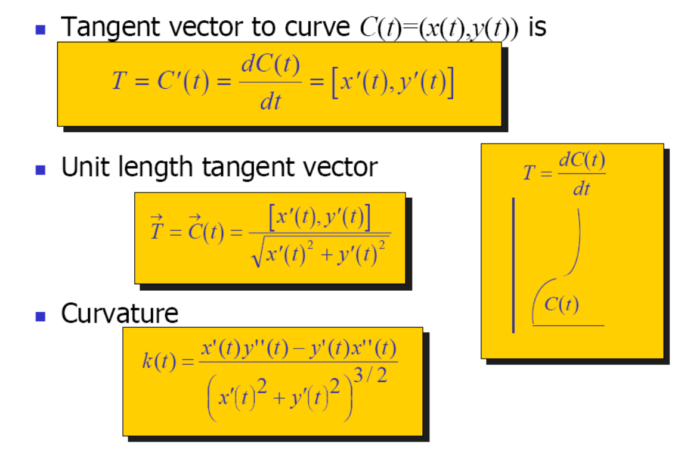

# 曲线的微分几何    

   

## Point p
Point p on the curve at \\(u_0\\)   

$$
p = C (u_0)     
$$

> 单参数曲线，因此只有一个参数u0

## Tangent T

Tangent T to the curve at \\(u_0\\)    

$$
C_u=\frac{\partial C(u)}{\partial u} \\\\ T=\frac{C_u}{||C_u||}
$$     

## Normal N and Binormal B

Normal N and Binormal B to the curve at \\(u_0\\)    

> \\(C_u\\) 与曲线相切，又记为T     
\\(C_{uu} 与 N 同朝向(夹角<90^{\circ})\\)  
\\(C_u\\)和\\(C_{uu}\\)做叉积，得到方向B。      
B 称为从法矢，B与 \\(C_u\\) 叉乘得到 N.    
\\(N,C_{uu},C_u\\) 应该在同一平面内，且\\(C_{uu}位于C_u 和 N \\)之间。      
T（切线），B(以法），N（法线）构成直角坐标系。    

## Curvature κ

Curvature is **independent** of parameterization，用于Measure curve bending     

$$
k=1/R
$$

其中R为二阶密切圆的半径

## 以上符号的关系    

   

本文出自CaterpillarStudyGroup，转载请注明出处。
https://caterpillarstudygroup.github.io/GAMES102_mdbook/  
