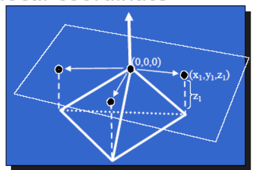
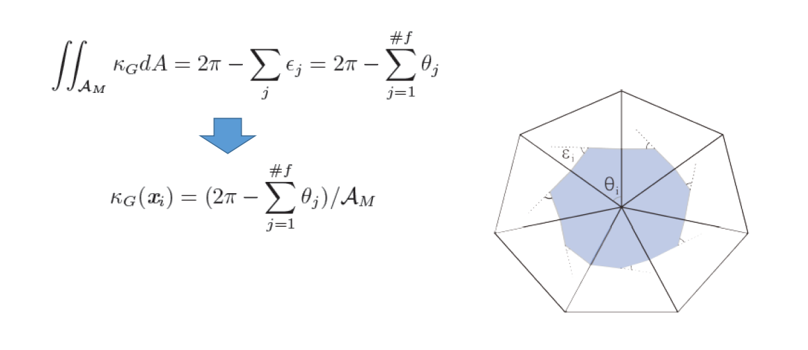

# 离散微分几何要解决的问题   

微分几何研究曲面无穷小邻域上的微分属性（导数、曲率）    
但Mesh是分段线性的，在三角形内部无穷连续，在边和点上\\(C^0\\)连续。      
\\(C^0\\)连续不光滑、不可微，如何讨论微分性质？

> 答：通过采样点估计出原始曲面的微分属性。包括：  
• Normal estimation    
• Curvature estimation    
• Principal curvature directions   
• …  

## 两种估计微分属性的方法论

Approximate the (unknown) underlying surface    

（1） Continuous approximation：Approximate the surface & compute continuous differential measures (normal, curvature)   
（2） Discrete approximation：Approximate differential measures for mesh    

# Continuous Approximation   

## Quadratic Approximation     

### 第一步：获取周围点的信息

对于要估计的顶点，使用其周围的顶点的信息：  

- Compute normal at vertex    
  - Typically average face normals    
- Compute tangent plane & local coordinate system      
- For each neighbor vertex compute location in local system    
  - relative to node and tangent plane   

    

### 第二步：拟合曲面

定义 quadric function，例如抛物面    

$$
F(x, y, z)=ax^{2}+bxy+cy^{2}-z=0 
$$

使用least squares来找到拟合quadric function的系数

$$
\min \sum_{i}^{} (ax_i^2+bx_iy_i+cy_i^2-z_i) 
$$

$$
\begin{pmatrix}x_1^2  & x_1y_1 &y_1^2
 \\\\ \cdots  &\cdots   &\cdots
  \\\\ x_n^2 &x_ny_n  &y_n^2
\end{pmatrix}\begin{pmatrix}a
 \\\\b
 \\\\c
\end{pmatrix}=\begin{pmatrix}z_1
 \\\\\cdots 
 \\\\z_n
\end{pmatrix}A=\begin{pmatrix}x_1^2  & x_1y_1 &y_1^2
 \\\\ \cdots  &\cdots   &\cdots
  \\\\ x_n^2 &x_ny_n  &y_n^2
\end{pmatrix},X=\begin{pmatrix}a
 \\\\b
 \\\\c
\end{pmatrix},b=\begin{pmatrix}z_1
 \\\\\cdots 
 \\\\z_n
\end{pmatrix}
$$

Approximation can be found by:\\(\tilde{X}=\left(A^{T} A\right)^{-1} A^{T} b\\)     

### 第三步：基于曲面估计微分属性

Approximation principal curvatures

Given surface \\(F\\)，principal curvatures \\(k_\min \\) and \\(k_\max\\) are real roots of:   

$$
k^{2}-(a+c)k + ac - b^{2} = 0
$$

Mean curvature: 

$$
H = (k_\min + k_\max)/2
$$

Gaussian curvature:  

$$
K = k_\min  k_\max
$$

## Other approximation     

* Cubic approximation     
• J. Goldfeather and V. Interrante. A novel cubic‐order algorithm for approximating principal direction vectors. ACM Transactions on Graphics 23, 1 (2004), 45–63.    
* Implicit surface approximation     
• Yutaka Ohtake et al. Multi‐level partition of unity implicits. Siggraph 2003.    
* Many others…      

# Discrete Approximation    

## 顶点的Normal Estimation   

顶点Normal = 加权平均 face normals    

Weighted:  face areas, angles at vertex      

> What happen at edges/creases(折痕)?     
为什么刘老师要问这个问题，顶点肯定在边上的。  

## Mean Curvature     

由Laplace‐Beltrami（平均曲率流）定理：      

$$
K(x_i)=\frac{1}{2A_M} \sum_{j\in N_1(i)}^{} (\cot \alpha _{ij}+\cot \beta _{ij})(x_i-x_j)
$$

    

其中：  
\\(N_l(X_i)\\):表\\(X_i点的l\\)邻域点     
\\(A_m\\)：整个多边形的面积     

## Gauss Curvature     

Gauss‐Bonnet定理：   

    

例子：      

    
> &#x1F446; color map：数据的可视化方法，红 > 绿 > 篮    

## 存在的问题

Approximation always results in some noise    
解决方法：（1）截断（2）平滑

## References    

- MEYER M., DESBRUN M., SCHRÖDER P., BARR A.: Discrete differential‐geometry operators for triangulated 2‐manifolds. In Visualization and Mathematics III, Hege H.‐C., Polthier K., (Eds.). Springer, 2003, pp. 35–58. (<u>PDF</U>)    

> 离散微分几何算子的开创性文章   

- TAUBIN G.: Estimating the tensor of curvature of a surface from a polyhedral approximation. In Proc. International Conference on Computer Vision (1995), pp. 902–907.     
- MEYER M., DESBRUN M., SCHRÖDER P., BARR A.: Discrete differential‐geometry operators for triangulated 2‐ manifolds. In Visualization and Mathematics III, Hege H.‐C., Polthier K., (Eds.). Springer, 2003, pp. 35–58.      
- CAZALS F., POUGET M.: Estimating differential quantities using polynomial fitting of osculating jets. In Eurographics Symposium on Geometry Processing (2003), pp. 177–187.    
- COHEN‐STEINER D., MORVAN J.: Restricted delaunay triangulations and normal cycle. In Proc. ACM Symposium on Computational Geometry (2003), pp. 312–321.    
- GOLDFEATHER J., INTERRANTE V.: A novel cubic‐order algorithm for approximating principal direction vectors. ACM Transactions on Graphics 23, 1 (2004), 45–63.      
- MARTIN R. R.: Estimation of principal curvatures from range data. International Journal of Shape Modeling 4, 1 (1998), 99–109.     
- OHTAKE Y., BELYAEV A., SEIDEL H.‐P.: Ridge‐valley lines on meshes via implicit surface fitting. ACM 
Transactions on Graphics 23, 3 (2004), 609–612. (Proc. SIGGRAPH’2004).       
- PAGE D., SUN Y., KOSCHAN A., PAIK J., ABIDI M.: Normal vector voting: Crease detection and curvature 
extimation on large, noisy meshes. Graphical Models 64, 3‐4 (2002), 199–229.     

---  

> 本文出自CaterpillarStudyGroup，转载请注明出处。
https://caterpillarstudygroup.github.io/GAMES102_mdbook/

