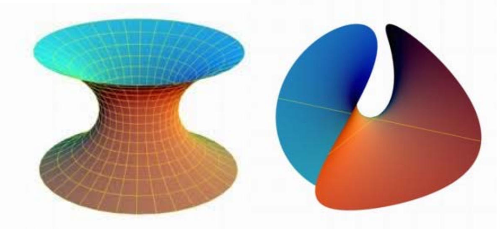
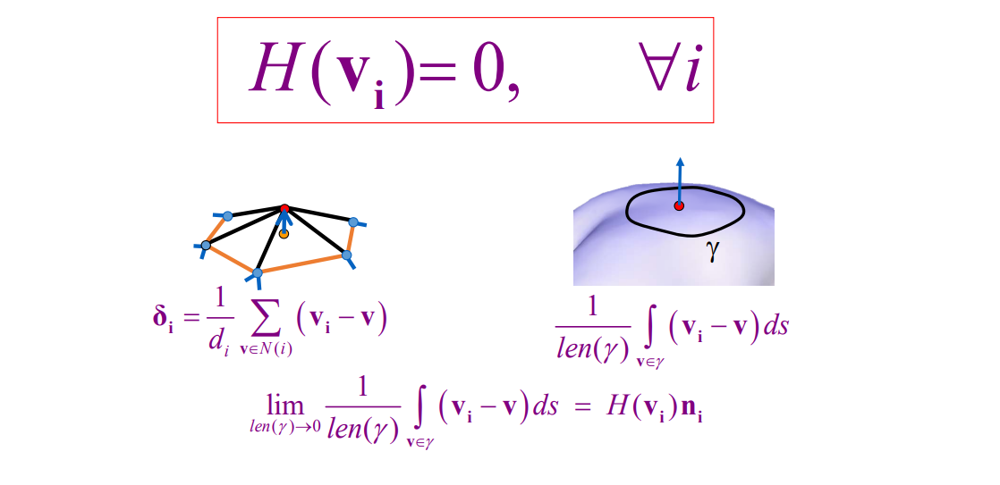
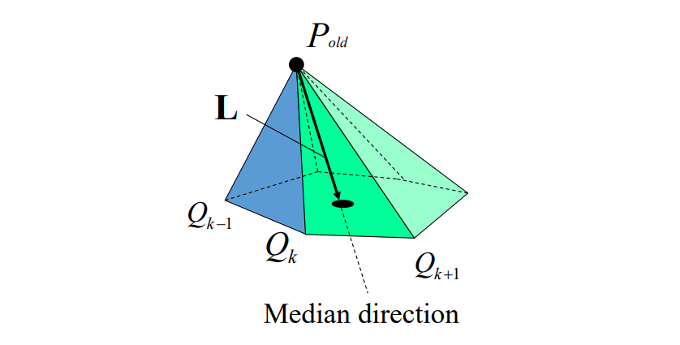
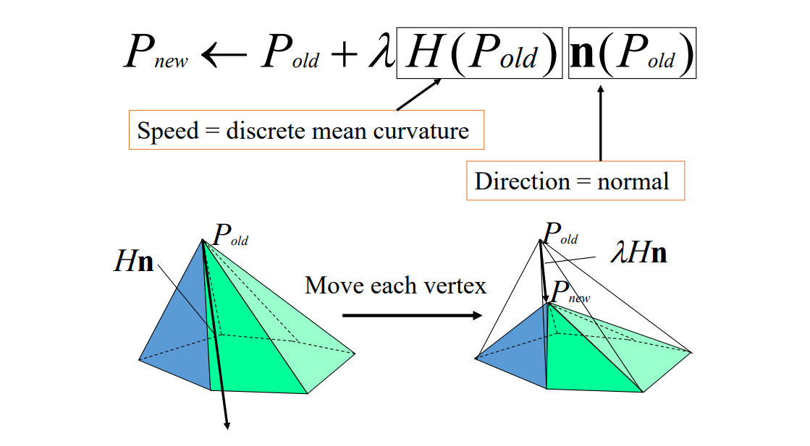
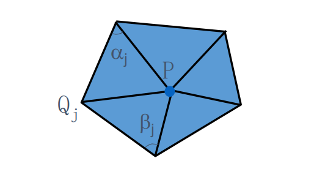
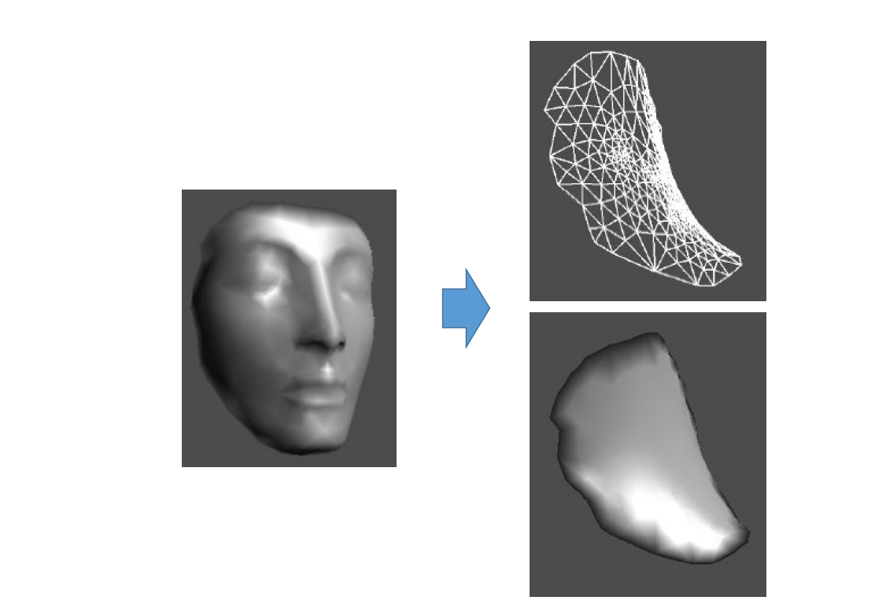
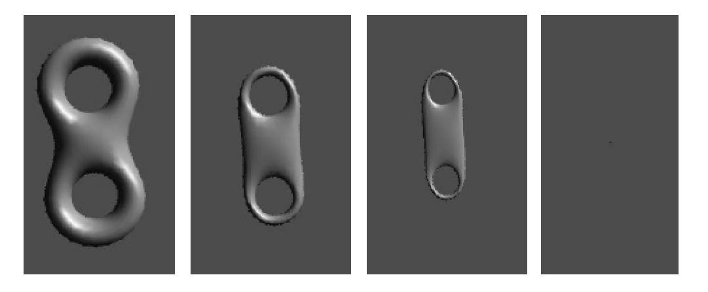

# 极小曲面    

• 平均曲率处处为0的曲面   

    

> 每个点都是马鞍点     
常见的极小曲面肥皂泡。    

> 建筑中使用极小曲面，好看、省材料、不积水   

# 极小曲面的平均曲率流    

    

**Laplace Operator (Umbrella Operator)**    

Mean 曲率处处为0，代入 Mean Curve 的计算公式     

$$ 
K=\frac{1}{2A_m} \sum (\cot \alpha_{ij}+\cot \beta_{ij})(x_i-x_j)=0
$$

以上公式可以看作是 V 与其 1 邻域点的线性组合，得到 Q 平面内的重心坐标点。     

任意一个曲面，把P往Q方向移动，就可以得到极小曲面：

$$
L(P)=\frac{1}{n} \sum_{i=1}^{n} \overrightarrow{PQ_i} =\frac{1}{n} \sum_{i=1}^{n}Q_i-P
$$

    

但是不建议直接把P移动Q点，而是每次移一小部分。  
   - 因为每个点的运动是互相影响的，一个点变化太大，它邻居的目标就不对了。  

  

不断迭代，每个顶点都会接近平均曲率为0。（离散平均曲率流定理）  

> \\(\lambda \\)太大会不收敛。\\(\lambda \\)取小一点多走几步。     

其中Hn的定义如下：  

$$
H_n=\frac{\nabla_PA}{2A} 
$$

$$
H_n=\frac{1}{4A} \sum_{j}^{} (\cot \alpha _j+\cot \beta _j)(P-Q_j)
$$

  

# 离散极小曲面的局部迭代法    

## 非封闭曲面

```python
找到边界 # 只能对非封闭曲面（带一条边界）操作    
固定边界顶点    
迭代 # 尝试试验不同的参数𝜆
   对每个内部顶点    
      找顶点1‐邻域    
      更新其坐标 # 更新坐标需要用老的顶点坐标   
更新所有顶点法向   
```

  


## 封闭曲面    

对于封闭曲面，不固定住的点，最后会收缩到一个点。    

  

> &#x2753; 如何构造曲面边界？   
答：自己构造   

# Triangle    

<http://www.cs.cmu.edu/~quake/triangle.html>   

当满足\\(K=0时， L 的模长为0\\)。        
从任意取曲面优化成极小曲面的方法：
1. 计算出中间的黑点     
2. 向黑点移动       
（重心）

---  

> 本文出自CaterpillarStudyGroup，转载请注明出处。
https://caterpillarstudygroup.github.io/GAMES102_mdbook/

