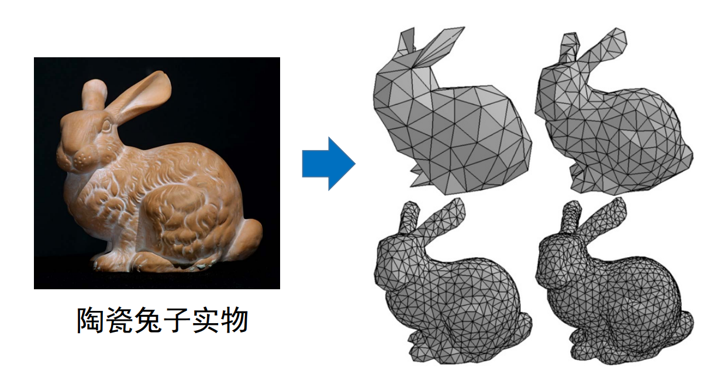
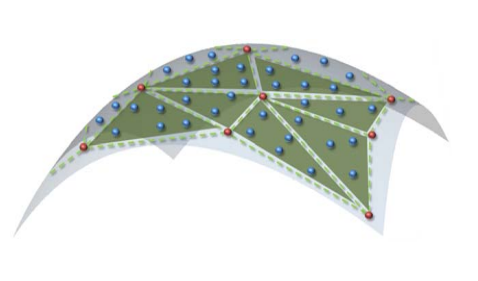
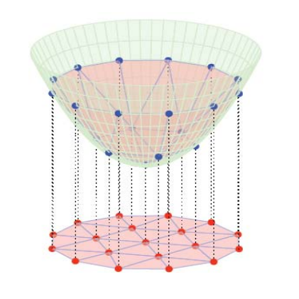
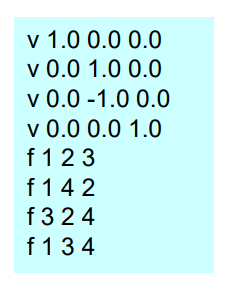
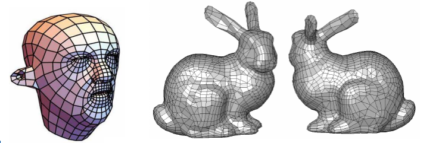
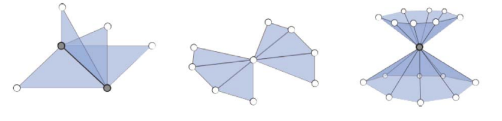

# 回顾：三角网格曲面   

   

* 观点 1：曲面的离散逼近    
• 采样：顶点为从曲面上的采样点     
• 构网：每个三角面为线性平面     
• 本质：分片线性逼近    

   

* 观点 2：平面图的嵌入     
• 平面图    
• 图的顶点提升 (lifting) 至三维空间   
• 本质：二维流形    

   

# 回顾：数据结构—图 (graph)    

* G={V, E, F}      
• V: 顶点集合；E: 边集合；F: 三角形集合     
• 有其中两个集合可推出另一个集合     

   

* 多边形网格均可转化为三角网格       

   

* 不考虑非流形结构    

   

# 几何（网格）处理库    

• CGAL: <http://www.cgal.org>    
• Libigl: <https://github.com/libigl/libigl>    
• MeshLab: <http://www.meshlab.net>    
• OpenMesh: <https://www.openmesh.org>    
• PCL (Point Cloud Library): <http://www.pointclouds.org>    
• TriMesh: <http://graphics.stanford.edu/software/trimesh>    
• DGtal: <https://dgtal.org>    
